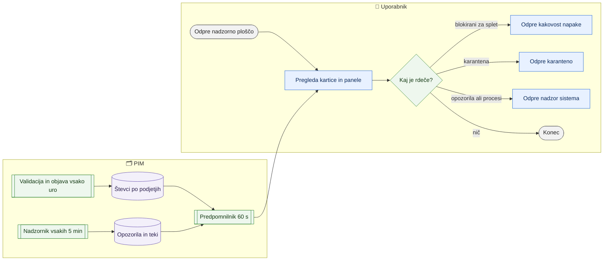

# Nadzorna plošča

> **Področje:** Nadzor · **Lastnik:** skrbnik PIM · **Stanje:** ✅ deluje · **Preverjeno:** 2026-09-24, iz kode

## 1. Namen

Ena stran, ki na začetku dneva pokaže stanje vseh podjetij skupaj: koliko artiklov je v katalogu, koliko jih je brez ERP blokad, koliko je blokiranih za splet, koliko zajemov čaka v karanteni, zadnje procese in odprta opozorila integracij. Stran samo bere — nič ne spreminja.

## 2. Kdo sodeluje

| Vloga | Kaj naredi v procesu |
|---|---|
| Komerciala | Pogleda, ali je število blokiranih za splet normalno; klikne na kartico za seznam. |
| Urednik kataloga | Iz kartic »Blokirani za splet« in »Kakovost po profilih« gre na delo v `/kakovost/napake`. |
| Skrbnik | Spremlja »Zadnji procesi« in »Opozorila in prioritete«; ob rdečem stanju gre na `/sistem`. |
| Avtomatika (PIM) | Validacija (urno) in objava sproti spreminjata števce; nadzornik odpira alarme, ki jih plošča pokaže. |

## 3. Kdaj se sproži

- **Ročno:** vsak prijavljen uporabnik odpre `/nadzorna-plosca` (prva postavka v meniju).
- **Po urniku:** ni lastnega posla. Števci sledijo poslom `PRODUCT_VALIDATION` (vsako uro ali po zajemu iz SAOP), `PRODUCT_PUBLICATION` in `ALERT_EVALUATION` (nadzornik, vsakih 5 min).
- **Ob dogodku:** ni.

## 4. Vhod in izhod

| | Kaj | Od kod / kam |
|---|---|---|
| **Vhod** | Števci kataloga, validacije, karantene; zadnji teki; opozorila in stanje integracij; profili kakovosti | PIM (vsa aktivna podjetja) |
| **Izhod** | Samo prikaz na zaslonu, s povezavami na podrobne strani | uporabnik |

## 5. Diagram

## 6. Koraki

| # | Kdo | Kje (stran) | Kaj narediš | Kaj se zgodi v sistemu | Kako preveriš, da je uspelo |
|---|---|---|---|---|---|
| 1 | Kdorkoli | `/nadzorna-plosca` | Odpreš stran. | Za vsako aktivno podjetje se vzporedno preberejo števci; rezultat se hrani 60 s, zato drugi uporabniki v isti minuti vidijo iste številke. | Zgoraj je pet kartic, spodaj tabela »Po podjetjih« z vrstico »Skupaj«. |
| 2 | Kdorkoli | `/nadzorna-plosca` | Prebereš pet kartic: »Artikli v katalogu«, »Brez ERP blokad« (z % od kataloga), »V PIM sloju«, »Blokirani za splet«, »Zajemi v karanteni«. | — | Števci niso deli iste celote (piše v podnaslovu strani); vsak meri drugo množico. |
| 3 | Kdorkoli | `/nadzorna-plosca` | Klikneš vrstico podjetja v »Po podjetjih«. | Odpre se `/izdelki?podjetje=N`. | Seznam izdelkov je filtriran na to podjetje. |
| 4 | Urednik kataloga | `/nadzorna-plosca` → `/kakovost/napake` | Klikneš »Blokirani za splet« ali »Poglej vse« pri »Kakovost po profilih«. | — | Odpre se seznam napak validacije. |
| 5 | Skrbnik | `/nadzorna-plosca` → `/sistem` ali `/sistem/teki` | Pri »Zadnji procesi / Status integracij« (5 najnovejših tekov) ali »Opozorila in prioritete« (5 odprtih) klikneš »Poglej vse« oziroma »Vsa opozorila«. | — | Na `/sistem` vidiš isti alarm in lahko ga potrdiš ali razrešiš. |
| 6 | Kdorkoli | `/nadzorna-plosca` → `/kakovost/karantena` | Klikneš »Zajemi v karanteni«. | — | Vidiš vhodne zapise, ki jih obdelava ni prevzela (to niso artikli). |

## 7. Pravila in varovalke

- Stran ničesar ne zapiše in ne sproži — je samo pregled.
- Prikaže **vsa aktivna podjetja skupaj** in razčlenitev po podjetjih (uporabnik 2026-08-28: »morajo kazati celotno tabelo«).
- Če eno podjetje ne odgovori, ostali paneli ostanejo; panel dobi besedilo »… ni na voljo«.
- Številke so lahko stare do 60 sekund (predpomnilnik, uveden 218 zaradi obremenitve baze).
- Dostop: vsak prijavljen uporabnik z dovoljenjem za nadzorno ploščo (postavka menija `PimAccessCatalog.Dashboard`).

## 8. Ko gre kaj narobe

| Znak (kaj vidiš) | Verjeten vzrok | Kaj narediš |
|---|---|---|
| »Nadzorne plošče trenutno ni mogoče naložiti.« | Baza ne odgovori ali poizvedba preseže čas (30 s). | Počakaj minuto in osveži; če se ponavlja, javi skrbniku (`/sistem`). |
| »Nobeno podjetje ni aktivno.« | V `dbo.OrganizationConfig` ni aktivnega podjetja. | Skrbnik preveri nastavitve podjetij. |
| Števci se po popravku ne spremenijo. | Predpomnilnik 60 s ali validacija še ni tekla (teče vsako uro ali po zajemu). | Počakaj na naslednjo validacijo; stanje posla vidiš na `/sistem`. |
| »Kakovost po profilih« je prazna. | Profili kakovosti še niso izračunani. | Počakaj na validacijo; če ostane prazno, javi skrbniku. |

## 9. Tehnično ozadje

Za skrbnika in razvoj

- **Strani:** `PIM.Intranet/Components/Pages/Dashboard.razor`
- **Storitve / delavci:** `IntranetDataService.GetOrganizationsAsync`, `GetDashboardAsync`, `GetValidationIssuesAsync(take: 0)` (samo profili), `GetPipelineRunsAsync`, `GetSystemIntegrationsAsync`; `IMemoryCache` 60 s na podjetje (`dashboard:metrics:{id}`, `dashboard:panels:{id}`).
- **Tabele in pogledi:** kanonični katalog (`canon.Product`), `pim.Product`, rezultati validacije, `raw.Inbox` (karantena), `ops.PipelineRun`, alarmi in integracije.
- **Migracije:** 218 (meritve zmogljivosti, vzporedno branje in predpomnilnik).
- **Urniki:** posredno `PRODUCT_VALIDATION`, `PRODUCT_PUBLICATION`, `ALERT_EVALUATION`.

## 10. Odprta vprašanja in razlike

- ⚠️ Kartica »V PIM sloju« šteje zgodovinsko promovirane artikle (`pim.Product`), ne trenutne spletne objave — ime lahko zavaja.
- ⚠️ »Zadnji procesi« kažejo samo stare teke (`ops.PipelineRun`), ne novih poslov avtomatike po fazah (`/sistem`); stanje posla je zanesljivejše na `/sistem`.
- ⚠️ Plošča ne kaže varovalk (zadržanih artiklov) — zadržani artikli so vidni samo na `/varovalke` in v zvoncu.
- ⚠️ Vse povezave »Poglej vse« pri procesih in opozorilih vodijo na `/sistem`, ki je v meniju samo za skrbnika; drugim vlogam lahko vrne zavrnitev.

## Povezani procesi

- [Varovalke](varovalke.md): zadržane objave, ki jih plošča ne prikaže.
- [Kakovost in validacija](../04-kakovost/kakovost-in-validacija.md): izvor števcev »Brez ERP blokad« in »Blokirani za splet«.
- [Karantena](../04-kakovost/karantena.md): kam vodi kartica »Zajemi v karanteni«.
- [Nadzor sistema](../09-administracija/nadzor-sistema.md): podrobnosti procesov in alarmov.
- [Pregled vhodov in virov](../02-vhodi/pregled-vhodov-in-virov.md): stanje zajema po virih.
