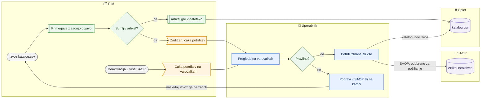

# Varovalke pred objavo in pred SAOP

> **Področje:** Nadzor · **Lastnik:** urednik kataloga in komerciala (potrditev), skrbnik (pravila) · **Stanje:** ⚠️ delno · **Preverjeno:** 2026-09-24, iz kode

## 1. Namen

Preden gre kaj iz PIM-a (katalog.csv za splet ali deaktivacija artikla v SAOP), PIM primerja novo stanje z zadnjo objavo. Sumljiv artikel je **zadržan**, vsi ostali gredo ven normalno. Rezultat: napačna cena ali množičen umik ne pride na splet, neaktiven artikel ne gre v SAOP, dokler ga nekdo ne potrdi na `/varovalke`.

## 2. Kdo sodeluje

| Vloga | Kaj naredi v procesu |
|---|---|
| Komerciala | Pregleda zadržane cene in potrdi (»Potrdi izbrane«, »Potrdi vse zadržane«) ali popravi ceno v SAOP. |
| Urednik kataloga | Pregleda umike s spleta in deaktivacije za SAOP; potrdi ali popravi (kategorija, kljukica, aktivnost na kartici). |
| Skrbnik | Ureja pravila, prag, »Najmanj artiklov« in vklop na `/varovalke` (razdelek »Pravila«); lahko tudi potrjuje. |
| Avtomatika (PIM) | Izvoz katalog.csv pred objavo pokliče varovalko in zadržane artikle izpusti iz datoteke; ob potrditvi sproži nov izvoz oziroma pošiljanje v SAOP; odpre obvestilo v zvoncu. |

## 3. Kdaj se sproži

- **Ročno:** uporabnik odpre `/varovalke` — ob tem se osveži seznam deaktivacij za SAOP (`ops.EvaluateSaopSafeguards`).
- **Po urniku:** ob vsakem izvozu kataloga (`WEB_CATALOG_EXPORT`, po uspešni objavi, najmanj vsako uro) teče varovalka katalog.csv.
- **Ob dogodku:** deaktivacija artikla v odhodni vrsti za SAOP (s kartice, iz Excela, množičnega urejanja) vedno ostane »čaka odobritev«, dokler je ne potrdi varovalka; potrditev sproži `WEB_CATALOG_EXPORT` (katalog) ali `SAOP_OUTBOUND_DISPATCH` (SAOP).

## 4. Vhod in izhod

| | Kaj | Od kod / kam |
|---|---|---|
| **Vhod** | Pripravljene vrstice katalog.csv (cene B2B/B2C, spletišča), zadnja objavljena datoteka, deaktivacije v odhodni vrsti za SAOP | PIM (izvoz, odhodna vrsta) |
| **Izhod** | Preverjanje z ugotovitvami, zadržani artikli, potrditve (veljajo 14 dni), zahteva za nov izvoz ali odobritev sporočila za SAOP, obvestilo v zvoncu | PIM → katalog.csv / SAOP |

## 5. Diagram

## 6. Koraki

**A. Katalog.csv (področje »Katalog za splet«)**

| # | Kdo | Kje (stran) | Kaj narediš | Kaj se zgodi v sistemu | Kako preveriš, da je uspelo |
|---|---|---|---|---|---|
| 1 | Avtomatika | — | — | Izvoz sestavi katalog.csv, nato ga primerja z zadnjo objavo: oblika cene, faktor ×10/×100/×1000, cena 0, prazna cena, skok nad prag (privzeto 25 %), padec števila vrstic (10 %), umik s spleta (od 10 artiklov naprej), nove kljukice brez objave, novi na spletu. Zadržani artikli **niso v datoteki**; ostali so objavljeni. | Na `/varovalke` je v »Zadnja preverjanja« nova vrstica; pri čakajočem je kartica v »Čaka potrditev«. V zvoncu je opozorilo. |
| 2 | Komerciala / urednik | `/varovalke` | V »Čaka potrditev« klikneš »Preglej in potrdi«. | Odpre se `/varovalke/{Id}`: števci (na spletu, zadržani, gre s spleta, novi, s kljukico a ne gre), nato skupine po pravilu s tabelo prej → zdaj. | Vidiš seznam zadržanih artiklov z razlogom. |
| 3 | Komerciala / urednik | `/varovalke/{Id}` | Pri umikih klikneš razlog v vrstici s števili, da vidiš samo te artikle; po potrebi »Prenesi ugotovitve v Excel«. | Filter po razlogu (odkljukan, brez kategorije, neveljaven, neaktiven …). | Tabela kaže samo izbrani razlog. |
| 4a | Komerciala / urednik | `/varovalke/{Id}` | Če je sprememba pravilna: označiš kljukice (ali »Izberi vse zadržane v tej skupini«), neobvezno vpišeš »Opomba«, klikneš »Potrdi izbrane« ali »Potrdi vse zadržane« → »Da, potrdi vse«. | Potrditev se zapiše (kdo, kdaj, opomba) in velja 14 dni za enako spremembo; odda se zahteva za takojšen izvoz (`WEB_CATALOG_EXPORT`). Artikel gre ven, ko so potrjene vse njegove zadržane ugotovitve. | Sporočilo »Potrjenih N ugotovitev. Izvoz je sprožen …«; stanje preverjanja postane »potrjeno«, v nekaj minutah je artikel v katalog.csv. |
| 4b | Komerciala / urednik | SAOP ali kartica artikla | Če sprememba ni pravilna: popraviš vzrok (ceno v SAOP, kategorijo ali kljukico na kartici; umike na `/splet/umaknjeni`). | Naslednji izvoz ugotovitve ne najde več in artikel objavi sam; staro preverjanje postane »nadomeščeno«. | Na `/varovalke` je novo preverjanje brez tega artikla. |
| 5 | Skrbnik | `/varovalke` (»Pravila«) | Spremeniš »zadrži artikel«, »Prag«, »Najmanj artiklov« ali »vklopljeno« in klikneš »Shrani«. | Pravilo se shrani s tvojim imenom; velja od naslednjega izvoza. | Sporočilo »Pravilo … je shranjeno. Velja od naslednjega izvoza.« |

**B. Deaktivacija v SAOP (področje »SAOP«, 281)**

| # | Kdo | Kje (stran) | Kaj narediš | Kaj se zgodi v sistemu | Kako preveriš, da je uspelo |
|---|---|---|---|---|---|
| 1 | Urednik | kartica, Excel, množično urejanje | Artikel označiš kot neaktiven. | V PIM se aktivnost zapiše takoj; sporočilo za SAOP gre v vrsto kot »čaka odobritev«. Odobritev skupine ali artikla ga **preskoči** (ostale spremembe gredo). | Na strani odobritve se pokaže okvir »V SAOP N artiklov bo neaktivnih« s seznamom. |
| 2a | Urednik | stran odobritve (odhodna vrsta, množično urejanje, artikli SAOP) | V okvirju pregledaš seznam in klikneš »Da, namenoma — pošlji v SAOP« (ali »Pošlji samo aktivne« / »Ne zdaj«). | Deaktivacije so potrjene in odobrene za pošiljanje; pošlje jih odhodna vrsta. | Sporočilo »Potrjeno: N neaktivnih artiklov gre v SAOP.« |
| 2b | Urednik / komerciala | `/varovalke` → `/varovalke/{Id}` | Odpreš kartico »SAOP · podjetje: v SAOP N artiklov bo neaktivnih«, izbereš in klikneš »Potrdi izbrane in pošlji v SAOP«. | Isto kot 2a; odda se zahteva za `SAOP_OUTBOUND_DISPATCH`. | Števec »Potrjeni« se poveča; preverjanje se zapre, ko nič več ne čaka. |
| 3 | Urednik | odhodna vrsta ali kartica | Če deaktivacija ni namerna: prekličeš sporočilo ali artikel spet označiš kot aktiven. | Ob naslednjem odprtju `/varovalke` preverjanje postane nadomeščeno. | Kartica izgine iz »Čaka potrditev«. |

## 7. Pravila in varovalke

- Varovalka **nikoli ne ustavi posla**: izvoz vedno objavi datoteko brez zadržanih artiklov. Če varovalka pade, gre datoteka ven kot pred 277, v zvoncu pa ostane opozorilo, da ni bila preverjena.
- Zadržan artikel, ki je že na spletu, tam ostane s **prejšnjimi podatki** (Magento se artiklov, ki jih ni v datoteki, ne dotakne); nov artikel na splet ne pride.
- Potrditev velja 14 dni za **isto** spremembo (artikel, polje, spletišče, prej → zdaj); nova sprememba spet vpraša.
- Pravila »o celoti« (padec vrstic, novi na spletu, kljukica brez objave) artikla ne morejo zadržati — so opozorilo ali informacija.
- Prvi izvoz po uvedbi nima primerjave: artikli s prazno ceno ali ceno 0 so enkrat zadržani.
- V SAOP nič ne gre samodejno; **vsaka** deaktivacija čaka potrditev, tudi če bi bil profil kdaj nastavljen na samodejno odobritev. Posamična odobritev deaktivacije v vrsti vrne napako z napotkom na `/varovalke`.
- Kdo sme: potrditev (`SafeguardConfirm`) — skrbnik, urednik kataloga, komercialist. Pravila (`SafeguardSettings`) — samo skrbnik. Potrditev deaktivacij na strani odobritve (`SaopWrite`) — skrbnik in urednik kataloga.
- Čiščenje: nadomeščena preverjanja po 2 dneh, podrobnosti objavljenih po 30 dneh, vse po 120 dneh (čakajoča ostanejo).

## 8. Ko gre kaj narobe

| Znak (kaj vidiš) | Verjeten vzrok | Kaj narediš |
|---|---|---|
| Artikla ni na spletu ali ima staro ceno. | Zadržan na varovalki. | `/varovalke` → »Preglej in potrdi«; potrdi ali popravi vzrok. |
| »To preverjanje ne čaka več potrditve …« | Potrdil je nekdo drug ali je nastal novejši izvoz. | Klikni »Odpri najnovejše preverjanje« in nadaljuj tam. |
| »Potrjeni artikli gredo na splet z naslednjim izvozom (izvoz ta hip teče ali ni vklopljen).« | Izvoz že teče ali je posel izklopljen. | Počakaj na naslednji izvoz; če je izklopljen, javi skrbniku (`/sistem`). |
| »Tvoja vloga potrditve ne dovoljuje.« / »Potrdi lahko skrbnik, urednik kataloga ali komercialist.« | Bralna vloga. | Prosi uporabnika s pravo vlogo. |
| »Varovalk ni mogoče prebrati (migracija 277 …)« | Migracija 277 ali 281 ni nameščena v tej bazi. | Skrbnik namesti migracije (`PIM.Migrator`). |
| Isto preverjanje ima »isti izid N× zapored«. | Vzrok ni odpravljen, izvoz vsako uro najde isto. | Odloči: potrdi ali popravi. |

## 9. Tehnično ozadje

Za skrbnika in razvoj

- **Strani:** `PIM.Intranet/Components/Pages/SafeguardOverview.razor` (`/varovalke`), `SafeguardReview.razor` (`/varovalke/{Id}`), Excel `GET /varovalke/{id}/excel` (`Program.cs`); okvir `Components/Shared/SaopSafeguardBanner.razor` in `SaopDeactivationConfirm.razor` na straneh odobritve SAOP. Okvir kaže in potrjuje samo podjetje strani (`/outbound`, `/izvozi/mnozicno`, `/saop/artikli`, na `/cene?zavihek=saop` izbrano podjetje); pri »Vsa podjetja« je en seznam na podjetje z imenom in svojim gumbom za potrditev, v seznamu sta cene in artikli ločeni skupini (#76).
- **Storitve / delavci:** `SafeguardService` (`GetChecksAsync`, `GetCheckAsync`, `ApproveAsync`, `SaveRuleAsync`, `EvaluateSaopAsync`, `GetSaopDeactivationsAsync`, `ConfirmSaopDeactivationsAsync`); `PIM.B2bWorker/CatalogSafeguard.cs` kliče `ops.EvaluateCatalogSafeguards` pred zamenjavo datotek in `out.RecordCatalogPublication` po objavi.
- **Tabele in pogledi:** `ops.SafeguardRule`, `ops.SafeguardCheck` (CLEAN, WARNED, WAITING, CONFIRMED, SUPERSEDED), `ops.SafeguardFinding`, `ops.SafeguardApproval`, `out.CatalogPublishedValue`, `pim.WebShopReason()`, pogled `ops.SaopHeldDeactivation`; procedure `ops.ApproveSafeguardFindings` → `ops.OnSafeguardApproved` → `ops.RequestJobRun`.
- **Migracije:** `277_VarovalkeKatalogCsv.sql` (tudi ločilo `;` in decimalna vejica v katalog.csv), `281_VarovalkaSaopNeaktivniArtikli.sql`.
- **Urniki:** `WEB_CATALOG_EXPORT` (varovalka teče v njem), `SAOP_OUTBOUND_DISPATCH` (po potrditvi SAOP).
- **Pravila (seme):** `KAT_CENA_OBLIKA`, `KAT_CENA_VEJICA`, `KAT_CENA_NIC`, `KAT_CENA_PRAZNA`, `KAT_CENA_SKOK` (25 %), `KAT_VRSTICE` (10 %), `KAT_SPLET_UMIK` (najmanj 10), `KAT_KLJUKICA_NE_GRE`, `KAT_SPLET_NOVI`, `SAOP_NEAKTIVEN`.

## 10. Odprta vprašanja in razlike

- ⚠️ Seznam deaktivacij za SAOP se osveži **samo ob odprtju** `/varovalke` (ali okvirja na strani odobritve); ni posla, ki bi ga osveževal sam. Opozorilo v zvoncu za SAOP zato nastane šele, ko nekdo odpre stran.
- ⚠️ Pravici se ne ujemata: na `/varovalke/{Id}` lahko deaktivacije za SAOP potrdi tudi **komercialist** (`SafeguardConfirm`), na strani odobritve pa samo skrbnik in urednik (`SaopWrite`). Komercialist lahko torej prek varovalke odobri pošiljanje v SAOP, ki ga sicer ne sme.
- ⚠️ Del SAOP varovalke (281, okvir na straneh odobritve) je ob pregledu v **neuveljavljenih spremembah** v repozitoriju (`SaopSafeguardBanner.razor`, `SaopDeactivationConfirm.razor`, `281_…sql`); ni zanesljivo, da je na strežniku.
- ⚠️ Varovalka katalog.csv velja samo za **podjetje 2** (edini katalog); zaloga in viri kot področji varovalk še ne obstajajo, čeprav jih stran omenja kot prihodnje.
- ⚠️ Ročni korak pred uvedbo: uvoz katalog.csv in stranke.csv v Magento mora biti preklopljen na ločilo `;`, sicer splet datoteke ne prebere.

## Povezani procesi

- [Katalog in stranke CSV](../06-izhod-splet/katalog-in-stranke-csv.md): izvoz, v katerem teče varovalka katalog.csv.
- [Umaknjeni artikli in obvestila](../06-izhod-splet/umaknjeni-s-spleta.md): popravek umikov in kljukic brez objave.
- [Izhod v SAOP](../05-izhod-saop/izhod-v-saop.md): odhodna vrsta, kjer čakajo deaktivacije.
- [Množični izhod](../05-izhod-saop/mnozicni-izhod.md): odobritev skupin z okvirjem deaktivacij.
- [Zgodovina in popravki SAOP](../05-izhod-saop/zgodovina-in-popravki-saop.md): popravek že poslanih vrednosti.
- [Cene in ceniki](../07-poslovanje/cene-in-ceniki.md): kje popraviti napačno ceno.
- [Uporabniki in vloge](../09-administracija/uporabniki-in-vloge.md): kdo sme potrjevati.
