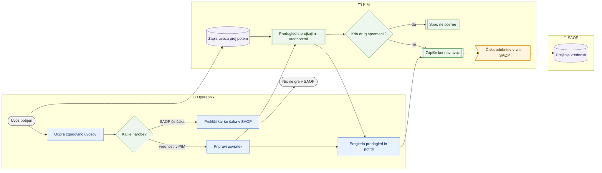

# Zgodovina uvozov in povratek

> **Področje:** Nadzor · **Lastnik:** urednik kataloga (izdelki), komerciala (cene, stranke) · **Stanje:** ⚠️ delno · **Preverjeno:** 2026-09-24, iz kode

## 1. Namen

Vsak uveljavljen uvoz izdelkov, cen ali strank iz Excela se zapiše kot ena vrstica z vsemi spremenjenimi celicami (prej → potem). Uvoz, ki je naredil narobe, se **povrne v celoti**: iz »prej« nastane nov uvoz, ki gre skozi isti predogled in isti zapis kot vsak uvoz.

## 2. Kdo sodeluje

| Vloga | Kaj naredi v procesu |
|---|---|
| Komerciala | Pregleda uvoz cen ali strank, pripravi in potrdi povratek. |
| Urednik kataloga | Pregleda uvoz delovnega lista izdelkov; prekliče, kar še čaka v SAOP; pripravi povratek. |
| Skrbnik | Enako kot urednik; pomaga pri sporih, ki jih povratek ne vrne. |
| Avtomatika (PIM) | Ob vsakem uvozu zapiše zgodovino; pri povratku preveri spore; odhodna vrsta pošlje v SAOP šele po odobritvi. |

## 3. Kdaj se sproži

- **Ročno:** zapis nastane samodejno ob potrditvi uvoza na `/izdelki/uvoz`, `/cene/uvoz` ali `/stranke/uvoz`. Povratek sproži uporabnik z gumbom »Pripravi povratek (predogled)« na `/uvozi/{Id}`.
- **Po urniku:** ni. Po odobritvi pošlje sporočila v SAOP posel `SAOP_OUTBOUND_DISPATCH`.
- **Ob dogodku:** vsak uveljavljen uvoz z vsaj eno spremembo.

## 4. Vhod in izhod

| | Kaj | Od kod / kam |
|---|---|---|
| **Vhod** | Predogled uvoza (prej → potem po celicah), skupine v vrsti za SAOP, pri strankah posnetek seznama pred uvozom | Excel / uporabnik |
| **Izhod** | Zapis uvoza s spremembami; povratni uvoz (nov zapis, povezan s prvotnim); preklic čakajočih sporočil za SAOP | PIM / vrsta za SAOP |

## 5. Diagram

## 6. Koraki

| # | Kdo | Kje (stran) | Kaj narediš | Kaj se zgodi v sistemu | Kako preveriš, da je uspelo |
|---|---|---|---|---|---|
| 1 | Komerciala / urednik | `/uvozi` | Odpreš »Zgodovina uvozov« v meniju; po potrebi izbereš »Izdelki«, »Cene« ali »Stranke«. | Prebere se največ 200 zadnjih uvozov. | Tabela: številka, čas, vrsta, datoteka, kdo, vrstic, sprememb, v SAOP, stanje (»uveljavljen«, »povrnjen (#N)«, »povratek #N«). |
| 2 | Komerciala / urednik | `/uvozi/{Id}` | Klikneš številko uvoza. Iščeš po polju »Išči« (šifra, polje, vrednost). | Pokaže do 500 spremenjenih celic: vrstica, polje, prej, potem, kam (»PIM« ali »PIM + vrsta za SAOP«); števec sporočil v vrsti (čaka / poslanih / preklicanih). | Vidiš točno, kaj je uvoz spremenil. |
| 3 | Urednik / skrbnik | `/uvozi/{Id}` | Če sporočila za SAOP še čakajo: »Prekliči, kar še čaka v SAOP (N)« → »Da, prekliči«. | Skupine uvoza v vrsti za SAOP se prekličejo; v SAOP ne gre nič od tega. | Sporočilo »Preklicanih sporočil: N. V SAOP ne gre nič od tega.«; števec »čaka« je 0. |
| 4 | Komerciala / urednik | `/uvozi/{Id}` | Klikneš »Pripravi povratek (predogled)«. | Odpre se stran uvoza (`/izdelki/uvoz?povrni=N`, `/cene/uvoz?povrni=N` ali `/stranke/uvoz?povrni=N`) z okvirjem »Povratek uvoza #N« in običajnim predogledom s prejšnjimi vrednostmi. Nič se še ne zapiše. | Okvir pove, kaj se ne povrne (»Ne povrnem (N)«) in zakaj. |
| 5 | Komerciala / urednik | stran uvoza | Pregledaš predogled in potrdiš uvoz kot vsak drug. | Zapiše se kot nov uvoz z opombo »Povratek uvoza #N« (zgodovina, validacija, sled). Vrednosti za SAOP gredo v vrsto in čakajo odobritev. Prvotni uvoz dobi oznako »povrnjen«. | Na `/uvozi` je nova vrstica »povratek #N«, prvotna ima »povrnjen (#M)«. |
| 6 | Urednik | Izhod v SAOP | Odobriš povratne spremembe v vrsti za SAOP. | Posel `SAOP_OUTBOUND_DISPATCH` jih pošlje. | V zgodovini SAOP so poslane prejšnje vrednosti. |

## 7. Pravila in varovalke

- Povratek vrne vrednost **samo tam, kjer je še vedno vrednost uvoza**. Kar je po uvozu spremenil kdo drug, ostane in se pokaže kot spor (»po uvozu spremenjeno … preveri ročno«).
- V SAOP nič ne gre samodejno: povratne vrednosti čakajo odobritev v vrsti.
- SAOP ne dobi praznih vrednosti: če je bilo polje pred uvozom prazno, ga povratek ne izprazni v SAOP (»polje izprazni v SAOP ročno«).
- Cene: povratek je mogoč šele, ko je nova cena že prišla iz SAOP (zajem cen). Dokler serija čaka v vrsti, je pravi povratek **preklic**.
- Stranke: zaznamkov in pravil S po tipih ter novo ustvarjenih B2B profilov povratek ne vzame nazaj (samo nastavitve).
- Uvoz, ki je že povrnjen, se ne more povrniti drugič (»Uvoz #N je že povrnjen«).
- Zapis zgodovine ne sme podreti uvoza: če zgodovine ni mogoče zapisati, uvoz ostane uveljavljen, zapisa pa ni.
- Zapisi se hranijo 180 dni.
- Kdo sme: pregled — vsak z dovoljenjem za »Zgodovina uvozov«; preklic čakajočih — `SaopWrite` (skrbnik, urednik kataloga); povratek — ista pravica kot uvoz na izvorni strani.

## 8. Ko gre kaj narobe

| Znak (kaj vidiš) | Verjeten vzrok | Kaj narediš |
|---|---|---|
| Uvoza ni v zgodovini. | Uvoz ni imel sprememb, je starejši od 180 dni, je bil pred migracijo 280 ali zapis zgodovine ni uspel. | Uvoza ni mogoče povrniti s to potjo; popravi ročno ali z novim delovnim listom. |
| »Ničesar ni za povrniti …« | Vse je že kot pred uvozom ali je bilo medtem spremenjeno. | Preglej razdelek »Ne povrnem«. |
| Pri cenah »v PIM je še cena pred uvozom — uvoz v SAOP še ni prišel«. | Serija še čaka ali zajem cen še ni tekel. | Na `/uvozi/{Id}` prekliči, kar še čaka v SAOP. |
| »Tvoja vloga preklica v vrsti za SAOP ne dovoljuje.« | Komercialist nima `SaopWrite`. | Prosi urednika ali skrbnika. |
| »Zgodovine uvozov ni mogoče prebrati (migracija 280 …)« | Migracija 280 ni nameščena. | Skrbnik namesti migracijo. |

## 9. Tehnično ozadje

Za skrbnika in razvoj

- **Strani:** `PIM.Intranet/Components/Pages/ImportHistory.razor` (`/uvozi`), `ImportRunView.razor` (`/uvozi/{Id}`), `Components/Shared/ImportUndoBanner.razor`; povratek na `ProductImport.razor`, `PriceImport.razor`, `CustomerImport.razor` (parameter `?povrni=N`).
- **Storitve / delavci:** `ImportHistoryService` (`RecordAsync`, `GetRunsAsync`, `GetRunAsync`, `GetQueueStateAsync`, `CancelWaitingAsync` → `out.CancelOutboundBatch`, `PlanCustomerUndoAsync`), `ProductWorkbookService.PlanUndoAsync`, `PriceWorkbookService.PlanUndoAsync`.
- **Tabele in pogledi:** `ops.ImportRun` (vrste `IZDELKI`, `CENE`, `STRANKE`; `UndoOfImportRunId`, `UndoneByImportRunId`, `Snapshot`), `ops.ImportRunChange`; procedure `ops.RecordImportRun`, `intranet.GetImportRuns`, `intranet.GetImportRun`; pravica `page.imports.history`.
- **Migracije:** `280_ZgodovinaInPovratekUvozov.sql`.
- **Urniki:** `SAOP_OUTBOUND_DISPATCH` (pošiljanje po odobritvi).

## 10. Odprta vprašanja in razlike

- ⚠️ Zgodovina zajema samo **tri** vrste uvozov (izdelki, cene, stranke). Uporabnik je omenil tudi »SAOP«; uvoz odprodaje, S-popustov, množično urejanje in urejanje na kartici se sem ne zapisujejo in jih ni mogoče povrniti na ta način.
- ⚠️ Kar je že poslano v SAOP, povratek pošlje kot **novo** spremembo; če je SAOP medtem kaj spremenil, PIM tega pri sporu ne vidi (primerja samo s PIM).
- ⚠️ Povratek cen je odvisen od zajema cen iz SAOP (`PRICE_IMPORT`); dokler ta ne teče, povratek ne najde ničesar.
- ⚠️ Stran uvoza ob povratku uporabi pravico izvorne strani; ni posebne pravice »povratek«.

## Povezani procesi

- [Uvoz delovnega lista](../03-izdelki/uvoz-delovnega-lista.md): uvoz izdelkov, ki se zapiše in povrne tu.
- [Cene in ceniki](../07-poslovanje/cene-in-ceniki.md): uvoz cen.
- [Stranke](../07-poslovanje/stranke.md): uvoz delovnega lista kupcev.
- [Izhod v SAOP](../05-izhod-saop/izhod-v-saop.md): odobritev povratnih sprememb.
- [Zgodovina in popravki SAOP](../05-izhod-saop/zgodovina-in-popravki-saop.md): popravek posameznih že poslanih vrednosti.
- [Varovalke](varovalke.md): povratek, ki deaktivira artikle, čaka potrditev.
