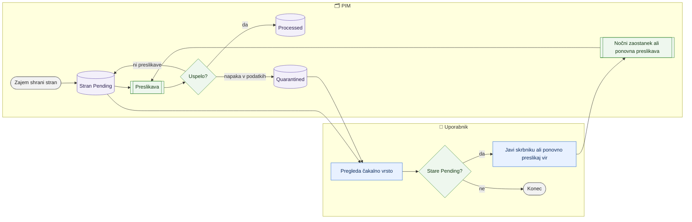

# Čakalna vrsta zajema

> **Področje:** Vhodi · **Lastnik:** skrbnik PIM · **Stanje:** ⚠️ delno · **Preverjeno:** 2026-09-24, iz kode

## 1. Namen

Vsak zajem (SAOP, XML, delovni zvezek) najprej shrani surove »strani« podatkov, nato jih preslikava prenese v katalog. Čakalna vrsta pokaže, koliko strani je po viru, vrsti podatkov (entiteti) in stanju: »Pending« (čaka preslikavo), »Processed« (obdelano), »Quarantined« ali »Failed« (ni prevzeto). »Pending« ni napaka — stran je shranjena in čaka.

## 2. Kdo sodeluje

| Vloga | Kaj naredi v procesu |
|---|---|
| Komerciala | Ni. |
| Urednik kataloga | Po potrebi preveri, ali je zajem dobavitelja obdelan. |
| Skrbnik | Išče zastale strani (stare »Pending«) in razloge za karanteno; sproži ponovno preslikavo. |
| Avtomatika (PIM) | Preslikava obdela strani; nočna uskladitev pobere zaostanek (`--preslikaj-zaostanek`). |

## 3. Kdaj se sproži

- **Ročno:** odpreš `/zajem/cakalna-vrsta` (kartica »Čaka« na `/zajem`).
- **Po urniku:** strani nastajajo z vsakim zajemom; zaostanek pobere nočna uskladitev (00:30, skupina »Preslikava zaostanka v raw.Inbox«).
- **Ob dogodku:** ko se preslikava dopolni, stari zajemi ostanejo »Pending« pod svojim tekom, dokler jih nekdo ne preslika znova.

## 4. Vhod in izhod

| | Kaj | Od kod / kam |
|---|---|---|
| **Vhod** | Surove strani zajema izbranega podjetja | PIM |
| **Izhod** | Prikaz skupin in posameznih strani z razlogom | uporabnik |

## 5. Diagram

## 6. Koraki

| # | Kdo | Kje (stran) | Kaj narediš | Kaj se zgodi v sistemu | Kako preveriš, da je uspelo |
|---|---|---|---|---|---|
| 1 | Skrbnik | `/zajem/cakalna-vrsta` | Odpreš stran (podjetje je izbrano podjetje v glavi strani). | Prebere se povzetek po viru, entiteti in stanju (število strani, najstarejša, najnovejša). | Tabela skupin. |
| 2 | Skrbnik | isto | Klikneš ime entitete v skupini. | Spodaj se naložijo posamezne strani tega stanja (50 na stran, listanje). | Vidiš številko strani, vir, prejeto, obdelano in razlog. |
| 3 | Skrbnik | isto | Pri »Quarantined« ali »Failed« prebereš »Razlog«. | — | Razlog pove, ali gre za pokvarjen vhod ali manjkajočo preslikavo. |
| 4 | Skrbnik / urednik | `/izdelki/novi-artikli` → »Vrzeli in ponovna preslikava …« | Za XML vire zapreš vrzeli in klikneš »Ponovno preslikaj vir«. | Strani vira gredo še enkrat skozi preslikavo. | Število »Pending« in »Quarantined« pade. |
| 5 | Skrbnik | strežnik | Za SAOP vir po dopolnjeni preslikavi zaženeš `PIM.KatalogWorker --znova-preslikaj <RunId>` ali počakaš nočni zaostanek. | Strani teka se vrnejo na »Pending« in se preslikajo znova. | Skupina »Processed« zraste. |

## 7. Pravila in varovalke

- Stran samo bere.
- Ista vsebina se ne zajame dvakrat (strani so enolične po viru, entiteti in vsebini) — zato se po dopolnitvi preslikave ne zajema znova, ampak **preslika znova**.
- Mejnik zajema SAOP se premakne šele, ko so strani preslikane; nepreslikane strani pomenijo, da bo isto obdobje zajeto znova.

## 8. Ko gre kaj narobe

| Znak (kaj vidiš) | Verjeten vzrok | Kaj narediš |
|---|---|---|
| Veliko starih »Pending« za eno entiteto. | Entiteta nima aktivne preslikave. | Na `/zajem/viri/{SourceCode}` preveri »Preslikava: Manjka«; skrbnik doda preslikavo. |
| »Quarantined« z razlogom. | Pokvarjen ali nepričakovan vhod. | Odpri težavo na `/zajem/tezave?vrsta=INBOX`. |
| »Za to organizacijo ni zajetih strani.« | Izbrano je podjetje brez zajema. | Zamenjaj podjetje v glavi strani. |

## 9. Tehnično ozadje

Za skrbnika in razvoj

- **Strani:** `PIM.Intranet/Components/Pages/IngestQueue.razor`.
- **Storitve / delavci:** `PipelineReadService.GetInboxGroupsAsync`, `GetInboxPagesAsync`; worker stikala `--map-run`, `--znova-preslikaj`, `--preslikaj-zaostanek` (`PIM.KatalogWorker`, `PIM.XmlFileWorker`).
- **Tabele in pogledi:** `raw.Inbox` (Status Pending, Processed, Quarantined, Failed), `map.ExtractedValue`.
- **Migracije:** 240 (jedro preslikave), 244 (ponovna preslikava vira), 094 (vrnitev na Pending z vrednostmi v surovi obliki).
- **Urniki:** `NIGHTLY_RECONCILIATION` (zaostanek).

## 10. Odprta vprašanja in razlike

- ⚠️ Stran kaže samo **izbrano podjetje** (piškotek izbire podjetja; brez izbire prvo aktivno po šifri), medtem ko `/zajem` privzeto kaže vsa.
- ⚠️ Na strani ni gumba za ponovno preslikavo; za SAOP vire je potreben ukaz na strežniku ali nočni zaostanek, za XML vire pot prek strani Novi artikli.
- ⚠️ Stanja so prikazana v angleščini (Pending, Processed, Quarantined).

## Povezani procesi

- [Pregled vhodov in virov](pregled-vhodov-in-virov.md): kartica »Čaka«.
- [Preslikava virov in ponovna obdelava](preslikava-virov-in-ponovna-obdelava.md): kako se zastale strani spet obdelajo.
- [Težave in neujemanja zajema](tezave-in-neujemanja-zajema.md): karantena in napake.
- [Karantena](../04-kakovost/karantena.md): pregled zapisov v karanteni.
