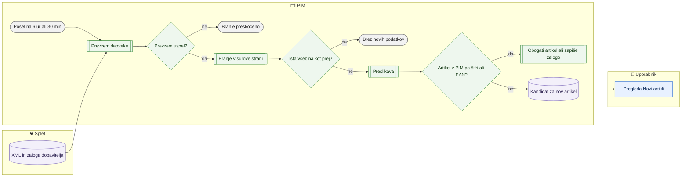

# Dobaviteljski katalogi XML in zaloga dobaviteljev

> **Področje:** Vhodi · **Lastnik:** urednik kataloga (vsebina), skrbnik (prevzem) · **Stanje:** ⚠️ delno · **Preverjeno:** 2026-09-29, iz kode in razvojne baze (#7)

## 1. Namen

PIM sam prenese kataloge dobaviteljev Nowodvorski (`NW_XML`) in Braytron (`BT_XML`) ter njihove datoteke zaloge (`NW_STOCK`, `BT_STOCK`). Katalog **obogati obstoječe artikle** (atributi, opisi, slike, dokumenti, kategorija dobavitelja), za šifre in EAN, ki jih v PIM ni, pa ustvari **kandidate** na strani Novi artikli. Zaloga dobavitelja se zapiše samo artiklom, ki jih podjetje že ima.

## 2. Kdo sodeluje

| Vloga | Kaj naredi v procesu |
|---|---|
| Komerciala | Uporablja zalogo dobavitelja pri artiklih. |
| Urednik kataloga | Pregleda, kaj je XML prinesel (kartica artikla, Novi artikli); zapre vrzeli preslikave. |
| Skrbnik | Nastavi naslove prevzema v `appsettings.Local.json` (`Fetch:NW_XML`, `Fetch:BT_XML` …), spremlja posle na `/sistem`. |
| Avtomatika (PIM) | Prevzame datoteke, jih prebere v surove strani, preslika v katalog ali kandidate, zapiše zalogo. |

## 3. Kdaj se sproži

- **Ročno:** skrbnik na `/sistem` pri »Katalog dobaviteljev (XML)« ali »Zaloga dobaviteljev« klikne »Poženi zdaj«.
- **Po urniku:**
  - `SUPPLIER_CATALOG_IMPORT` — vsakih 6 ur; ne kliče SAOP, zato ne čaka v pasu SAOP, a ne teče hkrati z zajemom artiklov iz SAOP (nova šifra mora obstajati, preden jo XML obogati).
  - `SUPPLIER_STOCK_IMPORT` — vsakih 30 min; prevzemnik spoštuje omejitve dobaviteljev (Nowodvorski na 2 h, Braytron en prenos na 3 h).
  - `NIGHTLY_RECONCILIATION` ob 00:30 ponovi prevzem in branje kot kontrolo.
- **Ob dogodku:** ni.

## 4. Vhod in izhod

| | Kaj | Od kod / kam |
|---|---|---|
| **Vhod** | `products_en_US.xml` (Nowodvorski, ~19 MB, HTTP), Braytron XML (HTTP), zaloga NW (FTP, CSV), zaloga BT (HTTPS, XML) | dobavitelj |
| **Izhod** | Surove strani zajema, atributi, besedila, slike in dokumenti, kategorija dobavitelja, kandidati za nove artikle, pozicije zaloge dobavitelja | PIM |

## 5. Diagram

## 6. Koraki

| # | Kdo | Kje (stran) | Kaj narediš | Kaj se zgodi v sistemu | Kako preveriš, da je uspelo |
|---|---|---|---|---|---|
| 1 | Avtomatika | — | — | Prevzemnik prenese datoteko v mapo prevzema (`<LANDING_ROOT>\NW_XML` …). Nowodvorski katalog se prenese največ vsakih 6 h (varovalka `MinIntervalMinutes = 360`). Če prevzem pade (npr. manjka naslov), se branje istega vira preskoči, da stara datoteka ne ustvari videza svežine. | `/sistem` → posel → faza prevzema zelena. |
| 2 | Avtomatika | — | — | Za **vsako vključeno podjetje** posebej se XML prebere v surove strani. Enaka vsebina kot že zajeta se ne zapiše znova (»uspelo, brez novih podatkov«). | Faze BRANJE in ZAPIS; na `/zajem/viri/NW_XML?podjetje=2` raste »Prejeto v 24 urah«. |
| 3 | Avtomatika | — | — | Preslikava zapis poveže z artiklom po šifri ali EAN. Obstoječemu artiklu zapiše polja, katerih lastnik je dobavitelj (atributi, opisi, slike, dokumenti, kategorija dobavitelja); ne povozi polj SAOP in PIM. | Na kartici artikla so nove lastnosti in slike. |
| 4 | Avtomatika | — | — | Zapis brez ujemanja postane **kandidat** (ne artikel). Če je artikel medtem nastal po drugi poti (SAOP), se kandidat samodejno zapre. | Na `/izdelki/novi-artikli` je nov kandidat »Čaka na ERP«. |
| 5 | Avtomatika | — | — | Zaloga dobavitelja se zapiše vsakemu podjetju, a na strani Zaloga šteje samo pri artiklu, ki ga podjetje ima (262). | `/zaloge` pri artiklu kaže vir `NW_STOCK` ali `BT_STOCK`. |
| 6 | Urednik | `/zajem` | Pregledaš vrstice »Dobaviteljev XML« in »Zaloga dobavitelja« (stanje, zadnji uspeh, čaka, zavrnjeno). | — | Stanje »V redu«; »Čaka« 0. |
| 6b | Urednik | `/izdelki/novi-artikli?pogled=spremembe` (zavihek »Spremembe iz XML«) | Vpišeš šifro artikla ali izbereš podjetje, vir, vrsto (atributi, besedila, slike) in obdobje. | Prebere se zgodovina polj (`pim.ProductFieldHistory`), ki jo je zapisal zajem **dobaviteljevega** XML (paketi `PIM.XmlMapping:NW_XML` / `BT_XML`); spremembe preslikave SAOP in ročni popravki niso zraven. Listanje po 50, štetje v bazi. | Vrstice »šifra · kaj · prej → potem · kdaj · vir«; zgoraj »Zadnji prevzem datoteke« po viru (rumeno, če je starejši od dneva). Klik na šifro odpre kartico artikla. |
| 6c | Urednik | isti zavihek, gumb »Izvozi Excel (N)« | Klikneš izvoz; med gradnjo lahko prekličeš. | Iste vrstice in isti vrstni red kot na zaslonu, a vse strani (`SupplierCandidateReadService.WriteXmlChangesWorkbookAsync`, bere sproti, piše na disk, vrsta izvozov `HeavyWorkGate.Exports`); datoteka gre prek `ExportResultStore` na `/izvoz/prenos/{žeton}`. Nič ne zapiše v bazo. | Prenos `PIM_spremembe_iz_XML_<datum>.xlsx`: šifra, podjetje, vir, vrsta, kaj, sprememba, prej, potem, kdaj; pod tabelo opomba z uporabljenimi filtri. Cela zgodovina (≈385.000 vrstic) v ~4 s. |
| 7 | Urednik | `/izdelki/novi-artikli` → »Vrzeli in ponovna preslikava …« | Če XML prinaša kategorije ali atribute brez preslikave, jih zapreš in klikneš »Ponovno preslikaj vir«. | Glej [Preslikava virov in ponovna obdelava](preslikava-virov-in-ponovna-obdelava.md). | Artikli dobijo manjkajoče vrednosti. |

## 7. Pravila in varovalke

- XML **nikoli ne ustvari artikla** v PIM (257); ustvari samo kandidata. Artikel nastane šele po poti v SAOP in povratnem zajemu.
- XML ne povozi polj, katerih lastnik je SAOP ali PIM.
- Zaloga dobavitelja se ne pokaže pri artiklu, ki ga podjetje nima (262).
- Svežina: `NW_XML` sme biti star 7 dni, `BT_XML` 36 h; zaloga `NW_STOCK` 4 h, `BT_STOCK` 6 h (merjeno po **novih** podatkih — Braytron je 2026-09-22 pet dni vračal isto datoteko). Prekoračitev odpre alarm »SourceStale«.
- Naslov z dostopnim žetonom stoji samo v `appsettings.Local.json` na strežniku, ne v bazi.
- Vsaka sprememba, ki jo zajem XML naredi pri obstoječem artiklu, gre v zgodovino polj (sprožilci 034, `ChangeSource = XML_FEED`, `ChangedBy = PIM.XmlMapping:<vir>`); pregled po šifri je zavihek »Spremembe iz XML« (#7). Povratka teh sprememb ni in ga ne bo (odločitev lastnika pri #27, 2026-09-29: samo pregled, filtri in izvoz v Excel, brez zaklepanja polj) — naslednji zajem bi vrnjeno vrednost spet prepisal.

## 8. Ko gre kaj narobe

| Znak (kaj vidiš) | Verjeten vzrok | Kaj narediš |
|---|---|---|
| Prevzem javi »Naslov ni nastavljen«. | Na strežniku manjka `Fetch:NW_XML` (ali `Fetch:BT_XML`) v `appsettings.Local.json`. | Skrbnik doda naslov (ročni korak migracije 270). |
| Vir »Zamuja«, alarm »SourceStale«. | Dobavitelj ne odgovarja ali vrača isto datoteko. | Skrbnik preveri prevzem na `/sistem`; po potrebi kontaktira dobavitelja. |
| Artikel nima atributov ali kategorije iz XML. | Manjka preslikava kategorije ali atributa vira. | Zapri vrzeli in ponovno preslikaj vir. |
| Datoteka v karanteni. | Pokvarjen ali nepričakovan XML. | `/zajem/tezave?vrsta=INBOX`; skrbnik pogleda predogled vhoda. |
| Zavihek »Spremembe iz XML« je prazen ali zadnja sprememba je stara. | XML ne prihaja (glej »Zadnji prevzem datoteke«) ali dobavitelj ni ničesar spremenil. | Pri rumenem prevzemu preveri posel `SUPPLIER_CATALOG_IMPORT` na `/sistem`. |
| Pri opisu piše »skrajšano«. | Zgodovina hrani prvih 400 znakov. | Celotno besedilo je na kartici artikla. |
| »Zavrnjena zaloga« na `/zajem` raste. | Šifre v datoteki zaloge se ne ujemajo z artikli. | `/zajem/tezave?vrsta=STOCK`. |

## 9. Tehnično ozadje

Za skrbnika in razvoj

- **Strani:** `/zajem` (`Ingest.razor`), `/zajem/viri/{SourceCode}` (`IngestSourceDetail.razor`), zavihek »Spremembe iz XML« (`SupplierXmlChanges.razor` v `IngestCandidates.razor`, `SupplierCandidateReadService.GetXmlChangesAsync` in `WriteXmlChangesWorkbookAsync` (izvoz v Excel) — parametriziran SELECT nad `pim.ProductChangeBatch` + `pim.ProductFieldHistory`, brez migracije).
- **Storitve / delavci:** `PIM.SourceFetchWorker` (`SourceFetcher`, `FetchLocation`; register `map.SourceFetchLocation`), `PIM.XmlFileWorker` (branje XML in delovnih zvezkov, okolje `PIM_XML_SOURCE_CODE`, `PIM_XML_ORGANIZATION_ID`; stikala `--map-run`, `--znova-preslikaj`), `PIM.StockFileWorker` (`NwFtpTransport`, `BtXmlTransport`), knjižnici `PIM.XmlMapping` (`XPathMappingExtractor`, `SqlMappingPipeline`) in `PIM.StockMapping` (`StockMappingExtractor`, `StockLandingWriter`); posli v `PIM.Automation/JobCatalog.cs` (`PlanSupplierCatalog`) in `WorkerSchedulerPolicy.cs` (`XmlSteps`, `StockFilesSteps`).
- **Tabele in pogledi:** `raw.Inbox`, `map.ExtractedValue`, `map.SourceConnector` (`CanCreateProducts = 0` za ne-SAOP), `map.SupplierProductCandidate`, `stock.Position`, `map.StockIdentityRule`.
- **Migracije:** 240 (kandidati po EAN), 256 (viri in svežina), 257 (ERP-first), 262 (zaloga dobavitelja samo obstoječim), 270 (NW_XML prek HTTP), 273.
- **Urniki:** `SUPPLIER_CATALOG_IMPORT` (21600 s), `SUPPLIER_STOCK_IMPORT` (1800 s), `NIGHTLY_RECONCILIATION` (00:30).

## 10. Odprta vprašanja in razlike

- ⚠️ Nočna uskladitev pri XML koraku, če mapa prevzema nima datotek, uporabi **testne datoteke** (`nw`, `bt` v mapi fixtures), redni posel `SUPPLIER_CATALOG_IMPORT` pa ne. Nočni tek lahko torej na strežniku z mapo fixtures zajame testni XML.
- ⚠️ Oznaka `XML_FEED` v zgodovini pokriva tudi preslikavo SAOP (`PIM.XmlMapping:SAOP_*`); dobavitelja loči samo `ChangedBy`. Paket XML nima podjetja (`pim.ProductChangeBatch.OrganizationId` je NULL), podjetje je v vrstici zgodovine.
- ⚠️ Stara in nova vrednost v zgodovini sta odrezani na 400 znakov (sprožilci 034).
- ⚠️ `Fetch:BT_XML` na PRD po zapisih prejšnjih sej verjetno manjka; iz kode ni mogoče preveriti.
- ⚠️ Znana napaka iz prejšnjih sej: MERGE medijev iz NW XML in časovna omejitev za podjetje 4 — v kodi nisem našel potrditve, da sta odpravljeni.
- ⚠️ XML se bere za vsa vključena podjetja, čeprav ima katalog za splet samo podjetje 2; pri velikem podjetju preslikava traja 10 min in več.

## Povezani procesi

- [Novi artikli dobaviteljev](novi-artikli-dobaviteljev.md): kaj se zgodi s kandidati.
- [Preslikava virov in ponovna obdelava](preslikava-virov-in-ponovna-obdelava.md): zapiranje vrzeli in ponovna preslikava.
- [Pregled vhodov in virov](pregled-vhodov-in-virov.md): stanje virov.
- [Težave in neujemanja zajema](tezave-in-neujemanja-zajema.md): karantena, zavrnjena zaloga.
- [Mediji](../03-izdelki/mediji.md): slike in dokumenti iz XML.
- [Kategorije izdelka](../03-izdelki/kategorije-izdelka.md): kategorija dobavitelja → naše drevo.
- [Zaloge in rezervacija](../07-poslovanje/zaloge-in-rezervacija.md): uporaba zaloge dobavitelja.
- [Avtomatika in urniki](../09-administracija/avtomatika-in-urniki.md): posli in ročni zagon.
