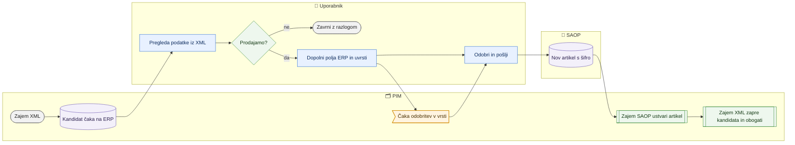

# Novi artikli dobaviteljev (kandidati iz XML v SAOP)

> **Področje:** Vhodi · **Lastnik:** urednik kataloga · **Stanje:** ⚠️ delno · **Preverjeno:** 2026-09-29, iz kode (#7)

## 1. Namen

Artikel, ki ga dobavitelj ponuja v XML, v PIM pa ga ni (ne po šifri ne po EAN), postane **kandidat**. Urednik ga pregleda, dopolni obvezne podatke ERP in pošlje v SAOP kot nov artikel. Pravi artikel v PIM nastane šele, ko ga povratni zajem iz SAOP prebere; XML ga nato obogati.

## 2. Kdo sodeluje

| Vloga | Kaj naredi v procesu |
|---|---|
| Komerciala | Odloči, ali artikel prodajamo (lahko ga predlaga uredniku). |
| Urednik kataloga | Pregleda kandidata (»Podatki iz XML«), dopolni polja ERP, uvrsti v vrsto SAOP ali zavrne. |
| Skrbnik | Enako kot urednik; rešuje primere, ko SAOP dodeli drugo šifro. |
| Avtomatika (PIM) | Ustvari kandidate ob zajemu XML; pošlje odobrena sporočila v SAOP; zajem SAOP ustvari artikel; naslednji zajem XML kandidata zapre. |

## 3. Kdaj se sproži

- **Ročno:** urednik odpre `/izdelki/novi-artikli` (zavihek »Novi artikli« pod Izdelki; stara pot `/zajem/novi-artikli` še deluje).
- **Po urniku:** kandidati nastanejo s poslom `SUPPLIER_CATALOG_IMPORT` (vsakih 6 ur); pošiljanje `SAOP_OUTBOUND_DISPATCH`; artikel v PIM ustvari `SAOP_PRODUCT_IMPORT` (vsako uro).
- **Ob dogodku:** nova šifra ali EAN v XML dobavitelja.

## 4. Vhod in izhod

| | Kaj | Od kod / kam |
|---|---|---|
| **Vhod** | Kandidat s posnetkom vrednosti iz XML (naziv, EAN, šifra, slike, atributi), pogodba polj SAOP, privzetki ERP | dobavitelj (XML) / uporabnik |
| **Izhod** | Sporočila »nov artikel« (POST) v odhodni vrsti za SAOP; zavrnjen kandidat z razlogom | PIM → SAOP |

## 5. Diagram

## 6. Koraki

| # | Kdo | Kje (stran) | Kaj narediš | Kaj se zgodi v sistemu | Kako preveriš, da je uspelo |
|---|---|---|---|---|---|
| 1 | Urednik | `/izdelki/novi-artikli` | Izbereš podjetje, vir (`NW_XML`, `BT_XML`) in stanje (privzeto »Čaka na ERP«); iščeš po šifri ali EAN in klikneš »Uporabi filtre«. | Prebere se do 50 kandidatov na stran; zgoraj števci (Čaka na ERP, Kandidati čakajo na SAOP, V čakalni vrsti SAOP, SAOP zavrnil, Potrjeni v SAOP, Zavrnjeni). | Seznam kandidatov; oznaka »šifra = EAN«, kadar dobavitelj šifre ne pošilja. |
| 2 | Urednik | isto | Pri vrstici klikneš »Podatki iz XML«. | Pokažejo se vrednosti, ki jih je poslal dobavitelj, po skupinah (tudi do 12 slik). | Vidiš naziv, lastnosti, slike. |
| 2b | Urednik | isto, stolpec »Uvrstitev v kategorijo« | Pogledaš, kam bo artikel uvrščen. Vrstica ima oznako »nov v katalogu dobavitelja«. | Iz zadnjega zajema (zapis Classification) se prebere dobaviteljeva pot in prevede po preslikavah kategorij (`map.CategoryPathMap`) za vsako drevo — isto pravilo, kot ga uporabi zajem, ko artikel obstaja (#7). | »Bo uvrščen v: Notranja svetila > …« ali rdeče »Kategorija dobavitelja nima preslikave« z gumbom »Preslikaj …« (okno vrzeli) in povezavo na Preslikave kategorij. »Dobavitelj kategorije ne pošlje« pomeni ročno uvrstitev po ustvaritvi. |
| 3a | Urednik | isto | Če artikla ne želimo: »Zavrni …«, vpišeš razlog, »Potrdi zavrnitev«. | Kandidat dobi stanje »Zavrnjeni« z razlogom, tvojim imenom in časom. | Sporočilo »Artikel … je zavrnjen.« |
| 3b | Urednik | isto | Če ga želimo: »V SAOP …« (en artikel) ali kljukice + »V čakalno vrsto SAOP izbrane (N) …« (več artiklov **istega podjetja**). | Odpre se priprava: polja ERP, ki jih PIM sme pisati; obvezna so označena z `*`, manjkajoča obarvana. Skupne vrednosti šifrantov vpišeš enkrat, naziv po artiklu. | Števec pripravljenih artiklov v gumbu. |
| 4 | Urednik | priprava | Klikneš »Uvrsti v čakalno vrsto (N)« ali »Uvrsti in odobri (N)«. | Za popolne artikle nastane skupina v vrsti za SAOP (vir `XML`, POST). Nepopolni ostanejo tu z razlogom (»Preskočenih: N«). Z »Uvrsti in odobri« so sporočila takoj odobrena. | Sporočilo »Skupina N: v čakalno vrsto SAOP uvrščenih …«; kandidat ima oznako »SAOP: v čakalni vrsti«. |
| 5 | Urednik | isto ali Izhod v SAOP | Če še ni odobreno: »Odobri v vrsti (N)«; nato »Pošlji zdaj« ali počakaš odhodno vrsto. | Sporočila gredo v SAOP; SAOP vrne šifro. | Oznaka »SAOP: poslan, čaka potrditev«. |
| 6 | Avtomatika | — | — | Zajem artiklov iz SAOP (vsako uro) ustvari artikel v PIM; naslednji zajem XML kandidata zapre in artikel obogati. | Oznaka »Potrjeni v SAOP«, povezava »Odpri artikel«; če je SAOP dodelil drugo šifro, piše »šifra SAOP X (prej Y)«. |

## 7. Pravila in varovalke

- **XML ne ustvari artikla v PIM** — samo kandidata. Stari ukaz »uvozi kandidata v PIM« je zaprt (257).
- Nepopoln dokument ne gre v vrsto: SAOP bi ga zavrnil in poskus bi bil porabljen.
- V SAOP nič ne gre samodejno: brez »Uvrsti in odobri« ali »Odobri v vrsti« sporočila čakajo odobritev.
- Paketna priprava velja za artikle **enega podjetja** (šifranti ERP in kanal so na podjetje). Če kanal SAOP za podjetje ni vklopljen, sta gumba za uvrstitev onemogočena.
- Kandidat, ki ga SAOP že pozna, se preskoči (»spremembe gredo s kartice artikla«).
- Kdo sme: zavrnitev `CatalogWrite` (skrbnik, urednik); uvrstitev v vrsto, **odobritev v vrsti** in »Pošlji zdaj« `SaopWrite` (skrbnik, urednik) — vse tri preveri servis `SupplierCandidateSaopService` (#7), stran brez pravice gumbe onemogoči in pokaže »Samo za branje«; ponovna preslikava vira `CatalogWrite`.
- Predlagana kategorija ne sproži ničesar: uvrstitev naredi zajem XML, ko artikel po zajemu SAOP obstaja; SAOP s tem nima opravka.

## 8. Ko gre kaj narobe

| Znak (kaj vidiš) | Verjeten vzrok | Kaj narediš |
|---|---|---|
| »Noben artikel ni šel v vrsto: … manjka …« | Manjka obvezno polje ERP. | Dopolni označena polja in ponovi. |
| »Za pot v SAOP izberi artikle enega podjetja …« | Izbrani kandidati več podjetij. | Filtriraj po podjetju. |
| Oznaka »SAOP zavrnil« z napako. | SAOP je dokument zavrnil. | Preberi napako v vrstici, popravi in ponovno uvrsti. |
| »SAOP je dodelil šifro X, ki je PIM ni prevzel …« | Šifro že ima drug artikel v PIM. | Uskladi ročno (skrbnik). |
| »Pošlji zdaj« ne pošlje, sporočilo o poverilnicah. | Na strežniku ni poverilnic SAOP. | Počakaj odhodno vrsto ali javi skrbniku. |
| Kandidat ostaja »poslan« dolgo po pošiljanju. | Zajem SAOP ali naslednji zajem XML še ni tekel. | Preveri posla na `/sistem`. |
| Rdeče »Kategorija dobavitelja nima preslikave«. | Za dobaviteljevo pot ni preslikave v nobenem drevesu. | »Preslikaj …« (vrzeli vira) ali Kakovost → Preslikave kategorij; ob naslednjem zajemu gre artikel v kategorijo. |
| Gumbi »V SAOP …«, »Odobri v vrsti« sivi, zgoraj »Samo za branje«. | Tvoja vloga nima pravice `SaopWrite`. | Prosi urednika kataloga ali skrbnika. |

## 9. Tehnično ozadje

Za skrbnika in razvoj

- **Strani:** `PIM.Intranet/Components/Pages/IngestCandidates.razor` (`/izdelki/novi-artikli`, `/zajem/novi-artikli`), okno `Components/Shared/ImportGapsDialog.razor`.
- **Storitve / delavci:** `SupplierCandidateReadService.GetCandidatesAsync` / `GetCategoryPredictionsAsync` (#7, en SELECT za stran), `SupplierCandidateWriteService.RejectAsync`, `SupplierCandidateSaopService` (`PrepareAsync`, `QueueAsync`, `ApproveAsync`, `SendNowAsync` — vse z `SaopWrite`), `SaopItemWriteService.BuildPlan` / `GetSupplierCandidateStateAsync`, `SaopWriteService.EnqueueAsync`, `IntranetDataService.ApproveItemAsync` (`out.ApproveItemDocument`, klican samo prek `ApproveAsync`), `PIM.Outbound.SaopNewItemQueue`.
- **Tabele in pogledi:** `map.SupplierProductCandidate` (PENDING, APPROVED, REJECTED), za uvrstitev `raw.Inbox` + `map.ExtractedValue` (`ProductCategory.SourceLevel1..3`), `map.CategoryPathMap`, `canon.CategoryPathTranslated`, `out.OutboxMessage`, `out.OutboundBatch`, `out.SaopItemAssignment`, `out.SaopAddDefault`, `out.SaopXmlField`; procedure `intranet.GetSupplierProductCandidates`, `out.GetSupplierCandidateSaopWriteState`, `map.RejectSupplierProductCandidate`.
- **Migracije:** 219, 240, 241, 257 (ERP-first; datoteka nosi v glavi številko 256), 273 (samodejno zapiranje kandidata).
- **Urniki:** `SUPPLIER_CATALOG_IMPORT`, `SAOP_OUTBOUND_DISPATCH`, `SAOP_PRODUCT_IMPORT`.

## 10. Odprta vprašanja in razlike

- ✅ (#7) Gumb »Odobri v vrsti (N)« je šel mimo varovalke; zdaj gre prek `SupplierCandidateSaopService.ApproveAsync` z `SaopWrite`.
- ⚠️ Pot dobavitelja, ki je še na nobenem obstoječem artiklu, se v »Preslikave kategorij« (`map.SourceCategory`) pokaže šele, ko jo zajem vidi pri artiklu; do takrat jo najdeš v oknu »Vrzeli in ponovna preslikava«.
- ⚠️ Stanje »V PIM« (APPROVED) in »Potrjeni v SAOP« nastaneta šele, ko po zajemu SAOP teče še **zajem XML**, ki kandidata poveže z artiklom (vsakih 6 ur). Do takrat kandidat kaže »poslan, čaka potrditev«, čeprav je artikel že v PIM.
- ⚠️ Odločitveni dokument (`docs/ODLOCITEV_ERP_FIRST_NOVI_ARTIKLI.md`) predvideva ročni »Nov predlog« in stanja `DOPOLNITI_ERP`, `NEJASNO_UJEMANJE` …; v kodi ju ni — stanja so samo PENDING, APPROVED, REJECTED in izpeljano stanje SAOP.
- ⚠️ Opis storitve `SupplierCandidateSaopService` še govori o »artiklu, ki ga je ustvaril PIM« (stara pot 241), stran in baza pa že delata po ERP-first (257).
- ⚠️ Filter vira ima samo `NW_XML` in `BT_XML`; nov dobavitelj zahteva spremembo kode.

## Povezani procesi

- Na isti strani je zavihek **»Spremembe iz XML«** (`?pogled=spremembe`): kaj je XML spremenil pri **obstoječih** artiklih — glej [Dobaviteljski katalogi XML](dobaviteljski-katalogi-xml.md), korak »Pregled sprememb po šifri«.
- [Dobaviteljski katalogi XML](dobaviteljski-katalogi-xml.md): kje kandidati nastanejo.
- [Preslikava virov in ponovna obdelava](preslikava-virov-in-ponovna-obdelava.md): gumb »Vrzeli in ponovna preslikava …« na tej strani.
- [Zajem iz SAOP](zajem-iz-saop.md): povratni zajem ustvari artikel.
- [Izhod v SAOP](../05-izhod-saop/izhod-v-saop.md): odobritev in pošiljanje sporočil.
- [Iskanje in kartica izdelka](../03-izdelki/iskanje-in-kartica-izdelka.md): nadaljnje urejanje nastalega artikla.
