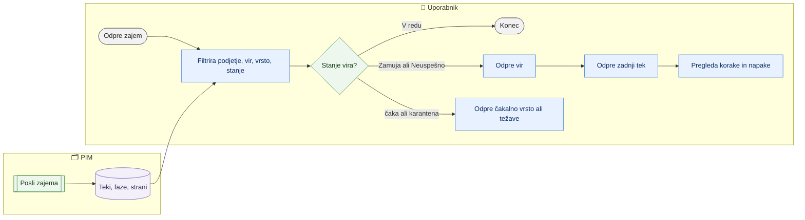

# Pregled vhodov, virov in tekov zajema

> **Področje:** Vhodi · **Lastnik:** skrbnik PIM · **Stanje:** ⚠️ delno · **Preverjeno:** 2026-09-24, iz kode

## 1. Namen

Na enem mestu pokaže vse registrirane vhode vseh podjetij (SAOP API, dobaviteljev XML, zaloga, ročni uvoz): kaj beremo, od kod, kdaj nazadnje in s kakšnim izidom. Zadnji poskus je ločen od zadnjega uspeha, da neuspeh ne ostane skrit za starim zelenim stanjem. Iz pregleda se gre v podrobnosti vira in posameznega teka.

## 2. Kdo sodeluje

| Vloga | Kaj naredi v procesu |
|---|---|
| Komerciala | Preveri, ali so cene in zaloga sveže (stolpec »Zadnji uspeh«). |
| Urednik kataloga | Preveri, ali je XML dobavitelja prišel; gre na »Novi artikli iz XML«. |
| Skrbnik | Išče vir, ki »Zamuja« ali je »Neuspešno«; odpre tek in njegove napake. |
| Avtomatika (PIM) | Posli zapisujejo teke, faze in stanje virov, ki jih stran prebere. |

## 3. Kdaj se sproži

- **Ročno:** uporabnik odpre `/zajem` (prek neposredne povezave ali zavihka »Vhodi«), `/zajem/viri/{SourceCode}`, `/sistem/teki` (zavihek »Teki« na Nadzoru sistema).
- **Po urniku:** stran nima posla; kaže izid poslov zajema.
- **Ob dogodku:** ni.

## 4. Vhod in izhod

| | Kaj | Od kod / kam |
|---|---|---|
| **Vhod** | Registrirani tokovi po podjetjih, teki, faze, strani zajema, kandidati, zavrnjena zaloga | PIM |
| **Izhod** | Samo prikaz s povezavami | uporabnik |

## 5. Diagram

## 6. Koraki

| # | Kdo | Kje (stran) | Kaj narediš | Kaj se zgodi v sistemu | Kako preveriš, da je uspelo |
|---|---|---|---|---|---|
| 1 | Kdorkoli | `/zajem` | Odpreš »Zajem podatkov«. | Preberejo se tokovi, povzetek in števci kandidatov. | Zgoraj kartice: »Tokovi v redu«, »Čaka«, »V karanteni«, »Nerazvrščene vrednosti«, »Zavrnjena zaloga«, »Tehnične težave«, »Novi artikli iz XML«, »Uvoženi, čakajo na SAOP«. |
| 2 | Kdorkoli | `/zajem` | Izbereš »Podjetje«, »Vir«, »Vrsta vhoda« (SAOP API, Dobaviteljev XML, Zaloga, Ročni uvoz), »Stanje« (V redu, Zamuja, Neuspešno, V teku, Še brez teka), »Aktivnost«. | Filtri se uporabijo takoj. | »N vhodnih tokov«. |
| 3 | Kdorkoli | `/zajem` | Klikneš kartico (npr. »Čaka« → `/zajem/cakalna-vrsta`, »Nerazvrščene vrednosti« → `/zajem/neujemanja`, »Tehnične težave« → `/zajem/tezave`, »Novi artikli iz XML« → `/izdelki/novi-artikli`). | — | Odpre se ustrezna stran. |
| 4 | Skrbnik | `/zajem` → `/zajem/viri/{SourceCode}?podjetje=N` | Klikneš ime vira. | Pokaže operativno stanje (zadnji poskus, uspeh, neuspeh, naslednji zagon), količine (prejeto v 24 h, čaka, zavrnjeno, ali sme ustvarjati artikle), zadnjo napako, entitete s preslikavo in mejnikom, zadnjih 20 tekov. Če je vir pri več podjetjih, so nad tabelo zavihki podjetij. | Entitete imajo »Preslikava: Aktivna«; »Čaka« 0. |
| 5 | Skrbnik | `/sistem/teki` | Filtriraš po iskanju, podjetju, viru, postopku, statusu in klikneš »Uporabi filtre«. | Zgodovina vseh tekov po 50 na stran. | Prebrano, uspešno, zavrnjeno, trajanje. |
| 6 | Skrbnik | `/sistem/teki/{RunId}` | Klikneš začetek teka. | Pokaže identiteto teka, rezultat, korake obdelave, napake teka (povezava na težavo), zavrnjene pozicije zaloge in strani zajema. | Vzrok napake je viden; stran vodi na `/zajem/tezave/…`. |

## 7. Pravila in varovalke

- Stran samo bere; zagon posla je na `/sistem` (glej [Avtomatika in urniki](../09-administracija/avtomatika-in-urniki.md)).
- »Sme ustvarjati« je dovoljeno samo virom SAOP (257).
- Privzeto so prikazana **vsa podjetja**, ker se delo enega podjetja pogosto ustavi zaradi vira, ki ga polni drugo.
- Podrobnosti teka (tehnični del) so enake za vse vloge; tehnični predogled vhoda na težavi vidi samo skrbnik.

## 8. Ko gre kaj narobe

| Znak (kaj vidiš) | Verjeten vzrok | Kaj narediš |
|---|---|---|
| »Pregleda vhodnih podatkov trenutno ni mogoče naložiti.« | Baza ne odgovori. | Osveži; če se ponavlja, javi skrbniku. |
| »Vira X ni v nobenem podjetju — konektor ni registriran.« | Napačna šifra vira v naslovu ali vir ni v registru. | Odpri vir s seznama na `/zajem`. |
| Stanje »Zamuja«. | Meja svežine prekoračena. | Odpri vir → zadnji tek; skrbnik preveri posel na `/sistem`. |
| Entiteta »Preslikava: Manjka«. | Za to vrsto podatkov ni preslikave. | Skrbnik doda preslikavo (Pravila in izvor podatkov); strani čakajo. |
| »Ta worker korakov ne zapisuje …« | Zalogovni tok ne piše korakov. | Uporabi rezultat teka in zavrnjene pozicije. |

## 9. Tehnično ozadje

Za skrbnika in razvoj

- **Strani:** `Ingest.razor` (`/zajem`), `IngestSourceDetail.razor` (`/zajem/viri/{SourceCode}`), `IngestRuns.razor` (`/sistem/teki`, `/zajem/teki`), `IngestRunDetail.razor` (`/sistem/teki/{RunId}`, `/zajem/teki/{RunId}`), zavihki `Components/Shared/IngestTabs.razor` (Vhodi, Teki, Težave) in `NadzorTabs` v `PimTab.cs`.
- **Storitve / delavci:** `PipelineReadService` (`GetInboundFlowsAsync`, `GetInboundOverviewSummaryAsync`, `GetInboundFilterOptionsAsync`, `GetSourceEntitiesAsync`, `GetInboundRunsAsync`, pogled teka), `SupplierCandidateReadService` (števci).
- **Tabele in pogledi:** `map.SourceConnector`, `raw.Inbox`, `ops.PipelineRun`, koraki teka, `ops.JobSourceState()`, `stock.*` (zavrnjene pozicije).
- **Migracije:** 256 (viri in svežina), 276 (meja svežine na strani posla).
- **Urniki:** vsi posli zajema.

## 10. Odprta vprašanja in razlike

- ⚠️ Meni »Zajem podatkov« je bil 2026-09-24 odstranjen (`PimNavigation.cs`): `/zajem` in podstrani niso več v meniju; dosegljive so samo z neposredno povezavo, z zavihkov na straneh zajema in s kartic na `/zajem`. Uporabnik jih težko najde.
- ⚠️ Stran kaže dve različni meri: stare teke (`ops.PipelineRun`) in stanje virov iz novih faz (`/sistem`); lahko se ne ujemata.
- ⚠️ Stran podrobnosti teka ima zavihek »Teki« iz zajema, seznam tekov pa zavihke Nadzora sistema — navigacija med njima ni enotna.

## Povezani procesi

- [Zajem iz SAOP](zajem-iz-saop.md) in [Dobaviteljski katalogi XML](dobaviteljski-katalogi-xml.md): viri, ki jih stran prikazuje.
- [Čakalna vrsta zajema](cakalna-vrsta-zajema.md): kartica »Čaka«.
- [Težave in neujemanja zajema](tezave-in-neujemanja-zajema.md): kartice »Tehnične težave«, »Zavrnjena zaloga«, »Nerazvrščene vrednosti«.
- [Novi artikli dobaviteljev](novi-artikli-dobaviteljev.md): kartici kandidatov.
- [Nadzor sistema](../09-administracija/nadzor-sistema.md): posli, faze, alarmi.
- [Nadzorna plošča](../01-nadzor/nadzorna-plosca.md): skupni pregled.
