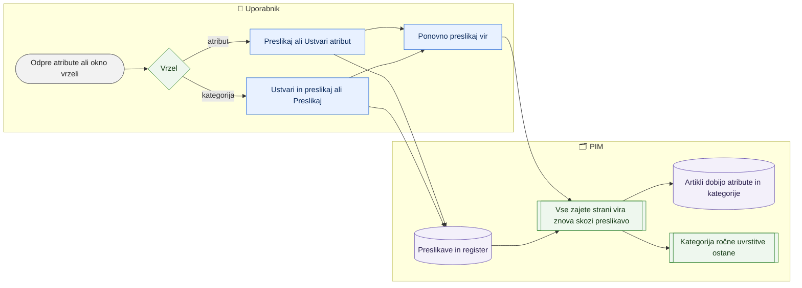

# Preslikava atributov in kategorij virov ter ponovna obdelava vira

> **Področje:** Vhodi · **Lastnik:** urednik kataloga · **Stanje:** ⚠️ delno · **Preverjeno:** 2026-09-24, iz kode

## 1. Namen

Dobavitelj pošilja svoje atribute (npr. »Colour temperature«) in svoje poti kategorij. Da pridejo v PIM, mora vsak imeti cilj: **našo lastnost** oziroma **našo kategorijo**. Ta proces zapre take vrzeli (preslika ali ustvari nov atribut ali kategorijo) in nato isto, že zajeto datoteko vira še enkrat pošlje skozi preslikavo — brez ponovnega nalaganja. Tudi že obstoječi artikli tako dobijo manjkajoče vrednosti.

## 2. Kdo sodeluje

| Vloga | Kaj naredi v procesu |
|---|---|
| Komerciala | Ni. |
| Urednik kataloga | Na `/zajem/atributi` preslika atribute; v oknu vrzeli ustvari ali preslika kategorije in atribute; klikne »Ponovno preslikaj vir«. |
| Skrbnik | Enako; po potrebi ponovna preslikava SAOP vira na strežniku. |
| Avtomatika (PIM) | Ponovna preslikava obdela vse zajeme vira; nočna uskladitev pobere zaostanek. |

## 3. Kdaj se sproži

- **Ročno:**
  - `/zajem/atributi` — delovni seznam izvornih atributov (privzeto »Nepreslikano«).
  - `/izdelki/novi-artikli` → gumb »Vrzeli in ponovna preslikava …« — okno z manjkajočimi kategorijami, atributi in drugimi napakami uvoza za izbrani vir (ali oba XML vira) in **vsa podjetja** s tem virom.
- **Po urniku:** nova preslikava velja ob naslednjem zajemu vira (`SUPPLIER_CATALOG_IMPORT`) — a nespremenjena datoteka se ne zajame znova, zato je za obstoječe podatke potrebna ponovna preslikava. Nočna uskladitev preslika samo strani, ki so še »Pending«.
- **Ob dogodku:** ni.

## 4. Vhod in izhod

| | Kaj | Od kod / kam |
|---|---|---|
| **Vhod** | Izvorni atributi z vzorcem vrednosti in številom izdelkov, nepreslikane poti kategorij, že zajete surove strani vira | dobavitelj (XML) / PIM |
| **Izhod** | Preslikava atributa (lastnost, jezik, ali je enota), nov atribut v registru, preslikava ali nova kategorija, ponovno preslikani artikli in kandidati | PIM |

## 5. Diagram

## 6. Koraki

**A. Delovni seznam atributov (`/zajem/atributi`)**

| # | Kdo | Kje (stran) | Kaj narediš | Kaj se zgodi v sistemu | Kako preveriš, da je uspelo |
|---|---|---|---|---|---|
| 1 | Urednik | `/zajem/atributi` | Izbereš »Vir«, »Stanje« (Nepreslikano, Preslikano, Ugasnjeno) in iščeš po imenu ali oznaki. | Seznam je razvrščen po številu izdelkov za atributom; prikazan je vzorec vrednosti. | »N atributov«. |
| 2 | Urednik | isto | Klikneš »Preslikaj« (ali »Uredi«); v polju »Naša lastnost« izbereš lastnost ali vpišeš novo ime in klikneš »Ustvari nov atribut«; izbereš »Jezik vrednosti«; po potrebi »Vir nosi enoto te lastnosti, ne vrednosti«; klikneš »Shrani«. | Preslikava se zapiše s tvojim imenom. Izbirnik opozori na enako ali podobno ime, da se atribut ne podvoji. | »Preslikava je zapisana. Velja ob naslednji preslikavi vira za N izdelkov.« |
| 3 | Urednik | isto | Napačno preslikavo izklopiš z »Ugasni preslikavo«. | Preslikava je ugasnjena, atribut gre v stanje »Ugasnjeno«. | Stanje v vrstici. |

**B. Okno vrzeli in ponovna preslikava (`/izdelki/novi-artikli`)**

| # | Kdo | Kje (stran) | Kaj narediš | Kaj se zgodi v sistemu | Kako preveriš, da je uspelo |
|---|---|---|---|---|---|
| 1 | Urednik | `/izdelki/novi-artikli` | Po želji izbereš vir, klikneš »Vrzeli in ponovna preslikava …«. | Okno poišče nepreslikane kategorije (do 100 po številu izdelkov) in atribute vira. | Razdelka »Manjkajoče kategorije«, »Manjkajoči atributi« ali »Ni odprtih vrzeli«. |
| 2 | Urednik | okno | Pri kategoriji: »Ustvari / preslikaj« → vpišeš »Ime« in »Nadrejena kategorija« → »Ustvari in preslikaj«, ali izbereš obstoječo → »Preslikaj«. | Kategorija in preslikava poti se zapišeta. | Vrstica izgine; »Zaprtih vrzeli v tem oknu: N«. |
| 3 | Urednik | okno | Pri atributu: »Ustvari »ime««, ali »Poveži z obstoječim …« → lastnost, jezik, enota → »Preslikaj«. | Atribut in preslikava se zapišeta. | Vrstica izgine. |
| 4 | Urednik | okno | Klikneš »Ponovno preslikaj vir« in okna ne zapreš (traja lahko 10 min in več). | Za vsako podjetje z virom gredo vsi zajemi vira znova skozi preslikavo (atributi, dokumenti, kategorije). Ročna uvrstitev kategorije se ohrani. Števec pojavov kandidatov se ne poveča. | »Vir je šel znova skozi preslikavo …« in vrstice »N zajemov, M strani je šlo znova skozi preslikavo«. |
| 5 | Urednik | kartica artikla | Odpreš artikel iz vira. | — | Ima nove lastnosti in kategorijo. |

## 7. Pravila in varovalke

- Preslikave so **po viru**, ne po podjetju: ena preslikava velja za vsa podjetja, ki berejo isti vir.
- Ponovna preslikava ne nalaga datoteke znova in ne odobri kandidatov; ne ustvari artikla v PIM.
- Ponovna preslikava je združevalna in varna za večkraten zagon; ročna uvrstitev kategorije ima prednost.
- Kdo sme: preslikava in nov atribut `CatalogWrite` (skrbnik, urednik); stran `/zajem/atributi` samo vlogi ADMIN in CATALOG_EDITOR; ponovna preslikava vira `CatalogWrite`.

## 8. Ko gre kaj narobe

| Znak (kaj vidiš) | Verjeten vzrok | Kaj narediš |
|---|---|---|
| »Izberi našo lastnost.« | Polje »Naša lastnost« je prazno. | Izberi ali ustvari lastnost. |
| Napaka iz baze pri »Shrani«. | Neznana lastnost, jezik ali izvorni atribut. | Preveri izbiro; lastnost uredi na `/nastavitve/atributi`. |
| »Preslikava je končana, nekateri zajemi pa so padli …« | Napaka v enem od zajemov. | Preberi vrstice napak v oknu; javi skrbniku. |
| Okno »Preslikujem vir …« traja zelo dolgo, drugi posli čakajo. | Veliko podjetje (IQLighting), vsi zajemi vira. | Poganjaj izven delovnega časa; okna ne zapiraj. |
| Po preslikavi SAOP vira ni sprememb. | Okno velja samo za XML vire. | Skrbnik na strežniku zažene `--znova-preslikaj` ali počaka nočni zaostanek. |

## 9. Tehnično ozadje

Za skrbnika in razvoj

- **Strani:** `IngestAttributes.razor` (`/zajem/atributi`, `[Authorize(Roles = "ADMIN,CATALOG_EDITOR")]`), okno `Components/Shared/ImportGapsDialog.razor` na `IngestCandidates.razor`.
- **Storitve / delavci:** `AttributeMappingService` (`GetSourceAttributesAsync`, `SaveMapAsync` → `map.SaveAttributeMap`, `DeactivateMapAsync`, `CreateDefinitionAsync`), `CategoryMappingService` (`GetMappingsAsync`, `SaveMappingAsync` → `map.SaveCategoryPathMap`), `SupplierCandidateWriteService.ReprocessSourceAsync` → `map.ReprocessSupplierSource` (časovna meja 1800 s); workerji `--map-run`, `--znova-preslikaj`, `--preslikaj-zaostanek`.
- **Tabele in pogledi:** preslikave atributov (`map.SaveAttributeMap`, `map.DeactivateAttributeMap`), register atributov, preslikave poti kategorij, `raw.Inbox`, `map.ExtractedValue`; jedro `map.ProcessRawInbox`, `map.ProcessAttributePairInbox`, `map.ProcessDocumentInbox`, `map.ResolveProductCategories`.
- **Migracije:** 121 (delovni seznam izvornih atributov), 177 (nov atribut iz izbirnika), 240, 244 (`map.ReprocessSupplierSource`).
- **Urniki:** `SUPPLIER_CATALOG_IMPORT`, `NIGHTLY_RECONCILIATION`.

## 10. Odprta vprašanja in razlike

- ⚠️ Po zapisih prejšnjih sej ponovna preslikava podjetja 2 traja več kot 12 minut in medtem **blokira druge workerje**; okno teče v brskalniku in se prekine, če ga uporabnik zapre ali poteče seja.
- ⚠️ `CategoryMappingService.SaveMappingAsync` nima preverjanja vloge, okno vrzeli pa je na strani, odprti vsem prijavljenim — preslikavo kategorije lahko zapiše tudi bralna vloga.
- ⚠️ `/zajem/atributi` ne ponudi ponovne preslikave; sporočilo »Velja ob naslednji preslikavi vira« zavaja, ker se nespremenjena datoteka ne zajame znova — uporabnik mora iti na Novi artikli in odpreti okno vrzeli.
- ⚠️ Okno vrzeli je samo za `NW_XML` in `BT_XML`; za SAOP vire in delovne zvezke ni gumba.

## Povezani procesi

- [Dobaviteljski katalogi XML](dobaviteljski-katalogi-xml.md): vir, ki ga preslikava obdela.
- [Novi artikli dobaviteljev](novi-artikli-dobaviteljev.md): stran z oknom vrzeli.
- [Čakalna vrsta zajema](cakalna-vrsta-zajema.md): strani, ki po preslikavi preidejo v »Processed«.
- [Manjkajoče kategorije](../04-kakovost/manjkajoce-kategorije.md): preslikave kategorij na `/kakovost/kategorije`.
- [Atributi in nabori](../08-upravljanje/atributi-in-nabori.md): šifrant lastnosti.
- [Drevo kategorij](../08-upravljanje/drevo-kategorij.md): kam se ustvari nova kategorija.
- [Pravila validacije, slovar, preslikave](../08-upravljanje/pravila-validacije-slovar-preslikave.md): slovar vrednosti.
