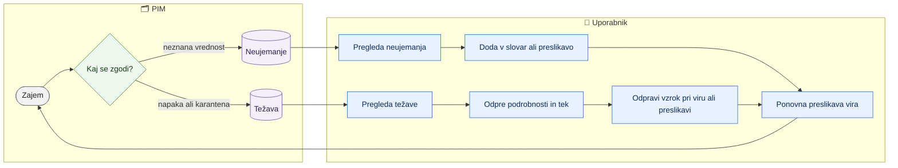

# Težave in neujemanja zajema

> **Področje:** Vhodi · **Lastnik:** skrbnik PIM (težave), urednik kataloga (neujemanja) · **Stanje:** ⚠️ delno · **Preverjeno:** 2026-09-24, iz kode

## 1. Namen

En delovni seznam vseh tehničnih težav zajema — strani v karanteni ali zastale v čakalni vrsti, zavrnjena zaloga, mrtva pisma in sistemske napake — združen po viru in vzroku (ne tisočkrat ista vrstica). Poleg tega seznam **neujemanj**: vrednosti iz virov, ki jih preslikava ni znala razvrstiti (npr. neznana enota ali barva), združene po vrednosti in pogostosti.

## 2. Kdo sodeluje

| Vloga | Kaj naredi v procesu |
|---|---|
| Komerciala | Ni. |
| Urednik kataloga | Pregleda neujemanja in doda vrednost v slovar ali preslikavo. |
| Skrbnik | Pregleda težave, odpre tek in tehnične podrobnosti; odpravi vzrok (preslikava, poverilnice, vir). |
| Avtomatika (PIM) | Workerji in preslikava beležijo napake, karanteno, zavrnjene pozicije in neznane vrednosti. |

## 3. Kdaj se sproži

- **Ročno:** odpreš `/zajem/tezave` (zavihek »Težave« ali kartice »V karanteni«, »Zavrnjena zaloga«, »Tehnične težave« na `/zajem`) oziroma `/zajem/neujemanja` (kartica »Nerazvrščene vrednosti«).
- **Po urniku:** težave nastajajo med posli zajema.
- **Ob dogodku:** vsaka napaka ali neznana vrednost ob zajemu.

## 4. Vhod in izhod

| | Kaj | Od kod / kam |
|---|---|---|
| **Vhod** | Karantena in čakajoče strani, zavrnjene pozicije zaloge, mrtva pisma, sistemske napake (7 dni), neznane vrednosti preslikave | PIM |
| **Izhod** | Prikaz; popravek se naredi drugje (slovar, preslikave, nastavitve vira) | uporabnik |

## 5. Diagram

## 6. Koraki

| # | Kdo | Kje (stran) | Kaj narediš | Kaj se zgodi v sistemu | Kako preveriš, da je uspelo |
|---|---|---|---|---|---|
| 1 | Skrbnik | `/zajem/tezave` | Vpišeš iskanje (vir, razlog, podjetje), izbereš »Podjetje«, »Vir«, »Vrsta težave« (Čakalna vrsta in karantena, Zavrnjena zaloga, Mrtva pisma, Sistemske napake) in klikneš »Uporabi filtre«. | Prebere se do 50 skupin težav na stran. | »N skupin težav«; stolpci resnost, težava, podjetje, vir, ponovitev, prvič, nazadnje. |
| 2 | Skrbnik | isto | Klikneš naslov težave. | Odpre se `/zajem/tezave/{vrsta}/{id}`: »Kaj se je zgodilo« (vzrok z besedami, vrsta, stanje, koda, vir, entiteta) in »Kontekst« (podjetje, prvič, nazadnje, tek). Skrbnik vidi še »Tehnične podrobnosti za administratorja« z omejenim predogledom vhoda (do 20.000 znakov). | Vzrok je razumljiv. |
| 3 | Skrbnik | isto | Klikneš »Odpri tek«. | Odpre se `/sistem/teki/{RunId}` s koraki in napakami. | Vidiš, v katerem koraku je padlo. |
| 4 | Skrbnik | drugje | Odpraviš vzrok: preslikava (Pravila in izvor podatkov), poverilnice ali naslov prevzema, dobavitelj. | Naslednji zajem ali ponovna preslikava obdela strani. | Število ponovitev se ne povečuje več; »Nazadnje« ostane star. |
| 5 | Urednik | `/zajem/neujemanja` | Pregledaš ciljno polje, vrednost iz vira, razlog, pojavitve (do 300 najpogostejših). | — | Vidiš, katere vrednosti manjkajo v slovarju. |
| 6 | Urednik | `/pravila/slovar` | Dodaš vrednost v slovar ali preslikavo. | Velja ob naslednji preslikavi. | Po ponovni preslikavi vrednost izgine s seznama. |

## 7. Pravila in varovalke

- Strani samo berejo; nič se ne da »razrešiti« neposredno na njih.
- Ne-skrbnik vidi podrobnosti težave samo za izbrano podjetje in brez tehničnega predogleda; skrbnik vidi vsa podjetja in predogled. Poverilnice se v predogled nikoli ne berejo.
- Ponavljajoči vzroki so združeni (en vzrok = ena vrstica s številom ponovitev).

## 8. Ko gre kaj narobe

| Znak (kaj vidiš) | Verjeten vzrok | Kaj narediš |
|---|---|---|
| Veliko »Zavrnjena zaloga«. | Šifre v datoteki zaloge nimajo artikla v podjetju ali pravilo identitete ne ujame. | Skrbnik preveri pravilo identitete zaloge; artikli, ki jih podjetje nima, so pričakovani. |
| »Mrtva pisma«. | Sporočilo za SAOP je po vseh poskusih obupalo. | Glej Izhod v SAOP; popravi in ponovno pošlji. |
| »Sistemske napake« s kodo. | Napaka workerja ali baze. | Odpri tek, preberi napako; javi razvoju, če ni jasna. |
| »Težava ne obstaja ali ni več dostopna.« | Drugo podjetje (ne-skrbnik) ali je bila zapis očiščen. | Zamenjaj podjetje ali prosi skrbnika. |

## 9. Tehnično ozadje

Za skrbnika in razvoj

- **Strani:** `IngestIssues.razor` (`/zajem/tezave`, parameter `?vrsta=INBOX|STOCK|DEADLETTER|ERROR`), `IngestIssueDetail.razor`, `IngestUnmapped.razor` (`/zajem/neujemanja`).
- **Storitve / delavci:** `PipelineReadService.GetInboundIssuesAsync`, `GetInboundIssueDetailAsync`, `GetUnmappedValuesAsync`.
- **Tabele in pogledi:** `raw.Inbox` (karantena), zavrnjene pozicije zaloge, `out.OutboxMessage` (Dead), dnevnik napak, tabela nerazvrščenih vrednosti preslikave.
- **Migracije:** ni posebne.
- **Urniki:** vsi posli zajema.

## 10. Odprta vprašanja in razlike

- ⚠️ Na `/zajem/tezave` ni nobenega dejanja (potrdi, razreši, ponovi) — težava izgine šele, ko je vzrok odpravljen in pretečejo dnevi okna. Uporabnik ne ve, ali je težavo že kdo pregledal.
- ⚠️ `/zajem/neujemanja` kaže samo izbrano podjetje in nima povezave na slovar; urednik mora sam vedeti, kam iti.
- ⚠️ Mrtva pisma odhodne vrste za SAOP so pomešana med težave zajema (vhod), čeprav gre za izhod.
- ⚠️ Resnost in stanja so deloma v angleščini (Pending, Quarantined, Dead).

## Povezani procesi

- [Pregled vhodov in virov](pregled-vhodov-in-virov.md): kartice, ki vodijo sem.
- [Čakalna vrsta zajema](cakalna-vrsta-zajema.md): strani, ki čakajo preslikavo.
- [Preslikava virov in ponovna obdelava](preslikava-virov-in-ponovna-obdelava.md): kako se po popravku podatki obdelajo znova.
- [Karantena](../04-kakovost/karantena.md): zapisi, ki jih obdelava ni prevzela.
- [Pravila validacije, slovar, preslikave](../08-upravljanje/pravila-validacije-slovar-preslikave.md): kje dodaš vrednost v slovar.
- [Izhod v SAOP](../05-izhod-saop/izhod-v-saop.md): mrtva pisma.
