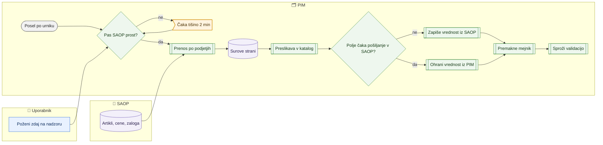

# Zajem artiklov, cen in zaloge iz SAOP

> **Področje:** Vhodi · **Lastnik:** skrbnik PIM · **Stanje:** ✅ deluje · **Preverjeno:** 2026-09-24, iz kode

## 1. Namen

SAOP je vir resnice za šifrant artiklov. PIM iz njega samodejno bere artikle (osnovna polja, opise, nazive po jezikih, lastnosti, planske in zalogovne podatke), cene, zalogo, naročila in datume dobave ter jih zapiše v katalog PIM. **Samo zajem iz SAOP sme ustvariti nov artikel v PIM.**

## 2. Kdo sodeluje

| Vloga | Kaj naredi v procesu |
|---|---|
| Komerciala | Artikel in cene ureja v SAOP; v PIM jih vidi po naslednjem zajemu. |
| Urednik kataloga | Preveri, da je nov artikel iz SAOP prišel v PIM; dopolni spletne podatke. |
| Skrbnik | Spremlja posle na `/sistem`, po potrebi klikne »Poženi zdaj«; ureja mejo svežine vira; izključi podjetje iz avtomatike. |
| Avtomatika (PIM) | Posli kličejo SAOP po urniku, podatke shranijo surovo, preslikajo v katalog in premaknejo mejnik; uspešen zajem artiklov sproži validacijo. |

## 3. Kdaj se sproži

- **Ročno:** skrbnik na `/sistem` pri poslu klikne »Poženi zdaj« → »Potrdi zagon«. Ročna zahteva ima v pasu SAOP prednost pred rednimi posli.
- **Po urniku:**

| Posel | Kaj prebere | Pogostost |
|---|---|---|
| `SAOP_PRODUCT_IMPORT` | 8 točk za artikle (`GetItemsGeneralData`, `GetItemsDescriptions`, `GetItemsTitlesLanguage`, `GetItemsCustomProperties`, `GetItemsPlanningData`, `GetItemsStockData`, `GetItemsStockAccountingData`, `GetItemCustomerDataV2`) | vsako uro |
| `PRICE_IMPORT` | spremembe cen (`GetPrices`) | vsakih 10 min |
| `STOCK_IMPORT` | količine zaloge | vsakih 10 min |
| `SAOP_ORDER_IMPORT` | naročila kupcev (VNK) in dobaviteljem (VND): od največje znane številke naprej (`GetOrder`/`GetPurchaseOrder` po leto/knjiga/številka), odprta enkrat na dan znova; zgodovina enkrat z `--zgodovina-od` | vsako uro |
| `SAOP_DELIVERY_IMPORT` | datumi in količine prihoda | privzeto izklopljen, ročno |
| `NIGHTLY_RECONCILIATION` | poln kontrolni pregled (šifranti, SAOP katalog, dobave …), nato validacija in objava | vsak dan ob 00:30 |

- **Ob dogodku:** uspešen `SAOP_PRODUCT_IMPORT` sproži `PRODUCT_VALIDATION`; uspešen `STOCK_IMPORT` sproži izvoz cen in zaloge za splet (če je vklopljen).

## 4. Vhod in izhod

| | Kaj | Od kod / kam |
|---|---|---|
| **Vhod** | Artikli, opisi, nazivi, lastnosti, planski in zalogovni podatki, cene, zaloga, naročila, dobave | SAOP (API, samo v načinu `Live`) |
| **Izhod** | Surove strani zajema, kanonični artikli (tudi novi), atributi, besedila, cene, zaloga, mejnik, faze teka | PIM |

## 5. Diagram

## 6. Koraki

| # | Kdo | Kje (stran) | Kaj narediš | Kaj se zgodi v sistemu | Kako preveriš, da je uspelo |
|---|---|---|---|---|---|
| 1 | Komerciala | SAOP | Ustvariš ali spremeniš artikel oziroma ceno. | — | — |
| 2 | Avtomatika | — | — | Posel počaka, da je pas SAOP prost (samo en SAOP posel naenkrat, 2 min tišine vmes), nato za vsako vključeno podjetje posebej kliče SAOP. Padec enega podjetja ne ustavi drugih. | Na `/sistem` ima posel zeleno fazo PRENOS. |
| 3 | Avtomatika | — | — | Odgovori se shranijo kot surove strani; preslikava jih zapiše v katalog. Nov artikel iz SAOP se ustvari v PIM (samo SAOP vir to sme). Polja, ki imajo v vrsti za SAOP še neposlano spremembo iz PIM, ostanejo, kot jih je zapisal PIM. | Faza PRESLIKAVA zelena; na `/zajem/viri/{SourceCode}` »Obdelano« raste, »Čaka« je 0. |
| 4 | Avtomatika | — | — | Mejnik (do kdaj je prebrano) se premakne šele, ko je podatek v katalogu. | Faza MEJNIK; naslednji zajem bere samo spremembe od mejnika. |
| 5 | Avtomatika | — | — | Uspešen zajem artiklov sproži validacijo in nato objavo. | `/nadzorna-plosca` števci se osvežijo. |
| 6 | Urednik | `/izdelki` | Poiščeš artikel po šifri. | — | Artikel ima nove vrednosti iz SAOP. |
| 7 | Skrbnik (po potrebi) | `/sistem` | Pri poslu »Artikli iz SAOP« klikneš »Poženi zdaj« → »Potrdi zagon«. | Zahteva ima prednost v pasu SAOP; če SAOP ravno uporablja drug posel, stran napiše »čaka …«. | Stanje posla »v teku«, nato zeleno. |
| 8 | Skrbnik | `/zajem`, `/zajem/viri/{SourceCode}` | Pregledaš stanje vira (zadnji poskus, zadnji uspeh, naslednji zagon, čaka, zavrnjeno). | — | Stanje »V redu«. |

## 7. Pravila in varovalke

- **Samo SAOP ustvarja artikle** (`CanCreateProducts` dovoljen le konektorjem SAOP; baza to ščiti s pravilom od 257). XML, Excel, zaloga in cene samo dopolnjujejo obstoječe.
- **Neposlana sprememba iz PIM ima prednost** pred zajemom (273): dokler sporočilo za isto polje čaka odobritev, pošiljanje ali ponovni poskus, zajem polja ne povozi. Ko je poslano, zajem spet prinese vrednost iz SAOP (tako se preveri, ali je SAOP spremembo sprejel).
- V SAOP se v tem procesu nič ne piše — zajem samo bere.
- Posli, ki kličejo SAOP, nikoli ne tečejo hkrati; med njimi je 2 min tišine (zahteva ekipe SAOP 2026-09-22).
- Živ klic na SAOP se izvede samo v načinu `PIM_SAOP_MODE=Live`; sicer worker samo izpiše, kaj bi poklical.
- Svežina: vir »zamuja«, ko je zadnji uspešen stik starejši od meje (artikli 2 h, cene 30 min, zaloga 30 min — po novih podatkih). Mejo lahko skrbnik spremeni na strani posla (276).
- Podjetje, izključeno iz avtomatike, se ne bere.

## 8. Ko gre kaj narobe

| Znak (kaj vidiš) | Verjeten vzrok | Kaj narediš |
|---|---|---|
| Nov artikel iz SAOP ni v PIM. | Zajem še ni tekel (vsako uro) ali je padel za to podjetje. | Na `/sistem` preveri »Artikli iz SAOP«; po potrebi »Poženi zdaj«. |
| Vrednost v PIM je drugačna kot v SAOP. | V vrsti za SAOP čaka neposlana sprememba za to polje (PIM ima prednost). | Odobri ali prekliči sporočilo v Izhodu v SAOP. |
| Vir na `/zajem` »Zamuja« ali alarm »SourceStale«. | SAOP ne odgovarja, poverilnice, posel izklopljen ali pas SAOP zaseden. | Skrbnik: `/sistem` → posel → faze in izpis. |
| »Čaka« na viru raste. | Preslikava ni obdelala strani (manjka preslikava entitete ali je padla). | Glej [Čakalna vrsta zajema](cakalna-vrsta-zajema.md). |
| Posel »čaka na tišino SAOP«. | Drug SAOP posel je ravno končal ali teče. | Počakaj; ročna zahteva gre naprej prva. |

## 9. Tehnično ozadje

Za skrbnika in razvoj

- **Strani:** `/zajem`, `/zajem/viri/{SourceCode}` (`Ingest.razor`, `IngestSourceDetail.razor`), upravljanje poslov na `/sistem` in `/sistem/posel/{JobKey}` (`Monitor.razor`, `MonitorJob.razor`).
- **Storitve / delavci:** `PIM.KatalogWorker` (`SaopIngestRunner`, `SaopApiClient`, `SaopEndpoints`, `OrganizationLoop`, `RawInboxWriter`; stikala `--map-run`, `--znova-preslikaj`, `--preslikaj-zaostanek`, `--only-ingest`), `PIM.SaopStockWorker` (zaloga in dobave), `PIM.SaopOrdersWorker` (naročila); preslikava `PIM.XmlMapping` (`SqlMappingPipeline`, `MappingPhaseReport`); gostitelj `PIM.Automation` (`JobCatalog`, `AutomationEngine`, pas SAOP `SaopQuietSeconds = 120`).
- **Tabele in pogledi:** `raw.Inbox`, `map.ExtractedValue`, `map.SourceConnector`, `map.EntityMapping`, `canon.Product` in podrejene, mejniki; faze `ops.JobPhaseRun`, viri `ops.JobSource` / `ops.JobSourceState()`; procedura `map.ProcessRawInbox`.
- **Migracije:** 240 (jedro preslikave), 246 (en motor avtomatike), 256 (viri in svežina), 257 (samo SAOP ustvarja), 260/261 (zamuda, premor SAOP), 264 (DEMO neaktiven), 273 (PIM ima prednost pred zajemom), 276 (meja svežine na strani).
- **Urniki:** glej tabelo v razdelku 3 (`JobCatalog.All`).

## 10. Odprta vprašanja in razlike

- ⚠️ Cene se berejo samo kot **spremembe** v oknu `Saop:LookbackDays`; cena, spremenjena pred tem oknom in zgrešena, pride šele z nočno uskladitvijo.
- ⚠️ Šifranti in poln zajem tečejo samo v nočni uskladitvi (00:30); nova vrednost šifranta v SAOP je v PIM vidna šele naslednji dan.
- ⚠️ Po zapisih prejšnjih sej tečejo na razvojnem računalniku in PRD hkrati trije razporejevalniki proti živemu SAOP (Windows opravila, razporejevalnik v IIS, gostitelj avtomatike); iz kode ni mogoče preveriti, kateri je zdaj edini aktiven.
- ⚠️ `SAOP_DELIVERY_IMPORT` je privzeto izklopljen; datume dobave prinese samo nočna uskladitev (≈50 min za IQLighting).

## Povezani procesi

- [Pregled vhodov in virov](pregled-vhodov-in-virov.md): kje vidiš stanje zajema.
- [Čakalna vrsta zajema](cakalna-vrsta-zajema.md): strani, ki čakajo preslikavo.
- [Težave in neujemanja zajema](tezave-in-neujemanja-zajema.md): napake in nerazvrščene vrednosti.
- [Novi artikli dobaviteljev](novi-artikli-dobaviteljev.md): artikel, poslan v SAOP, se v PIM ustvari s tem zajemom.
- [Kakovost in validacija](../04-kakovost/kakovost-in-validacija.md): sproži se po zajemu.
- [Izhod v SAOP](../05-izhod-saop/izhod-v-saop.md): neposlane spremembe, ki imajo prednost pred zajemom.
- [Zaloge in rezervacija](../07-poslovanje/zaloge-in-rezervacija.md): uporaba prebrane zaloge.
- [Cene in ceniki](../07-poslovanje/cene-in-ceniki.md): uporaba prebranih cen.
- [Avtomatika in urniki](../09-administracija/avtomatika-in-urniki.md): posli, pas SAOP, ročni zagon.
