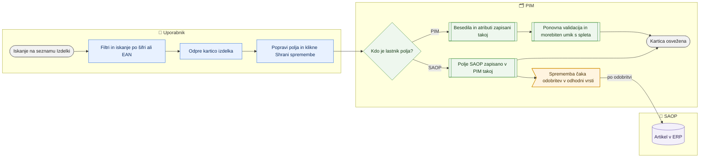

# Iskanje izdelka in urejanje na kartici

> **Področje:** Izdelki · **Lastnik:** urednik kataloga · **Stanje:** ✅ deluje · **Preverjeno:** 2026-09-28, v brskalniku (razvojna baza)

## 1. Namen

Najti izdelek (ali skupino izdelkov) po šifri, EAN in filtrih ter na kartici izdelka pregledati in popraviti njegove podatke. Rezultat je popravljen izdelek v PIM: spletna besedila in atributi veljajo takoj, polja SAOP veljajo v PIM takoj, v SAOP pa gredo šele po odobritvi.

## 2. Kdo sodeluje

| Vloga | Kaj naredi v procesu |
|---|---|
| Komerciala | Išče in pregleduje izdelke, na seznamu nastavlja S-popuste; kartice ne more urejati (samo branje). |
| Urednik kataloga | Ureja kartico: spletna besedila, atribute, polja SAOP, spletišča, oznake, odprodajo. |
| Skrbnik | Vse kot urednik; poleg tega potrdi, da artikel nima EAN, proizvajalca ali dobavitelja. |
| Avtomatika (PIM) | Po shranjevanju ponovno validira izdelek, uvrsti polja SAOP v odhodno vrsto in po potrebi sam odkljuka spletišče (samodejni umik s spleta). |

## 3. Kdaj se sproži

- **Ročno:** urednik ali komercialist išče izdelek na `/izdelki` in odpre kartico `/izdelki/{ProductId}`; povezave na kartico so tudi na straneh Mediji, Odprodaja, Kakovost ipd.
- **Po urniku:** ni (kartica samo bere, kar so pripravili zajem in validacija).
- **Ob dogodku:** ni.

## 4. Vhod in izhod

| | Kaj | Od kod / kam |
|---|---|---|
| **Vhod** | Šifra, EAN ali filtri; ročni popravki polj | Uporabnik |
| **Vhod** | Podatki izdelka (ERP polja, besedila, atributi, kategorije, mediji, cene, zaloga, težave) | PIM (zajem iz SAOP in dobaviteljev) |
| **Izhod** | Spletna besedila, atributi, kljukice spletišč, oznake, odprodaja | PIM, takoj |
| **Izhod** | Polja SAOP (npr. EAN, dobavitelj, aktivnost, teže, pakiranje) | PIM takoj + odhodna vrsta za SAOP (čaka odobritev) |

## 5. Diagram

## 6. Koraki

| # | Kdo | Kje (stran) | Kaj narediš | Kaj se zgodi v sistemu | Kako preveriš, da je uspelo |
|---|---|---|---|---|---|
| 1 | Urednik / komerciala | `/izdelki` | V polje »Išči po šifri artikla ali EAN …« vpišeš šifro ali EAN in pritisneš Enter. | Seznam se zoži; filtri so v naslovu strani, zato povezavo lahko deliš. | Desno od iskanja piše število rezultatov. |
| 2 | Urednik / komerciala | `/izdelki` | Po potrebi odpreš **Filtri** (podjetje, napaka, proizvajalec, dobavitelj, skupina, kategorija, slika, ABC, pripravljenost za ERP/splet, aktivnost, zastavica za splet, popolnost, S-popust, rabatna skupina, posebni S) in klikneš **Uporabi filtre**. | Privzeto so prikazana vsa podjetja. Aktivni filtri se pokažejo kot čipi nad tabelo. | Čipi filtrov; napis tabele pove obseg (»Izdelki podjetja …« ali »vseh podjetij«). |
| 3 | Urednik / komerciala | `/izdelki` | Klikneš vrstico izdelka. | Odpre se kartica `/izdelki/{ProductId}` (zavihek Pregled). | Naslov kartice je naziv, podnaslov podjetje, šifra in EAN. |
| 4 | Urednik | Kartica, zavihek **Pregled** | Pogledaš stanje treh kanalov (ERP, Komerciala, Splet) in **Odprte naloge**. | Kartica pokaže blokirajoče napake za ERP in splet ter opozorila komerciale. | Rdeča pasica »… napak blokira ERP« z gumbom **Odpri kakovost**. |
| 5 | Urednik | Kartica, zavihek **ERP** | Popraviš katerokoli polje (EAN, davčna stopnja, dobavitelj, teže, dolžina/širina/višina, prostornina, pakiranje, ERP nazivi in opisi …). Ob vsakem polju je značka, kam gre sprememba: **PIM + SAOP** (v PIM takoj, v SAOP po odobritvi), **PIM** (velja takoj) ali **samo PIM** (podatek iz SAOP, ki ga SAOP od PIM ne sprejme — zajem ga lahko prepiše). Pot izbere kartica sama iz registra, ne uporabnik. | Polje dobi osnutek (poudarjen levi rob, »Spremenjeno, še ni shranjeno«); zgoraj piše »N gre v odobritev SAOP«. | Povzetek na vrhu zavihka: kaj je prazno in ustavi objavo, kaj je priporočeno, kaj čaka SAOP, česa nisi shranil — z imeni polj. |
| 6 | Urednik | Kartica, zavihek **Splet** | Popraviš spletni naziv, spletni opis ali atribut; po želji klikneš **Predlagaj naziv in opis (AI)** v izbranem jeziku. Atribut, ki ga izdelek še nima, dodaš v razdelku **Dodaj atribut** (izbirnik iz šifranta, oznaka »nabor« pove, ali gre na splet) → **Dodaj na kartico**, vpišeš vrednost. | AI predlog in dodani atribut gresta samo v osnutek, v bazo ne. Atribut, ki ga SAOP sprejme (Garancija), gre po poti PIM + SAOP tudi s tega zavihka. | Polje je označeno kot spremenjeno; »N velja takoj«. Po shranjevanju je atribut med »Atributi« in ostane urejljiv; prazna vrednost ga izbriše. |
| 6a | Urednik | Kartica, zavihek **Splet → Kategorije po spletnih straneh** | Pri spletišču klikneš **Spremeni**, izbereš kategorijo v izbirniku, **Dodaj na seznam** (ali **Odstrani**), **Shrani kategorije**; **Vrni pod vir** odstrani ročno izbiro. | Isti postopek kot na strani Uvrstitev izdelka ([Kategorije izdelka](kategorije-izdelka.md)): ročna izbira, zgodovina, ponovna validacija; kartica se naloži znova, ker se s kategorijo spremeni nabor atributov. | Pri spletišču piše »ročno«, kdo in kdaj; zgoraj sporočilo, da so kategorije shranjene. |
| 7 | Urednik | Kartica, zgoraj desno | Klikneš **Shrani spremembe** (ali **Prekliči** za zavrnitev osnutkov). | Besedila in atributi se zapišejo takoj; polja SAOP se zapišejo v PIM in uvrstijo v odhodno vrsto (vir »CARD«); izdelek se ponovno validira. | Sporočilo npr. »3 besedil shranjenih — velja takoj · 1 polj velja v PIM takoj; v SAOP gre zadnja vrednost po odobritvi na Izhod v SAOP (skupina …)«. |
| 8 | Urednik | Kartica, **Splet → Spletišča** | Obkljukaš ali odkljukaš spletišče in klikneš **Shrani spletišča**. | Kljukica določa, kam gre izdelek in kateri spletni profil ga validira. Kljukica, ki je PIM ne dovoli (npr. ni kategorije), se ne shrani. | Sporočilo »Shranjeno. Izdelek gre na N spletišč(a)« ali razlog zavrnitve. |
| 9 | Urednik | Kartica, **Splet → Objava za splet (katalog.csv)** | Klikneš **Preveri zdaj**. | Validacija tega izdelka se požene znova; v SAOP se nič ne pošlje in CSV se ne izdela. | Tabela po spletiščih pove, ali gre izdelek v stolpec »Spletne strani« in zakaj ne. |
| 10 | Urednik | Kartica, **Splet → Oznake** | Označiš npr. »Razstavni eksponat« in klikneš **Shrani oznake**. | Oznaka se zapiše v PIM. | »Oznake shranjene.« |
| 11 | Skrbnik | Kartica, **ERP**, pri napaki EAN/proizvajalec/dobavitelj | Klikneš »… — potrdi«. | Potrditev skrbnika se zapiše, izdelek se takoj ponovno validira. | Napaka izgine, potrditev je vidna pod »Potrditve skrbnika«. |
| 12 | Urednik | Kartica, **Kakovost in zgodovina** | Pregledaš odprte težave, »Zapisi v SAOP« in »Izvor podatkov«. | Izvor se naloži šele ob odprtju zavihka (počasno iskanje). | Tabela sporočil na poti v SAOP s stanjem (Čaka odobritev, Poslano, Potrjeno, Odklon). |

Zavihek **Komerciala** ureja ABC, skupino, aktivnost in »Objava na spletu (SAOP)« (vse po poti PIM + SAOP); cene po cenikih so tabela (urejanje na strani Cene), S-popust glej [Popusti](../07-poslovanje/popusti.md). Samo za branje so **SAOP endpoint** (zapis, kot ga ima ERP, z označenimi odkloni), **Mediji**, **Zaloga**. Desni stolpec **Aktivnosti** pokaže zadnje spremembe izdelka.

## 7. Pravila in varovalke

- **V SAOP nič samodejno.** Polje SAOP, shranjeno na kartici, velja v PIM takoj, v SAOP pa gre šele po odobritvi na strani Izhod v SAOP. Zajem iz SAOP polja z neposlanim sporočilom ne povozi.
- **Deaktivacija** (Aktivnost = Ne) gre prav tako v vrsto in čaka potrditev (glej [Varovalke](../01-nadzor/varovalke.md)).
- **Logična polja** so na kartici Da / Ne, v vrsto gredo kot 1/0.
- **Hkratno urejanje:** če je nekdo polje spremenil med tvojim urejanjem, se tvoja vrednost ne shrani; kartica pokaže »Nekdo je bil hitrejši« s tvojo in trenutno vrednostjo.
- **Delni izid:** če shranjevanje pade na pol poti, ostane shranjeno, kar je šlo skozi, osnutki ostalega ostanejo v obrazcu.
- **Samodejni umik s spleta:** če po spremembi besedila, atributa ali po »Preveri zdaj« izdelek ni več veljaven za označeno spletišče, ga PIM (ob vklopljenem umiku) odkljuka in to izpiše; na kartici se pojavi pasica »Samodejno umaknjen s spleta«.
- **Pravice:** urejanje kartice samo ADMIN in CATALOG_EDITOR (vsi ostali vidijo »Samo za branje«); **Preveri zdaj** tudi COMMERCIAL; potrditev manjkajočega EAN/proizvajalca/dobavitelja samo ADMIN. Na seznamu gumb **S-popust …** vidijo ADMIN, CATALOG_EDITOR in COMMERCIAL.
- Šifra artikla je enolična samo znotraj podjetja, zato je podjetje vedno izpisano ob šifri.
- **Vse je okence (2026-09-28).** Zaklenjeni (onemogočeni okenci z razlogom) ostajata samo **Šifra artikla** (ključ v SAOP in PIM) in **Sledenje serij** (vpliva na zalogo, nastavi se v SAOP). Katero polje gre v SAOP, pove register `out.SaopXmlField` + pravilo lastništva `out.OwnershipPolicy` (Owner = PIM); dolžina (`ItemLength`) in prostornina (`ItemVolumePerUnit`) sta tam od migracij 298/300.
- **Števci pomenijo isto povsod:** značke v levem meniju in številki »Ustavi objavo« / »Priporočeno« v glavi zavihka štejejo prazna polja **na tem zavihku** (napaka komercialnega profila, npr. Pak1, se šteje tam, kjer polje stoji — na ERP). Rdeče je samo, kar ustavi objavo; število slik in zalogovnih vrstic je sivo in ima opis.
- **Prazno = kot validacija:** 0 v številskem polju pakiranja/mer šteje za prazno.

## 8. Ko gre kaj narobe

| Znak (kaj vidiš) | Verjeten vzrok | Kaj narediš |
|---|---|---|
| »Samo za branje« na kartici | Tvoja vloga ni ADMIN ali CATALOG_EDITOR. | Popravek naroči uredniku ali uporabi uvoz delovnega lista (če imaš pravico). |
| »Nekdo je bil hitrejši« | Drug uporabnik je polje spremenil med tvojim urejanjem. | Preveri vrednost v katalogu in jo po potrebi vpiši znova. |
| »… zavrnjenih« pri shranjevanju polja SAOP | Vrsta za SAOP je polje zavrnila (razlog je izpisan, npr. prazna vrednost). | Popravi vrednost; SAOP ne sprejema praznih vrednosti. |
| Kljukica spletišča se ne shrani | Izdelek tja ne sme (npr. nima kategorije na tem spletišču ali nima slike). | Dopolni izdelek (kategorija: [Kategorije izdelka](kategorije-izdelka.md)), nato spletišče ponovno označi. |
| Spletišče obkljukano, izdelka pa ni v katalog.csv | Neaktiven, zadržan, izključen, ni objavljen v PIM ali ima blokirajoče napake. | Poglej stolpec »V stolpcu Spletne strani« v razdelku Objava za splet in klikni **Preveri zdaj**. |
| Gumb AI je siv, »AI ni nastavljen« | Na strežniku ni ključa AI. | Skrbnik nastavi ključ (Ai:ApiKey). |
| »Kartice izdelka trenutno ni mogoče naložiti.« | Napaka baze ali povezave. | Osveži; če ostane, skrbnik pogleda dnevnik. |

## 9. Tehnično ozadje

Za skrbnika in razvoj

- **Strani:** `PIM.Intranet/Components/Pages/Products.razor` (`/izdelki`), `ProductCard.razor` (`/izdelki/{ProductId:long}`), deli v `Pages/ProductCard/` (`ProductChannelPanel`, `ProductMediaGallery`, `ProductPackagingPanel`); zavihki `ProductTabs` v `Components/Shared/PimTab.cs`.
- **Storitve / delavci:** `ProductWorkbenchService` (seznam, fasete, kartica, izvor), `ProductEditService` (`SaveTextsAsync`, `SaveAttributesAsync`, `SaveErpFieldsBulkAsync`, `SaveWebShopsAsync`, `SaveProductFlagsAsync`), `SaopWriteService.EnqueueAsync` (vir `CARD`), `QualityWriteService` (`ValidateAsync`, `SetFieldWaiverAsync`), `WebWithdrawalService.AfterChangeAsync`, `AiTextService.SuggestWebTextsAsync`, `SaopEndpointSnapshotService`.
- **Tabele in pogledi:** `intranet.GetProductList`, `intranet.GetProductListFilters`, `intranet.GetProductCard`, `intranet.GetProductOrigin`, `val.ProductChannelReadiness`, `pim.ProductWebShop`, `pim.ProductFlag`, `out.SaopXmlField` (register pisljivih polj), `pim.ProductFieldHistory`.
- **Pravice:** politike `CatalogWrite` (ADMIN, CATALOG_EDITOR), `SaopWrite`, `BusinessWrite`, `FieldWaiver` (ADMIN) v `Services/PimAuthorization.cs`; ključ strani `view.products.list`.
- **Migracije:** 101, 108 (seznam), 182 (spletišča), 186 (spori), 233 (oznake), 239 (ERP besedila), 242 (objava za splet), 249 (potrditve), 251 (umik s spleta), 273 (PIM takoj, SAOP po odobritvi).
- **Urniki:** ni.

## 10. Odprta vprašanja in razlike

- ✅ 2026-09-28 rešeno: kategorije in dodajanje atributov sta na kartici; »Davčna stopnja« bere pravi ključ (`Product.VatRateId`); prazna mesta »Kosov v paketu«, »Nabavni podatki«, »Knjigovodske šifre« in »Cenovna polja« so odstranjena.
- ⚠️ Polja »samo PIM« (ERP opisi, ERP nazivi v drugih jezikih, kratki naziv) SAOP od PIM ne sprejme; naslednji zajem artikla iz SAOP jih lahko prepiše. Za trajno rešitev bi jih bilo treba pošiljati v SAOP (SAOP ima za to ločeni vmesnik ItemsDescriptions / ItemsTitlesLanguage).
- ✅ »Dimenzije artikla« (`ProductCommercial.Dimensions`) odstranjeno: 0 artiklov z vrednostjo, ni polja v SAOP ne zapisa v PIM. Davčna stopnja se bere posebej (`ProductEditService.GetVatRateIdAsync`), ker je `intranet.GetProductCard` ne vrača.
- ⚠️ »Objava na spletu (SAOP)« (`Product.WebPublish`) se še vedno ureja in pošilja v SAOP, o objavi pa odločajo kljukice spletišč; uporabnik lahko zamenja pomen obeh.
- ⚠️ Filter »Napaka → Čaka SAOP« in oznaka »čaka SAOP (N)« štejeta sporočila v odhodni vrsti; ni preverjeno, ali štejeta tudi sporočila v stanju odklon/mrtvo.

## Povezani procesi

- [Uvoz delovnega lista](uvoz-delovnega-lista.md): isti podatki množično, prek Excela; izvoz se sproži z gumbom na seznamu Izdelki.
- [Kategorije izdelka](kategorije-izdelka.md): ročna uvrstitev — isti gradnik je na kartici (Splet) in na strani Uvrstitev izdelka.
- [Mediji](mediji.md): vse slike in dokumenti izdelka.
- [Odprodaja](odprodaja.md): razdelek Odprodaja na kartici.
- [Izhod v SAOP](../05-izhod-saop/izhod-v-saop.md): odobritev polj, shranjenih na kartici.
- [Zgodovina in popravki SAOP](../05-izhod-saop/zgodovina-in-popravki-saop.md): kaj je bilo poslano in potrjeno.
- [Kakovost in validacija](../04-kakovost/kakovost-in-validacija.md): odprte težave in pripravljenost za ERP/splet.
- [Umaknjeni artikli in obvestila](../06-izhod-splet/umaknjeni-s-spleta.md): samodejni umik s spleta.
- [Katalog in stranke CSV](../06-izhod-splet/katalog-in-stranke-csv.md): kdaj pride izdelek v katalog.csv.
- [Popusti](../07-poslovanje/popusti.md): S-popust na seznamu in na kartici.
- [Novi artikli dobaviteljev](../02-vhodi/novi-artikli-dobaviteljev.md): zavihek »Novi artikli« na strani Izdelki.
