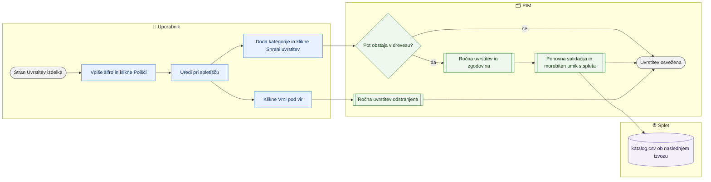

# Ročna uvrstitev izdelka v kategorije

> **Področje:** Izdelki · **Lastnik:** urednik kataloga · **Stanje:** ✅ deluje · **Preverjeno:** 2026-09-24, iz kode

## 1. Namen

Izdelku ročno določiti kategorije na posameznem spletišču (Svetila, Videlektro …), kadar samodejna preslikava dobaviteljeve kategorije ne da pravega rezultata. Rezultat je ročna uvrstitev, ki je ponovna preslikava vira ne povozi.

## 2. Kdo sodeluje

| Vloga | Kaj naredi v procesu |
|---|---|
| Komerciala | Ne sodeluje (stran ji ni dostopna). |
| Urednik kataloga | Poišče izdelek, izbere kategorije po spletiščih, shrani ali vrne uvrstitev pod vir. |
| Skrbnik | Kot urednik. |
| Avtomatika (PIM) | Preveri, da pot obstaja v drevesu spletišča, zapiše zgodovino, ponovno validira izdelek in ga po potrebi umakne s spletišča. |

## 3. Kdaj se sproži

- **Ročno:** urednik, ko izdelek nima kategorije na spletišču (napaka »brez kategorije«, kljukica spletišča se ne da shraniti) ali je uvrščen napačno.
- **Po urniku:** ni (samodejna uvrstitev iz vira je del zajema, glej povezane procese).
- **Ob dogodku:** ni.

## 4. Vhod in izhod

| | Kaj | Od kod / kam |
|---|---|---|
| **Vhod** | Šifra artikla, izbrane poti kategorij po spletišču, opomba | Uporabnik |
| **Vhod** | Drevo kategorij spletišča in trenutna uvrstitev | PIM |
| **Izhod** | Ročna uvrstitev izdelka po spletišču (lahko tudi namenoma prazna) | PIM → validacija → katalog.csv ob naslednjem izvozu |

## 5. Diagram

## 6. Koraki

| # | Kdo | Kje (stran) | Kaj narediš | Kaj se zgodi v sistemu | Kako preveriš, da je uspelo |
|---|---|---|---|---|---|
| 1 | Urednik | `/izdelki/kategorije` (ali neposredno `/izdelki/{šifra}/kategorije`) | V glavi strani preveriš izbrano podjetje, vpišeš **Šifra artikla** in klikneš **Poišči**. | Prebere uvrstitev izdelka po vseh aktivnih spletiščih. | Tabela »2. Kje je izdelek zdaj«: ena vrstica na spletišče, stolpec Izvor »ročno« ali »iz vira«; »brez uvrstitve« je rdeče. |
| 2 | Urednik | isto | Pri spletišču klikneš **Uredi**. | Naloži se drevo kategorij tega spletišča. | Pojavi se izbirnik »Dodaj kategorijo« in trenutni seznam. |
| 3 | Urednik | isto | V izbirnik vpišeš del imena ali poti, izbereš kategorijo in klikneš **Dodaj na seznam**; odvečne odstraniš z **odstrani**. Po želji vpišeš **Opombo**. | Samo osnutek na strani. | Seznam izbranih poti. |
| 4 | Urednik | isto | Klikneš **Shrani uvrstitev**. | Stare kategorije izdelka na tem spletišču se zamenjajo z izbranimi, stara vrednost gre v zgodovino, izdelek se ponovno validira; če zaradi tega ne sme več na spletišče, ga PIM (ob vklopljenem umiku) odkljuka. | »Uvrstitev je shranjena. …«; Izvor se spremeni v »ročno« z imenom in časom. |
| 5 | Urednik | isto | Če želiš, da spet velja dobaviteljeva kategorija, klikneš **Vrni pod vir**. | Ročna uvrstitev se odstrani; vrednost iz vira vrne naslednja preslikava. | »Ročna uvrstitev je odstranjena …«; Izvor ni več »ročno«. |
| 6 | Urednik | `/izdelki/{ProductId}` (kartica, zavihek Splet → Kategorije po spletnih straneh) | Iste korake 2–5 narediš kar na kartici (gumb **Spremeni** pri spletišču), nato po potrebi označiš spletišče. | Isti gradnik `ProductCategoryEditor` kot na tej strani; podjetje pride iz izdelka, ne iz glave strani. Kartica se po shranjevanju naloži znova (nov nabor atributov). | Pri spletišču »ročno«; razdelek »Objava za splet«: stolpec Kategorija = da. |

## 7. Pravila in varovalke

- **Samo obstoječe poti:** baza zavrne pot, ki je v drevesu tega spletišča ni; prosto besedilo ni mogoče.
- **Ročna je močnejša od vira:** ponovna preslikava dobaviteljevega XML ročne uvrstitve ne povozi. Enako velja za kategorije, zapisane z uvozom delovnega lista.
- **Prazen seznam** shranjen namenoma pomeni »namenoma brez kategorije«, kar ni isto kot »še ni preslikano«.
- Uvrstitev velja samo za izbrano podjetje in samo za eno spletišče naenkrat.
- Izdelek brez kategorije na spletišču tja ne gre, tudi če ima kljukico.
- **Pravice:** stran samo ADMIN in CATALOG_EDITOR.

## 8. Ko gre kaj narobe

| Znak (kaj vidiš) | Verjeten vzrok | Kaj narediš |
|---|---|---|
| Napaka pri shranjevanju (pot ne obstaja) | Pot ni v drevesu spletišča ali je v drugem jeziku. | Izberi pot iz izbirnika, ne vpisuj ročno. |
| Izdelka ni mogoče najti ali so vse vrstice »brez uvrstitve« | V glavi strani je izbrano drugo podjetje, kot mu izdelek pripada. | Zamenjaj podjetje v glavi in klikni Poišči znova. |
| »Ni aktivnih spletnih strani.« | V registru spletišč ni aktivnega spletišča. | Skrbnik preveri `/nastavitve/kanali`. |
| Po shranjevanju sporočilo o umiku s spleta | Izdelek zaradi nove uvrstitve ni več veljaven za spletišče. | Dopolni uvrstitev in spletišče na kartici ponovno označi. |
| Po »Vrni pod vir« izdelek ostane brez kategorije | Preslikava se še ni ponovno izvedla ali za dobaviteljevo pot ni preslikave. | Preveri `/kakovost/kategorije` (nepreslikane poti). |

## 9. Tehnično ozadje

Za skrbnika in razvoj

- **Strani:** `PIM.Intranet/Components/Pages/ProductCategories.razor` (`/izdelki/kategorije`, `/izdelki/{ItemId}/kategorije`), podjetje iz piškotka izbire podjetja (`PimOrganizationScope`, `IntranetDataService.GetCurrentOrganizationAsync`).
- **Storitve / delavci:** `CategoryMappingService` (`GetProductCategoriesAsync`, `GetTreeNodesAsync`, `SetProductCategoriesAsync`, `ClearProductCategoryOverrideAsync`), `WebWithdrawalService.AfterChangeByItemsAsync` (vir `KATEGORIJE`).
- **Tabele in pogledi:** `intranet.GetProductCategories`, `pim.SetProductCategories`, `pim.ClearProductCategoryOverride`, `pim.ProductCategoryOverride`, `canon.ProductCategory`, `canon.CategoryPathTranslated`, `pim.ProductFieldHistory` (`ProductCategory.CategoryPath`), `map.ResolveProductCategories` (spoštuje ročno uvrstitev).
- **Migracije:** 059 (drevo kategorij in preslikava dobaviteljev), 109 (ročna uvrstitev), 251 (umik s spleta).
- **Urniki:** ni.

## 10. Odprta vprašanja in razlike

- ⚠️ Stran vzame podjetje iz izbire v glavi strani, ne iz izdelka. Na kartici izdelka (2026-09-28) tega problema ni — tam podjetje pride iz izdelka.
- ✅ 2026-09-28: `SetProductCategoriesAsync` in `ClearProductCategoryOverrideAsync` preverita vlogo v storitvi (`CatalogWrite`). Uvoz delovnega lista z vlogo COMMERCIAL kategorij ne zapiše (vrstica dobi razlog) — enako kot že velja za besedila in atribute v istem uvozu.
- ⚠️ »Vrni pod vir« ne sproži preslikave; kdaj se vrednost iz vira dejansko vrne (naslednji zajem dobavitelja, ponovna obdelava vira), stran ne pove in iz kode strani ni razvidno.
- ⚠️ »Vrni pod vir« pusti trenutno vrstico kategorije (zdaj označeno »iz vira«), dokler je ne nadomesti naslednja preslikava; če vir kategorije nima, ostane zadnja ročna vrednost. Preverjeno 2026-09-28 na razvojni bazi.
- ✅ 2026-09-28: gumbi uporabljajo `primary-button` / `ghost-button` (prej nedefiniran `button-primary`).

## Povezani procesi

- [Iskanje in kartica izdelka](iskanje-in-kartica-izdelka.md): urejanje kategorij na kartici (isti gradnik) in kljukice spletišč.
- [Uvoz delovnega lista](uvoz-delovnega-lista.md): množični vpis kategorij prek stolpcev »Kategorije — {spletišče}«.
- [Manjkajoče kategorije](../04-kakovost/manjkajoce-kategorije.md): preslikava dobaviteljevih poti, ki določi uvrstitev »iz vira«.
- [Drevo kategorij](../08-upravljanje/drevo-kategorij.md): kategorije, ki jih je mogoče izbrati.
- [Dobaviteljski katalogi XML](../02-vhodi/dobaviteljski-katalogi-xml.md): vir uvrstitve »iz vira«.
- [Umaknjeni artikli in obvestila](../06-izhod-splet/umaknjeni-s-spleta.md): umik zaradi manjkajoče kategorije.
- [Katalog in stranke CSV](../06-izhod-splet/katalog-in-stranke-csv.md): kategorije v katalog.csv.
