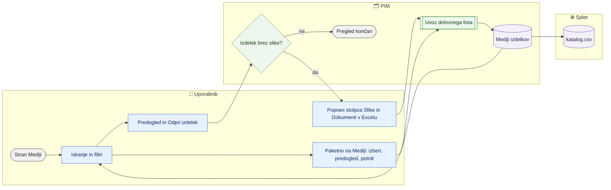

# Pregled in urejanje medijev izdelkov

> **Področje:** Izdelki · **Lastnik:** urednik kataloga · **Stanje:** ⚠️ delno · **Preverjeno:** 2026-09-30, iz kode (naloga #9)

## 1. Namen

Na enem mestu videti vse slike, videe in dokumente izdelkov vseh podjetij, najti izdelke brez slike in preveriti, ali naslovi medijev delujejo. Na strani lahko urednik kataloga izbrane medije paketno odstrani, izbrane slike postavi na prvo mesto ali izdelkom izbranih vrstic doda isto sliko ali dokument (naloga #32); sicer se slike in dokumenti spreminjajo z uvozom delovnega lista (ali pa pridejo iz zajema).

## 2. Kdo sodeluje

| Vloga | Kaj naredi v procesu |
|---|---|
| Komerciala | Išče slike in dokumente (npr. tehnični list) za kupca. |
| Urednik kataloga | Išče izdelke brez slike, preverja nove medije, popravlja sezname slik prek Excela ali paketno na strani Mediji (odstrani, na prvo mesto, dodaj isto sliko ali dokument več izdelkom). |
| Skrbnik | Ni posebne vloge. |
| Avtomatika (PIM) | Zajem iz SAOP in dobaviteljskih XML prinese naslove medijev; uvoz delovnega lista jih dopolni ali odstrani. Posel **Preverjanje slik (URL)** (`MEDIA_URL_CHECK`) preveri, ali se slike na naslovih res odprejo. |

## 3. Kdaj se sproži

- **Ročno:** kadar urednik ali komercialist potrebuje slike/dokumente ali preverja popolnost (npr. »aktivnih brez slike«).
- **Po urniku:** mediji pridejo z zajemom (npr. `SUPPLIER_CATALOG_IMPORT` vsakih 6 ur, zajem SAOP) — stran jih samo prikaže.
- **Ob dogodku:** po uvozu delovnega lista s stolpcema »Slike« ali »Dokumenti«.
- **Po urniku (preverjanje slik):** posel `MEDIA_URL_CHECK` vsaki 2 uri, ko ga skrbnik vklopi (privzeto izklopljen).

## 4. Vhod in izhod

| | Kaj | Od kod / kam |
|---|---|---|
| **Vhod** | Naslovi slik, videov in dokumentov | Dobavitelj (XML) / SAOP / Excel |
| **Vhod** | Paketno dejanje na izbranih medijih (odstrani, na prvo mesto, dodaj sliko/dokument) | Stran Mediji → zgodovina uvozov (`/uvozi`, »Povrni«) → PIM |
| **Izhod** | Pregled medijev, predogled, povezava na izdelek | Zaslon (brez zapisa) |
| **Izhod** | Dopolnjen ali skrajšan seznam slik in dokumentov (prek Excela) | PIM → katalog.csv ob naslednjem izvozu |
| **Izhod** | Izid preverjanja naslova slike (odpre se / napaka / strežnik ni odgovoril) | `val.MediaUrlCheck` → validacija in katalog.csv |

## 5. Diagram

### Paketno urejanje na strani Mediji (naloga #32)

| # | Kdo | Kje (stran) | Kaj narediš | Kaj se zgodi v sistemu | Kako preveriš, da je uspelo |
|---|---|---|---|---|---|
| P1 | Urednik kataloga | `/mediji` | Označiš medije (kljukica na ploščici ali vrstici, **Označi vse na strani** ali **Označi vse, ki ustrezajo filtru**). | Vrstica izbire pokaže »Izbranih N« in dejanja. Brez vloge urednika piše »Samo za branje«. | Števec izbranih. |
| P2 | Urednik kataloga | `/mediji` | Izbereš **Odstrani …**, **Na prvo mesto …**, **Dodaj sliko …** ali **Dodaj dokument …** (pri dodajanju vpišeš celoten naslov `https://…`), nato **Pokaži predogled**. | PIM prebere trenutne sezname izbranih izdelkov (samo branje) in pokaže, koliko izdelkov in naslovov se spremeni, po podjetjih, ter prej → potem. Pri odstranitvi opozori, da zajem dobavitelja sliko lahko vrne. | Vprašanje, npr. »Dodati 1 dokument 3 izdelkom v podjetju IQLighting?«. |
| P3 | Urednik kataloga | `/mediji` | **Potrdi**. | Najprej zapis v zgodovino uvozov (»Mediji – paketno«, prej → potem), nato zapis po paketih po 200 izdelkov skozi `pim.SaveProductMediaBulk` in ponovna validacija spremenjenih izdelkov. | Sporočilo s povezavo »Odpri zapis #N (tam je Povrni)«. |
| P4 | Urednik kataloga | `/uvozi/{Id}` | Po potrebi **Povrni**. | Seznami se vrnejo na »prej« (kjer jih medtem ni spremenil kdo drug). | Mediji na strani so spet kot prej. |

## 6. Koraki

| # | Kdo | Kje (stran) | Kaj narediš | Kaj se zgodi v sistemu | Kako preveriš, da je uspelo |
|---|---|---|---|---|---|
| 1 | Urednik / komerciala | `/mediji` | Vpišeš iskalni niz (šifra, naziv, EAN, naslov, vloga, dobavitelj; več besed zoži iskanje, npr. »203 pdf«). | Rezultati se osvežijo med tipkanjem; privzeto vsa aktivna podjetja, najnovejši najprej. | Števec rezultatov ob izbiri vrste medija. |
| 2 | Urednik / komerciala | `/mediji` | Zožiš: podjetje, razvrstitev, vloga medija, strežnik, čas vnosa (24 ur … 90 dni), stanje izdelka; vrsta (Vse, Slike, Videi, Dokumenti, Drugo). **Počisti** vrne vse. | — | Izbrani čip vrste je obarvan. |
| 3 | Urednik | `/mediji` | Klikneš **novih v 7 dneh** ali **aktivnih brez slike**. | Prvo pokaže medije zadnjih 7 dni; drugo odpre seznam `/izdelki` s filtrom »Brez slike« in »Samo aktivni«. | Seznam izdelkov s čipoma filtrov. |
| 4 | Urednik / komerciala | `/mediji` | Preklapljaš **Mreža** / **Seznam**; klikneš predogled. | Odpre se povečava: slika, predogled videa ali prva stran PDF; če tuji strežnik vgradnje ne dovoli, povezava **Odpri izvirnik**. | Okno predogleda z vlogo, vrstnim redom in časom vnosa. |
| 5 | Urednik | `/mediji` ali okno predogleda | Klikneš šifro ali **Odpri izdelek**. | Odpre se kartica izdelka; zavihek **Mediji** pokaže vse slike in dokumente tega izdelka. | Galerija na kartici. |
| 6 | Urednik | `/izdelki` → **Izvozi Excel** | Izvoziš izdelke s stolpcema »Slike« in »Dokumenti«, dopolniš ali popraviš naslove (ločeni z `\|`, prva slika je glavna). | — | — |
| 7 | Urednik | `/izdelki/uvoz` | Uvoziš datoteko. | Naslov, ki ga v celici ni več, izdelek izgubi; novi se dodajo. | Izid uvoza: »slik in dokumentov dodanih: N, odstranjenih: M«. |
| 8 | Avtomatika | posel `MEDIA_URL_CHECK` | — | Preveri do 1.500 naslovov na tek (novi najprej, neuspeli po 24 urah, ostali vsakih 7 dni): en zahtevek naenkrat na strežnik, 0,5 s premora, samo glava odgovora. Izid zapiše na naslov. | Sistem → posel »Preverjanje slik (URL)«: faza s števili (odpre se / napaka / brez odziva). |
| 9 | Urednik / komerciala | `/mediji` → **Napačni naslovi slik** (`/mediji/napacni-naslovi`) | Pregledaš slike, ki se niso odprle: filter po stanju, podjetju, strežniku (dobavitelju) in napaki, iskanje po šifri ali naslovu; **Izvozi Excel** izvozi točno ta pogled. Klik na šifro odpre kartico. | Samo branje. | Števec »izdelkov brez delujoče slike« in stanja na pilulah. |
| 10 | Urednik | vir (XML, Excel) ali kartica izdelka | Popraviš naslov. | Nov naslov posel preveri ob naslednjem teku; ob uspehu se števec neuspehov ponastavi. | Naslov izgine s seznama. |

## 7. Pravila in varovalke

- Stran Mediji zapisuje samo prek paketnih dejanj (#32), ki gredo po isti poti kot uvoz delovnega lista: zgodovina na `/uvozi` z »Povrni«, `pim.SaveProductMediaBulk`, ponovna validacija. Trajni popravek napačnega naslova dobavitelja je naloga preslikave vira.
- **Paketno na Mediji (PRIVZETO ZA NOČ 2026-09-29, lastnik lahko spremeni):** dodajanje obstoječe slike in dokumente ohrani (novo gre na konec; izdelek brez slik dobi dodano kot glavno); odstranjena slika, ki jo dobavitelj še pošilja v XML, se ob naslednjem zajemu (vsakih 6 ur) vrne na konec galerije; delo je po podjetjih ločeno (šifra je enolična samo v podjetju); največ 5.000 izdelkov in 5.000 medijev »po filtru« na potrditev. Nov dokument dobi vlogo »Dokument« brez naziva. Nič ne gre v SAOP.
- Vrsta medija (slika, video, dokument, drugo) se določi po naslovu datoteke, enako na strani Mediji in v izvozu.
- Naslov brez `https` dobi opombo (»Dodan https:«, »Nešifrirana povezava«, »Naslov ni varna spletna povezava«); nevarni naslovi se ne odprejo.
- V Excelu prazna celica »Slike« pomeni »ne dotikaj se«, zato vseh slik z uvozom ni mogoče odstraniti.
- Če uvoz pobriše edino sliko, izdelek lahko izgubi pravico do spletišča in ga PIM odkljuka (samodejni umik).
- **Preverjanje slik (naloga #9, odločitev lastnika #18, 2026-09-29):**
  - slika je **pokvarjena** šele po **2 neuspehih v razmiku vsaj 24 ur** (404, 410, drug trajni 4xx, spletna stran namesto slike, neobstoječ strežnik, naslov ni spletna povezava);
  - **ne šteje** (»strežnik ni odgovoril«): 429, 5xx, 401/403, časovna meja, prekinjena povezava — strežniki dobaviteljev občasno ne odgovorijo;
  - izid je vezan na **naslov**, ne na vrstico slike: zajem XML vrstice slik zamenja, naslov in njegova zgodovina ostaneta;
  - **validacija:** izdelek, ki ima slike in so vse pokvarjene, dobi napako »Delujoča slika« (profila WEB_svetila_si in WEB_videlektro, blokira splet); ena pokvarjena od več je samo opozorilo »Vse slike se odprejo«;
  - **katalog.csv:** pokvarjena slika se izpusti; če je bila pokvarjena glavna slika, postane glavna prva preostala. Slike se ne briše — izpust je filter in je povraten (ko se slika spet odpre, gre spet v katalog.csv);
  - posel je **privzeto izklopljen** (kliče strežnike dobaviteljev); vklopi ga skrbnik na strani Sistem.
- **Pravice:** stran vidi vsak prijavljen uporabnik z dovoljenjem za Medije (tudi Napačne naslove slik); spreminjanje prek uvoza zahteva ADMIN ali CATALOG_EDITOR. Izide preverjanja piše samo posel.

## 8. Ko gre kaj narobe

| Znak (kaj vidiš) | Verjeten vzrok | Kaj narediš |
|---|---|---|
| Predogled prazen, oznaka »!« | Naslov ne deluje ali ni varen. | Odpri izvirnik; če ne deluje, popravi naslov v Excelu ali prijavi napako vira. |
| PDF se ne prikaže znotraj strani | Strežnik dobavitelja ne dovoli vgradnje. | Klikni **Odpri izvirnik v novem zavihku**. |
| Slik nekega podjetja ni | Izbrano je drugo podjetje. | Izberi »Vsa podjetja«. |
| Po uvozu izdelek nima več slik | V celici »Slike« je ostal samo del seznama. | Uvoz povrni v zgodovini uvozov ali vpiši cel seznam znova. |
| Na Napačnih naslovih slik ni ničesar in piše »še nikoli« | Posel `MEDIA_URL_CHECK` je izklopljen. | Skrbnik ga vklopi na Sistem → posli. |
| Veliko slik enega strežnika »Strežnik ni odgovoril« | Dobavitelj omejuje zahtevke ali ima izpad. | Nič; ne šteje kot napaka, posel preveri znova čez 6 ur. |
| Izdelek z vpisano sliko ima napako »Delujoča slika« | Vse njegove slike se dvakrat v razmiku 24 ur niso odprle. | Popravi naslov v viru ali na kartici; po naslednjem preverjanju in validaciji napaka izgine. |

## 9. Tehnično ozadje

Za skrbnika in razvoj

- **Strani:** `PIM.Intranet/Components/Pages/Media.razor` (`/mediji`, parametri `?izdelek=`, `?podjetje=`, `?vrsta=`, `?naslov=`), `Pages/ProductCard/ProductMediaGallery.razor` (zavihek Mediji na kartici).
- **Storitve / delavci:** `CatalogReadService` (`GetMediaAsync`, `GetMediaKindCountsAsync`, `GetMediaRolesAsync`, `GetMediaHostsAsync`, `GetMediaSummaryAsync`), `MediaKindPolicy`, `MediaUrlPolicy`, zapis prek `ProductWorkbookService` → `ProductEditService.SaveMediaBulkAsync`.
- **Tabele in pogledi:** `canon.ProductMedia`, `canon.ProductDocument` (vse, kar pride iz uvozov); `pim.ProductMedia` je podmnožica za izvoz; `pim.SaveProductMediaBulk`.
- **Preverjanje slik:** `PIM.SourceFetchWorker --preveri-slike [--najvec 1500] [--premor-ms 500] [--najvec-minut 40]` (`MediaUrlChecker.cs`), posel `MEDIA_URL_CHECK` v `JobCatalog.cs`, razpored `ops.ScheduleProfile` MEDIA_URL_CHECK; tabela `val.MediaUrlCheck` (ključ SHA2_256 obrezanega naslova, `IsBroken` je izračunan stolpec), procedure `val.GetMediaUrlsToCheck`, `val.RecordMediaUrlChecks`, `intranet.GetMediaUrlChecks`; izpeljani polji `ProductMedia.DelujocaSlika` in `ProductMedia.VseSlikeDelujejo` v `canon.FieldValue`; izpust v `out.GetExportRows` (blok B3, oznaka PreverjanjeSlik312). Stran `MediaUrlChecks.razor`, storitev `MediaCheckReadService`, izvoz `/izvoz/napacni-naslovi-slik.xlsx`.
- **Migracije:** 245 (slike in dokumenti v uvozu delovnega lista), 312 (preverjanje naslovov slik).
- **Urniki:** zajem iz virov (glej 02-vhodi).

## 10. Odprta vprašanja in razlike

- ⚠️ Medija ni mogoče naložiti (datoteka) ne urediti posamezno; uporabniški poti sta naslov v Excelu in paketno dejanje na strani Mediji (#32). Pošiljanje datotek na strežnik (npr. arhiv slik na FTP) v kodi te strani ni.
- ⚠️ Kako se medij iz `canon.ProductMedia` prenese v `pim.ProductMedia` (in s tem v katalog.csv), s strani ni razvidno; stran kaže vse medije, tudi tiste, ki na splet ne gredo.
- ⚠️ Filter stanja naslova (`?naslov=INVALID`) je ostal samo v naslovu strani, na zaslonu ga ni.
- ⚠️ Mreža na `/mediji` še ne označi slik, ki jih je posel spoznal za pokvarjene; to kaže samo stran Napačni naslovi slik.
- ⚠️ Preverjajo se samo slike (`canon.ProductMedia`), ne dokumenti (`canon.ProductDocument`).

## Povezani procesi

- [Uvoz delovnega lista](uvoz-delovnega-lista.md): pot za spreminjanje slik in dokumentov (tudi paketna dejanja na Mediji gredo skozenj).
- [Iskanje in kartica izdelka](iskanje-in-kartica-izdelka.md): zavihek Mediji in filter »Brez slike«.
- [Dobaviteljski katalogi XML](../02-vhodi/dobaviteljski-katalogi-xml.md): od kod pride večina slik.
- [Zajem iz SAOP](../02-vhodi/zajem-iz-saop.md): mediji iz ERP.
- [Umaknjeni artikli in obvestila](../06-izhod-splet/umaknjeni-s-spleta.md): umik izdelka brez slike.
- [Katalog in stranke CSV](../06-izhod-splet/katalog-in-stranke-csv.md): slike v katalog.csv (pokvarjene se izpustijo, glej razdelek 7).
- [Kakovost in validacija](../04-kakovost/kakovost-in-validacija.md): napaka »Delujoča slika«.
