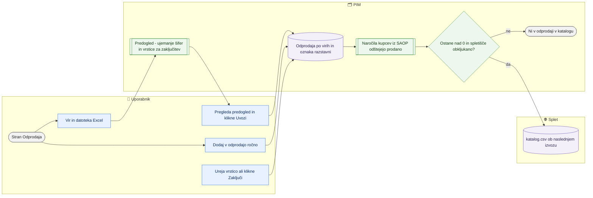

# Odprodaja in razstavni eksponati

> **Področje:** Izdelki · **Lastnik:** komerciala · **Stanje:** ✅ deluje · **Preverjeno:** 2026-09-28, na razvojni bazi s testnimi naročili

## 1. Namen

Artikle dati v odprodajo s količino in popustom ter jih označiti kot razstavni eksponat — ročno ali z uvozom dobaviteljevega seznama iz Excela. Rezultat so stolpci »Odprodaja«, »Odprodaja - popust %«, »Odprodaja - količina« in »Razstavni eksponat« v katalog.csv ob naslednjem izvozu; cena se ne spremeni, popust uporabi spletna trgovina. Naročila kupcev iz SAOP količino sproti zmanjšujejo (288). Isti popust in količino dobijo tudi stari stolpci »Popust na artikel«, »Popust odprodaje %« in »Količina odprodaje« (304), da Magento vidi odprodajo ne glede na to, katerega bere.

## 2. Kdo sodeluje

| Vloga | Kaj naredi v procesu |
|---|---|
| Komerciala | Dodaja artikle, ureja količino in popust, uvaža odprodajne sezname, zaključuje odprodajo. |
| Urednik kataloga | Enako; na kartici izdelka še ročni vnos in oznaka »Razstavni eksponat«. |
| Skrbnik | Kot urednik. |
| Avtomatika (PIM) | Ob ponovnem uvozu istega vira zaključi vrstice, ki jih v datoteki ni več; ob zaključitvi odstrani oznako razstavni eksponat; naročila kupcev (delavec SAOP_ORDERS_VNK, vsaki 2 uri) zmanjšajo količino; izvoz katalog.csv prebere preostanek. |

## 3. Kdaj se sproži

- **Ročno:** ko dobavitelj pošlje odprodajni seznam (npr. Azzardo), ko se odloči za odprodajo posameznega artikla ali ko je artikel razstavljen v salonu.
- **Po urniku:** naročila kupcev iz SAOP (SAOP_ORDERS_VNK, vsaki 2 uri) zmanjšajo količino; podatki gredo v katalog.csv ob naslednjem rednem izvozu.
- **Ob dogodku:** ni.

## 4. Vhod in izhod

| | Kaj | Od kod / kam |
|---|---|---|
| **Vhod** | Šifra, količina, popust %, razstavni eksponat, vir | Uporabnik |
| **Vhod** | Excel s stolpci Šifra, Količina, Popust, Cena (samo pregled), Razstavni eksponat | Dobavitelj / Excel |
| **Izhod** | Vrstice odprodaje po viru in oznaka razstavni eksponat | PIM |
| **Vhod** | Naročila kupcev (VNK) za artikle v odprodaji | SAOP (sales.OrderLine) |
| **Izhod** | Odprodaja DA/NE, popust %, preostala količina, razstavni eksponat DA/NE; popust in količina tudi v starih stolpcih »Popust na artikel«, »Popust odprodaje %«, »Količina odprodaje« (304) | katalog.csv (ob naslednjem izvozu) |

## 5. Diagram

## 6. Koraki

| # | Kdo | Kje (stran) | Kaj narediš | Kaj se zgodi v sistemu | Kako preveriš, da je uspelo |
|---|---|---|---|---|---|
| 1 | Komerciala | `/izdelki/odprodaja` (meni **Odprodaja** ali zavihek na Izdelkih) | Pogledaš povzetek: V odprodaji, Gre v katalog.csv, Razstavni eksponati, Ni na spletu. | Privzeto je izbrano podjetje IQLighting (2). | Ploščice s števili. |
| 2 | Komerciala | isto, »Dodaj artikel v odprodajo« | Izbereš **Podjetje**, vpišeš **Šifra artikla**, **Količina**, **Popust %**, **Vir** (privzeto »Ročno«), po potrebi **Razstavni eksponat**, klikneš **Dodaj v odprodajo**. | Vrstica se zapiše; če artikel pod istim virom že obstaja, se posodobi. | Sporočilo »… je v odprodaji: količina …, popust … %«; vrstica v tabeli. |
| 3 | Komerciala | isto, tabela »Artikli v odprodaji« | Popraviš količino, popust ali kljukico Razstavni in klikneš **Shrani**; ali **Zaključi**. Zaključene prikažeš s »Pokaži tudi zaključene« in jih vrneš z **Obnovi**. | Zaključitev: artikel gre v katalog z Odprodaja = NE; oznaka razstavni se odstrani, če artikel nima druge aktivne odprodaje. | Stolpec »V katalog.csv«: DA / NE — količina 0 / NE — velja novejši vir / zaključena. |
| 4 | Komerciala | isto, »Uvoz odprodajnega seznama iz Excela« | Preveriš, da je zgoraj izbrano pravo podjetje, vpišeš **Vir** (npr. »Azzardo 2026-09«) in izbereš datoteko. | PIM poišče šifre v podjetju in izračuna odprodajno ceno za pregled. | Predogled: ujemajoče/neujemajoče šifre, razstavni, prvih 20 vrstic. |
| 5 | Komerciala | isto | Prebereš opozorila: podvojene šifre, popust izven 0–100, **»Uvoz bo zaključil N aktivnih odprodaj vira …«**. Klikneš **Uvozi N ujemajočih vrstic**. | Vrstice vira se posodobijo, vrstice istega vira, ki jih v datoteki ni, se zaključijo. Neujemajoče šifre se preskočijo. | »Uvoz končan: N vrstic zapisanih«; prejetih/zapisanih/preskočenih. |
| 6 | Urednik | Kartica `/izdelki/{ProductId}`, zavihek **Splet → Odprodaja** | Pogledaš Vpisano / Prodano / Ostane; vpišeš Količina na zalogi in Popust % in klikneš **Daj v odprodajo** / **Posodobi odprodajo**; ali **Zaključi** pri vrstici. | Ročni vnos gre pod vir »Ročno«; obrazec pokaže obstoječo ročno vrstico; nova količina začne štetje prodaje znova. | »Artikel je v odprodaji.« |
| 7 | Urednik | Kartica, **Splet → Oznake** | Označiš »Razstavni eksponat« in klikneš **Shrani oznake**. | Oznaka brez odprodaje; na strani Odprodaja je vrstica »samo oznaka«. | Na `/izdelki/odprodaja` vrstica z **Odstrani oznako**. |
| 8 | Komerciala | Kartica, **Splet → Spletišča** | Preveriš, da ima artikel obkljukano spletišče (Svetila, Videlektro). | Brez kljukice ga katalog ne izvozi. | Stolpec »Spletne strani« na strani Odprodaja ni »ni na spletu«. |
| 9 | Avtomatika | — | — | Naročila kupcev iz SAOP (vsa: splet, trgovina, B2B) zmanjšajo količino od trenutka vpisa; stornirana ne štejejo. | Stolpca »Prodano« (s številkami naročil) in »Ostane«; pri 0 »NE — razprodano«. |
| 10 | Avtomatika | — | — | Ob naslednjem izvozu katalog.csv prebere preostanek. | Glej [Katalog in stranke CSV](../06-izhod-splet/katalog-in-stranke-csv.md). |

## 7. Pravila in varovalke

- Artikel je v odprodaji, dokler ima aktivna vrstica **preostanek večji od 0**; če ima več virov, v katalog gre najnovejša aktivna vrstica.
- **Preostanek = vpisano − naročeno pri kupcih.** Štejejo vsa naročila kupcev iz SAOP istega podjetja z datumom na dan vpisa ali pozneje, ki jih je PIM videl po vpisu; stornirano/preklicano ne šteje, zaprta vrstica šteje samo odpremljeno. Pri 0 gre v katalog Odprodaja = NE in količina 0, vrstica ostane (»razprodano«).
- **Zaloga v glavnem skladišču (297):** ob vpisu količine PIM primerja zalogo. *Vsa zaloga za odprodajo* (zaloga = vpisano): velja zaloga, ki jo SAOP ob prodaji sam zmanjša, naročila samo za vsak slučaj. *Del redne zaloge* (zaloga > vpisano): velja vpisano minus naročila. *Zaloge premalo* (zaloga < vpisano): napaka v seznamu — opozorilo v predogledu, na strani (števec, filter) in na kartici; na splet gre največ toliko, kolikor je na zalogi. *Zaloga ni znana*: velja vpisano minus naročila.
- Na splet gre vedno manjše od (vpisano − naročeno) in sveže zaloge (posnetek < 30 min); stara zaloga ne zniža ničesar, razen pri »zaloge premalo«.
- **Popravek količine v stolpcu Ostane** je nova zaloga: štetje prodaje začne znova. Ponovni uvoz iste datoteke z isto količino štetja ne ponastavi (prodano ostane odšteto).
- **Vir je ključ:** ponovni uvoz pod istim virom je celotno stanje tega seznama — kar v datoteki manjka, se **samodejno zaključi** (samo v izbranem podjetju). Za ločen seznam uporabi drugo ime vira.
- Popust mora biti med 0 in 100; sicer uvoz ni mogoč (gumb se ne ponudi). Količina 0 ali več.
- Ista šifra večkrat v datoteki: upošteva se prva vrstica.
- **Razstavni eksponat v uvozu:** če stolpec obstaja, prazna celica pomeni NE in oznako odstrani (1/da/x = DA); če stolpca ni, oznake ostanejo nespremenjene. To je drugače kot pri delovnem listu izdelkov, kjer prazna celica pomeni »ne dotikaj se«.
- Odprodaja v SAOP ne gre; cena v PIM se ne spremeni.
- **Pravice:** stran ADMIN, CATALOG_EDITOR, COMMERCIAL; odprodaja in oznake na kartici ter gumb **Odstrani oznako** samo ADMIN in CATALOG_EDITOR.

## 8. Ko gre kaj narobe

| Znak (kaj vidiš) | Verjeten vzrok | Kaj narediš |
|---|---|---|
| »Vnesi vir … pred izbiro datoteke.« | Polje Vir je prazno. | Vpiši vir in izberi datoteko znova. |
| »Datoteka nima stolpca 'Šifra'.« | Drugačen naslov stolpca. | Preimenuj stolpec v »Šifra«. |
| Veliko neujemajočih šifer | Izbrano je napačno podjetje ali šifre dobavitelja niso naše. | Zamenjaj podjetje zgoraj; šifre preslikaj v naše. |
| »Uvoz bo zaključil N aktivnih odprodaj …« a tega nočeš | Isti vir je bil uporabljen za drug seznam. | Uporabi novo ime vira. |
| »V katalog.csv: NE — velja novejši vir« | Artikel je v odprodaji pod več viri. | Zaključi starejšo vrstico ali popravi novejšo. |
| »ni na spletu« / »NE — ni na spletu« | Artikel nima obkljukanega spletišča. | Na kartici obkljukaj spletišče (in kategorijo). |
| »Zaloga: zaloge premalo« | V seznamu je več kosov, kot jih je na zalogi v glavnem skladišču. | Preveri seznam ali zalogo v SAOP; popravi količino v stolpcu Ostane. |
| »NE — razprodano« | Naročila so porabila vso količino. | Nič; če je kos še na zalogi (preklic), vpiši pravo količino v Ostane. |
| »Artikla ni bilo mogoče dodati« / uvoz ne uspe ob hkratnem zajemu iz SAOP | Zastoj v bazi, ki ga trije samodejni poskusi niso rešili. | Poskusi znova čez minuto. |
| Prodaja se ne odšteva | Delavec naročil iz SAOP ne teče ali ne vidi SAOP. | Preveri SAOP_ORDERS_VNK na /sistem (zadnji tek). |
| »Tvoja vloga ne dovoljuje urejanja oznak.« pri Odstrani oznako | Komercialist nima pravice urejanja kataloga. | Oznako odstrani urednik kataloga. |

## 9. Tehnično ozadje

Za skrbnika in razvoj

- **Strani:** `PIM.Intranet/Components/Pages/ClearanceImport.razor` (`/izdelki/odprodaja` in stara pot `/izdelki/uvoz-odprodaje`), razdelka Odprodaja in Oznake v `ProductCard.razor`.
- **Storitve / delavci:** `ClearanceService` (`PreviewAsync`, `ApplyAsync`, `GetOverviewAsync`, `GetForProductAsync`, `SaveItemAsync`, `EndAsync`), `ProductEditService.SaveProductFlagsAsync` (CatalogWrite), `HeavyWorkGate.Imports`.
- **Tabele in pogledi:** `pim.ClearanceItem`, `pim.ProductFlag` (`RAZSTAVNI_EKSPONAT`), `pim.SaveClearanceItems`, `pim.SaveClearanceItem`, `pim.EndClearanceItem`, `pim.SetShowcaseFlags`, `pim.ClearanceItemRemaining` (preostanek po naročilih), `sales.OrderLine`/`sales.OrderHeader` (naročila), `intranet.GetClearanceOverview`, `intranet.GetClearanceItemsForProduct`, `intranet.GetClearanceItemsToEnd`, `out.GetExportRows` (stolpci v katalog.csv).
- **Migracije:** 153, 154 (tabela), 232 (uvoz), 233 (oznake), 234 (stolpci v katalogu), 275 (pregled, ročni vnos, razstavni), 276 (uvoz po podjetju, brez dvojnikov, meja popusta), 288/289 (naročila kupcev zmanjšajo količino), 296 (preostanek na kartici), 297 (primerjava z zalogo glavnega skladišča).
- **Urniki:** SAOP_ORDERS_VNK (`PIM.SaopOrdersWorker`, 2 uri) prinese naročila; izvoz katalog.csv glej 06-izhod-splet.

## 10. Odprta vprašanja in razlike

- ⚠️ Uvoz odprodaje se **ne** zapiše v zgodovino uvozov (`/uvozi`) in ga ni mogoče povrniti; napačen uvoz pod obstoječim virom tiho zaključi aktivne vrstice (predogled sicer opozori).
- ⚠️ `ClearanceService` nima preverbe vloge; zaščita je samo na strani. Komercialist lahko na strani Odprodaja oznako razstavni **postavi** (prek zapisa odprodaje), **odstraniti** pa je z gumbom Odstrani oznako ne more (CatalogWrite).
- ⚠️ Na kartici izdelka sta odprodaja in oznake urejivi samo za ADMIN/CATALOG_EDITOR, na strani Odprodaja pa tudi za COMMERCIAL — neenotno.
- ⚠️ Stran dovoli odprodajo za vsa podjetja (privzeto 2), katalog.csv pa se izdeluje samo za IQLighting (organizacija 2); stolpec »V katalog.csv = DA« pri drugih podjetjih verjetno ne pomeni, da gre artikel res v datoteko (od 285 gre v katalog tudi ViD za videlektro).
- ⚠️ Na razvojni bazi (2026-09-28) delavec naročil še ni zapisal nobenega naročila (`sales.OrderLine` prazna); odštevanje je preverjeno samo s testnimi naročili.
- ⚠️ **Artikel v IQ in ViD:** katalog.csv vzame vrstico (tudi stolpce odprodaje) iz IQ, če ga IQ objavlja; odprodaja, vpisana v ViD, se takrat ne upošteva, stran Odprodaja pri ViD pa kaže »V katalog.csv: DA«. Zaloga in naročila se štejejo samo v podjetju vrstice. Uporabnik 2026-09-28: rešimo pozneje.
- ⚠️ Zaloga premalo še ne sproži obvestila v zvoncu (samo stran, kartica, predogled).
- ⚠️ Stolpec »Cena« iz datoteke se shrani le kot redna cena za pregled in izračun odprodajne cene; na izvoz ne vpliva.

## Povezani procesi

- [Iskanje in kartica izdelka](iskanje-in-kartica-izdelka.md): razdelka Odprodaja, Oznake in Spletišča na kartici.
- [Katalog in stranke CSV](../06-izhod-splet/katalog-in-stranke-csv.md): stolpci Odprodaja in Razstavni eksponat v katalog.csv.
- [Varovalke](../01-nadzor/varovalke.md): zadržki pri objavi katalog.csv.
- [Zgodovina uvozov in povratek](../01-nadzor/zgodovina-uvozov-in-povratek.md): uvoz odprodaje tja (še) ne pride.
- [Cene in ceniki](../07-poslovanje/cene-in-ceniki.md): redna cena, na katero trgovina uporabi popust.
