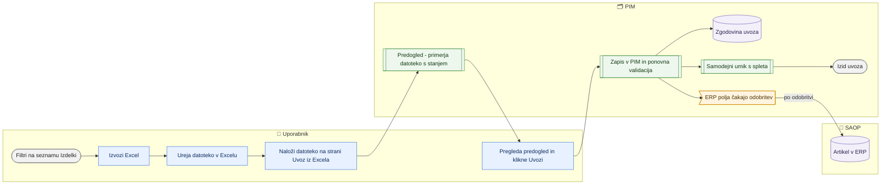

# Izvoz in uvoz delovnega lista izdelkov (Excel)

> **Področje:** Izdelki · **Lastnik:** urednik kataloga · **Stanje:** ⚠️ delno · **Preverjeno:** 2026-09-24, iz kode

## 1. Namen

Množično urejanje izdelkov v Excelu: izbrane izdelke izvoziš v delovni zvezek, ga popraviš in vrneš v PIM. Rezultat: spletni podatki, atributi, kategorije, slike, dokumenti, S-popusti in ERP polja so v PIM zapisani takoj; ERP polja gredo poleg tega v odhodno vrsto za SAOP, kjer čakajo odobritev.

## 2. Kdo sodeluje

| Vloga | Kaj naredi v procesu |
|---|---|
| Komerciala | Lahko izvozi in naloži datoteko; zapis večine polj ji baza zavrne (glej razdelek 10). |
| Urednik kataloga | Izvozi pogled, uredi datoteko, jo uvozi in pregleda izid. |
| Skrbnik | Kot urednik; odobri skupine za SAOP na Izhodu v SAOP. |
| Avtomatika (PIM) | Zgradi datoteko v ozadju, primerja datoteko s stanjem, zapiše spremembe, ponovno validira, zapiše zgodovino uvoza in po potrebi umakne izdelke s spleta. |

## 3. Kdaj se sproži

- **Ročno:** urednik, kadar mora popraviti več izdelkov naenkrat (npr. dopolniti spletne opise, atribute, kategorije, slike).
- **Po urniku:** ni.
- **Ob dogodku:** povratek uvoza iz zgodovine uvozov (`/izdelki/uvoz?povrni=N`).

## 4. Vhod in izhod

| | Kaj | Od kod / kam |
|---|---|---|
| **Vhod** | Delovni zvezek `.xlsx` (izvožen s strani Izdelki, do 16 MB) | Excel / uporabnik |
| **Izhod** | Spletne strani (kljukice), kategorije po spletiščih, spletni nazivi in opisi po jezikih, atributi, slike, dokumenti, S-popusti | PIM, takoj |
| **Izhod** | ERP polja iz registra SAOP (npr. EAN, dobavitelj, aktivnost, pakiranje, izloči iz rezervacije) | PIM takoj + odhodna vrsta za SAOP (čaka odobritev) |
| **Izhod** | Zapis uvoza »prej → potem« | Zgodovina uvozov `/uvozi` |

## 5. Diagram

## 6. Koraki

| # | Kdo | Kje (stran) | Kaj narediš | Kaj se zgodi v sistemu | Kako preveriš, da je uspelo |
|---|---|---|---|---|---|
| 1 | Urednik | `/izdelki` | Nastaviš filtre (npr. kategorijo — ta določi, kateri atributi nabora so v datoteki) in po želji obkljukaš posamezne izdelke. | Obseg izvoza: izbrani izdelki, sicer cel pogled. | Gumb se glasi »Izvozi Excel (izbrani: N)« ali »(cel pogled)«. |
| 2 | Urednik | `/izdelki` | Po želji klikneš **Stolpci** in izbereš samo potrebne skupine/polja, nato **Uporabi**. | Ključ (Podjetje, Šifra artikla) gre v datoteko vedno; stolpca »Naziv« od 2026-09-29 ni več. Manj stolpcev pomeni hitrejši uvoz nazaj. | Značka »izbranih/vseh« ob gumbu Stolpci. |
| 3 | Urednik | `/izdelki` | Klikneš **Izvozi Excel**. | Datoteka se gradi v ozadju; prenos se odpre takoj, napredek je v oknu izvozov spodaj desno na vsaki strani. Vmes lahko greš na drugo stran. | Brskalnik prenese `.xlsx`; okno izvozov kaže »preneseno«. |
| 4 | Urednik | Excel | Popraviš celice. Ne spreminjaj naslovov stolpcev. Prazna celica = »ne dotikaj se«. Več vrednosti v celici loči z `\|`. Logična polja: D/N (sprejme tudi da/ne, 1/0). | — | Rumene glave označujejo obvezna polja, rdeče celice manjkajoče vrednosti. |
| 5 | Urednik | `/izdelki/uvoz` | Če datoteka nima stolpca »Podjetje«, izbereš podjetje v »Podjetje za vrstice brez stolpca Podjetje«. Nato izbereš datoteko. | PIM prebere zvezek in ga primerja s trenutnim stanjem (skozi vrata za uvoze — hkrati tečeta največ dva). | Razdelek **2. Kaj bo uvoz naredil**: število vrstic, sprememb za PIM in ERP polj, predogled prvih 20 vrstic. |
| 6 | Urednik | `/izdelki/uvoz` | Prebereš opozorila: stolpci samo za branje, neprepoznani stolpci, **Novi atributi**, podvojeni artikli, »ni D ali N«, »ni število«, vodilne ničle. | Nič se še ne zapiše. | Rumena opozorila nad predogledom. |
| 7 | Urednik | `/izdelki/uvoz` | Vpišeš **Opombo k spremembi** in klikneš **Uvozi N sprememb**. | Po korakih: novi atributi v šifrant, spletišča, kategorije, besedila, atributi, slike in dokumenti, ERP polja v vrsto za SAOP (vir »EXCEL«) in v PIM, S-popusti. Nato zapis v zgodovino uvozov in preverba, ali je kak izdelek izgubil pravico do spleta. | Razdelek **3. Izid**: spremenjenih izdelkov, zapisano v PIM, ERP polj, slik dodanih/odstranjenih, uvrščeno v vrsto / že v vrsti / zavrnjeno, povezava »uvoz #N«. |
| 8 | Urednik | `/izdelki/uvoz` | Prebereš opozorila izida in seznam »Umaknjeni s spleta«. | Opozorilo velja samo za navedeno polje; ostalo je zapisano. | Seznam opozoril in povezava na `/splet/umaknjeni`. |
| 9 | Urednik / skrbnik | `/saop/artikli` (Izhod v SAOP) | Odobriš skupino ERP sprememb. | Šele zdaj gre zadnja vrednost v SAOP. | Glej [Množični izhod](../05-izhod-saop/mnozicni-izhod.md). |
| 10 | Urednik | `/nastavitve/nabori-atributov` | Nove atribute dodaš v nabor kategorije. | Brez tega atribut ne gre na splet. | Atribut je na kartici v skupini »Atributi kategorije (nabor)«. |
| 11 | Urednik | `/uvozi` → uvoz #N | Po potrebi uvoz povrneš (povezava vodi na `/izdelki/uvoz?povrni=N`). | Pripravi se predogled s prejšnjimi vrednostmi; polja, ki jih je medtem nekdo spremenil, se izpustijo in izpišejo. Potrdiš z istim gumbom **Uvozi**. | Glej [Zgodovina uvozov in povratek](../01-nadzor/zgodovina-uvozov-in-povratek.md). |

**Kaj je v datoteki:** Ključ · ERP (stolpci iz registra pisljivih polj SAOP) · Splet (Spletne strani, Kategorije — {spletišče}, Spletni naziv/opis po jezikih, Slike, Dokumenti) · S-popust (S koda, Posebni S — tipi strank, Posebni S — stranke) · Oznake (Pakirno naročanje, Razstavni eksponat — D/N) · Atributi kategorije — nabor · Atributi izven nabora · Stanje (samo za branje).

## 7. Pravila in varovalke

- **Prazna celica nikoli ne izprazni polja.** Izjema so polja S-popusta, kjer znak `-` odstrani S.
- **ERP polja:** v PIM takoj, v SAOP šele po odobritvi. Zajem iz SAOP neposlanega polja ne povozi. SAOP ne dobi praznih vrednosti; logičnega polja ni mogoče izprazniti.
- **Slike in dokumenti:** celica je cel seznam v vrstnem redu (prva slika je glavna); naslov, ki ga v celici ni več, izdelek izgubi.
- **Kategorije:** pot mora obstajati v drevesu spletišča, sicer se vrstica zavrne z opozorilom. Jezikovna različica spletišča (npr. Videlektro angleško) brez svojega stolpca dobi isto kategorijo v svojem jeziku. Kategorija, zapisana z uvozom, velja kot ročna uvrstitev (ponovna preslikava vira je ne povozi).
- **Spletne strani:** sprejme ime ali kodo (»svetila«, »Videlektro«); kljukica, ki je PIM ne dovoli (npr. brez kategorije), se ne postavi.
- **Enote atributov (301):** atribut z enoto (npr. Dolžina = mm) sprejme karkoli: »5 m«, »3,5 m« ali 5 + stolpec »Enota dolžine« se pretvori v mm; ista enota se samo odstrani; vrednost, ki je ni mogoče pretvoriti (»5 ft«, »do 30m«), se zapiše, kot je, predogled pa opozori, naj bo v enoti atributa. Stolpec pod skupino »Atributi …«, katerega naslov je ime atributa, gre v atribut tudi, če ima polje SAOP isto ime (»Dolžina«).
- **Dvoumni naslovi (#6):** stolpec z naslovom Naziv, Naziv artikla, Naziv izdelka, Ime artikla, Ime izdelka, Naslov, Name, Title, Product name ali Item name uvoz preskoči: ne gre v spletni naziv, ne v atribut (tudi pod skupino »Atributi …« ne in ne ponudi se v oknu »Manjkajoče«). Predogled in izid to povesta, opozorilo gre v `ops.ImportRun.Problems`. Primerjava je natančna, zato »Spletni naziv (sl)«, »Naziv ERP (sl)« in atributi »Nazivna …« ostanejo, kot so.
- **Novi atributi:** stolpec pod skupino atributov, ki ga šifrant ne pozna, uvoz ustvari kot besedilni atribut.
- **Oznake (302):** »Pakirno naročanje« in »Razstavni eksponat« sta D/N (sprejme tudi da/ne, 1/0; `-` = ne). Druga vrednost (npr. »morda«) je napaka vrstice »… ni D ali N; polje se preskoči« — pokaže se v predogledu, v izidu uvoza in se zapiše v zgodovino uvozov (`ops.ImportRun.Problems`). Predogled pokaže naslov stolpca in Da/Ne (npr. »Pakirno naročanje = Ne«). Zapis gre v PIM z zgodovino (`pim.SetProductFlagsBulk`), v SAOP ne. Pakirno naročanje brez Pakiranja 2 (> 1) artikel zadrži s spleta; izid uvoza pove, koliko artiklov je zadržanih. Povratek uvoza vrne prejšnjo vrednost (manjkajoča oznaka = N).
- **S-popust** se zapiše samo izdelku, ki je že objavljen v PIM; brez PAK2 nima učinka.
- **Isti artikel večkrat** v datoteki: upošteva se prva vrstica. Dva stolpca za isto polje z različno vrednostjo: polje se preskoči.
- **Hkratni uvozi:** največ dva hkrati, ostali čakajo v vrsti (stran to izpiše).
- **Pravice:** stran odpre ADMIN, CATALOG_EDITOR, COMMERCIAL; zapis besedil, atributov, slik, spletišč in ERP polj pa zahteva ADMIN ali CATALOG_EDITOR (glej ⚠️ v razdelku 10).

## 8. Ko gre kaj narobe

| Znak (kaj vidiš) | Verjeten vzrok | Kaj narediš |
|---|---|---|
| »Zvezek nima stolpca Podjetje, podjetje pa ni izbrano.« | Datoteka ni izvožena iz PIM ali je stolpec izbrisan. | Izberi podjetje na vrhu strani in naloži znova. |
| »Stolpci brez ustreznega polja (ne bodo uvoženi)« | Preimenovan naslov ali polje, ki ni več pisljivo. | Vrni izvirni naslov ali izvozi svežo datoteko. |
| »Stolpec »Naziv« je preskočen, ker je dvoumen …« | Stara datoteka (pred 29. 9.) ali ročno dodan stolpec z naslovom Naziv, Naziv artikla, Name, Title … Tak naslov ne pove, ali gre za spletni naziv ali naziv ERP, zato ga uvoz ne vpiše nikamor (ne v polje, ne v atribut); opozorilo ostane v zgodovini uvoza. | Vrednosti prepiši v stolpec »Spletni naziv (sl)« ali »Naziv ERP (sl)« in uvozi znova. |
| »V zvezku ni nobene vrstice, ki bi kaj spremenila.« | Vse je v PIM že tako. | Nič. |
| »… se razlikuje samo po vodilnih ničlah« | Excel je šifro spremenil v število. | Celico zapiši kot besedilo (z apostrofom) in uvozi znova. |
| »kategorija … ni v drevesu« | Pot ne obstaja na tem spletišču. | Kopiraj pot iz izvoza ali s strani Kategorije. |
| »Datoteka je večja od 16 MB.« | Prevelik izvoz. | Izvozi manj stolpcev ali razdeli izdelke. |
| »Uvoz čaka v vrsti …« | Tečeta že dva uvoza. | Počakaj, začne se sam. |
| Veliko opozoril »ni zapisano« za komercialista | Vloga COMMERCIAL nima pravice pisanja kataloga. | Uvoz naj izvede urednik kataloga. |
| Umaknjeni s spleta po uvozu | Uvoz je pobrisal sliko, kategorijo ali obvezno polje. | Dopolni izdelek in spletišče ponovno označi. |

## 9. Tehnično ozadje

Za skrbnika in razvoj

- **Strani:** `PIM.Intranet/Components/Pages/Products.razor` (izvoz, okno Stolpci), `ProductImport.razor` (`/izdelki/uvoz`), `Components/Shared/ImportUndoBanner`.
- **Storitve / delavci:** `ProductWorkbookService` (`DescribeColumnsAsync`, `PreviewAsync`, `ApplyAsync`, `PlanUndoAsync`), `ExportJobService.StartWorkbookExport` + prenos `izvoz/zvezek/{jobId}` (največ 90 min gradnje), `PIM.Operations/ProductWorkbookContract.cs` (stolpci, D/N, `|`), `SaopWriteService.EnqueueAsync` (vir `EXCEL`), `ProductEditService` (`SaveTextsBulkAsync`, `SaveAttributesBulkAsync`, `SaveMediaBulkAsync`, `SaveErpFieldsBulkAsync`, `SaveWebShopsAsync`), `CategoryMappingService.SetProductCategoriesAsync`, `PackagingDiscountService`, `ImportHistoryService.RecordAsync`, `WebWithdrawalService.AfterChangeByItemsAsync`, `HeavyWorkGate.Imports`.
- **Tabele in pogledi:** `intranet.GetProductWorkbook`, `intranet.GetProductExportSheet`, `pim.SaveProductTextsBulk`, `pim.SaveProductAttributesBulk`, `pim.SaveProductMediaBulk`, `pim.SetProductCategories`, `out.SaopXmlField`, `ops.ImportRun`, `ops.ImportChange`.
- **Migracije:** 218 (množični zapis), 245 (ERP takoj, slike, dokumenti), 251, 273, 274, 276 (rumene glave), 280 (zgodovina uvozov), 301 (enote atributov), 302 (oznake D/N, `pim.SetProductFlagsBulk`).
- **Urniki:** ni.

## 10. Odprta vprašanja in razlike

- ⚠️ Stran `/izdelki/uvoz` je odprta vlogi COMMERCIAL, zapisovalne storitve pa so neenotne: besedila, atributi, slike/dokumenti, kljukice spletišč (CatalogWrite) in ERP polja (SaopWrite) so dovoljeni samo ADMIN in CATALOG_EDITOR, kategorije (`CategoryMappingService`) in S-popusti (`PackagingDiscountService`) pa nimajo preverbe vloge v storitvi. Komercialist tako zapiše kategorije in S-popuste, ostalo pade kot opozorila »niso zapisana«; uvoz se kljub temu zapiše v zgodovino uvozov.
- ⚠️ Z Excelom ni mogoče izprazniti spletnega besedila ali atributa (prazna celica = ne dotikaj se; znak `-` velja samo za S-popust). Prav tako ni mogoče odstraniti vseh slik izdelka.
- ⚠️ Podnaslov strani uvoza omenja gumb »Delovni list«, gumb na seznamu pa se imenuje **Izvozi Excel**.
- ⚠️ Izid uvoza za odobritev napoti na `/izvozi/mnozicno` in `/outbound`, drugod v intranetu pa je odobritev na `/saop/artikli` (Izhod v SAOP) — preveriti, katera pot je prava za uporabnika.
- ⚠️ Kategorija iz uvoza se zapiše kot ročna uvrstitev; ponovna preslikava dobaviteljevega XML je nato ne spremeni več — uporabnik tega verjetno ne ve.
- ⚠️ Znano: `ProductWorkbookTests` z delom na bazi ne poganjati na računalniku z 8 GB RAM.

## Povezani procesi

- [Iskanje in kartica izdelka](iskanje-in-kartica-izdelka.md): isti podatki za en izdelek; izvoz se začne na seznamu.
- [Kategorije izdelka](kategorije-izdelka.md): ročna uvrstitev, ki jo zapiše tudi uvoz.
- [Mediji](mediji.md): stolpca Slike in Dokumenti.
- [Zgodovina uvozov in povratek](../01-nadzor/zgodovina-uvozov-in-povratek.md): uvoz #N in povratek.
- [Izhod v SAOP](../05-izhod-saop/izhod-v-saop.md) in [Množični izhod](../05-izhod-saop/mnozicni-izhod.md): odobritev ERP polj.
- [Umaknjeni artikli in obvestila](../06-izhod-splet/umaknjeni-s-spleta.md): izdelki, umaknjeni po uvozu.
- [Atributi in nabori](../08-upravljanje/atributi-in-nabori.md): novi atributi v nabor kategorije.
- [Popusti](../07-poslovanje/popusti.md): stolpci S-popusta.
- [Zaloge in rezervacija](../07-poslovanje/zaloge-in-rezervacija.md): polje »Izloči iz rezervacije zaloge«.
