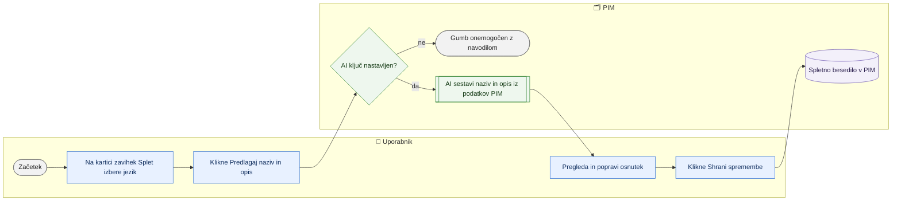

# AI predlog spletnega naziva in opisa

> **Področje:** Kakovost · **Lastnik:** urednik kataloga · **Stanje:** ⚠️ delno · **Preverjeno:** 2026-09-24, iz kode

## 1. Namen

Iz podatkov artikla v PIM (ERP nazivi in opisi, atributi, kategorije, proizvajalec, dobavitelj) AI predlaga spletni naziv in spletni opis v izbranem jeziku. Rezultat je osnutek na kartici, ki ga urednik prebere, popravi in shrani kot ročno spremembo.

## 2. Kdo sodeluje

| Vloga | Kaj naredi v procesu |
|---|---|
| Komerciala | Ne sodeluje (razen če ima pravico urejanja kartice). |
| Urednik kataloga | Na kartici izbere jezik, klikne gumb za AI predlog, pregleda besedili in ju shrani. |
| Skrbnik | Nastavi ključ `Ai:ApiKey` (in po želji model in napor) na strežniku intraneta. |
| Avtomatika (PIM) | Ne sodeluje; množičnega ali samodejnega generiranja ni. |

## 3. Kdaj se sproži

- **Ročno:** urednik na kartici izdelka, zavihek Splet, klikne »Predlagaj naziv in opis (AI)«.
- **Po urniku:** ni.
- **Ob dogodku:** ni.

## 4. Vhod in izhod

| | Kaj | Od kod / kam |
|---|---|---|
| **Vhod** | Šifra, EAN, proizvajalec, dobavitelj, ERP besedila, kategorije po spletiščih, neprazni atributi, obstoječa spletna besedila v drugih jezikih | PIM (kartica izdelka) |
| **Izhod** | Osnutek spletnega naziva (`WEB_TITLE`) in opisa (`DESCRIPTION`) v izbranem jeziku | Kartica (osnutek) → PIM šele po »Shrani spremembe« |

## 5. Diagram

## 6. Koraki

| # | Kdo | Kje (stran) | Kaj narediš | Kaj se zgodi v sistemu | Kako preveriš, da je uspelo |
|---|---|---|---|---|---|
| 1 | Urednik | `/izdelki/{id}` | Na kartici odpreš zavihek Splet; v »AI predlog v jeziku« izbereš jezik. | — | Gumb »Predlagaj naziv in opis (AI)« je omogočen; če piše »AI ni nastavljen«, glej razdelek 8. |
| 2 | Urednik | `/izdelki/{id}` | Klikneš »Predlagaj naziv in opis (AI)«. | Intranet pošlje podatke artikla modelu (privzeto `claude-opus-5`); gumb kaže »AI piše …«. | Sporočilo »AI (model) je predlagal spletni naziv in opis v jeziku … Besedili sta v osnutku …«. |
| 3 | Urednik | `/izdelki/{id}` | Prebereš in po potrebi popraviš naziv (do 80 znakov) in opis (60–140 besed). | Besedili sta samo v osnutku, v bazi še ni nič. | Polji sta označeni kot spremenjeni. |
| 4 | Urednik | `/izdelki/{id}` | Klikneš »Shrani spremembe«. | Besedili se zapišeta kot ročna sprememba (ista sled in pravice), artikel se validira. | Sporočilo o shranjenih besedilih; napaka spletnega profila za naziv ali opis izgine. |

## 7. Pravila in varovalke

- **Predlog nikoli ne gre naravnost v bazo**; shrani ga uporabnik z istim gumbom kot ročno spremembo.
- AI sme uporabiti samo podatke iz PIM; navodilo prepoveduje izmišljanje lastnosti, šifro in EAN v nazivu, klicaje, HTML in superlative brez podlage.
- Artikel brez ERP besedil in brez atributov se zavrne (»AI ne bi imel iz česa pisati«).
- Gumb je viden samo, kdor sme urejati kartico.

## 8. Ko gre kaj narobe

| Znak (kaj vidiš) | Verjeten vzrok | Kaj narediš |
|---|---|---|
| »AI ni nastavljen« | Na strežniku ni ključa `Ai:ApiKey` (ali `ANTHROPIC_API_KEY`). | Skrbnik doda v `appsettings.Local.json` ob intranetu razdelek `"Ai": { "ApiKey": "…" }` in znova zažene intranet. |
| »Klic AI ni uspel: …« | Ni povezave, napačen ključ, omejitev. | Poskusi znova; skrbnik preveri ključ in dnevnik. |
| »AI ni vrnil pričakovanega JSON odgovora« | Model je odgovoril v napačni obliki. | Poskusi znova. |
| »Artikel nima ERP nazivov, opisov ali atributov« | Premalo podatkov. | Najprej dopolni ERP opis ali atribute. |

## 9. Tehnično ozadje

Za skrbnika in razvoj

- **Strani:** `PIM.Intranet/Components/Pages/ProductCard.razor` (`SuggestWithAiAsync`, `ApplyAiDraft`).
- **Storitve / delavci:** `PIM.Intranet/Services/AiTextService.cs` (uradni Anthropic SDK); nastavitve `Ai:ApiKey`, `Ai:Model` (privzeto `claude-opus-5`), `Ai:Effort` (`low`, `medium`, `high`, `max`; privzeto `medium`); registracija v `Program.cs`.
- **Tabele in pogledi:** zapis prek običajnega shranjevanja besedil (`ProductEditService`).
- **Migracije:** ni.
- **Urniki:** ni.

## 10. Odprta vprašanja in razlike

- ⚠️ Iz kode ni razvidno, ali je ključ `Ai:ApiKey` nastavljen na produkciji; brez njega funkcija ne dela.
- ⚠️ Ni množičnega generiranja (npr. za vse artikle brez spletnega opisa); vsak artikel posebej.
- ⚠️ Ni zapisa, da je besedilo napisal AI (sled pokaže samo uporabnika, ki je shranil).
- ⚠️ Podatki artikla se pošiljajo zunanji storitvi; poslovna odobritev tega v kodi ni zabeležena.

## Povezani procesi

- [Iskanje in kartica izdelka](../03-izdelki/iskanje-in-kartica-izdelka.md): kje je gumb.
- [Manjkajoči prevodi](prevodi.md): prevodi vrednosti lastnosti (brez AI).
- [Kakovost in validacija](kakovost-in-validacija.md): spletni profil zahteva naziv in opis.
