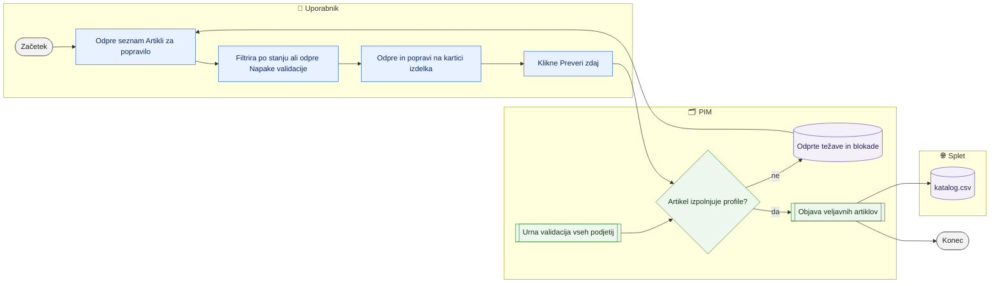

# Kakovost in validacija artiklov

> **Področje:** Kakovost · **Lastnik:** urednik kataloga · **Stanje:** ⚠️ delno · **Preverjeno:** 2026-09-24, iz kode

## 1. Namen

Pokaže, kateri artikli so pripravljeni za ERP in za splet, katere zahteve validacijskih profilov jim manjkajo in kje se to popravi. Rezultat je popravljen artikel, ki po naslednji validaciji izgine s seznama napak in (če izpolnjuje pravila izvoza) pride v `katalog.csv`.

## 2. Kdo sodeluje

| Vloga | Kaj naredi v procesu |
|---|---|
| Urednik kataloga | Pregleda seznam na `/kakovost/artikli` in `/kakovost/napake`, odpre kartico izdelka in dopolni manjkajoča polja, po potrebi artikel ročno zadrži ali sprosti. |
| Komerciala | Vidi iste sezname; sme tudi klikniti »Preveri zdaj« in postaviti ročni zadržek (pravica `BusinessWrite`). |
| Skrbnik | Ureja profile in zahteve na `/pravila/validacija`; na kartici izdelka potrdi izjemo za polje, ki ga artikel namenoma nima (EAN, proizvajalec, dobavitelj). |
| Avtomatika (PIM) | Vsako uro (in po uspešnem zajemu iz SAOP) validira vsa podjetja, nato objavi veljavne artikle in po potrebi odkljuka spletišča artiklom, ki niso več veljavni za splet. |

## 3. Kdaj se sproži

- **Ročno:** urednik ali komerciala klikne »Preveri zdaj« pri artiklu na `/kakovost/artikli` (validira samo ta artikel).
- **Po urniku:** posel `PRODUCT_VALIDATION` (»Validacija artiklov«) vsakih 3600 s za vsako podjetje; za njim `PRODUCT_PUBLICATION` (objava, samo po sveži validaciji, mlajši od 2 ur). Ista koraka tečeta tudi v nočni uskladitvi `NIGHTLY_RECONCILIATION` (skupini »Validacija vseh podjetij« in »Objava vseh podjetij«).
- **Ob dogodku:** uspešen zajem artiklov `SAOP_PRODUCT_IMPORT` takoj sproži validacijo. Shranjevanje besedil, lastnosti in kljukic spletišč (kartica, uvoz delovnega lista) v bazi znova validira prizadete artikle.

## 4. Vhod in izhod

| | Kaj | Od kod / kam |
|---|---|---|
| **Vhod** | Podatki artikla (ERP polja, besedila, atributi, kategorije, kljukice spletišč) in zahteve profilov | PIM (`canon`), register profilov `val.ValidationProfile` / `val.FieldRequirement` |
| **Vhod** | Ročni zadržek z razlogom | Uporabnik na `/kakovost/artikli` |
| **Izhod** | Odprte težave po artiklu, stanje pripravljenosti ERP in splet, čas zadnje validacije | PIM (`val.ProductIssue`, `val.ProductValidationState`) |
| **Izhod** | Excel s filtriranim seznamom napak | Prenos `izvoz/kakovost-napake.xlsx` |
| **Izhod** | Objavljeni veljavni artikli, iz katerih nastane `katalog.csv` | PIM (`pim`) → splet |

## 5. Diagram

## 6. Koraki

| # | Kdo | Kje (stran) | Kaj narediš | Kaj se zgodi v sistemu | Kako preveriš, da je uspelo |
|---|---|---|---|---|---|
| 1 | Urednik | `/kakovost` | Odpreš meni »Kakovost podatkov«. | Stran brez `?pogled=` te preusmeri na prvi zavihek `/kakovost/artikli` (»Artikli za popravilo«). | Vidiš kartice »Pripravljeni za ERP«, »ERP blokirani«, »Objavljeni na spletu«, »Splet blokirani«, »Brez spletnega mesta«, »Vrstic v katalog.csv«, »Ročni zadržki«, »Zastarela validacija«. |
| 2 | Urednik | `/kakovost/artikli` | Klikneš kartico (npr. »Splet blokirani«) ali izbereš podjetje, stanje in iskanje ter klikneš »Uporabi filtre«. | Seznam 50 artiklov na stran s stolpci ERP, Splet / katalog.csv, Težave, Validirano, Ročni zadržek. Stanje spleta se računa po istih pravilih kot `katalog.csv` (migracija 242). | Število artiklov desno v orodni vrstici; filtri so v naslovu (povezavo lahko deliš). |
| 3 | Urednik | `/kakovost/napake` | Za podrobnosti odpreš zavihek »Napake validacije«, izbereš podjetje, nivo (ERP_SLO, ERP_EU/THIRD, KOMERCIALA, SPLET), profil, resnost, »Blokira«, drevo in kategorijo, polje; klikneš »Uporabi filtre«. | Po 25 artiklov na stran, za vsakega do 4 manjkajoča polja s profilom in resnostjo; spodaj tabeli »Katera zahteva ustavi največ izdelkov« in »Pri katerem dobavitelju se napake kopičijo«. | Številka »… izdelkov z odprto težavo«; aktivni filtri so kot čipi nad tabelo. |
| 4 | Urednik | `/kakovost/napake` | Po želji klikneš »Izvozi Excel«. | Prenos `kakovost-napake.xlsx` z natanko istimi filtri; vrstice obarvane po resnosti. | Datoteka se prenese. |
| 5 | Urednik | `/izdelki/{id}` | Pri artiklu klikneš »Odpri in popravi →« (ali ime izdelka) in na kartici dopolniš polje. | Kartica odpre zavihek, ki ustreza nivoju (ERP, komerciala, splet). ERP polja gredo v PIM takoj in v vrsto za SAOP (glej [Izhod v SAOP](../05-izhod-saop/izhod-v-saop.md)). | Na kartici izgine opozorilo za to polje po validaciji. |
| 6 | Urednik ali komerciala | `/kakovost/artikli` | Klikneš »Preveri zdaj« pri artiklu. | Pokliče se `val.RunValidationForProduct` samo za ta artikel (največ 120 s). Nič ne gre v SAOP in CSV se ne izdela. | Sporočilo »Preverba za … je končana«, stolpec »Validirano« dobi nov čas, stanje se osveži. |
| 7 | Urednik | `/kakovost/artikli` | Če artikla namenoma ne želiš ven: »Zadrži …« → izbereš kanal (Vsi kanali, ERP, Splet), vpišeš obvezen razlog → »Zadrži«. Za sprostitev »Sprosti«. | `val.SetProductHold` zapiše zadržek z akterjem in razlogom. Zadržek za splet ali vse kanale izključi artikel iz `katalog.csv`. | Stolpec »Ročni zadržek« pokaže čip kanala; kartica »Ročni zadržki« se poveča. |
| 8 | Avtomatika | — | — | Urni `PRODUCT_VALIDATION` validira vsa podjetja in pokliče `pim.WithdrawIneligibleWebShops`; `PRODUCT_PUBLICATION` objavi veljavne artikle; `WEB_CATALOG_EXPORT` iz objavljenega stanja naredi `katalog.csv`. | Na `/kakovost/artikli` kartica »Zastarela validacija« (starejša od 2 ur) pada na 0. |
| 9 | Urednik | `/kakovost?pogled=kategorije` | Za pregled po drevesu odpreš zavihek »Po kategorijah«, izbereš drevo (Svetila, Videlektro) in resnost. | Vsaka vrstica šteje artikle kategorije in vseh podkategorij (vsa podjetja skupaj); »Odpri napake →« odpre `/kakovost/napake` s filtrom kategorije. | Stolpec »Najpogosteje manjka« pokaže polja, ki jih je treba dopolniti. |
| 10 | Skrbnik | `/kakovost?pogled=profili` | Pregleda profile (stran nima zavihka, dosegljiva samo z naslovom). | Tabela profilov z nivojem, obsegom, številom zahtev, neveljavnimi in vplivom (ERP, splet). Profil brez nivoja je označen. | Povezava na profil vodi na `/pravila/validacija?profil=…`. |

## 7. Pravila in varovalke

- **Napake ni mogoče ročno zapreti.** Izgine sama, ko je polje dopolnjeno in je artikel znova validiran.
- **Karantena ni napaka validacije:** karantena je zapis iz vira, ki ga preslikava ni sprejela (artikla še ni); napaka validacije je na obstoječem artiklu. Glej [Karantena](karantena.md).
- **Nivoji:** `SHARED` profil šteje v ERP in splet (kar blokira), `ERP` profil v ERP_SLO ali ERP_EU/THIRD (po imenu profila), `COMMERCIAL` v KOMERCIALA (nikoli ne blokira), `WEB` v SPLET. Napaka profila, ki nič ne blokira, je prikazana kot »Manjka (ne blokira)«.
- **Resnost:** `ERROR` naredi profil neveljaven, `WARNING` se samo pokaže.
- **Svežina:** validacija, starejša od 2 ur, velja za zastarelo; objava (`PRODUCT_PUBLICATION`) teče samo po uspešni in sveži validaciji.
- **Splet:** stolpec »Splet / katalog.csv« uporablja ista pravila kot izvoz: kljukice spletišč, kategorija na označenem spletišču, ročni zadržek, izključitev iz kataloga, veljavnost spletnih profilov. Oznaka »ERP: za splet« iz SAOP je samo informativna.
- **ERP pripravljenost je samo informativna.** Od migracije 236 ne blokira vpisa ali pošiljanja v SAOP; odloči SAOP ob prejemu. ⚠️ glej razdelek 10.
- **Pravice:** vse strani kakovosti zahtevajo prijavo; »Preveri zdaj« in »Zadrži« zahtevata `BusinessWrite` (ADMIN, CATALOG_EDITOR, COMMERCIAL); izjema polja na kartici samo ADMIN (`FieldWaiver`). Zavihki imajo dodatne ključe dostopa `tab.quality.*`.

## 8. Ko gre kaj narobe

| Znak (kaj vidiš) | Verjeten vzrok | Kaj narediš |
|---|---|---|
| Veliko artiklov ima »Potrebna preverba« / »Zastarelo« | Urna validacija ni tekla ali je padla (počasna, ~11 min za podjetje 2). | Preveri posel »Validacija artiklov« na `/sistem` (posel `/sistem/posel/PRODUCT_VALIDATION`) (glej [Avtomatika in urniki](../09-administracija/avtomatika-in-urniki.md)); za posamezen artikel klikni »Preveri zdaj«. |
| »Validacije ni bilo mogoče dokončati« po »Preveri zdaj« | Ni pravice, časovna omejitev 120 s ali zaklep med nočno validacijo. | Poskusi čez nekaj minut; če se ponavlja, poglej dnevnik aplikacije. |
| `/kakovost/napake` kaže bistveno manj artiklov kot `/kakovost/artikli` | Stran napak privzeto pokaže samo eno podjetje (prvo po šifri); pripravljenost privzeto vsa. | V izbirniku podjetja izberi pravo podjetje in klikni »Uporabi filtre«. |
| Artikel je popravljen, a je še »Splet blokiran« | Validacija še ni tekla, ali manjka kljukica/kategorija, ali je aktiven ročni zadržek. | »Preveri zdaj«; preveri stolpec »spletišča N/M« in zadržek. |
| Napaka za polje, ki ga artikel res nima (npr. brez EAN) | Zahteva profila velja za vse. | Skrbnik na kartici potrdi izjemo polja (samo ADMIN). |

## 9. Tehnično ozadje

Za skrbnika in razvoj

- **Strani:** `PIM.Intranet/Components/Pages/Quality.razor` (`/kakovost`, pogleda `profili` in `kategorije`), `QualityProducts.razor` (`/kakovost/artikli`), `ValidationErrors.razor` (`/kakovost/napake`); zavihki `Components/Shared/PimTab.cs` → `QualityTabs`.
- **Storitve / delavci:** `QualityReadService` (`GetProductReadinessAsync`, `GetIssuesAsync`, `GetByCategoryAsync`, `GetOverviewAsync`), `QualityWriteService` (`val.RunValidationForProduct`, `val.SetProductHold`, `val.SetProductFieldWaiver`), `GovernanceReadService`, `QualityIssueExportService`, `ValidationLayer.cs`; avtomatika `PIM.Automation/JobCatalog.cs` (koraka `Validate`, `Promote`).
- **Tabele in pogledi:** `val.ValidationProfile`, `val.FieldRequirement`, `val.ProductIssue`, `val.ProductValidationState`, `val.ProductHold`, `val.ProductChannelReadiness`; procedure `val.RunValidation`, `val.RunValidationForProducts`, `val.Promote`, `pim.WithdrawIneligibleWebShops`, `intranet.GetQualityIssues`, `intranet.GetQualityOverview`, `intranet.GetQualityByCategory`.
- **Migracije:** 102 (bralne procedure), 146–148 (zahteve po kategoriji), 177 (po kategorijah), 194/195/236 (ERP varovalka uvedena in odstranjena), 211 (prioriteta zastoja), 218 (zmogljivost), 236 (sveža validacija), 242 (pripravljenost = pravila izvoza), 249 (izjema polja), 251 (samodejni umik kljukic).
- **Urniki:** `PRODUCT_VALIDATION` 3600 s, `PRODUCT_PUBLICATION` 3600 s (odvisen od validacije, največ 7200 s stare), `NIGHTLY_RECONCILIATION`.

## 10. Odprta vprašanja in razlike

- ⚠️ `/kakovost/napake` kartica »Blokira ERP« piše »težav v profilih, ki ustavijo zapis v SAOP«, a od migracije 236 blokirajoče napake zapisa v SAOP ne ustavijo več (sprožilec `out.TR_OutboxMessage_ErpQualityGate` je odstranjen). Besedilo zavaja.
- ⚠️ Ročni zadržek za kanal **ERP** na `/kakovost/artikli` nima učinka na vrsto za SAOP (236: »za ERP ostane samo informativen«). Uporabnik lahko misli, da je artikel zadržan pred SAOP.
- ⚠️ `/kakovost/napake` privzeto kaže samo prvo podjetje (`GetCurrentOrganizationAsync`), `/kakovost/artikli` pa vsa podjetja; številke se med zavihkoma ne ujemajo.
- ⚠️ Gumb »Zadrži …« je viden vsem, pravica se preveri šele ob kliku (napaka pri vlogi brez `BusinessWrite`).
- ⚠️ Pogled `/kakovost?pogled=profili` nima zavihka; dosegljiv je samo z vpisanim naslovom.
- ⚠️ Celotna validacija podjetja 2 je bila izmerjena ~11 min (prej ~3,5 min); pri urnem ritmu lahko artikli pogosto kažejo »zastarelo«. Potrebna ponovna meritev.
- ⚠️ Ali shranjevanje vsake vrste polja na kartici res sproži validacijo, je razvidno le iz komentarjev kode (`val.RunValidationForProducts` pri množičnem zapisu besedil); ni preverjeno za vsa polja.

## Povezani procesi

- [Karantena](karantena.md): zapisi, ki sploh niso postali artikel.
- [Manjkajoči prevodi](prevodi.md) in [Manjkajoče kategorije](manjkajoce-kategorije.md): pogosta vzroka napak spletnega profila.
- [Iskanje in kartica izdelka](../03-izdelki/iskanje-in-kartica-izdelka.md): kje se napaka dejansko popravi.
- [Pravila validacije, slovar, preslikave](../08-upravljanje/pravila-validacije-slovar-preslikave.md): kje se urejajo profili in zahteve.
- [Atributi in nabori](../08-upravljanje/atributi-in-nabori.md): nabor atributov kategorije določa, kaj se zahteva.
- [Katalog in stranke CSV](../06-izhod-splet/katalog-in-stranke-csv.md): kaj se zgodi z veljavnimi artikli.
- [Umaknjeni artikli in obvestila](../06-izhod-splet/umaknjeni-s-spleta.md): samodejni umik kljukic po validaciji.
- [Avtomatika in urniki](../09-administracija/avtomatika-in-urniki.md): posla `PRODUCT_VALIDATION` in `PRODUCT_PUBLICATION`.
