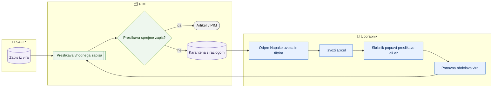

# Karantena (napake uvoza)

> **Področje:** Kakovost · **Lastnik:** skrbnik podatkov · **Stanje:** ⚠️ delno · **Preverjeno:** 2026-09-24, iz kode

## 1. Namen

Pokaže vhodne zapise (iz SAOP ali dobaviteljev), ki jih preslikava ni sprejela, zato iz njih artikel v PIM sploh ni nastal ali ni bil posodobljen. Rezultat je seznam z razlogom izločitve, na podlagi katerega se popravi preslikava ali izvorni podatek.

## 2. Kdo sodeluje

| Vloga | Kaj naredi v procesu |
|---|---|
| Komerciala | Običajno ne sodeluje; lahko pogleda, zakaj artikla dobavitelja ni v PIM. |
| Urednik kataloga | Pregleda seznam, izvozi ga v Excel in javi skrbniku, kaj je treba popraviti. |
| Skrbnik | Popravi preslikavo, slovar ali izvorni podatek in sproži ponovno obdelavo vira. |
| Avtomatika (PIM) | Ob vsaki preslikavi vhodnega zapisa (`map.ProcessRawInbox`) zapis, ki ne gre skozi, pusti v karanteni z razlogom. |

## 3. Kdaj se sproži

- **Ročno:** uporabnik odpre `/kakovost/karantena`, ko artikla ni v PIM ali ko nadzorna plošča kaže napake uvoza.
- **Po urniku:** zapisi nastajajo med zajemi (`SAOP_PRODUCT_IMPORT`, `SUPPLIER_CATALOG_IMPORT` …); sama stran nima urnika.
- **Ob dogodku:** vsak neuspešno preslikan zapis iz `raw.Inbox`.

## 4. Vhod in izhod

| | Kaj | Od kod / kam |
|---|---|---|
| **Vhod** | Neuspešno preslikani vhodni zapisi z virom, entiteto, stranjo in razlogom | PIM (`raw.Inbox`) iz SAOP ali dobaviteljev |
| **Izhod** | Pregled in Excel `karantena.xlsx` | Uporabnik |

## 5. Diagram

## 6. Koraki

| # | Kdo | Kje (stran) | Kaj narediš | Kaj se zgodi v sistemu | Kako preveriš, da je uspelo |
|---|---|---|---|---|---|
| 1 | Urednik | `/kakovost/karantena` | Odpreš zavihek »Napake uvoza«. | Naložijo se karantenski zapisi privzetega podjetja (`intranet.GetRawQuarantine`). | Tabela z Vir, Entiteta, Stran, Razlog izločitve, Prejeto. |
| 2 | Urednik | `/kakovost/karantena` | Izbereš podjetje, vir, entiteto ali vpišeš iskanje (vir, entiteta, razlog) in klikneš »Uporabi filtre« (ali Enter). | Filtri se zapišejo v naslov; filtriranje po viru in entiteti je nad že naloženimi vrsticami. | Število »… rezultatov«; čipi aktivnih filtrov, »Počisti vse«. |
| 3 | Urednik | `/kakovost/karantena` | Klikneš »Izvozi Excel«. | Prenos `karantena.xlsx` z istimi filtri. | Datoteka se prenese. |
| 4 | Skrbnik | `/pravila/...`, `/kakovost/kategorije` | Glede na razlog popravi preslikavo polja, kategorije ali vrednosti v slovarju. | Pravilo preslikave se spremeni. | — |
| 5 | Skrbnik | stran zajema (glej 02-vhodi) | Sproži ponovno obdelavo vira. | `map.ProcessRawInbox` zapis obdela znova; sprejet zapis izgine iz karantene. | Po osvežitvi `/kakovost/karantena` zapisa ni več; artikel je na `/izdelki`. |

## 7. Pravila in varovalke

- Stran je **samo bralna**: zapisa ni mogoče izbrisati, popraviti ali ponovno obdelati s te strani.
- Karantena je pred PIM (artikel ne obstaja), napaka validacije je za PIM (artikel obstaja, a mu manjka polje).
- Za ogled je dovolj prijava in dostop do zavihka `tab.quality.quarantine`.

## 8. Ko gre kaj narobe

| Znak (kaj vidiš) | Verjeten vzrok | Kaj narediš |
|---|---|---|
| »Razlog ni podan« | Preslikava ni zapisala razloga. | Skrbnik pogleda zapis v `raw.Inbox` po `InboxId`. |
| Veliko zapisov istega vira z istim razlogom | Sprememba oblike pri dobavitelju ali manjkajoča preslikava. | Popravi preslikavo in ponovno obdelaj vir (glej [Težave in neujemanja zajema](../02-vhodi/tezave-in-neujemanja-zajema.md)). |
| Seznam je prazen, artikla pa ni v PIM | Izbrano napačno podjetje, ali artikel ni prišel niti do `raw.Inbox`. | Zamenjaj podjetje; preveri zajem na nadzorni plošči. |
| »Karantene trenutno ni mogoče naložiti« | Baza ni dosegljiva ali procedura manjka. | Skrbnik preveri povezavo in dnevnik. |

## 9. Tehnično ozadje

Za skrbnika in razvoj

- **Strani:** `PIM.Intranet/Components/Pages/RawQuarantine.razor`
- **Storitve / delavci:** `IntranetDataService.GetQuarantineAsync`, `QualityIssueExportService` (Excel); preslikavo izvaja `PIM.XmlMapping` / `map.ProcessRawInbox`.
- **Tabele in pogledi:** `raw.Inbox` (stolpci `InboxId`, `RunId`, `SourceCode`, `EntityType`, `PageNumber`, `FailureReason`, `ReceivedUtc`), procedura `intranet.GetRawQuarantine`.
- **Migracije:** ni posebne; ponovna obdelava vira 244.
- **Urniki:** ni lastnega; zapisi nastajajo ob zajemih.

## 10. Odprta vprašanja in razlike

- ⚠️ Na strani ni gumba za ponovno obdelavo ali za povezavo na preslikavo; uporabnik mora vedeti, kam iti.
- ⚠️ Privzeto podjetje je prvo po šifri; brez izbire podjetja so zapisi drugih podjetij nevidni.
- ⚠️ Iz kode ni razvidno, ali in kdaj se stari karantenski zapisi čistijo (seznam lahko raste).
- ⚠️ Vsi zapisi podjetja se naložijo naenkrat, brez strani; pri velikem številu je stran lahko počasna.

## Povezani procesi

- [Kakovost in validacija](kakovost-in-validacija.md): napake na že obstoječih artiklih.
- [Zajem iz SAOP](../02-vhodi/zajem-iz-saop.md) in [Dobaviteljski katalogi XML](../02-vhodi/dobaviteljski-katalogi-xml.md): od kod pridejo zapisi.
- [Težave in neujemanja zajema](../02-vhodi/tezave-in-neujemanja-zajema.md): ponovna obdelava vira.
- [Pravila validacije, slovar, preslikave](../08-upravljanje/pravila-validacije-slovar-preslikave.md): kje se popravi preslikava.
