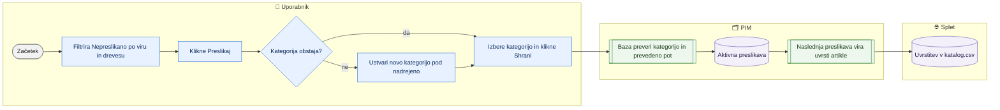

# Manjkajoče kategorije (preslikave kategorij dobaviteljev)

> **Področje:** Kakovost · **Lastnik:** urednik kataloga · **Stanje:** ✅ deluje · **Preverjeno:** 2026-09-24, iz kode

## 1. Namen

Vsaki poti kategorije, ki jo pošlje dobavitelj (vir), določi našo kategorijo v drevesu spletišča. Dokler pot nima cilja, artikel na spletu nima uvrstitve. Rezultat je aktivna preslikava, ki velja za vsa podjetja in vse artikle za to potjo.

## 2. Kdo sodeluje

| Vloga | Kaj naredi v procesu |
|---|---|
| Komerciala | Ne sodeluje. |
| Urednik kataloga | Izbere ciljno kategorijo za pot, po potrebi ustvari novo kategorijo, spremeni ali ugasne preslikavo. |
| Skrbnik | Ureja drevo kategorij in prevode poti (pogoj za shranjevanje). |
| Avtomatika (PIM) | Ob naslednji preslikavi vira artiklom za to potjo dodeli kategorijo. |

## 3. Kdaj se sproži

- **Ročno:** urednik odpre `/kakovost/kategorije` (zavihek »Nepreslikane kategorije«), npr. po novem dobaviteljevem katalogu.
- **Po urniku:** nove poti nastajajo ob zajemih dobaviteljev (`SUPPLIER_CATALOG_IMPORT`).
- **Ob dogodku:** vir pošlje pot, ki je še ni v preslikavah.

## 4. Vhod in izhod

| | Kaj | Od kod / kam |
|---|---|---|
| **Vhod** | Poti iz vira (do 3 ravni), število artiklov za potjo | PIM (`map.SourceCategory`) iz dobaviteljevih datotek |
| **Izhod** | Preslikava pot → naša kategorija (ali nova kategorija v drevesu) | PIM (preslikave kategorij, drevo) → uvrstitev na spletu |

## 5. Diagram

## 6. Koraki

| # | Kdo | Kje (stran) | Kaj narediš | Kaj se zgodi v sistemu | Kako preveriš, da je uspelo |
|---|---|---|---|---|---|
| 1 | Urednik | `/kakovost/kategorije` | Odpreš zavihek »Nepreslikane kategorije«. | Privzeto so prikazane poti v stanju »Nepreslikano«, razvrščene po številu artiklov, 50 na stran. | Števec »… poti«. |
| 2 | Urednik | `/kakovost/kategorije` | Izbereš vir, drevo, stanje (Nepreslikano, Preslikano, Ugasnjeno) ali vpišeš iskanje. | Seznam se takoj osveži. | Stolpci: Vir, Pot iz vira, Izdelkov, Stanje, Naša kategorija. |
| 3 | Urednik | `/kakovost/kategorije` | Pri vrstici klikneš »Preslikaj« (ali »Uredi«). | Naloži se drevo tega spletišča v izbirnik s tipkanjem. | Pod vrstico se odpre obrazec »Ciljna kategorija«. |
| 4 | Urednik | `/kakovost/kategorije` | Vpišeš del imena ali poti in izbereš kategorijo; neobvezno »Opomba«. | — | Izbrana pot je vidna v polju. |
| 4a | Urednik | `/kakovost/kategorije` | Če kategorije ni: v izbirniku »Ustvari novo kategorijo«, izbereš nadrejeno (prazno = koren) → »Ustvari in izberi«. | Nova kategorija nastane v drevesu; enako ime pod istim staršem je zavrnjeno že na strani. | Sporočilo »Kategorija … je ustvarjena … Shrani preslikavo.« |
| 5 | Urednik | `/kakovost/kategorije` | Klikneš »Shrani«. | Baza preveri, da kategorija obstaja in ima prevedeno pot; zapiše preslikavo z imenom uporabnika. | Sporočilo »Preslikava je zapisana. Velja za N izdelkov ob naslednji preslikavi vira.«; stanje »Preslikano«. |
| 6 | Urednik | `/kakovost/kategorije` | Za preklic pri preslikani vrstici »Uredi« → »Ugasni preslikavo«. | Vrstica ostane v stanju »Ugasnjeno« (sled odločitve). | Stanje »Ugasnjeno«. |
| 7 | Avtomatika | — | — | Naslednja preslikava vira artiklom za to potjo dodeli kategorijo. | Na kartici izdelka je kategorija; zavihek »Po kategorijah« na `/kakovost` jo šteje. |

## 7. Pravila in varovalke

- Seznam in preslikava sta **skupna vsem podjetjem**, ker je drevo dobaviteljevo.
- Baza zavrne neobstoječo kategorijo (napaka 106003) in kategorijo brez prevedene poti (106004); sporočilo baze se pokaže nespremenjeno.
- Preslikava se ne briše, samo ugasne.
- Učinek ni takojšen: velja ob naslednji preslikavi vira.

## 8. Ko gre kaj narobe

| Znak (kaj vidiš) | Verjeten vzrok | Kaj narediš |
|---|---|---|
| Napaka o kategoriji brez prevedene poti | Kategorija nima prevoda poti v jezik spletišča. | V drevesu dodaj prevod (glej [Drevo kategorij](../08-upravljanje/drevo-kategorij.md)) in shrani znova. |
| »Izberi ciljno kategorijo« | Klik »Shrani« brez izbire. | Izberi kategorijo. |
| Preslikava shranjena, artikli še brez kategorije | Vir še ni bil znova preslikan. | Počakaj na naslednji zajem ali ponovno obdelaj vir. |
| »Ustvari in izberi« je onemogočen | Pod istim staršem že obstaja enako ime. | Izberi obstoječo kategorijo. |

## 9. Tehnično ozadje

Za skrbnika in razvoj

- **Strani:** `PIM.Intranet/Components/Pages/MissingCategories.razor`
- **Storitve / delavci:** `CategoryMappingService` (`GetMappingsAsync`, `SaveMappingAsync`, `DeactivateMappingAsync`, `GetTreeNodesAsync`), `CategoryTreeService.CreateCategoryAsync`.
- **Tabele in pogledi:** `map.SourceCategory`, preslikave kategorij (migracija 109), procedura `intranet.GetCategoryMappings`.
- **Migracije:** 109 (urejanje preslikav), 178 (nova kategorija iz izbirnika).
- **Urniki:** ni lastnega.

## 10. Odprta vprašanja in razlike

- ⚠️ `CategoryMappingService` pravice ne preverja sam (nima `PimWriteGuard`); zapis varuje samo dostop do zavihka `tab.quality.categories` in pravila v bazi. Vsak prijavljen uporabnik z dostopom do zavihka lahko spremeni preslikavo, ki velja za vsa podjetja.
- ⚠️ Stran ne ponudi ponovne obdelave vira; uporabnik ne ve, kdaj bo sprememba vidna.
- ⚠️ Ime datoteke je »manjkajoče kategorije«, v meniju pa se zavihek imenuje »Nepreslikane kategorije« in naslov strani »Preslikave kategorij«.

## Povezani procesi

- [Drevo kategorij](../08-upravljanje/drevo-kategorij.md): kategorije in njihovi prevodi.
- [Kategorije izdelka](../03-izdelki/kategorije-izdelka.md): ročna uvrstitev posameznega izdelka.
- [Dobaviteljski katalogi XML](../02-vhodi/dobaviteljski-katalogi-xml.md): od kod pridejo poti.
- [Kakovost in validacija](kakovost-in-validacija.md): artikel brez kategorije na označenem spletišču ni objavljen.
