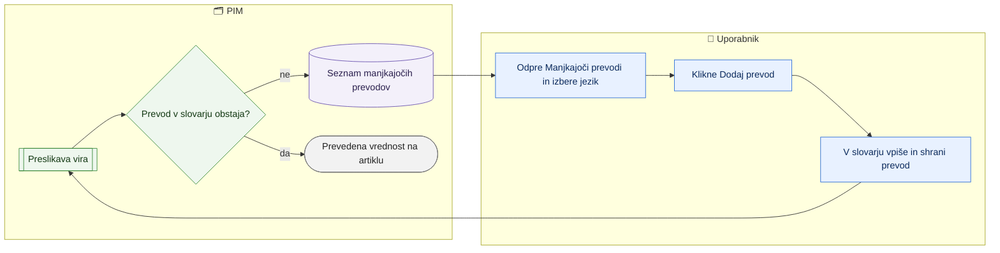

# Manjkajoči prevodi

> **Področje:** Kakovost · **Lastnik:** urednik kataloga · **Stanje:** ✅ deluje · **Preverjeno:** 2026-09-24, iz kode

## 1. Namen

Pokaže vrednosti iz virov (npr. barva, material), za katere slovar nima prevoda v posamezni jezik, in vodi urednika naravnost v slovar, kjer prevod doda. Rezultat je prevod, ki velja za vsa podjetja in se uporabi ob naslednji preslikavi.

## 2. Kdo sodeluje

| Vloga | Kaj naredi v procesu |
|---|---|
| Komerciala | Ne sodeluje. |
| Urednik kataloga | Pregleda seznam, klikne »Dodaj prevod« in v slovarju vpiše prevod. |
| Skrbnik | Po potrebi sproži ponovno obdelavo vira, da se prevod takoj uporabi. |
| Avtomatika (PIM) | Med preslikavo zabeleži vsako vrednost brez prevoda in šteje pojavitve. |

## 3. Kdaj se sproži

- **Ročno:** urednik odpre `/kakovost/prevodi`, npr. ko ima artikel prazno lastnost v angleščini.
- **Po urniku:** vrstice nastajajo med zajemi; stran nima urnika.
- **Ob dogodku:** preslikava naleti na vrednost, ki je v slovarju ni za ciljni jezik.

## 4. Vhod in izhod

| | Kaj | Od kod / kam |
|---|---|---|
| **Vhod** | Vrednosti brez prevoda z domeno, jezikom, številom pojavitev in časom zadnjega pojava | PIM (`map.MissingTranslationOpen`) |
| **Izhod** | Nov vnos v slovarju | PIM, stran `/pravila/slovar` |

## 5. Diagram

## 6. Koraki

| # | Kdo | Kje (stran) | Kaj narediš | Kaj se zgodi v sistemu | Kako preveriš, da je uspelo |
|---|---|---|---|---|---|
| 1 | Urednik | `/kakovost/prevodi` | Odpreš zavihek »Manjkajoči prevodi«. | Naloži se največ 300 vrstic, razvrščenih po številu pojavitev (najpogostejše najprej). | Tabela: Domena, Jezik, Vrednost iz vira, Pojavitev, Nazadnje. |
| 2 | Urednik | `/kakovost/prevodi` | V izbirniku izbereš jezik (ali »Vsi jeziki«). | Seznam se takoj osveži za ta jezik. | Števec »… vrstic (največ 300)«. |
| 3 | Urednik | `/kakovost/prevodi` | Pri vrstici klikneš »Dodaj prevod«. | Odpre se `/pravila/slovar` z vnaprej izpolnjeno domeno, vrednostjo in jezikom. | Na slovarju vidiš izpolnjen obrazec. |
| 4 | Urednik | `/pravila/slovar` | Vpišeš prevod in ga shraniš. | Vnos slovarja velja za vsa podjetja. | Ob naslednji preslikavi vrstica izgine s seznama. |
| 4a | Urednik | `/kakovost/prevodi`, razdelek »Kaj bi slovar prevedel« | Izbereš jezik (SL, DE, HR, IT) in pri angleški vrednosti atributa klikneš »Dodaj prevod«. | Za vsako različno angleško vrednost atributa pri izdelkih se preveri, ali ima slovar prevod (domena * ali ime atributa). Samo pregled; prevod se vpiše v slovar. Rimske številke in števila (npr. Električni razred I/II/III) niso na seznamu, ker se ne prevajajo. | Število »prevedenih / vseh« za jezik se poveča. |
| 5 | Avtomatika | — | — | Naslednji zajem ali ponovna obdelava vira uporabi nov prevod. | Na kartici izdelka je lastnost prevedena. |

## 7. Pravila in varovalke

- Slovar je **skupen vsem podjetjem**: prevod velja povsod.
- Seznam je posledica dejanskega zajema, ne domneve: vrstica nastane šele, ko preslikava vrednost res sreča.
- Stran je bralna; zapis gre prek slovarja (pravice po strani `/pravila/slovar`).
- Samodejni prevod vrednosti je pretvorba LOOKUP ob zajemu (slovar); zunanjega prevajalnika ali AI ni (privzeto za noč #15, lastnik lahko spremeni).
- Izdelek hrani vrednosti atributov samo v sl in en, katalog.csv jih izvaža kot ANG/SLO. Nemški, hrvaški in italijanski prevodi v slovarju zato (še) ne gredo na splet — odločitev lastnika.

## 8. Ko gre kaj narobe

| Znak (kaj vidiš) | Verjeten vzrok | Kaj narediš |
|---|---|---|
| Prevod je dodan, vrstica pa je še na seznamu | Preslikava vira od takrat še ni tekla. | Počakaj na naslednji zajem ali prosi skrbnika za ponovno obdelavo vira. |
| V izbirniku jezikov manjka jezik | Izbirnik pozna samo jezike z vrzelmi ob prvem nalaganju. | Osveži stran. |
| Seznam se ustavi pri 300 | Namerna meja. | Najprej reši najpogostejše vrstice ali filtriraj po jeziku. |

## 9. Tehnično ozadje

Za skrbnika in razvoj

- **Strani:** `PIM.Intranet/Components/Pages/MissingTranslations.razor`; cilj povezave `/pravila/slovar?domena=…&vrednost=…&jezik=…`.
- **Storitve / delavci:** `PipelineReadService.GetMissingTranslationsAsync` (TOP 300).
- **Tabele in pogledi:** `map.MissingTranslationOpen`.
- **Migracije:** ni posebne.
- **Urniki:** ni lastnega.

## 10. Odprta vprašanja in razlike

- ⚠️ Prevod se ne uporabi za nazaj takoj; artikli dobijo prevedeno vrednost šele ob naslednji preslikavi vira.
- ⚠️ Stran ne kaže, katerih artiklov se vrednost tiče, samo število pojavitev (razdelek »Kaj bi slovar prevedel« kaže število izdelkov).
- ❓ Odločitev lastnika (#15): ali naj katalog.csv dobi vrednosti atributov tudi v nemščini, hrvaščini in italijanščini (zdaj samo ANG/SLO).
- Samodejnih (AI) prevodov slovarja v kodi ni; AI piše samo spletni naziv in opis na kartici (glej [AI spletna besedila](ai-spletna-besedila.md)).

## Povezani procesi

- [Pravila validacije, slovar, preslikave](../08-upravljanje/pravila-validacije-slovar-preslikave.md): urejanje slovarja.
- [Jeziki, kanali, skladišča, povezave](../08-upravljanje/jeziki-kanali-skladisca-povezave.md): kateri jeziki obstajajo.
- [AI spletna besedila](ai-spletna-besedila.md): predlog spletnega naziva in opisa v drugem jeziku.
- [Kakovost in validacija](kakovost-in-validacija.md): manjkajoč prevod lahko povzroči napako spletnega profila.
