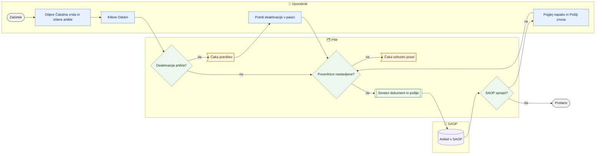

# Čakalna vrsta in pošiljanje v SAOP

> **Področje:** Izhod v SAOP · **Lastnik:** urednik kataloga · **Stanje:** ⚠️ delno · **Preverjeno:** 2026-09-24, iz kode

## 1. Namen

Na enem mestu pokaže vse spremembe za SAOP, ki še niso zaključene (en artikel = ena vrstica), in omogoča odobritev, preklic, ponovni poskus in takojšnje pošiljanje. Rezultat je artikel, poslan v SAOP, ali jasen razlog, zakaj ni bil.

## 2. Kdo sodeluje

| Vloga | Kaj naredi v procesu |
|---|---|
| Komerciala | Stran vidi; odobritev in pošiljanje sta namenjena vlogam s `SaopWrite` (⚠️ glej razdelek 10). |
| Urednik kataloga | Pregleda vrsto, odobri ali prekliče artikle (posamično ali skupinsko), potrdi deaktivacije, ponovi neuspele. |
| Skrbnik | Nastavi poverilnice SAOP (razdelek `Saop` v `appsettings.Local.json`), profil `SAOP_PRODUCT` in razpored `OUTBOUND`; odloča o vklopu odhodnega posla. |
| Avtomatika (PIM) | Ob odobritvi takoj poskusi poslati ta artikel; odhodni posel (privzeto izklopljen) bi pošiljal preostanek. |

## 3. Kdaj se sproži

- **Ročno:** urednik na `/outbound` klikne »Odobri«, »Odobri izbrane artikle« ali »Pošlji zdaj«.
- **Po urniku:** posel `SAOP_OUTBOUND_DISPATCH` (»Pošiljanje v SAOP (odhodna vrsta)«, `PIM.OutboxDispatcher`, razmik 300 s) — **privzeto izklopljen**.
- **Ob dogodku:** nova skupina iz `/saop/artikli`, kartice, uvoza, množičnega urejanja ali popravka zgodovine se pojavi v vrsti.

## 4. Vhod in izhod

| | Kaj | Od kod / kam |
|---|---|---|
| **Vhod** | Sporočila v vrsti (Čaka odobritev, V obdelavi, Napaka) | PIM (`out.OutboxMessage`) |
| **Vhod** | Poverilnice in naslov SAOP | Nastavitve strežnika, `dbo.IntegrationProfile` |
| **Izhod** | Dokument POST ali PATCH na artikel | SAOP (iCenter API) |
| **Izhod** | Stanje sporočila (Poslano, Napaka, Preklicano), odgovor SAOP, potrjene deaktivacije | PIM (`out.OutboxMessage`, `out.OutboxAttempt`, `ops.SafeguardApproval`) |

## 5. Diagram

## 6. Koraki

| # | Kdo | Kje (stran) | Kaj narediš | Kaj se zgodi v sistemu | Kako preveriš, da je uspelo |
|---|---|---|---|---|---|
| 1 | Urednik | `/outbound` | Odpreš zavihek »Čakalna vrsta« (naslov strani »Izvozi«), izbereš podjetje. | Prikažejo se samo artikli z vsaj enim nezaključenim sporočilom, 10 na stran; status artikla je »najnujnejši« status njegovih polj. | Stolpci Šifra, Operacija, Polja, Status, Zadnja sprememba, Odklon, Dejanja. |
| 2 | Urednik | `/outbound` | Filtriraš po šifri in statusu; »Poglej XML« pokaže dokument, ki bi šel v SAOP. | Predogled se sestavi iz čakajočih sprememb brez prevzema (ne porabi poskusa). | Okno s POST/PATCH, potjo in XML; opozorilo, če manjka obvezno polje. |
| 3 | Urednik | `/outbound` | Klikneš »Odobri« pri artiklu (ali označiš več, »Izberi vse filtrirane (N)« → »Odobri izbrane artikle«). | `out.ApproveItemDocument` odobri vsa čakajoča polja artikla, nato intranet **takoj** poskusi poslati prav ta artikel (`TrySendArticleAsync`, omejitev 25 s). | Sporočilo »Artikel je odobren. Poslano v SAOP: 1 od 1. NW.…: PATCH uspešno« ali »SAOP poverilnice niso nastavljene na tem strežniku — čaka na worker«. |
| 4 | Urednik | `/outbound` | Če se pojavi pasica »V SAOP N artiklov bo neaktivnih«: pregledaš seznam (Šifra, Naziv, Od kod, Pripravil) in klikneš »Da, namenoma — pošlji v SAOP« ali »Ne zdaj«. | Deaktivacija (Aktiven = Ne) se pri odobritvi preskoči (napaka 52901); potrditev jo zapiše v `ops.SafeguardApproval` in odobri. | »Potrjeno: N neaktivnih artiklov gre v SAOP.« Nato »Pošlji zdaj«. |
| 5 | Urednik | `/outbound` | Za že odobren artikel v stanju »V obdelavi« klikneš »Pošlji zdaj«. | Isti takojšnji poskus kot v koraku 3. | Artikel izgine s seznama (je v Zgodovini) ali dobi »Napaka«. |
| 6 | Urednik | `/outbound` | Pri »Napaka« klikneš »Poglej napako«, popraviš vzrok, nato »Pošlji znova«. | Neuspela sporočila se vrnejo v vrsto (`out.RequeueOutboxMessage`) z zapisom, kdo je sprožil. | Status se spremeni v »V obdelavi«; po »Pošlji zdaj« v »Poslano«. |
| 7 | Urednik | `/outbound` | Česar ne želiš poslati: »Prekliči« ali »Prekliči izbrane artikle«. | `out.CancelItemDocument` prekliče vsa nezaključena polja artikla. | »Artikel je preklican.«; v Zgodovini »Preklicano«. |
| 8 | Urednik | `/outbound` | Po naslednjem zajemu iz SAOP klikneš »Preveri potrditve SAOP«. | Sporočila v stanju Poslano se primerjajo s trenutno vrednostjo v PIM (243); preverijo se samo tista, po katerih je zajem `SAOP_PRODUCTS` že tekel. | »Preverjenih N sporočil« ali »N še čaka na vhodno sinhronizacijo«. |
| 9 | Urednik | `/saop` | Na »Pregled« po potrebi »Pošlji znova vse neuspele« za celo skupino. | `out.RequeueOutboundBatch`. | Števec »Napake« pade. |
| 10 | Avtomatika | — | — | Če je `SAOP_OUTBOUND_DISPATCH` vklopljen in je razpored `OUTBOUND` omogočen, `PIM.OutboxDispatcher` prevzema in pošilja sporočila iz vrste. | Na `/sistem/posel/SAOP_OUTBOUND_DISPATCH` uspešen tek posla. |

## 7. Pravila in varovalke

- **Nič ne gre v SAOP brez odobritve.** Odobritev je hkrati ukaz za takojšnje pošiljanje (če so poverilnice nastavljene).
- **Odobritev in preklic veljata za cel artikel**, ne za posamezno polje; SAOP dobi en dokument na artikel.
- **Deaktivacija vedno čaka izrecno potrditev** (281), tudi če bi bil profil nastavljen na samodejno odobritev; ostale spremembe iste skupine gredo normalno.
- **Pošiljanje je zaprto brez poverilnic:** brez uporabnika in gesla SAOP se ne poskusi nič, sporočilo ostane v vrsti.
- **HTTP 200 ni dokaz:** odgovor z `ResultCode=Error` se šteje kot zavrnitev; napaka se zapiše kot navodilo (npr. manjka šifrant, dobavitelj).
- **Samopopravek metode:** če SAOP javi »artikel že obstaja« ali »ne obstaja«, PIM v istem poskusu ponovi z drugo metodo.
- **Vloge:** vpis, odobritev skupine in pošiljanje zahtevajo `SaopWrite` (ADMIN, CATALOG_EDITOR); potrditev deaktivacij prav tako.

## 8. Ko gre kaj narobe

| Znak (kaj vidiš) | Verjeten vzrok | Kaj narediš |
|---|---|---|
| »SAOP poverilnice niso nastavljene na tem strežniku — čaka na worker« | Na strežniku intraneta ni razdelka `Saop` / `PIM_SAOP_*`. | Skrbnik nastavi poverilnice; do takrat artikel čaka (odhodni posel je privzeto izklopljen). |
| »SAOP se ni odzval pravočasno« | SAOP počasen (> 25 s). | Kasneje »Pošlji zdaj«. |
| »Artikel bo v SAOP neaktiven — preveri ga na seznamu spodaj« | Sprememba Aktiven = Ne čaka potrditev. | Potrdi v pasici ali prekliči artikel. |
| Status »Napaka«, `CodebookMissing` | Vrednost (tarifa, skupina, tip) ni v šifrantu SAOP. | Popravi vrednost v PIM ali šifrant v SAOP, nato »Pošlji znova«. |
| Status »Napaka«, `AuthConfig` | Napačna poverilnica ali pravica; kanal se ustavi. | Skrbnik popravi poverilnico in znova omogoči profil. |
| Artikel ostaja »Poslano«, nikoli potrjen | Potrditev se ne izvaja sama. | Po zajemu klikni »Preveri potrditve SAOP«. |
| »Dejanja trenutno ni mogoče izvesti« po odobritvi | Odobritev je lahko že uspela, pošiljanje pa ne (npr. vloga brez `SaopWrite`). | Osveži stran in preveri status; pošlje naj uporabnik z ustrezno vlogo. |

## 9. Tehnično ozadje

Za skrbnika in razvoj

- **Strani:** `PIM.Intranet/Components/Pages/Outbound.razor` (`/outbound`), `Saop.razor` (`/saop`); pasica `Components/Shared/SaopSafeguardBanner.razor` in `SaopDeactivationConfirm.razor`.
- **Storitve / delavci:** `SaopWriteService.TrySendArticleAsync` (poverilnice `ReadSaopCredentials`: `PIM_SAOP_*` ali razdelek `Saop`), `IntranetDataService` (`ApproveItemAsync`, `CancelItemAsync`, `RetryOutboundAsync`, `GetOutboundAsync`), `SafeguardService` (`GetSaopDeactivationsAsync`, `ConfirmSaopDeactivationsAsync`), `ProductWorkbookService.VerifyPendingEchoesAsync`; `PIM.Outbound` (`SaopDocumentRunner.SendOneAsync`, `SaopDocumentSender`, `SaopErrorTranslator`, `SaopResponseReader`); worker `PIM_Solution/workers/PIM.OutboxDispatcher` (pot `--saop-documents [--send] [--org N] [--max N]`, privzeto suhi tek).
- **Tabele in pogledi:** `out.OutboxMessage`, `out.OutboxAttempt`, `out.OutboundBatch`, `dbo.IntegrationProfile`, `ops.ScheduleProfile` (razpored `OUTBOUND`), `ops.SafeguardRule` (`SAOP_NEAKTIVEN`), `ops.SaopHeldDeactivation`, `ops.SafeguardApproval`; procedure `out.ApproveItemDocument`, `out.CancelItemDocument`, `out.ClaimItemDocumentByKey`, `out.CompleteItemDocument`, `out.RequeueOutboxMessage`, `out.RequeueOutboundBatch`, `out.VerifyEchoBatch`, `ops.ConfirmSaopDeactivations`, `intranet.GetOutboundMessages`.
- **Migracije:** 046 (nadomeščanje), 152 (po artiklu), 193 (pošiljanje po šifri), 195 (prevzem zastalih), 236, 243 (potrditev odmeva), 265 (cene in ceniki), 281 (deaktivacije).
- **Urniki:** `SAOP_OUTBOUND_DISPATCH`, 300 s, privzeto izklopljen, v SAOP-pasu (ne teče hkrati z drugimi klici SAOP).

## 10. Odprta vprašanja in razlike

- ⚠️ Posel `SAOP_OUTBOUND_DISPATCH` zažene `PIM.OutboxDispatcher` **brez** argumentov, torej staro pot po enem sporočilu (`out.ClaimMessage`), ne pot po dokumentu (`--saop-documents --send`), ki jo uporablja intranet. Če bi ga vklopili, ni jasno, kako bi obdelal sporočila artiklov. V praksi artikle pošilja samo intranet ob »Odobri« / »Pošlji zdaj«.
- ⚠️ `/izvozi/mnozicno` piše »Pošlje jo šele odhodni worker«, ki je izklopljen — odobrena skupina tam obstane, dokler nekdo na `/outbound` ne klikne »Pošlji zdaj«.
- ⚠️ `/outbound` je odprt tudi vlogi COMMERCIAL; odobritev, preklic in ponovni poskus gredo prek `IntranetDataService` **brez** preverjanja `SaopWrite` (preveri samo pošiljanje). Komerciala lahko odobri ali prekliče artikel, pošiljanje pa ji pade s splošno napako.
- ⚠️ Potrditev odmeva (243) je ročni gumb »Preveri potrditve SAOP«, ni povezana v redni cikel; brez klika sporočila ostanejo »Poslano«.
- ⚠️ Stran naloži vsa sporočila podjetja v zgodovini (`intranet.GetOutboundMessages` brez omejitve) in filtrira v pomnilniku; s časom bo počasna.
- ⚠️ Na seznamu so tudi cene in ceniki (265), »Pošlji zdaj« pa pošilja samo artikle (`SAOP_PRODUCT`).
- ⚠️ Naslov strani je »Izvozi«, zavihek pa »Čakalna vrsta«; drugje se imenuje »Odhodna pošta« ali »Odhodna vrsta«.
- ⚠️ Deaktivacije (281) in te datoteke prav zdaj ureja druga seja; opis velja za stanje 2026-09-24.

## Povezani procesi

- [Izhod v SAOP](izhod-v-saop.md): priprava skupine.
- [Množični izhod](mnozicni-izhod.md): drugi vir skupin.
- [Zgodovina in popravki SAOP](zgodovina-in-popravki-saop.md): kaj je bilo poslano, potrditev in popravek.
- [Varovalke](../01-nadzor/varovalke.md): potrditev deaktivacij na `/varovalke`.
- [Cene in ceniki](../07-poslovanje/cene-in-ceniki.md): cene v isti vrsti.
- [Avtomatika in urniki](../09-administracija/avtomatika-in-urniki.md): posel `SAOP_OUTBOUND_DISPATCH` in SAOP-pas.
- [Zajem iz SAOP](../02-vhodi/zajem-iz-saop.md): zajem, ki omogoči potrditev odmeva.
