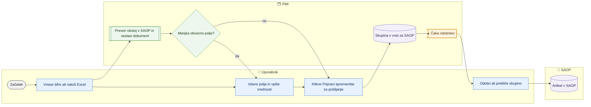

# Izhod v SAOP – priprava novih artiklov in sprememb

> **Področje:** Izhod v SAOP · **Lastnik:** urednik kataloga · **Stanje:** ⚠️ delno · **Preverjeno:** 2026-09-24, iz kode

## 1. Namen

Na enem mestu pripravi nove artikle za SAOP in spremembe obstoječih (samo polja, ki jih sme pisati PIM). Rezultat je nadzorovana skupina sprememb v čakalni vrsti za SAOP; v SAOP gre šele po odobritvi.

## 2. Kdo sodeluje

| Vloga | Kaj naredi v procesu |
|---|---|
| Komerciala | Strani `/saop/artikli` ne vidi; spremembe lahko sproži prek kartice ali uvoza, če ima pravico. |
| Urednik kataloga | Vnese šifre ali naloži Excel, izbere polja, vpiše vrednosti, odda skupino v vrsto in jo po potrebi odobri ali prekliče. |
| Skrbnik | Nastavi zapisovalno pot (profil `SAOP_PRODUCT` v `dbo.IntegrationProfile`) in lastništvo polj; odloča, katera polja sme PIM pisati. |
| Avtomatika (PIM) | Za vsak artikel ugotovi, ali ga SAOP že pozna (nov → POST, obstoječ → PATCH), sestavi dokument in pokaže manjkajoča obvezna polja. |

## 3. Kdaj se sproži

- **Ročno:** urednik na `/saop/artikli` (meni »Izhod v SAOP«, zavihek »Artikli«).
- **Po urniku:** ni; priprava je vedno ročna.
- **Ob dogodku:** enake spremembe v vrsto pošljejo tudi kartica izdelka (vir `CARD`), uvoz delovnega lista (`EXCEL`), novi artikli dobaviteljev (`XML`), popravek iz zgodovine in množično urejanje (`BULK`) — vse končajo na isti čakalni vrsti.

## 4. Vhod in izhod

| | Kaj | Od kod / kam |
|---|---|---|
| **Vhod** | Šifre artiklov (ročno ali Excel predloga) in nove vrednosti polj | Uporabnik / Excel |
| **Vhod** | Trenutne vrednosti artikla, ali ga SAOP pozna, privzetki za nov artikel, pogodba polj | PIM |
| **Izhod** | Sporočila v odhodni vrsti (eno na polje) v skupini, stanje »Čaka odobritev« | PIM (`out.OutboxMessage`, `out.OutboundBatch`) |
| **Izhod** | Po odobritvi: dokument POST ali PATCH v SAOP | SAOP (glej [Čakalna vrsta in pošiljanje](cakalna-vrsta-in-posiljanje-saop.md)) |

## 5. Diagram

## 6. Koraki

| # | Kdo | Kje (stran) | Kaj narediš | Kaj se zgodi v sistemu | Kako preveriš, da je uspelo |
|---|---|---|---|---|---|
| 1 | Urednik | `/saop/artikli` | Odpreš »Izhod v SAOP« (zavihek »Artikli«) in izbereš podjetje. | Naloži se pogodba dokumenta in stanje povezave. Menjava podjetja počisti tabelo. | Čip »SAOP: Povezava je pripravljena«; če ni, rumeno opozorilo (pripraviš lahko, oddati ne). |
| 2a | Urednik | `/saop/artikli` | Za nekaj artiklov: prilepiš šifre v »Šifre artiklov« → »Preveri in dodaj artikle«. | Za vsako šifro se prebere stanje v PIM in ali ga SAOP pozna; največ 300 vrstic. | Povzetek »N artiklov v pripravi«, čipa »Novih (POST)« in »Sprememb (PATCH)«. |
| 2b | Urednik | `/saop/artikli` | Za več artiklov: »Prenesi predlogo (XLSX)«, izpolniš, izbereš datoteko (do 8 MB). | Zvezek se prebere, stolpci se preslikajo na pisljiva polja; neznani stolpci so navedeni kot prezrti. Uvoz sam ne pošlje ničesar. | Sporočilo »Prebranih N vrstic, prevzetih M vrednosti«. |
| 3 | Urednik | `/saop/artikli` | V koraku 2 klikaš polja (čipi), ki jih želiš spreminjati; »Ponastavi priporočeni izbor« vrne obvezna polja za nov artikel + naziv in EAN. | Izbrana polja postanejo stolpci tabele. Polja z oznako »upravlja SAOP« so zaklenjena. | »Izbranih polj: N«. |
| 4 | Urednik | `/saop/artikli` | V koraku 3 vpišeš vrednosti; z vrstico »Velja za vse« in gumbom »↓« vpišeš isto vrednost v vse vrstice. | Po vsakem vnosu se dokument sestavi znova; stolpec »Dokument« kaže »N polj«, »manjka N«, »nič za poslati« ali »napaka«. »Tehnični predogled XML« pokaže dokument. | Povzetek »Pripravljenih / Za dopolniti / Sprememb« v koraku 4. |
| 5 | Urednik | `/saop/artikli` | Klikneš »Pripravi N sprememb za pošiljanje«. | Samo pripravljene vrstice in samo neprazne vrednosti gredo v `out.EnqueueSaopItemChanges`; nastane skupina. Gumb **še ne pošlje v SAOP**. | »Priprava je zabeležena v skupini N. Uvrščenih · že v vrsti · zavrnjenih«; zavrnjene vrstice z razlogom v tabeli. |
| 6 | Urednik | `/saop/artikli` | Če povezava zahteva odobritev: »Odobri skupino N« ali »Prekliči skupino«. | Odobritev preda sporočila v stanje za pošiljanje; deaktivacije (Aktiven = Ne) ostanejo zadržane in se pokažejo v pasici za potrditev. | »Odobrenih sporočil: N«; povezava »Odpri čakalno vrsto«. |
| 7 | Urednik | `/outbound` | Nadaljuješ na čakalni vrsti. | Glej [Čakalna vrsta in pošiljanje](cakalna-vrsta-in-posiljanje-saop.md). | — |
| 8 | Urednik | `/saop` | Za pregled klikneš zavihek »Pregled«. | Števci po entitetah (Artikli, Cene, Ceniki, Stranke, Dokumenti): Čaka, V vrsti, Poslano, Potrjeno, Napake; tabeli neuspelih sporočil in skupin z gumboma »Pošlji znova« in »Pošlji znova vse neuspele«. | Števec »Napake« je 0. |
| 9 | Kdorkoli | `/saop/polja` | Pregledaš, katera polja sme PIM pisati. | Samo bralni seznam: polje, XML element, sekcija, oblika, obvezno ob dodajanju. | — |

## 7. Pravila in varovalke

- **V SAOP se nič ne pošlje samodejno.** Priprava ustvari samo skupino v vrsti; pošiljanje sledi odobritvi.
- **Prazna celica pomeni »ne spreminjaj«** — obstoječi podatki v SAOP se ne izbrišejo. Prazne vrednosti se na tej strani ne uvrstijo.
- **Metode POST/PATCH ne izbira uporabnik**; določi jo PIM glede na to, ali SAOP artikel pozna (`ErpExistence`). Ob napačni izbiri se pošiljatelj sam popravi.
- **Nov artikel brez obveznih polj ne odide** (»Za nov artikel manjka …«), da ga SAOP ne zavrne z 409.
- **Samo polja v lasti PIM** so pisljiva; ostala (»upravlja SAOP«) se popravijo v SAOP.
- **Zadnja sprememba zmaga:** starejša neposlana sprememba istega polja postane »Nadomeščeno«.
- **PIM ima vrednost takoj:** kartica in uvoz polje zapišeta v PIM takoj; zajem iz SAOP polja z neposlano spremembo ne povozi (273).
- **Deaktivacija čaka potrditev** (281): sprememba »Aktiven = Ne« se ob odobritvi preskoči, dokler je nekdo izrecno ne potrdi.
- **Blokirajoče napake validacije ne ustavijo vpisa** (236); zavora je samo validacija SAOP ob prejemu.
- **Vloge:** `/saop/artikli`, `/saop`, `/saop/zgodovina` samo ADMIN in CATALOG_EDITOR; vpis v vrsto, odobritev in preklic zahtevajo `SaopWrite`.

## 8. Ko gre kaj narobe

| Znak (kaj vidiš) | Verjeten vzrok | Kaj narediš |
|---|---|---|
| »Povezava za artikle ni nastavljena / je izklopljena« | Profil `SAOP_PRODUCT` manjka ali je izklopljen (napaka 51001). | Skrbnik vklopi profil za to podjetje. |
| Stolpec »Dokument«: »manjka N« | Nov artikel brez obveznega polja. | Dodaj polje med stolpce in vpiši vrednost; vrstica brez tega ne gre v vrsto. |
| »nič za poslati« | Vrednosti niso vpisane ali so enake. | Vpiši novo vrednost ali odstrani vrstico (»×«). |
| Zavrnjena vrstica z razlogom | Polje ni pisljivo, vrednost ni »da/ne« ali ni število, predolga vrednost, artikla ni v podjetju. | Popravi vrednost ali artikel po razlogu. |
| »Izpuščenih N šifer« | Več kot 300 vrstic. | Razdeli na več delov ali uporabi uvoz delovnega lista. |
| Artikel po odobritvi še »Čaka odobritev« | Deaktivacija čaka potrditev (281). | Potrdi v pasici »V SAOP … neaktiven« ali na `/varovalke`. |

## 9. Tehnično ozadje

Za skrbnika in razvoj

- **Strani:** `PIM.Intranet/Components/Pages/SaopItems.razor` (`/saop/artikli`), `Saop.razor` (`/saop`), `SaopFields.razor` (`/saop/polja`); zavihki `SaopTabs` v `Components/Shared/PimTab.cs`; izbrano podjetje se deli med stranmi prek `SaopOrganizationContext`.
- **Storitve / delavci:** `SaopItemWriteService` (pogodba, stanje artikla, `BuildPlan`, `PreviewQueuedAsync`, `MaxRows = 300`), `SaopWriteService` (`EnqueueAsync` → `out.EnqueueSaopItemChanges`, `ApproveBatchAsync`, `CancelBatchAsync`, `PreviewWorkbook`); knjižnica `PIM.Outbound` (`SaopItemPlanner`, `SaopDocumentBuilder`, `SaopIntentResolver`); predloga `izvoz/izdelki.xlsx?predloga=saop`.
- **Tabele in pogledi:** `out.OutboxMessage`, `out.OutboundBatch`, `out.SaopXmlField`, `out.SaopAddDefault`, `out.OwnershipPolicy`, `dbo.IntegrationProfile`, `canon.Product.ErpExistence`; procedure `out.GetSaopXmlContract`, `out.GetSaopItemWriteState`, `intranet.GetWritableSaopFields`, `out.ApproveOutboundBatch`, `out.CancelOutboundBatch`, `intranet.GetOutboundBatches`.
- **Migracije:** 089 (množične spremembe, prekrivka), 152 (odobritev po artiklu), 169 (obstoj v SAOP), 193 (pošiljanje po šifri), 236 (umik ERP varovalke), 245 (ERP v PIM takoj), 273 (neposlana sprememba ima prednost), 281 (deaktivacije).
- **Urniki:** ni.

## 10. Odprta vprašanja in razlike

- ⚠️ `/saop/polja` vedno kaže samo privzeto (prvo) podjetje; izbirnika ni. Zavihka za to stran v meniju SAOP ni.
- ⚠️ Pregled `/saop` šteje entitete po imenu (»Cene«, »Stranke« …) in za entitete brez zapisov piše »pot nazaj še ne obstaja«, kar za cene ne drži več (265).
- ⚠️ Po odobritvi na tej strani se artikel **ne** poskusi poslati takoj (za razliko od gumba »Odobri« na `/outbound`); pošlje ga šele »Pošlji zdaj« na `/outbound` ali odhodni posel, ki je privzeto izklopljen.
- ⚠️ Področje deaktivacij (281: `SaopItems.razor`, `SaopSafeguardBanner`, `SaopDeactivationConfirm`, `SafeguardService`) prav zdaj ureja druga seja; opis velja za stanje datotek 2026-09-24.
- ⚠️ Ročni zadržek za kanal ERP (`/kakovost/artikli`) na to pot ne vpliva.

## Povezani procesi

- [Čakalna vrsta in pošiljanje v SAOP](cakalna-vrsta-in-posiljanje-saop.md): odobritev in dejansko pošiljanje.
- [Množični izhod](mnozicni-izhod.md): ena vrednost za veliko artiklov.
- [Zgodovina in popravki SAOP](zgodovina-in-popravki-saop.md): kaj je bilo poslano in popravek.
- [Iskanje in kartica izdelka](../03-izdelki/iskanje-in-kartica-izdelka.md) in [Uvoz delovnega lista](../03-izdelki/uvoz-delovnega-lista.md): drugi viri sprememb za SAOP.
- [Novi artikli dobaviteljev](../02-vhodi/novi-artikli-dobaviteljev.md): kandidati iz XML v vrsto za SAOP.
- [Varovalke](../01-nadzor/varovalke.md): potrditev deaktivacij.
- [Zajem iz SAOP](../02-vhodi/zajem-iz-saop.md): potrditev, da je SAOP spremembo prevzel.
