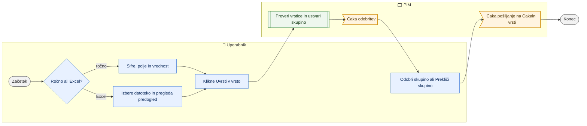

# Množični izhod v SAOP (množično urejanje)

> **Področje:** Izhod v SAOP · **Lastnik:** urednik kataloga · **Stanje:** ⚠️ delno · **Preverjeno:** 2026-09-24, iz kode

## 1. Namen

Hitro nastavi isto vrednost enega polja za veliko artiklov ali uvozi Excel z več polji in vse uvrsti v vrsto za SAOP. Rezultat je skupina sporočil, ki jo uporabnik odobri ali prekliče.

## 2. Kdo sodeluje

| Vloga | Kaj naredi v procesu |
|---|---|
| Komerciala | Stran vidi, vpis v vrsto pa zahteva `SaopWrite`, zato ji ne uspe (⚠️). |
| Urednik kataloga | Vpiše šifre, izbere polje in vrednost ali naloži Excel; skupino odobri ali prekliče. |
| Skrbnik | Določa, katera polja so pisljiva. |
| Avtomatika (PIM) | Preveri vsako vrstico (lastništvo polja, oblika vrednosti, podvojitve) in zapiše izid. |

## 3. Kdaj se sproži

- **Ročno:** urednik odpre `/izvozi/mnozicno` neposredno ali s seznama izdelkov (šifre in podjetje pridejo v naslovu `?items=…&podjetje=…`); povezava je tudi na strani uvoza izdelkov in na `/varovalke`.
- **Po urniku:** ni.
- **Ob dogodku:** ni.

## 4. Vhod in izhod

| | Kaj | Od kod / kam |
|---|---|---|
| **Vhod** | Šifre artiklov + eno polje + nova vrednost | Uporabnik |
| **Vhod** | Excel: prvi stolpec »Šifra artikla« ali `ItemID`, ostali stolpci imena polj | Uporabnik |
| **Izhod** | Skupina sporočil v vrsti, stanje »Čaka odobritev« | PIM (`out.OutboxMessage`) |

## 5. Diagram

## 6. Koraki

| # | Kdo | Kje (stran) | Kaj narediš | Kaj se zgodi v sistemu | Kako preveriš, da je uspelo |
|---|---|---|---|---|---|
| 1 | Urednik | `/izvozi/mnozicno` | Odpreš stran (npr. z izbranimi izdelki s seznama izdelkov). | Naloži se seznam pisljivih polj za podjetje; šifre iz naslova se vpišejo v polje. | V glavi »… podjetja NAZIV«. |
| 2a | Urednik | `/izvozi/mnozicno` | Razdelek 1: v »Šifre artiklov« vpišeš šifre, izbereš »Polje«, vpišeš »Nova vrednost« (za da/ne: da ali ne) → »Uvrsti v vrsto (N artiklov)«. | `out.EnqueueSaopItemChanges` z virom `BULK`. | Razdelek »3. Izid«: skupina, uvrščenih, že v vrsti, zavrnjenih. |
| 2b | Urednik | `/izvozi/mnozicno` | Razdelek 2: izbereš `.xlsx` (do 8 MB), pregledaš predogled prvih 20 vrstic in opozorila → »Uvrsti N sprememb v vrsto«. | Zvezek se preslika na pisljiva polja; prazna celica pomeni »ne spreminjaj«; vir `EXCEL`. | Isti izid; stolpci brez polja so navedeni kot neuvoženi. |
| 3 | Urednik | `/izvozi/mnozicno` | »Odobri skupino« ali »Prekliči skupino«. | `out.ApproveOutboundBatch` / `out.CancelOutboundBatch`; deaktivacije ostanejo zadržane in se pokažejo v pasici. | »Odobrenih sporočil: N« ali »Preklicanih sporočil: N«. |
| 4 | Urednik | `/izvozi/mnozicno` | Če se pokaže pasica »V SAOP N artiklov bo neaktivnih«, pregledaš seznam in potrdiš ali »Ne zdaj«. | Glej [Čakalna vrsta in pošiljanje](cakalna-vrsta-in-posiljanje-saop.md). | — |
| 5 | Urednik | `/outbound` | Odobrene artikle pošlješ z »Pošlji zdaj«. | Odobritev na tej strani **ne** pošlje takoj. | Artikli preidejo v Zgodovino kot »Poslano«. |

## 7. Pravila in varovalke

- Na voljo so samo polja, ki jih sme PIM pisati; ostala so last SAOP.
- Nič ne odide, dokler skupine ne odobriš; tudi po odobritvi je treba poslati (glej razdelek 10).
- Zadnja sprememba istega polja zmaga; starejša neposlana postane »Nadomeščeno«.
- Deaktivacije (Aktiven = Ne) čakajo izrecno potrditev (281).
- Stran **ne** zapiše vrednosti v PIM (za razliko od kartice in uvoza delovnega lista); ⚠️ glej razdelek 10.

## 8. Ko gre kaj narobe

| Znak (kaj vidiš) | Verjeten vzrok | Kaj narediš |
|---|---|---|
| »Sprememb trenutno ni mogoče uvrstiti v vrsto« | Vloga brez `SaopWrite` ali povezava ni omogočena. | Prijavi se z vlogo urednika; skrbnik preveri profil `SAOP_PRODUCT`. |
| Zavrnjene vrstice | Artikel ne obstaja v podjetju, polje ni pisljivo, napačna oblika vrednosti. | Popravi po stolpcu »Razlog«. |
| »Stolpci brez ustreznega polja« | Ime stolpca v Excelu ne ustreza polju. | Uporabi imena iz seznama polj (XML element ali slovenski naslov). |
| Po odobritvi se v SAOP nič ne zgodi | Odhodni posel je izklopljen. | Na `/outbound` klikni »Pošlji zdaj«. |

## 9. Tehnično ozadje

Za skrbnika in razvoj

- **Strani:** `PIM.Intranet/Components/Pages/BulkOutbound.razor`; parametra naslova `items`, `podjetje`.
- **Storitve / delavci:** `SaopWriteService` (`GetWritableFieldsAsync`, `PreviewWorkbook`, `EnqueueAsync`, `ApproveBatchAsync`, `CancelBatchAsync`), `PIM.Operations/WorkbookChangeMapper.cs`.
- **Tabele in pogledi:** `out.OutboxMessage`, `out.OutboundBatch`, `intranet.GetWritableSaopFields`, `out.EnqueueSaopItemChanges`.
- **Migracije:** 089, 152, 245, 281.
- **Urniki:** ni.

## 10. Odprta vprašanja in razlike

- ⚠️ Besedilo »Odobritev skupino samo uvrsti v vrsto. Pošlje jo šele odhodni worker.« — odhodni posel je privzeto izklopljen, zato odobrena skupina obvisi, dokler je nekdo ne pošlje na `/outbound`.
- ⚠️ Ročni vnos s prazno »Nova vrednost« uvrsti prazno vrednost (storitev: »prazna vrednost pomeni izpraznitev polja«); to je v nasprotju s pravilom »SAOP ne dobi praznih vrednosti« in s predlogo, kjer prazno pomeni »ne spreminjaj«. Ali baza prazno zavrne, iz kode ni jasno.
- ⚠️ Spremembe se ne zapišejo v PIM takoj (kartica, uvoz in popravek iz zgodovine jih zapišejo); PIM do zajema kaže staro vrednost.
- ⚠️ Stran nima izbirnika podjetja; brez `?podjetje=` dela s privzetim (prvim) podjetjem.
- ⚠️ V glavi in meniju se stran imenuje »Množično urejanje«, v registru dostopov »Množični izhod« (področje splet).
- ⚠️ Stran je odprta vlogi COMMERCIAL, vpis pa ji ne uspe.

## Povezani procesi

- [Izhod v SAOP](izhod-v-saop.md): bogatejša priprava z več polji in predogledom dokumenta.
- [Čakalna vrsta in pošiljanje v SAOP](cakalna-vrsta-in-posiljanje-saop.md): pošiljanje odobrene skupine.
- [Uvoz delovnega lista](../03-izdelki/uvoz-delovnega-lista.md): uvoz, ki vrednosti zapiše v PIM in v vrsto.
- [Iskanje in kartica izdelka](../03-izdelki/iskanje-in-kartica-izdelka.md): izbor izdelkov za množično urejanje.
- [Varovalke](../01-nadzor/varovalke.md): potrditev deaktivacij.
