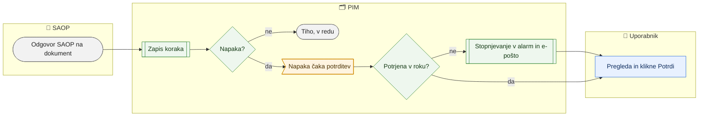

# Obvestila odhodne poti v SAOP (potrjevanje napak in stopnjevanje)

> **Področje:** Izhod na splet (vsebinsko Izhod v SAOP) · **Lastnik:** urednik kataloga · **Stanje:** ⚠️ delno · **Preverjeno:** 2026-09-24, iz kode

## 1. Namen

Vsaka sprememba, ki gre iz PIM v SAOP, pusti sled po korakih (uvrščeno, odobreno, poslano, potrjeno, zavrnjeno …). Uspeh je tih; napaka se pokaže na `/izvozi/obvestila` in mora jo nekdo potrditi, sicer se po preteku roka pošlje po e-pošti.

## 2. Kdo sodeluje

| Vloga | Kaj naredi v procesu |
|---|---|
| Komerciala | Pregleda obvestila in potrdi napako, ko jo je obravnaval. |
| Urednik kataloga | Enako; napako odpravi na kartici artikla ali v odhodni vrsti. |
| Skrbnik | Enako; poskrbi, da imajo uporabniki e-poštni naslov in da je dostava alarmov vklopljena. |
| Avtomatika (PIM) | Zapiše obvestilo ob vsakem koraku odhodnega dokumenta; nepotrjene napake stopnjuje v alarm in e-pošto. |

## 3. Kdaj se sproži

- **Ročno:** uporabnik odpre `/izvozi/obvestila` (vloge ADMIN, CATALOG_EDITOR, COMMERCIAL).
- **Po urniku:** `ALERT_DELIVERY` (`PIM.AlertDispatcher`, vsakih 300 s) stopnjuje nepotrjene napake in pošlje e-pošto, če je dostava vklopljena.
- **Ob dogodku:** zaključek odhodnega dokumenta v SAOP (poslano, zavrnjeno, odklon, samopopravek).

## 4. Vhod in izhod

| | Kaj | Od kod / kam |
|---|---|---|
| **Vhod** | Koraki odhodnih dokumentov (artikel, polje, izid) | PIM (odhodna vrsta) |
| **Izhod** | Potrjeno obvestilo (kdo, kdaj) | PIM |
| **Izhod** | Alarm in e-pošta za nepotrjene napake | Obvestila |

## 5. Diagram

## 6. Koraki

| # | Kdo | Kje (stran) | Kaj narediš | Kaj se zgodi v sistemu | Kako preveriš, da je uspelo |
|---|---|---|---|---|---|
| 1 | Avtomatika | — | — | Ob vsakem koraku odhodnega dokumenta nastane obvestilo z resnostjo V redu, Opozorilo ali Napaka. | — |
| 2 | Urednik / komerciala | `/izvozi/obvestila` | Pogledaš kartice »Nepotrjene napake«, »Opozorila«, »Stopnjevanih«, »Tihih (24 h)«. Privzeto je obkljukano »Pokaži samo nepotrjena«. | Tabela: kdaj, resnost, korak, artikel in polje, kaj se je zgodilo, kaj naredi. | Števci na karticah. |
| 3 | Urednik | Kartica artikla ali `/outbound` | Odpraviš vzrok po navodilu v stolpcu »Kaj naredi«. | — | — |
| 4 | Urednik / komerciala | `/izvozi/obvestila` | Pri vrstici klikneš **Potrdi**. | Obvestilo je potrjeno s tvojim imenom; opozorilo se ne ponavlja več. | Sporočilo »Obvestilo je potrjeno …«; v stolpcu Dejanje tvoje ime. |
| 5 | Avtomatika | — | — | Napaka, ki ni potrjena v dogovorjenem času, postane alarm in gre po e-pošti. | Rdeče sporočilo »N obvestil ni bilo potrjenih …«. |

## 7. Pravila in varovalke

- Uspešne spremembe so tihe (resnost »V redu«, brez gumba).
- Stopnjevanje se ponavlja, dokler obvestilo ni potrjeno.
- E-pošta gre samo uporabnikom z vpisanim naslovom in samo, če je dostava alarmov vklopljena.
- Potrditev ne popravi vzroka — samo utiša opozorilo.

## 8. Ko gre kaj narobe

| Znak (kaj vidiš) | Verjeten vzrok | Kaj narediš |
|---|---|---|
| »Obvestil trenutno ni mogoče naložiti.« | Povezava z bazo | Osveži; skrbnik preveri bazo. |
| Napaka se ponavlja po e-pošti | Obvestilo ni potrjeno | Potrdi ga po pregledu. |
| Ni e-pošte kljub stopnjevanju | Uporabnik brez naslova ali dostava izklopljena | Skrbnik: `/uporabniki`, nastavitev dostave. |

## 9. Tehnično ozadje

Za skrbnika in razvoj

- **Strani:** `PIM.Intranet/Components/Pages/OutboundEvents.razor`
- **Storitve / delavci:** `SaopWriteService.GetEventsAsync`, `GetEventCountsAsync`, `AcknowledgeAsync`; `PIM.AlertDispatcher` (`ops.EscalateOutboundEvents`).
- **Tabele in pogledi:** `ops.OutboundEvent`, `ops.Alert`, `ops.AlertDelivery`, `sec.LocalUser.Email`, `intranet.AcknowledgeOutboundEvent`.
- **Migracije:** 090, 196, 209.
- **Urniki:** `ALERT_DELIVERY` (300 s), `SAOP_OUTBOUND_DISPATCH` (privzeto izklopljen).

## 10. Odprta vprašanja in razlike

- ⚠️ Stran je v meniju pod »Izhod na splet« (dovoljenje `view.web.events`, opis »Napake in dogodki spletnega izvoza«), vsebina pa so samo dogodki poti v **SAOP**. O spletnem izvozu (`katalog.csv`) tu ni ničesar. Predlog: premakniti v področje 05-izhod-saop.
- ⚠️ Stran kaže samo trenutno izbrano organizacijo.
- ⚠️ Stopnjevanje po e-pošti je odvisno od stikala dostave (`PIM_ALERT_DELIVERY_ENABLED`); ali je vklopljeno, iz kode ni razvidno.

## Povezani procesi

- [Izhod v SAOP](../05-izhod-saop/izhod-v-saop.md): odhodna vrsta, iz katere nastajajo obvestila.
- [Zgodovina in popravki SAOP](../05-izhod-saop/zgodovina-in-popravki-saop.md).
- [Uporabniki in vloge](../09-administracija/uporabniki-in-vloge.md): e-poštni naslovi.
- [Nadzor sistema](../09-administracija/nadzor-sistema.md): alarmi in dostava.
