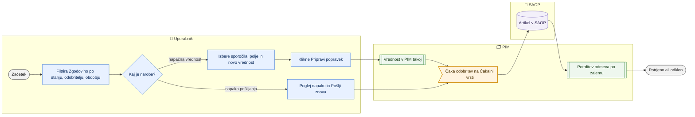

# Zgodovina, potrditve in popravki poslanega v SAOP

> **Področje:** Izhod v SAOP · **Lastnik:** urednik kataloga · **Stanje:** ⚠️ delno · **Preverjeno:** 2026-09-24, iz kode

## 1. Namen

Pokaže, kaj je bilo kdaj pripravljeno, odobreno in poslano v SAOP, kaj je SAOP odgovoril in ali je vrednost potrjena. Iz izbranih poslanih sprememb omogoča popravek (novo polje in vrednost), ki velja v PIM takoj, v SAOP pa po odobritvi.

## 2. Kdo sodeluje

| Vloga | Kaj naredi v procesu |
|---|---|
| Komerciala | Strani `/saop/zgodovina` ne vidi; `/saop/odkloni` lahko odpre. |
| Urednik kataloga | Išče po zgodovini, pregleda napake, ponovno pošlje neuspelo, pripravi popravek poslanih vrednosti. |
| Skrbnik | Pregleda odgovore SAOP in odklone pri težavah. |
| Avtomatika (PIM) | Zajem iz SAOP prinese vrednost, s katero se poslano sporočilo potrdi ali označi kot odklon. |

## 3. Kdaj se sproži

- **Ročno:** urednik odpre `/saop/zgodovina` (zavihek »Zgodovina« ali »Zgodovina pošiljanja« na `/saop/artikli`).
- **Po urniku:** zajem `SAOP_PRODUCT_IMPORT` (urni) prinese vrednosti iz SAOP, potrebne za potrditev.
- **Ob dogodku:** napaka v SAOP ali ugotovitev, da je bila poslana napačna vrednost (npr. artikli poslani kot neaktivni).

## 4. Vhod in izhod

| | Kaj | Od kod / kam |
|---|---|---|
| **Vhod** | Vsa sporočila podjetja z vrednostjo, odobriteljem, časom pošiljanja, odgovorom in napako | PIM (`out.OutboxMessage`) |
| **Vhod** | Vrednost iz zadnjega zajema SAOP | SAOP prek zajema |
| **Izhod** | Popravek: nova sprememba v vrsti (čaka odobritev) in takojšen zapis v PIM | PIM (`out.OutboxMessage`, `canon`) |
| **Izhod** | Ponovni poskus neuspelega sporočila | PIM (vrsta) |

## 5. Diagram

## 6. Koraki

| # | Kdo | Kje (stran) | Kaj narediš | Kaj se zgodi v sistemu | Kako preveriš, da je uspelo |
|---|---|---|---|---|---|
| 1 | Urednik | `/saop/zgodovina` | Izbereš podjetje, entiteto, stanje, odobritelja, obdobje (privzeto zadnjih 30 dni) in vpišeš iskanje (ključ, polje, cilj, vrednost). | Seznam vseh operacij, 10 na stran, najnovejše najprej. | Števec »N operacij«; stolpci Čas, Entiteta / ključ, Operacija, Polja, Vrednost, Odobril, Poslano, Odgovor ERP, Potrjeno, Rezultat. |
| 2 | Urednik | `/saop/zgodovina` | Pri »Napaka« klikneš »Poglej napako«, nato »Pošlji znova«. | `out.RequeueOutboxMessage` vrne sporočilo v vrsto. | »Znova poslanih v čakalno vrsto: 1«; nato na `/outbound` »Pošlji zdaj«. |
| 3 | Urednik | `/saop/zgodovina` | Za popravek označiš sporočila artiklov (ali »Izberi vse filtrirane (N)«). | Če so izbrana sporočila istega polja, se polje izbere samo. | Orodna vrstica »Izbranih sporočil: N (artiklov: M)«. |
| 4 | Urednik | `/saop/zgodovina` | Izbereš polje in novo vrednost (za da/ne izbirnik Da/Ne) → »Pripravi popravek (čaka odobritev)«. | Za vsak izbran artikel nova sprememba v vrsto (vir `BULK`), sprejete se takoj zapišejo v PIM (`SaveErpFieldsBulkAsync`); starejša neposlana sprememba istega polja postane »Nadomeščeno«. | »Pripravljen popravek za N artiklov (skupina M) — v PIM velja takoj, v SAOP gre šele, ko ga odobriš na Čakalni vrsti.« |
| 5 | Urednik | `/outbound` | Odobriš popravek (glej [Čakalna vrsta in pošiljanje](cakalna-vrsta-in-posiljanje-saop.md)). | Pošiljanje v SAOP. | V Zgodovini nova vrstica »Poslano«. |
| 6 | Avtomatika + urednik | `/outbound` | Po naslednjem zajemu klikneš »Preveri potrditve SAOP«. | Poslana vrednost se primerja z vrednostjo iz zajema: ujemanje → potrjeno, razlika → odklon. | Stolpec »Potrjeno: Da« v Zgodovini; odklon je označen na `/outbound` in na `/saop/odkloni`. |
| 7 | Urednik | `/saop/odkloni` | Pregledaš odklone (samo sporočila z zapisanim odklonom) in po potrebi »Pošlji znova«. | Sporočilo se pripravi za ponovni poskus. | »Operacija je pripravljena za ponovni poskus.« |

## 7. Pravila in varovalke

- **Popravek ne gre v SAOP sam:** vedno čaka odobritev na Čakalni vrsti.
- **PIM ima popravljeno vrednost takoj**; zajem iz SAOP je ne povozi, dokler sprememba ni poslana (273).
- **Poslana vrednost ni zaščitena:** po pošiljanju zajem prinese, kar ima SAOP, da je mogoče ločiti potrditev od odklona.
- Popravek je mogoč samo za sporočila artiklov (`SAOP_PRODUCT`, entiteta `Product`) in samo za pisljiva polja.
- Deaktivacija v popravku čaka izrecno potrditev (281).
- Stanja so poenostavljena: »Čaka odobritev«, »V obdelavi«, »Poslano« (tudi potrjeno), »Napaka« (tudi odklon), »Preklicano«, »Nadomeščeno«.
- **Vloge:** `/saop/zgodovina` ADMIN in CATALOG_EDITOR; popravek zahteva `SaopWrite`.

## 8. Ko gre kaj narobe

| Znak (kaj vidiš) | Verjeten vzrok | Kaj narediš |
|---|---|---|
| »Potrjeno« je ves čas »—« | Potrditev se izvede samo z gumbom »Preveri potrditve SAOP« po zajemu. | Klikni gumb na `/outbound` po naslednjem zajemu. |
| »Ni zapisano v PIM: izdelek …« | Artikel ne obstaja v PIM ali polje nima mesta v katalogu. | Preveri artikel; sprememba za SAOP je vseeno v vrsti. |
| »Zavrnjeno: …« pri popravku | Napačna oblika vrednosti ali nepisljivo polje. | Popravi vrednost. |
| Starejše operacije manjkajo | Filter »Obdobje« je privzeto 30 dni. | Izberi »Vse obdobje«. |
| Odklon pri pravilni vrednosti | Preverjeno pred zajemom (starejša različica) ali SAOP je vrednost preoblikoval. | Pošlji znova; skrbnik preveri primerjavo. |

## 9. Tehnično ozadje

Za skrbnika in razvoj

- **Strani:** `PIM.Intranet/Components/Pages/SaopHistory.razor` (`/saop/zgodovina`, parameter `?stanje=`), `SaopDrifts.razor` (`/saop/odkloni`).
- **Storitve / delavci:** `SaopWriteService` (`EnqueueAsync`, `RequeueMessageAsync`, `ResolveProductIdsAsync`, `GetWritableFieldsAsync`), `ProductEditService.SaveErpFieldsBulkAsync`, `ProductWorkbookService.VerifyPendingEchoesAsync` (`out.VerifyEchoBatch`), `IntranetDataService.RetryOutboundAsync`; `PIM.Outbound/EchoVerifier.cs`.
- **Tabele in pogledi:** `out.OutboxMessage` (`DriftDetail`, `ResponseStatusCode`, `ResponseCorrelationId`, `LastError`, `PayloadJson`), `out.OutboxAttempt`; procedure `intranet.GetOutboundMessages` (273: vrne tudi poslano vrednost), `intranet.GetOutboundMessage` (obstaja, ni vezana na stran).
- **Migracije:** 021, 046 (nadomeščanje), 243 (potrditev odmeva), 245, 273.
- **Urniki:** `SAOP_PRODUCT_IMPORT` (urni zajem, pogoj za potrditev).

## 10. Odprta vprašanja in razlike

- ⚠️ `/saop/odkloni` nima zavihka v meniju SAOP, vedno kaže samo privzeto (prvo) podjetje in je v kodi označena kot nedokončana (»strukturiran posnetek poslanih vrednosti … manjka«); stolpca »Kaj je ERP vrnil« in »Razlika« ne kažeta prave primerjave (prazen oz. isti povzetek dvakrat).
- ⚠️ Staro/novo vrednost ob spremembi in poskusi po posameznem pošiljanju (`out.OutboxAttempt`) na strani še niso prikazani.
- ⚠️ Potrditev odmeva ni samodejna; brez klika »Preveri potrditve SAOP« zgodovina ne pokaže »Potrjeno«.
- ⚠️ Stran naloži celotno zgodovino podjetja v pomnilnik; s časom bo počasna.
- ⚠️ `/saop/odkloni` je odprt vlogi COMMERCIAL in »Pošlji znova« tam ne preverja `SaopWrite`.

## Povezani procesi

- [Čakalna vrsta in pošiljanje v SAOP](cakalna-vrsta-in-posiljanje-saop.md): odobritev popravka in potrditev odmeva.
- [Izhod v SAOP](izhod-v-saop.md): prvotna priprava sprememb.
- [Zajem iz SAOP](../02-vhodi/zajem-iz-saop.md): vrednosti za potrditev.
- [Zgodovina uvozov in povratek](../01-nadzor/zgodovina-uvozov-in-povratek.md): povratek uvoza, ki je poslal v SAOP.
- [Varovalke](../01-nadzor/varovalke.md): deaktivacije v popravkih.
