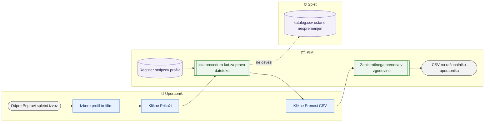

# Izvozni profili in izvoz na zahtevo (predogled trenutnih podatkov)

> **Področje:** Izhod na splet · **Lastnik:** urednik kataloga · **Stanje:** ⚠️ delno · **Preverjeno:** 2026-09-24, iz kode

## 1. Namen

Izvozni profil (register stolpcev) določa, kateri stolpci, v katerem vrstnem redu, s katero glavo in iz katerega polja PIM gredo v datoteko za splet. Na `/splet/izvoz` uporabnik po izbranem profilu pogleda **trenutne** podatke v bazi in jih prenese kot CSV — ne da bi čakal na naslednjo izdelavo `katalog.csv`.

## 2. Kdo sodeluje

| Vloga | Kaj naredi v procesu |
|---|---|
| Komerciala | Pripravi predogled in prenese CSV za lastno uporabo (npr. seznam objavljenih artiklov enega spletišča). |
| Urednik kataloga | Preveri, kako bo artikel videti v datoteki, preden se izdela prava; pogleda stolpce profila in preslikave. |
| Skrbnik | Ureja register profilov v bazi (v intranetu ni urejevalnika); vklopi ali izklopi posel `WEB_STOCK_EXPORT`. |
| Avtomatika (PIM) | Iste vrstice sestavi ista procedura kot za pravo datoteko; ročni prenos zapiše v zgodovino. |

## 3. Kdaj se sproži

- **Ročno:** uporabnik na `/splet/izvoz` (povezava »Predogled trenutnih podatkov PIM« na `/splet`) ali na `/izvozi/profili/{Id}`.
- **Po urniku:** `WEB_STOCK_EXPORT` (profil `MAGENTO_STOCK_PRICES`, datoteka `magento-stock-prices.csv` za vsako podjetje) — od migracije 272 **privzeto izklopljen**.
- **Ob dogodku:** ni (če bi bil `WEB_STOCK_EXPORT` vklopljen, ga sproži uspešen zajem zaloge iz SAOP).

## 4. Vhod in izhod

| | Kaj | Od kod / kam |
|---|---|---|
| **Vhod** | Izbran profil, spletno mesto, iskanje, »Samo objavljeni« | Uporabnik |
| **Vhod** | Register stolpcev (`out.ExportProfile`, `out.ExportColumn`) in podatki PIM | PIM |
| **Izhod** | Predogled največ 200 vrstic (na profilu 20) | Zaslon |
| **Izhod** | Prenos CSV z istim ločilom in obliko števil kot prava datoteka | Uporabnikov računalnik (ne `EXPORT_ROOT`) |

## 5. Diagram

## 6. Koraki

| # | Kdo | Kje (stran) | Kaj narediš | Kaj se zgodi v sistemu | Kako preveriš, da je uspelo |
|---|---|---|---|---|---|
| 1 | Urednik / komerciala | `/splet/izvoz` | V »Izvozni profil« izbereš profil (npr. katalog ali stranke). | Ponujeni so samo aktivni profili, ki jih zna sestaviti izvoz na zahtevo, brez SAOP/ERP kanalov. Podjetje je vedno 2. | — |
| 2 | Urednik / komerciala | `/splet/izvoz` | Pri profilu izdelkov izbereš »Spletno mesto«, vpišeš iskanje (šifra, EAN, naziv) in pustiš ali odkljukaš »Samo objavljeni«. Pri strankah sta spletno mesto in objava onemogočena. | — | — |
| 3 | Urednik / komerciala | `/splet/izvoz` | Klikneš **Prikaži**. | Sestavi se prvih 200 vrstic trenutnega stanja. | Tabela »Prvih 200 vrstic spletnega izvoza« in povzetek »v datoteki bo N vrstic«. |
| 4 | Urednik / komerciala | `/splet/izvoz` | Klikneš **Prenesi CSV**. | Prenos cele datoteke po istih filtrih, z ločilom profila (`;` za katalog in stranke) in decimalno vejico pri cenah; zapis v zgodovino izvozov. | Datoteka v mapi Prenosi; na `/splet` v zgodovini vrsta »Prenos iz baze«. |
| 5 | Urednik / skrbnik | `/izvozi/profili/{Id}` | Odpreš profil po številki (URL). | Stran pokaže stolpce: vrstni red, koda, izhodno ime, kanonično polje (ali »Ni preslikano«), obvezen/neobvezen, aktiven; spodaj predogled prvih 20 vrstic za izbrano podjetje. | Število vrstic celotne datoteke v napisu predogleda. |
| 6 | Skrbnik | `/sistem/posel/WEB_STOCK_EXPORT` | Po potrebi vklopi posel cen in zaloge. | Za vsako podjetje nastane `magento-stock-prices.csv` v podmapi `EXPORT_ROOT`. | Faza DATOTEKA na strani posla. |

## 7. Pravila in varovalke

- Predogled in prenos berejo isto proceduro kot prava datoteka, zato pokažeta isto vsebino kot bi jo imela datoteka, izdelana v tem trenutku.
- Ročni prenos **ne** zamenja datoteke v `EXPORT_ROOT` in ne sproži varovalke ali zapisa objave; Magento ga ne vidi.
- »Samo objavljeni« odkljukano da vse izdelke podjetja, ne samo spletnih — tak CSV ni primeren za Magento.
- Sprememba profila v registru takoj velja povsod, kjer se profil uporablja (tudi v pravi datoteki).
- Profil cen in zaloge zahteva veljavnost za splet (cene in zaloga samo za objavljene artikle, 251).

## 8. Ko gre kaj narobe

| Znak (kaj vidiš) | Verjeten vzrok | Kaj narediš |
|---|---|---|
| »Predogleda trenutno ni mogoče pripraviti.« | Napaka v proceduri ali preobremenjena baza | Poskusi znova; skrbnik pogleda dnevnik. |
| »Za ta profil izvoz na zahtevo ne zna sestaviti vrstic …« | Profil nima vira vrednosti, ki ga pozna `out.GetExportRows` | Profil se uporablja drugje (npr. SAOP); predogled ni mogoč. |
| »Profil … trenutno nima nobene vrstice.« | Filtri ali izbrano podjetje brez podatkov | Preveri podjetje v zgornji vrstici (izbira organizacije). |
| Stolpec je v predogledu prazen | Stolpec ni preslikan (»Ni preslikano«) ali vir nima vrednosti | `/splet/katalog` → »Stolpci brez nastavljenega vira«. |

## 9. Tehnično ozadje

Za skrbnika in razvoj

- **Strani:** `WebExportBuild.razor` (`/splet/izvoz`), `ExportProfileDetail.razor` (`/izvozi/profili/{Id}`); prenos `izvoz/splet-na-zahtevo?…`.
- **Storitve / delavci:** `WebExportBuildService` (`PreviewAsync`, zapis v `out.ExportRun`, ločilo iz `out.ExportProfile.FieldDelimiter`), `GovernanceReadService` (`GetExportProfilesAsync`, `GetExportColumnsAsync`); `PIM.B2bWorker --export-profile MAGENTO_STOCK_PRICES`.
- **Tabele in pogledi:** `out.ExportProfile`, `out.ExportColumn`, `out.GetExportRows`, `intranet.GetWebExportRows`, `out.ExportRun`.
- **Migracije:** 142 (izvoz iz tabel), 146 (pravila in zaloga), 150/151, 201/202, 216/217 (glave), 251, 271 (šumniki v glavah), 272 (izklop cen in zaloge), 277 (ločilo, decimalna vejica).
- **Urniki:** `WEB_STOCK_EXPORT` (1800 s, privzeto izklopljen).

## 10. Odprta vprašanja in razlike

- ⚠️ Na `/izvozi/profili/{Id}` ne vodi nobena povezava v intranetu; seznama profilov ni. Stran je dosegljiva samo z ročnim vpisom številke.
- ⚠️ Stolpcev profila v intranetu ni mogoče urejati; sprememba je poseg v bazo (skrbnik/razvoj).
- ⚠️ `/splet/izvoz` je vedno za podjetje 2, `/izvozi/profili/{Id}` pa za trenutno izbrano organizacijo — predogleda se lahko razlikujeta.
- ⚠️ `WEB_STOCK_EXPORT` je izklopljen (272); podmape 2, 3, 4 v `EXPORT_ROOT` z `magento-stock-prices.csv` so lahko še na disku (ročni korak je bil brisanje).

## Povezani procesi

- [Katalog in stranke za splet](katalog-in-stranke-csv.md): prava datoteka po istem profilu.
- [Nadzor kataloga](nadzor-kataloga.md): stolpci brez vira.
- [Atributi in nabori](../08-upravljanje/atributi-in-nabori.md): kanonična polja, ki jih profil preslika.
- [Avtomatika in urniki](../09-administracija/avtomatika-in-urniki.md): vklop `WEB_STOCK_EXPORT`.
