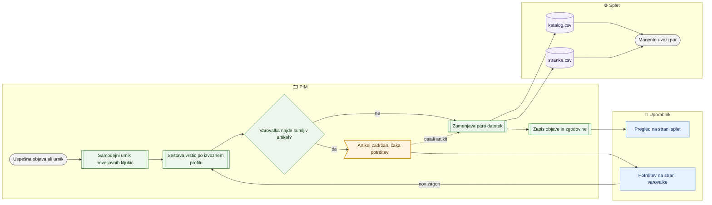

# Katalog in stranke za splet (katalog.csv in stranke.csv)

> **Področje:** Izhod na splet · **Lastnik:** urednik kataloga (vsebina), skrbnik (mapa in urnik) · **Stanje:** ⚠️ delno · **Preverjeno:** 2026-09-25, iz kode in s poskusnim izvozom na razvojni bazi

## 1. Namen

PIM iz objavljenih podatkov sam izdela par datotek za spletno trgovino Magento: `katalog.csv` (artikli) in `stranke.csv` (kupci s popusti). Datoteki sta ena sama para (katalog podjetja 2), vedno zamenjana skupaj, v izhodni mapi `EXPORT_ROOT`, od koder ju bere Magento.

**Od 285 iz več podjetij** (register `out.CatalogSource`): artikli IQ Lighting (2) in Vidadria (3) v eni datoteki, en artikel = ena vrstica po šifri. »Spletne strani« so unija kljukic, vendar vsako podjetje samo za svoja spletišča: **svetila samo s kartice IQ, videlektro s kartice IQ ali ViD** (uporabnik 2026-09-25). Vsebina (nazivi, opisi, cene, atributi, slike) pride iz IQ, če IQ artikel objavlja, sicer iz ViD; kategorija spletišča iz podjetja, ki spletišče prispeva. Varovalka in zapis objave tečeta po podjetju. `stranke.csv` ima stranke obeh podjetij, vsako s svojo šifro, cenikom in popusti (Anja Zorenc: »Stranke so dvojne, imajo tudi dvojne šifre … Vodimo jo posebej.«).

## 2. Kdo sodeluje

| Vloga | Kaj naredi v procesu |
|---|---|
| Komerciala | Pregleda vsebino datotek na `/splet`, prenese datoteko za Excel, potrdi zadržane artikle na `/varovalke`. |
| Urednik kataloga | Skrbi, da artikli izpolnjujejo pogoje za splet (kljukica, kategorija, validacija); razloge vidi v »Sestava kataloga«. Potrdi zadržane artikle. |
| Skrbnik | Nastavi izhodno mapo (`EXPORT_ROOT`) in pravice nanjo, urnik posla, samodejni umik; ročno zažene izvoz. |
| Avtomatika (PIM) | Posel `WEB_CATALOG_EXPORT` izdela par datotek, pred tem umakne neveljavne kljukice (če je vklopljeno), varovalka zadrži sumljive artikle, zapiše, kaj je šlo na splet. |

## 3. Kdaj se sproži

- **Ročno:** skrbnik na `/sistem/posel/WEB_CATALOG_EXPORT` (povezava »Urnik in zagon: CSV za Magento« na `/splet`). Po potrditvi na `/varovalke` se zagon zahteva samodejno.
- **Po urniku:** `WEB_CATALOG_EXPORT`, privzeti razmik 3600 s (vsako uro), meja trajanja 1800 s. ⚠️ Glej razdelek 10 (stran pričakuje 15 minut).
- **Ob dogodku:** uspešna objava v PIM (`PRODUCT_PUBLICATION`, ta teče po uspešni validaciji) posel takoj postavi na vrsto. Brez uspešne objave je izvoz blokiran (odvisnost).

## 4. Vhod in izhod

| | Kaj | Od kod / kam |
|---|---|---|
| **Vhod** | Register virov kataloga `out.CatalogSource` (285): 2 prednost 10 vsa spletišča, 3 prednost 20 samo videlektro | PIM |
| **Vhod** | Objavljeni artikli podjetij iz registra (2 in 3): nazivi SL/EN, atributi (enota v glavi, npr. `Bruto teža [kg]`), kategorije svetila in vid, slike, kljukice spletišč | PIM |
| **Vhod** | Cena B2C iz cenika B2C podjetja 2; cena B2B iz cenika B2B podjetja 3 (Vidadria) po isti šifri | PIM (zajem cen iz SAOP) |
| **Vhod** | Zaloga (lastna IQ + VID, ločeno dobaviteljeva), prihodi, popust odprodaje, S-popusti, posebni S po strankah in tipih | PIM |
| **Vhod** | Aktivne stranke podjetij iz registra (2 in 3) z B2B profilom: tip → Magento skupina, cenik, plačnik, pragovi, skupine popustov (+ P2), B2B+ | PIM (zajem strank iz SAOP + ročne nastavitve) |
| **Izhod** | `katalog.csv` (ločilo `;`, cene z decimalno vejico brez narekovajev) | `EXPORT_ROOT` → Magento |
| **Izhod** | `stranke.csv` (ločilo `;`) in oznaka `magento-export.complete` | `EXPORT_ROOT` → Magento |
| **Izhod** | Zapis, kaj je bilo objavljeno (osnova za odjavne vrstice in varovalko), zgodovina izdelave | PIM |

## 5. Diagram

## 6. Koraki

| # | Kdo | Kje (stran) | Kaj narediš | Kaj se zgodi v sistemu | Kako preveriš, da je uspelo |
|---|---|---|---|---|---|
| 1 | Avtomatika | — | — | Po uspešni objavi (ali najkasneje po urniku) se zažene `PIM.B2bWorker --export-magento --organization-id 2`. Če drug zagon že teče, se ta umakne. | `/sistem/posel/WEB_CATALOG_EXPORT`: zadnji tek. |
| 2 | Avtomatika | — | — | Najprej se uskladijo zadržki za »Pakirno naročanje« (302, `val.SyncPackageOrderHolds`, ena poizvedba na podjetje): artikel z oznako brez Pakiranja 2 (> 1) dobi zadržek za splet, artikel, ki je Pakiranje 2 medtem dobil (npr. z zajemom iz SAOP), se sprosti. Nato se osveži čakalna vrsta pregleda artiklov z oznako O (glej [Nadzor kataloga](nadzor-kataloga.md)). Če je za podjetje vklopljen samodejni umik, PIM artikle, ki na spletišče ne smejo več, ponovno validira in jim odkljuka spletišče z zapisanim razlogom. | `/splet/umaknjeni`, zavihek »Samodejni umik«. |
| 3 | Avtomatika | — | — | Vrstice se sestavijo po izvoznem profilu `MAGENTO_PRODUCTS`: artikel je v datoteki, če je aktiven, ima kljukico svetila ali videlektro, kategorijo na tem spletišču, je objavljen v PIM, veljaven za splet, brez ročnega zadržka in ni izključen. Artikel, ki je bil na spletu in ne sme več, gre še 14 dni kot **odjavna vrstica** s prazno »Spletne strani«. Stranke: profil `MAGENTO_CUSTOMERS`. | — |
| 4 | Avtomatika | — | — | **Varovalka** primerja nove vrstice z zadnjo objavo (cena ni število, ×10/×100, 0, prazna, skok nad 25 %, množičen umik …). Sumljive artikle izpusti iz datoteke, ostale objavi. Posel zaradi varovalke nikoli ne pade. | Na `/splet` pasica varovalke in čip »brez zadržanih artiklov: N« ob katalog.csv. |
| 5 | Avtomatika | — | — | Obe datoteki se zapišeta ob strani in šele nato skupaj zamenjata; nastane oznaka `magento-export.complete`. Ob kakršnikoli napaki ostane prejšnji veljavni par. | `/splet` → »Dokončane datoteke za Magento«: čas, velikost in generacija. |
| 6 | Avtomatika | — | — | Zapiše se, kaj je šlo na splet (osnova za odjavne vrstice in naslednjo primerjavo varovalke) in vrstica v zgodovini izdelave s kontrolno vsoto. | `/splet` → »Zgodovina izdelave in ročnih prenosov«: vrsta »Izdelana datoteka«. |
| 7 | Komerciala / urednik | `/splet` | Klikneš **Osveži stanje**. Pogledaš »Izhodna mapa«, stolpec »Zadnji poskus in zadnji uspeh izdelave« in pasico varovalke. | Stran prebere datoteki v mapi in zgodovino tekov. | Zadnji poskus »Uspešno«; mapa »obstaja«, »dokončan par datotek: da«. |
| 8 | Komerciala / urednik | `/splet` | Pri datoteki klikneš **Preglej vsebino**, vpišeš šifro, EAN ali naziv in klikneš **Poišči v datoteki**; po želji **Vsi stolpci**. | Prikaže se vsebina dejansko izdelane datoteke (ne trenutne baze), po 50 vrstic. | Artikel je v zadetkih; stolpec »Spletne strani« je izpolnjen (prazen = odjava). |
| 9 | Komerciala | `/splet` | Klikneš **Prenesi izdelano datoteko** ali **Prenesi za Excel**. | Prenese se ista datoteka; različica za Excel ima pravilne šumnike in decimalke. | Datoteka se odpre v Excelu s pravilnimi stolpci. |
| 10 | Urednik | `/splet` → »Sestava kataloga« | Pogledaš števila in tabelo »Zakaj artikel ni v katalog.csv«; klik na število odpre `/kakovost/artikli` s filtrom. | Izračun po istih pravilih kot izvoz, nad trenutnim stanjem baze. | »Vrstic v katalog.csv« se ujema s številom vrstic v datoteki (po naslednji izdelavi). |
| 11 | Komerciala / urednik | `/varovalke` | Če je artikel zadržan, ga pregledaš in potrdiš (ali popraviš vzrok, npr. ceno v SAOP). | Potrditev velja 14 dni in zahteva nov zagon izvoza; popravljen artikel gre ven sam ob naslednjem izvozu. | Na `/splet` pasica ne kaže več čakanja; artikel je v datoteki. |
| 12 | Skrbnik | `/sistem/posel/WEB_CATALOG_EXPORT` | Po potrebi zaženeš posel ročno. | Isti tek kot po urniku. | Nov zapis v zgodovini na `/splet`. |

## 7. Pravila in varovalke

- En par datotek, samo za podjetje 2 (IQLighting); nikoli po podjetju. Vidadria prispeva samo ceno B2B in zalogo.
- Artikel na splet samo, če je aktiven + kljukica spletišča + kategorija na tem spletišču + objavljen in veljaven za splet + brez zadržka + ni izključen. Kljukica sama ni dovolj.
- »Spletne strani« vsebuje samo spletišča, kamor artikel res gre (`svetila`, `videlektro` ali `svetila|videlektro`). Prazno polje Magento razume kot umik.
- Odjavna vrstica: artikel, ki je bil objavljen, ostane v datoteki s prazno »Spletne strani« še 14 dni (nastavljivo na `/splet/umaknjeni`); artikel, ki ni bil nikoli na spletu, v datoteko ne gre.
- Atributi (291): gredo **vsi** atributi izdelka s stolpcem; nabor po kategoriji izloči samo atribut z ravnijo EXCLUDED. Vrednost gre skozi `pim.NormalizeAttributeValue` — Napetost vedno `~220-230` (izmenična) oz. `DC 24` (enosmerna), Frekvenca `50/60`, brez dvojnih presledkov, decimalna pika; izjeme v slovarju (`/pravila/slovar`, jezik ENOTNO).
- Kategorije (291): v stolpce kategorij gre samo pot, ki obstaja v drevesu v jeziku spletišča (`canon.WebSiteCategoryPath`); ostanek stare preslikave ne pride v Magento.
- Stranka gre v `stranke.csv`, če je aktivna in ima B2B profil; tip stranke ni pogoj (brez tipa gre s prazno Magento skupino).
- Par se zamenja skupaj — nikoli nov katalog ob stari datoteki strank. Neuspešen tek pusti prejšnji veljavni par.
- Varovalka (277) zadrži samo sumljive artikle; zadržan artikel ostane na spletu s prejšnjimi podatki, nov artikel ne pride na splet.
- Posel ne validira; bere samo objavljeno stanje. Cene in zaloga se berejo sproti (ne čakajo objave).
- **Pakirno naročanje (302):** stolpec 28 »Pakirno naročanje« (prej prazen »Omejitev pri naročanju«) = DA/NE iz oznake artikla `PAKIRNO_NAROCANJE`; brez oznake NE. DA pomeni, da Magento prodaja samo po celih paketih po »Pakirni količini« (Pakiranje 2). Artikel z DA brez Pakiranja 2 (> 1) v datoteko ne gre (zadržek »pravilo 302«), dokler Pakiranje 2 ni vpisano.
- »Popust na artikel« pri oznakah X in O gre ven samo ob sveži (do 30 min) pozitivni lastni zalogi, sicer 0.
- Stran `/splet` vidijo vloge z dovoljenjem `page.web`; potrditi na `/varovalke` smejo ADMIN, CATALOG_EDITOR in COMMERCIAL.

## 8. Ko gre kaj narobe

| Znak (kaj vidiš) | Verjeten vzrok | Kaj narediš |
|---|---|---|
| »Izhodne mape ni mogoče določiti« ali »zapis … NI mogoč« | `EXPORT_ROOT` ni nastavljen ali račun nima pravic | Skrbnik: `scripts\Nastavi-pravice-izvozne-mape.ps1` kot skrbnik ali drugo mapo na `/sistem/mape`. |
| Zadnji poskus »Napaka« z besedilom »Izhodna mapa … ni zapisljiva za račun …« | Račun Windows naloge ali bazena IIS nima pravice spreminjanja | Isto kot zgoraj; prejšnji par ostane veljaven. |
| Čip »Starejša od 30 minut — preveri urnik« | Posel teče na uro, zato je čip pogosto prižgan brez napake (⚠️) | Preveri `/sistem/posel/WEB_CATALOG_EXPORT`: ali zadnji tek uspel in ali objava teče. |
| Čip »brez zadržanih artiklov: N« | Varovalka je zadržala artikle | `/varovalke` → potrdi ali popravi vzrok. |
| »Stolpci podatkov se ne ujemajo z izvoznim profilom« | Register stolpcev je spremenjen, procedura ne | Skrbnik/razvoj; prejšnji par ostane. |
| Artikla ni v datoteki | Manjka kategorija spletišča, validacija, objava ali je izključen | »Sestava kataloga«, kartica → »Preveri zdaj«, `/splet/umaknjeni` → »S kljukico, a ne gredo na splet«. |
| Magento prebere vso vrstico kot en stolpec | Uvoznik Magento ni nastavljen na ločilo `;` | Nastavitev na strani Magento (ročni korak 277). |
| Stranke ni v `stranke.csv` | Neaktivna, brez B2B profila ali ni iz podjetja 2 | Kartica stranke; `/stranke` filter »V stranke.csv«. |

## 9. Tehnično ozadje

Za skrbnika in razvoj

- **Strani:** `PIM.Intranet/Components/Pages/Web.razor`, komponenta `SafeguardBanner`; prenos `izvoz/magento-datoteka/{koda}` in `…/excel` (`ExportDownloadEndpoint.cs`).
- **Storitve / delavci:** `PIM.B2bWorker` (`Program.cs`, `MagentoExportCommand.ExecuteAsync`, `CatalogSafeguard`, `RegistryCsvWriter`, `MagentoExportLock`), `PIM.B2b` (`CustomerCsvGenerator`, `MagentoCsvContract`, `ExportValueFormat`), `MagentoArtifactService`, `QualityReadService.GetWebExportSummaryAsync`. `MagentoExportRunner.cs` je star in se ne uporablja.
- **Tabele in pogledi:** `out.ExportProfile` (`FieldDelimiter`, `IncludeWithdrawals`), `out.ExportColumn` (`DecimalSeparator`, `GuardKind`), `out.GetExportRows`, `out.ExportPriceList` (`PriceOrganizationId = 3` za B2B), `out.ExportStockSource`, `out.CatalogStock`, `out.WebPublication`, `out.CatalogPublishedValue`, `out.ExportRun`, `ops.SafeguardCheck/Finding/Approval`, `pim.WebPublicationPolicy`, `val.ProductChannelReadiness`, `intranet.GetWebExportSummary`, `b2b.CustomerGroupDiscounts`.
- **Migracije:** 142, 146, 201, 202, 204, 208, 213, 216, 217, 234, 242, 251, 252, 253, 271, 274, 277, 279, 302 (Pakirno naročanje, `val.SyncPackageOrderHolds` pred sestavo datoteke).
- **Urniki:** `WEB_CATALOG_EXPORT` (3600 s, odvisen od `PRODUCT_PUBLICATION`), faza DATOTEKA pod `MAGENTO_PRODUCTS`.
- **Pot:** `EXPORT_ROOT` iz argumenta, okolja `PIM_EXPORT_ROOT`, registra `ops.SystemPath` ali privzeto; na PRD `C:\inetpub\wwwroot\PIM_exports_csv`.

## 10. Odprta vprašanja in razlike

- ⚠️ Stran `/splet` pravi, da cikel teče vsakih 15 minut, in po 30 minutah prižge čip »Starejša od 30 minut«. Posel `WEB_CATALOG_EXPORT` ima privzeti razmik 3600 s (migracija 242: 300 → 3600) in ga sproži objava; čip je zato lahko prižgan brez napake. Uskladiti mejo ali razmik.
- ⚠️ Od 277 sta ločilo `;` in cene z decimalno vejico. Ali je uvoznik Magento že preklopljen, iz kode ni mogoče preveriti.
- ⚠️ Če varovalka pade (napaka v bazi), gre datoteka ven brez preverjanja; ostane samo opozorilo v zvoncu.
- ⚠️ Stranke v `stranke.csv` so samo iz podjetja 2. Dodatni popust P2, referent in baza kupcev ViD (279) so vodeni za Vidadrio (podjetje 3), a do spleta ne pridejo. Predlog združitve IQ + VID po šifri z lastništvom spletišča je odprt (ni odločeno).
- ⚠️ V katalogu sta dva ločena popusta za odprodajo: »Popust na artikel« / »Popust odprodaje %« (Nadzor kataloga, oznaka X/O) in »Odprodaja - popust %« (`/izdelki/odprodaja`). Katerega Magento upošteva, iz kode ni razvidno.
- ⚠️ Pravila poštnine (`/pravila-popustov`) v nobeni od datotek niso.
- ⚠️ Stran `/stranke/uvoz` po uvozu napoti na »Pripravi izvoz« za ročno izdelavo — ta stran pa izdela samo prenos, ne osveži datoteke za Magento.

## Povezani procesi

- [Varovalke](../01-nadzor/varovalke.md): potrditev zadržanih artiklov.
- [Kakovost in validacija](../04-kakovost/kakovost-in-validacija.md): validacija in objava sta pogoj za vrstico v katalogu.
- [Nadzor kataloga](nadzor-kataloga.md): izključitev in popust odprodaje X/O.
- [Umaknjeni artikli](umaknjeni-s-spleta.md): odjavne vrstice in samodejni umik.
- [Neskladja med podjetji](neskladja-med-podjetji.md): šifre, ki jih IQ in ViD vodita različno (manjkajoča kartica, različne kljukice).
- [Izvoz po Magento profilih](izvoz-magento-profili.md): register stolpcev in predogled na zahtevo.
- [Stranke](../07-poslovanje/stranke.md), [Popusti](../07-poslovanje/popusti.md), [Cene in ceniki](../07-poslovanje/cene-in-ceniki.md), [Zaloge](../07-poslovanje/zaloge-in-rezervacija.md): vsebina datotek.
- [Kategorije izdelka](../03-izdelki/kategorije-izdelka.md), [Mediji](../03-izdelki/mediji.md), [Odprodaja](../03-izdelki/odprodaja.md).
- [Avtomatika in urniki](../09-administracija/avtomatika-in-urniki.md): posel `WEB_CATALOG_EXPORT`.
