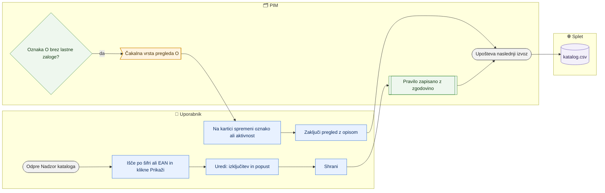

# Nadzor kataloga (izključitev, popust X/O, pregled oznake O)

> **Področje:** Izhod na splet · **Lastnik:** urednik kataloga · **Stanje:** ✅ deluje · **Preverjeno:** 2026-09-24, iz kode

## 1. Namen

Urednik na enem mestu izključi artikel iz spletnega kataloga, vpiše popust odprodaje za artikle z ABC oznako X ali O in zaključi pregled artiklov O, ki jim je pošla lastna zaloga. Rezultat so pravila, ki jih upošteva naslednji `katalog.csv`.

## 2. Kdo sodeluje

| Vloga | Kaj naredi v procesu |
|---|---|
| Komerciala | Nima dostopa (stran je samo za ADMIN in CATALOG_EDITOR). |
| Urednik kataloga | Išče artikle, ureja izključitev in popust, zaključi pregled O. |
| Skrbnik | Enako kot urednik. |
| Avtomatika (PIM) | Ob vsakem izvozu (in na gumb) doda v čakalno vrsto pregleda artikle O z izčrpano svežo lastno zalogo. |

## 3. Kdaj se sproži

- **Ročno:** urednik na `/splet/katalog`, ko želi artikel umakniti iz kataloga ali mu dati popust odprodaje.
- **Po urniku:** osvežitev čakalne vrste teče na začetku vsakega izvoza `WEB_CATALOG_EXPORT`.
- **Ob dogodku:** lastna zaloga artikla z oznako O pade na 0 (posnetek zaloge ne starejši od 30 minut).

## 4. Vhod in izhod

| | Kaj | Od kod / kam |
|---|---|---|
| **Vhod** | Šifra ali EAN, ABC oznaka (Department), aktivnost, kljukice, validacija | PIM |
| **Vhod** | Lastna zaloga (IQ + VID) in zaloga dobavitelja s časom posnetka | PIM (zajem zalog) |
| **Izhod** | Izključitev iz kataloga, popust odprodaje %, zaključen pregled z opisom | PIM → naslednji `katalog.csv` |

## 5. Diagram

## 6. Koraki

| # | Kdo | Kje (stran) | Kaj narediš | Kaj se zgodi v sistemu | Kako preveriš, da je uspelo |
|---|---|---|---|---|---|
| 1 | Urednik | `/splet/katalog` | V polje »Šifra ali EAN« vpišeš začetek šifre ali cel EAN; po želji odkljukaš »Samo čakalna vrsta O« in klikneš **Prikaži**. | Prikaže se največ 100 artiklov podjetja 2 z izborom, aktivnostjo, validacijo, lastno in dobaviteljevo zalogo. | Tabela z artikli. |
| 2 | Urednik | `/splet/katalog` | Pri artiklu klikneš **Uredi**. | Odpre se razdelek z imenom artikla. | — |
| 3 | Urednik | `/splet/katalog` | Obkljukaš »Izključen iz kataloga« in/ali vpišeš »Popust odprodaje %« (0–100) ter klikneš **Shrani**. | Pravilo se zapiše z zgodovino. Izključen artikel ne gre v `katalog.csv`, ne glede na kljukice. | Sporočilo »Pravilo je shranjeno. Upošteva ga naslednji izvoz.«; v tabeli »/ Izključen« oziroma nov odstotek. |
| 4 | Avtomatika | — | — | Artikel z oznako O, aktiven, ne izključen, z lastno zalogo ≤ 0 v svežem posnetku, gre v čakalno vrsto pregleda. | Stolpec »Pregled«: »Potreben pregled«. |
| 5 | Urednik | `/splet/katalog` | Klikneš **Osveži čakalno vrsto**, če ne želiš čakati na izvoz. | Čakalna vrsta se osveži takoj (samo, če je lastna zaloga sveža). | Novi artikli v vrsti. |
| 6 | Urednik | Kartica artikla | Spremeniš ABC oznako ali aktivnost (ali artikel na `/splet/katalog` izključiš). | — | — |
| 7 | Urednik | `/splet/katalog` | Pri artiklu **Uredi**, vpišeš »Opravljen pregled« in klikneš **Zaključi pregled**. | Pregled se zaključi. Če je artikel še vedno O, aktiven in ne izključen, sistem zavrne z »Najprej spremeni ABC oznako …«. | Sporočilo »Pregled je zaključen.« |

## 7. Pravila in varovalke

- Izključitev vedno prepreči izvoz artikla, tudi s kljukico in veljavno validacijo.
- Popust odprodaje pri oznakah X in O gre v `katalog.csv` samo, dokler je lastna zaloga pozitivna in posnetek ne starejši od 30 minut; sicer gre popust 0. Dobaviteljeva zaloga se ne šteje.
- Manjkajoča ali stara zaloga ni dokaz, da je zaloga pošla — takrat se čakalna vrsta ne osveži.
- Pregled O se ne da zaključiti, dokler artikel ostaja O, aktiven in ne izključen.
- Dostop: samo ADMIN in CATALOG_EDITOR.

## 8. Ko gre kaj narobe

| Znak (kaj vidiš) | Verjeten vzrok | Kaj narediš |
|---|---|---|
| »Artikel ne pripada izbranemu podjetju.« | Artikel ni iz podjetja 2 | Stran dela samo s podjetjem 2. |
| »Vnesi popust med 0 in 100 …« | Neveljaven odstotek | Popravi vrednost. |
| »Najprej spremeni ABC oznako …« | Pregled O zaključuješ, a artikel je še O in aktiven | Na kartici spremeni oznako/aktivnost ali ga izključi. |
| »Osveži čakalno vrsto« ne doda ničesar | Lastna zaloga ni sveža (starejša od 30 min) | Preveri zajem zalog na `/zaloge` (Svežina po viru). |
| Popust v CSV je 0, čeprav je vpisan | Ni sveže pozitivne lastne zaloge ali oznaka ni X/O | Preveri zalogo in oznako. |

## 9. Tehnično ozadje

Za skrbnika in razvoj

- **Strani:** `PIM.Intranet/Components/Pages/CatalogControl.razor`
- **Storitve / delavci:** `CatalogControlService` (`ReadAsync`, `UnmappedAsync`, `SaveAsync`, `RefreshAsync`, `ResolveAsync`); `PIM.B2bWorker` kliče `pim.RefreshCatalogReview` pred izvozom.
- **Tabele in pogledi:** `pim.CatalogPolicy`, `pim.CatalogPolicyHistory`, `pim.CatalogReview`, `out.CatalogStock`, `out.CatalogOwnStockFresh`, procedure `pim.SaveCatalogPolicy`, `pim.RefreshCatalogReview`, `pim.ResolveCatalogReview`; blok `/* CatalogLifecycle204 */` v `out.GetExportRows`.
- **Migracije:** 204–207.
- **Urniki:** osvežitev ob `WEB_CATALOG_EXPORT`.

## 10. Odprta vprašanja in razlike

- ⚠️ Popust odprodaje tu (oznaka X/O, stolpca »Popust na artikel« in »Popust odprodaje %«) je ločen od odprodaje na `/izdelki/odprodaja` (stolpec »Odprodaja - popust %«). Uporabnik lahko ima dva različna odstotka za isti artikel.
- ⚠️ Stran pokaže samo prvih 100 zadetkov in nima izvoza; večjih seznamov (npr. vse O) ni mogoče pregledati naenkrat.
- ⚠️ Razdelek »Stolpci brez nastavljenega vira« našteje stolpce, ki ostanejo v CSV prazni; kdo jih mora napolniti, stran ne pove.

## Povezani procesi

- [Katalog in stranke za splet](katalog-in-stranke-csv.md): pravila se upoštevajo ob naslednjem izvozu.
- [Odprodaja](../03-izdelki/odprodaja.md): drugi, ločen sistem popusta odprodaje.
- [Zaloge](../07-poslovanje/zaloge-in-rezervacija.md): lastna zaloga, ki odloča o popustu in pregledu O.
- [Iskanje in kartica izdelka](../03-izdelki/iskanje-in-kartica-izdelka.md): sprememba ABC oznake in aktivnosti.
