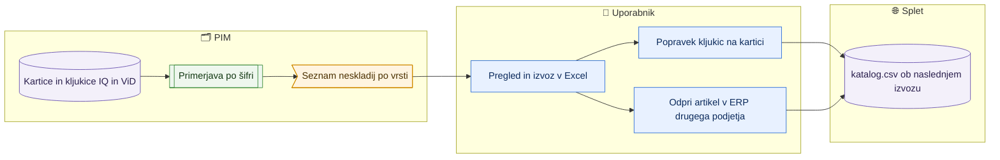

# Neskladja med podjetji (ista šifra v IQ in ViD)

> **Področje:** Izhod na splet · **Lastnik:** urednik kataloga, komerciala · **Stanje:** ✅ deluje · **Preverjeno:** 2026-09-28, upodobitev strani in izvoz na razvojni bazi

## 1. Namen

Ista šifra je lahko v več podjetjih (IQLighting, Vidadria). `katalog.csv` jo pošlje enkrat: vsebina iz glavnega podjetja (IQ), spletišča iz kljukic vseh kartic, pri čemer ViD prispeva samo videlektro. Stran pokaže šifre, kjer kartica v enem podjetju manjka ali se kljukice razlikujejo — da je ERP obeh podjetij pod nadzorom in je jasno, zakaj artikel ne gre na spletišče, ki ga kljukica zahteva.

Dogovor s komercialo (2026-09-28): svetila vodi IQ; ViD kartica je za videlektro; artikel na obeh spletiščih ima ERP urejen v obeh podjetjih; NW artikli so v obeh podjetjih in na obeh spletiščih.

## 2. Kdo sodeluje

| Vloga | Kaj naredi v procesu |
|---|---|
| Urednik kataloga | Pregleda neskladja, popravi kljukice na kartici. |
| Komerciala | Odpre manjkajoči artikel v ERP drugega podjetja. |
| Vsi (tudi pregledovalec) | Pregled in izvoz v Excel (samo branje). |

## 3. Kdaj se sproži

- **Ročno:** uporabnik odpre `/splet/neskladja` (povezava na `/splet` in `/splet/umaknjeni`).
- Stanje je vedno trenutno (bere kartice in kljukice ob odprtju), brez lastnega urnika.

## 4. Vhod in izhod

| | Kaj | Od kod / kam |
|---|---|---|
| **Vhod** | Kartice (aktivnost) in kljukice spletišč po podjetjih, viri kataloga | PIM (`canon.Product`, `pim.ProductWebShop`, `out.CatalogSource`) |
| **Izhod** | Seznam neskladij, izvoz v Excel | Zaslon, datoteka `.xlsx` |

## 5. Diagram

## 6. Koraki

| # | Kdo | Kje (stran) | Kaj narediš | Kaj se zgodi v sistemu | Kako preveriš, da je uspelo |
|---|---|---|---|---|---|
| 1 | Urednik | `/splet/neskladja` | Izbereš vrsto (**Manjka v IQLighting**, **Manjka v Vidadria**, **Različne kljukice**), po želji predpono (NW., BA.) ali iščeš po šifri/nazivu. | Seznam iz baze, 50 na stran; filtri so v naslovu strani. | Število na gumbu vrste in »N neskladij«. |
| 2 | Urednik | `/splet/neskladja` | **Izvozi Excel** (ves filter) ali označiš vrstice in **Izvozi izbrane v Excel**. | Datoteka s posledico in navodilom za vsako vrstico. | Datoteka `PIM_neskladja_med_podjetji_….xlsx`. |
| 3 | Urednik / komerciala | kartica artikla / ERP | Klik na naziv ali kljukice odpre kartico (razdelek Splet); popraviš kljukice ali artikel odpreš v ERP drugega podjetja. | Ob naslednjem zajemu iz SAOP se kartica pojavi v PIM. | Vrstica izgine s seznama. |

## 7. Pravila in varovalke

- **Manjka v IQLighting:** ViD kartica ima kljukico spletišča, ki ga ViD ne sme prispevati (svetila), IQ artikla nima ali je neaktiven → artikel na to spletišče ne gre.
- **Manjka v Vidadria:** IQ ima kljukico spletišča, ki bi ga lahko prispeval tudi ViD (videlektro), ViD artikla nima ali je neaktiven → splet dela (prispeva IQ), ERP v ViD ni urejen.
- **Različne kljukice:** obe kartici aktivni, kljukice različne → v katalogu je unija; stolpec »ne gre na« pokaže, kaj se izgubi.
- »V katalogu po kljukicah« upošteva samo kljukice in pravilo virov kataloga (285); kategorija in validacija lahko artikel še zadržita — to kaže `/splet/umaknjeni` → kljukice brez objave.
- Stran samo bere; nič ne pošlje v SAOP in ne spreminja kljukic.

## 8. Ko gre kaj narobe

| Znak (kaj vidiš) | Verjeten vzrok | Kaj narediš |
|---|---|---|
| »Neskladij ni bilo mogoče naložiti …« | Migracija 290 ni uveljavljena ali baza je preobremenjena | Skrbnik: uveljavi 290; poskusi znova čez minuto. |
| Artikel je v ERP odprt, na seznamu pa še je | Zajem iz SAOP še ni tekel | Počakaj na naslednji zajem artiklov. |
| »ni prevzeta v PIM« pri kartici | Artikel je v SAOP, v PIM še ni prevzet | Prevzem artikla v PIM. |

## 9. Tehnično ozadje

Za skrbnika in razvoj

- **Strani:** `PIM.Intranet/Components/Pages/OrganizationMismatches.razor` (`?vrsta=&predpona=&isci=&razvrsti=&smer=&stran=`).
- **Storitve:** `OrganizationMismatchService` (stran in izvoz `/izvoz/neskladja-med-podjetji.xlsx`, pravica `view.web.mismatches`).
- **Tabele in postopki:** `intranet.GetOrganizationMismatches` (bere `out.CatalogSource`, `canon.Product`, `pim.Product`, `pim.ProductWebShop`, `canon.WebSite`).
- **Migracije:** 285, 290.

## 10. Odprta vprašanja in razlike

- ⚠️ ViD artikli s samo kljukico svetila (npr. BA.) po dogovoru ne gredo na svetila, dokler niso odprti v IQ; ali jih odpreti v IQ ali jim odstraniti kljukico, odloči komerciala.
- ⚠️ Ediito (podjetje 4) še ni vir kataloga; ko bo, se prikaže kot dodatno podjetje.

## Povezani procesi

- [Katalog in stranke za splet](katalog-in-stranke-csv.md): združevanje IQ in ViD v en katalog (285).
- [Umaknjeni s spleta](umaknjeni-s-spleta.md): zakaj kljukica ne pripelje artikla na splet (kategorija, validacija).
- [Iskanje in kartica izdelka](../03-izdelki/iskanje-in-kartica-izdelka.md): kljukice spletišč na kartici.
