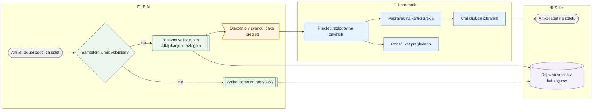

# Umaknjeni s spleta, kljukice brez objave in samodejni umik

> **Področje:** Izhod na splet · **Lastnik:** urednik kataloga · **Stanje:** ✅ deluje · **Preverjeno:** 2026-09-24, iz kode

## 1. Namen

Uporabnik vidi, kateri artikli so šli s spleta in zakaj, katere kljukice svetila/videlektro ne pripeljejo artikla na splet in zakaj, ter v enem koraku vrne kljukice tam, kjer je vzrok odpravljen. Skrbnik nastavi, ali PIM sam odkljuka artikle, ki na splet ne smejo več, in koliko dni gre odjavna vrstica v `katalog.csv`.

## 2. Kdo sodeluje

| Vloga | Kaj naredi v procesu |
|---|---|
| Komerciala | Pregleduje umike in razloge (samo branje). |
| Urednik kataloga | Vrne kljukice izbranim, označi samodejne umike kot pregledane, popravi vzrok na kartici. |
| Skrbnik | Vklopi ali izklopi samodejni umik, nastavi dni odjavne vrstice, pripravi predogled in umakne ročno (»Umakni zdaj …«). |
| Avtomatika (PIM) | Ob shranjevanju kartice, urni validaciji in pred izvozom odkljuka neveljavne kljukice (če je vklopljeno), zapiše razlog, prižge opozorilo v zvoncu; `katalog.csv` pošlje odjavno vrstico. |

## 3. Kdaj se sproži

- **Ročno:** uporabnik odpre `/splet/umaknjeni` (tudi iz zvonca, opozorilo »umaknjeni s spleta«, ali z zavihka **Umaknjeni s spleta** na straneh izhoda na splet).
- **Po urniku:** samodejni umik pred vsakim izvozom `WEB_CATALOG_EXPORT` in ob urni validaciji — samo pri podjetju z vklopljenim samodejnim umikom (privzeto izklopljen).
- **Ob dogodku:** artikel izgubi pogoj za splet (neaktiven, brez kategorije spletišča, blokirajoča napaka, npr. uvoz pobriše sliko).

## 4. Vhod in izhod

| | Kaj | Od kod / kam |
|---|---|---|
| **Vhod** | Zadnja objava na splet, kljukice spletišč, kategorije, validacija | PIM |
| **Izhod** | Odkljukane ali vrnjene kljukice z razlogom in zgodovino | PIM |
| **Izhod** | Odjavna vrstica (prazne »Spletne strani«) še N dni | `katalog.csv` → Magento umakne artikel |
| **Izhod** | Opozorilo v zvoncu, dokler umiki niso pregledani | Obvestila |

## 5. Diagram

## 6. Koraki

| # | Kdo | Kje (stran) | Kaj narediš | Kaj se zgodi v sistemu | Kako preveriš, da je uspelo |
|---|---|---|---|---|---|
| 1 | Urednik | `/splet/umaknjeni` | Izbereš »Podjetje« (privzeto 2) in zavihek **Umaknjeni s spleta**; izbereš »Obdobje« (7, 30, 90 dni, leto), po želji šifro ali naziv in **Prikaži**. | Pokaže umike po razlogu (stolpci s števili) in seznam (največ 500) z razlogom, kakršen je zdaj. Klik na razlog filtrira. | Števec na zavihku. |
| 2 | Urednik | `/splet/umaknjeni` | Popraviš vzrok na kartici artikla (povezava na šifro odpre kartico na razdelku Splet). | Kartica ponovno validira artikel. | Razlog v seznamu se spremeni. |
| 3 | Urednik | `/splet/umaknjeni` | Označiš vrstice ali klikneš **Izberi vse, ki jim lahko vrnem kljukico**, nato **Vrni kljukice izbranim (N) …** in **Da, vrni**. | Kljukica se vrne samo, če artikel na spletišče sme; ostale so naštete pod »Teh kljukic ni bilo mogoče vrniti …« z razlogom. | Sporočilo »Vrnjenih kljukic: N. Artikli gredo na splet ob naslednjem izvozu katalog.csv.« |
| 4 | Urednik | `/splet/umaknjeni` | Zavihek **S kljukico, a ne gredo na splet**: izbereš »Spletišče«, razlog, **Prikaži**. | Seznam artiklov s kljukico, ki jih `katalog.csv` ne pošlje, z razlogom (brez kategorije spletišča, ni veljaven za splet, še ni validiran …). | Po popravku na kartici artikel izgine s seznama. |
| 5 | Skrbnik | `/splet/umaknjeni` → **Samodejni umik** | Obkljukaš »Samodejno odkljukaj artikle, ki niso več veljavni za splet«, nastaviš »Odjavna vrstica v katalog.csv (dni)« in klikneš **Shrani nastavitev**. | Nastavitev velja za izbrano podjetje. | Sporočilo »Samodejni umik je vklopljen …«; kartica »Samodejni umik: vklopljen«. |
| 6 | Skrbnik | `/splet/umaknjeni` → **Samodejni umik** | Ko je umik izklopljen, klikneš **Pripravi predogled**, pregledaš seznam in po želji **Umakni zdaj …** → **Da, umakni**. | Kandidati se ponovno validirajo in odkljukajo z razlogom. | Sporočilo »Umaknjeno: N kljukic …«. |
| 7 | Urednik | `/splet/umaknjeni` → **Samodejni umik** | Pri vrstici klikneš **Pregledano** ali zgoraj **Označi vse kot pregledane**. | Umik je pregledan; ko ni nepregledanih, se opozorilo v zvoncu zapre. | Stanje »Pregledano«; »Ni nepregledanih umikov.« |
| 8 | Avtomatika | — | — | Naslednji `katalog.csv` pošlje odjavno vrstico (odkljukani) ali vrnjeno spletišče (vrnjeni). | `/splet` → Preglej vsebino → stolpec »Spletne strani«. |

## 7. Pravila in varovalke

- Artikel gre na spletišče samo, če je aktiven, ima kategorijo na tem spletišču in je veljaven za splet — kljukica sama ni dovolj.
- Samodejni umik je privzeto **izklopljen**; vklopi ga samo ADMIN (dovoljenje nastavitev objave). Izklopljen umik ne pomeni, da neveljaven artikel gre na splet — samo kljukica ostane.
- Ročni zadržek in izključitev iz kataloga nista razlog za odkljukanje (artikel samo ne gre ven). Manjkajoča validacija tudi ni razlog.
- Razlog se zapiše **pred** odkljukanjem, ker ga spletna validacija po odkljukanju ne kaže več.
- Odjavna vrstica gre samo za artikel, ki je bil na spletu; privzeto 14 dni (1–365).
- Vrniti kljukice in označiti pregled smeta ADMIN in CATALOG_EDITOR.
- Varovalka `katalog.csv` zadrži množičen umik s spleta (od 10 artiklov naprej) do potrditve na `/varovalke`.

## 8. Ko gre kaj narobe

| Znak (kaj vidiš) | Verjeten vzrok | Kaj narediš |
|---|---|---|
| »Umikov ni mogoče prebrati (migracija 251 …)« / »(migracija 277 …)« | Baza nima migracije | Skrbnik: uveljavi migracije. |
| Kljukica se ne vrne, razlog »Brez kategorije spletišča« | Artikel nima kategorije na drevesu tega spletišča | Na kartici dodaj kategorijo, nato vrni. |
| »Tvoja vloga tega ne dovoljuje.« | Vloga brez pravice | Prosi urednika ali skrbnika. |
| Artikel je vrnjen, a ga na spletu še ni | Izvoz še ni tekel ali ga je zadržala varovalka | `/splet` → zadnja izdelava; `/varovalke`. |
| Zvonec stalno kaže umike | Nepregledani samodejni umiki | **Označi vse kot pregledane** po pregledu. |

## 9. Tehnično ozadje

Za skrbnika in razvoj

- **Strani:** `PIM.Intranet/Components/Pages/WebWithdrawals.razor` (zavihki `?pogled=umaknjeni|kljukice|samodejni`).
- **Storitve / delavci:** `WebWithdrawalService`, `SafeguardText.ReasonShort`; `PIM.B2bWorker` kliče `pim.WithdrawIneligibleWebShops` (`@Mode = AUTO`, `@TriggerSource = IZVOZ`) in `out.RecordWebPublication`.
- **Tabele in pogledi:** `pim.WebShopWithdrawal`, `pim.WebPublicationPolicy`, `pim.WebShopEligibility`, `pim.WebShopReason`, `out.WebPublication`, procedure `pim.WithdrawIneligibleWebShops` (AUTO/PREVIEW/FORCE), `pim.ReviewWebShopWithdrawals`, `pim.SaveProductWebShops`, `intranet.GetWebWithdrawnItems`, `intranet.GetWebShopBlocked`, `intranet.GetWebShopWithdrawals`; opozorilo `WebShopWithdrawn` v `ops.Alert`.
- **Migracije:** 248, 251, 277.
- **Urniki:** pred `WEB_CATALOG_EXPORT`, ob `PRODUCT_VALIDATION`.

## 10. Odprta vprašanja in razlike

- ⚠️ Zavihek »Umaknjeni s spleta« kaže razlog, kakršen je **zdaj**, ne ob umiku; za artikel, ki je bil umaknjen in je vzrok že odpravljen, piše »Spet gre na splet«.
- ⚠️ Ali je na PRD samodejni umik vklopljen, iz kode ni mogoče ugotoviti (nastavitev je v bazi).

## Povezani procesi

- [Katalog in stranke za splet](katalog-in-stranke-csv.md): odjavne vrstice in samodejni umik pred izvozom.
- [Neskladja med podjetji](neskladja-med-podjetji.md): ista šifra v IQ in ViD z manjkajočo kartico ali različnimi kljukicami.
- [Varovalke](../01-nadzor/varovalke.md): množičen umik čaka potrditev.
- [Kakovost in validacija](../04-kakovost/kakovost-in-validacija.md): razlogi »ni veljaven za splet«.
- [Kategorije izdelka](../03-izdelki/kategorije-izdelka.md): manjkajoča kategorija spletišča.
- [Iskanje in kartica izdelka](../03-izdelki/iskanje-in-kartica-izdelka.md): kljukice spletišč in »Preveri zdaj«.
- [Nadzorna plošča](../01-nadzor/nadzorna-plosca.md): opozorilo v zvoncu.
