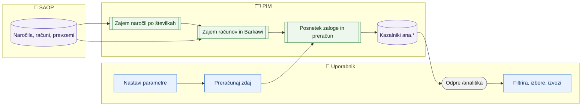

# Analitika prodaje, zalog in nabave

> **Področje:** Poslovanje · **Lastnik:** komerciala · **Stanje:** ⚠️ delno (strani in izračun delujejo; prodajni podatki pridejo ob prvem zagonu v omrežju podjetja) · **Preverjeno:** 2026-09-25, iz kode in testov F12

## 1. Namen

Pokaže, koliko se proda po mesecih (po artiklih in dobaviteljih), predlaga, koliko česa naročiti, in pokaže zalogo, ki stoji (zaležano) ali je je preveč. Rezultat so strani pod `/analitika` in izvoz v Excel. V SAOP se nič ne pošlje.

## 2. Kdo sodeluje

| Vloga | Kaj naredi v procesu |
|---|---|
| Komerciala | Pregleda trend, predloge naročil in zaležano zalogo; izvozi seznam za naročilo ali odprodajo; nastavi parametre izračuna. |
| Skrbnik | Enako kot komerciala; drugim vlogam lahko dodeli dostop (Sistemske zadeve → Vloge, pravica »Analitika«). |
| Avtomatika (PIM) | Vsako noč prebere podatke iz SAOP (samo branje) in preračuna kazalnike. |

## 3. Kdaj se sproži

- **Po urniku:** `SAOP_ANALYTICS_IMPORT` vsak dan ob 4:00 (računi, Barkawi naročila in nabavni podatki, nato preračun); `SAOP_ORDER_IMPORT` vsako uro (naročila kupcev VNK in dobaviteljem VND po številkah).
- **Ročno:** zavihek *Nastavitve izračuna* → »Preračunaj zdaj« (samo baza, brez SAOP); enkratni zajem zgodovine naročil `PIM.SaopOrdersWorker --zgodovina-od 2023`.
- **Ob dogodku:** Ni.

## 4. Vhod in izhod

| | Kaj | Od kod / kam |
|---|---|---|
| **Vhod** | Naročila kupcev (VNK) in dobaviteljem (VND) po številkah | SAOP `GetOrder`, `GetPurchaseOrder` |
| **Vhod** | Izdani računi z vrsticami, Barkawi naročila (CO/PO) z datumi prevzema, povprečne in zadnje nabavne cene | SAOP `Invoice/GetInvoices`, `Barkawi/GetCO/GetPO/GetSKU` |
| **Vhod** | Lastna zaloga (vir BASE), SAOP MIN/MAX, nabavni cenik | PIM (zajem zaloge in artiklov) |
| **Izhod** | Kazalniki po artiklu in dobavitelju, prodaja po mesecih, dnevni posnetek zaloge | PIM (shema `ana`) |
| **Izhod** | Excel: artikli (tudi izbrani) in dobavitelji | uporabnik |

## 5. Diagram

## 6. Koraki

| # | Kdo | Kje (stran) | Kaj narediš | Kaj se zgodi v sistemu | Kako preveriš, da je uspelo |
|---|---|---|---|---|---|
| 1 | Avtomatika | — | — | Vsako uro prebere nova naročila VNK/VND od zadnje znane številke naprej; enkrat na dan osveži odprta. | `/sistem` → posel »Naročila iz SAOP«, faza PRENOS |
| 2 | Avtomatika | — | — | Ob 4:00 prebere račune in Barkawi podatke, zapiše posnetek zaloge in preračuna kazalnike. | `/analitika` → »Od kod so podatki«: zadnji uspeh vsakega vira |
| 3 | Komerciala | `/analitika` | Pregleda promet, trend po mesecih (letos proti lani), vrh dobaviteljev, artiklov in kupcev; filtrira po dobavitelju. | — | Datum »Preračunano« v glavi |
| 4 | Komerciala | `/analitika/artikli?signal=NAROCI` | Pregleda predloge, označi vrstice, izvozi izbrane v Excel in naroči v SAOP. | — | Izvoz ima stolpca »Predlog količine« in »Razlog« |
| 5 | Komerciala | `/analitika/artikli?signal=ZALEZANO` | Izvozi zaležano zalogo za odprodajo. | — | Stolpec »Presežek vrednost« |
| 6 | Komerciala | `/analitika/dobavitelji` | Primerja dobavitelje po prometu, zalogi, dobavnem času in zamudah. | — | — |
| 7 | Komerciala / skrbnik | `/analitika/nastavitve` | Spremeni servisno raven, razmik naročil, meje; »Preračunaj zdaj«. | Zapis v `ana.Setting` z zgodovino, preračun. | Sporočilo s številom artiklov za naročilo; tabela zgodovine |

## 7. Pravila in varovalke

- V SAOP se nič ne pošilja: vsi klici so GET; predlog je samo izračun.
- Predlog: točka naročila = dnevna prodaja × dobavni čas + varnostna zaloga; naroči se do ciljne ravni (dobavni čas + razmik med naročili), zaokroženo na večkratnik. SAOP MIN ima prednost (pod MIN predlog dvigne do MAX).
- Dobavni čas: izmerjen iz prevzemov artikla (vsaj 2), sicer povprečje dobavitelja (vsaj 3), sicer nabavni čas iz SAOP, sicer privzeta vrednost.
- Zaležano: zaloga brez prodaje in brez prevzema v nastavljenem številu dni — samo, če zgodovina prodaje sega vsaj toliko nazaj (sicer se ne razglasi).
- Brez podatkov o prodaji (vir »ni podatkov«) ni predlogov po prodaji, trendov in zaležane zaloge.
- Zaloga dobaviteljev (NW, BT) se v analitiko ne šteje; samo lastna zaloga (vir BASE).
- Dostop: privzeto ADMIN in COMMERCIAL; nastavitve spreminjata samo ti dve vlogi (politika `AnalyticsSettings`, preverjeno v servisu).

## 8. Ko gre kaj narobe

| Znak (kaj vidiš) | Verjeten vzrok | Kaj narediš |
|---|---|---|
| »Podatkov o prodaji še ni« | Worker še ni tekel v omrežju podjetja ali SAOP ni dosegljiv. | Poženi `PIM.SaopAnalyticsWorker --preizkus` v omrežju, nato redni tek. |
| Vir »Napaka« z besedilom »SAOP ni dosegljiv« | Ni povezave do SAOP (192.168.178.12:81). | Preveri omrežje/VPN; naslednji tek poskusi znova, preračun iz baze teče vseeno. |
| Veliko artiklov »brez nabavne cene« | Ni povprečne cene iz Barkawi in ni nabavnega cenika. | Preveri cenik v Nastavitvah izračuna (privzeto NAB). |
| Predlog se zdi previsok | Kratka zgodovina ali visoka servisna raven. | Odpri kartico artikla — vse številke formule so izpisane; prilagodi nastavitve. |

## 9. Tehnično ozadje

Za skrbnika in razvoj

- **Strani:** `AnalyticsHome.razor` (/analitika), `AnalyticsItems.razor`, `AnalyticsItemCard.razor`, `AnalyticsSuppliers.razor`, `AnalyticsSettingsPage.razor`; graf `Shared/PimTrendChart.razor`.
- **Storitve / delavci:** `AnalyticsService`; `PIM.SaopAnalyticsWorker` (`--preizkus`, `--samo-izracun`, `--razcleni-znova`, `--full`, `--tokovi`); `PIM.SaopOrdersWorker` (`OrderSweep`, `--zgodovina-od`).
- **Tabele:** `ana.SalesInvoiceLine`, `ana.CustomerOrderLine`, `ana.PurchaseOrderLine`, `ana.ItemPurchaseInfo`, `ana.StockDaily`, `ana.ItemMonthly`, `ana.ItemMetric`, `ana.SupplierMetric`, `ana.Setting(+History)`, `ana.StreamState`, `ana.SourcePage`; vhod tudi `sales.Order*`, `purch.PurchaseOrder*`, `stock.*`, `canon.ProductPrice/ProductPlanning/ProductStockPolicy`.
- **Migracije:** `284_AnalitikaProdajeZalogInNabave.sql`.
- **Urniki:** `SAOP_ANALYTICS_IMPORT` (dnevno 4:00, razpored `SAOP_ANALYTICS`), `SAOP_ORDER_IMPORT` (vsako uro).
- **Nastavitve (appsettings.Local.json):** sekcija `Analitika` (TimeoutSeconds, PageSize, InitialBackfillMonths, BarkawiBackfillPeriod, BarkawiDeltaPeriod …); v sekciji `Saop` za naročila `OrderSweepTailGap`, `OrderSweepHistoryGap`, `OrderSweepTailMaxCalls`, `OrderOpenRefreshHours`.

## 10. Odprta vprašanja in razlike

- ⚠️ Nobena SAOP točka za analitiko še ni bila poklicana v živo (razvojni računalnik ni v omrežju SAOP). Pomen parametra `period` pri Barkawi GetCO/GetPO ni dokumentiran — `--preizkus` ga pokaže iz datumov v odgovoru.
- ⚠️ `GetOrderStatus` za VNK vrne 0 zapisov; zato zajem po številkah. Preslikava VNK (`map.ProcessSalesOrderInbox`) še ni videla živega dokumenta.
- ⚠️ Nova zaloga brez podatka o prevzemu je lahko napačno označena kot zaležana, dokler ni Barkawi PO podatkov.
- ⚠️ Obstoječi dnevni mail »zaloga pod MID« (`stock.GetBelowMidReplenishment`) šteje tudi zalogo dobaviteljev (NW, BT) kot lastno.

## Povezani procesi

- [Zaloge in rezervacija](zaloge-in-rezervacija.md): vir lastne zaloge in SAOP MIN/MAX.
- [Zajem iz SAOP](../02-vhodi/zajem-iz-saop.md): naročila VNK/VND.
- [Avtomatika in urniki](../09-administracija/avtomatika-in-urniki.md): posla SAOP_ANALYTICS_IMPORT in SAOP_ORDER_IMPORT.
