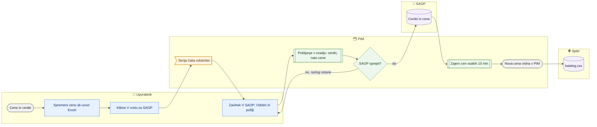

# Cene in ceniki — pregled, sprememba, uvoz in pošiljanje v SAOP

> **Področje:** Poslovanje · **Lastnik:** urednik kataloga (zapis v SAOP), komerciala (pregled) · **Stanje:** ✅ deluje · **Preverjeno:** 2026-09-29, iz kode (paketna sprememba #31)

## 1. Namen

Pregled cen vseh podjetij po cenikih, kot jih vodi SAOP, in pot za spremembo: sprememba, nova cena ali nov cenik gre iz PIM v vrsto za SAOP, po odobritvi v SAOP, v PIM pa se pokaže šele, ko jo zajem cen prinese nazaj. SAOP ostane vir resnice, zato `katalog.csv` nikoli ne odide s ceno, ki je SAOP ne pozna.

## 2. Kdo sodeluje

| Vloga | Kaj naredi v procesu |
|---|---|
| Komerciala | Pregleduje cene in cenike, izvozi Excel; uvrstiti v vrsto ali odobriti **ne more**. |
| Urednik kataloga | Spremeni ceno (eno ali paketno), doda ceno ali cenik, uvozi Excel, odobri in pošlje v SAOP. |
| Skrbnik | Enako kot urednik; povratek uvoza na `/uvozi`. |
| Avtomatika (PIM) | Zajem cen iz SAOP vsakih 10 minut; pošiljanje odobrenih serij v ozadju (najprej ceniki, nato cene). |

## 3. Kdaj se sproži

- **Ročno:** urednik na `/cene` (gumbi **Spremeni**, **V vrsto za SAOP**, **Spremeni ceno …** za izbrane, **Nov cenik**) ali `/cene/uvoz`; odobritev na zavihku »V SAOP«.
- **Po urniku:** `PRICE_IMPORT` (spremembe cen `GetPrices`, vsakih 600 s po podjetjih); šifrant cenikov v nočni uskladitvi.
- **Ob dogodku:** ni.

## 4. Vhod in izhod

| | Kaj | Od kod / kam |
|---|---|---|
| **Vhod** | Cene po cenikih (neto, DDV, velja od, aktivna), šifrant cenikov | SAOP (zajem) |
| **Vhod** | Delovni list cen (ključ: Podjetje + Cenik + Šifra artikla) | Excel |
| **Izhod** | Serija v vrsti za SAOP (čaka odobritev) | PIM |
| **Izhod** | `AddPrices`, `ModifyPricesV2`, `AddPriceLists` | SAOP (po odobritvi) |
| **Izhod** | Cene B2C (IQ) in B2B (VID cenik) v `katalog.csv` | Splet, po zajemu nazaj |

## 5. Diagram

## 6. Koraki

| # | Kdo | Kje (stran) | Kaj narediš | Kaj se zgodi v sistemu | Kako preveriš, da je uspelo |
|---|---|---|---|---|---|
| 1 | Komerciala / urednik | `/cene` → **Cene po izdelkih** | Iščeš po šifri ali EAN, v **Filtri** izbereš podjetje, cenik, število cenikov, »Vrsta za SAOP«. | Ena vrstica na izdelek s ceniki, min/max neto in stanjem vrste. | Število zadetkov. |
| 2 | Urednik | `/cene` | Klikneš vrstico izdelka, pri ceniku **Spremeni**, popraviš neto, DDV, »velja od«, aktivna in klikneš **V vrsto za SAOP**. Novo ceno dodaš v »Dodaj ceno v cenik« → **V vrsto za SAOP**. | Nastane serija »ročno na strani«, ki čaka odobritev. Stara cena ostane prikazana z oznako stanja vrste. | Oznaka »čaka odobritev« ob ceni; značka na zavihku »V SAOP«. |
| 2a | Urednik | `/cene` | **Paketno:** označiš izdelke (kljukica v vrstici, »Označi vse na strani« ali »Označi vse, ki ustrezajo filtru (N)«), klikneš **Spremeni ceno …**, izbereš cenik, »za odstotek« (npr. +5) ali »na novo neto vrednost«, datum »velja od« (privzeto danes) in **Pokaži predogled**. | Predogled prej/potem (prvih 50), število sprememb, enakih in preskočenih (brez cene v ceniku, neaktivne), opozorilo za spremembe nad 25 %. Pri »vse po filtru« nabor prebere strežnik po filtru strani (največ 20.000 cen). | Povzetek »N cen se spremeni« in tabela prej/potem. |
| 2b | Urednik | `/cene` | **Uvrsti N cen v vrsto za SAOP …** → potrditev »Uvrstiti N cen v ceniku X (podjetja) v vrsto za SAOP?« → **Da**. | Ena serija »paketno« na podjetje, ki čaka odobritev; zapis v zgodovino uvozov (vrsta CENE) s cenami prej/potem. V PIM se ne spremeni nič, dokler zajem ne prinese cene iz SAOP. | Sporočilo s številko serije in povezavo »uvoz #N«; serija na zavihku »V SAOP«. |
| 3 | Urednik | `/cene` → **Ceniki** | **Nov cenik**: podjetje, šifra, naziv, valuta (978 = EUR), po želji »Napolni s cenami iz cenika« s faktorjem; **Uvrsti v vrsto za SAOP**. | Cenik in cene gredo v isto serijo; cene počakajo, da odide cenik. | Cenik v seznamu z oznako »cenik: čaka odobritev«. |
| 4 | Urednik | `/cene` | **Izvozi Excel (N)** → urediš neto, DDV, datum ali aktivnost. | Ena vrstica = cenik × izdelek. | Datoteka `.xlsx`. |
| 5 | Urednik | `/cene/uvoz` | Naložiš datoteko (po želji podjetje za vrstice brez stolpca »Podjetje«). | Predogled: spremenjene, nove, brez sprememb, sprememba v %, opozorila. | Razdelek »2. Kaj bo šlo v SAOP«. |
| 6 | Urednik | `/cene/uvoz` | Pregledaš opozorila in klikneš **Uvrsti N cen v vrsto za SAOP (…)**. | Po podjetju nastane serija »uvoz iz Excela«; uvoz se zapiše v zgodovino. | »3. Izid«: v vrsto, že čakalo, enakih kot v SAOP, zavrnjenih; povezava »uvoz #N«. |
| 7 | Urednik | `/cene` → **V SAOP** | Pri seriji **Podrobnosti** (vsebina), nato **Odobri in pošlji** ali **Prekliči**. Zastalo pošlješ z **Pošlji čakajoče**. | Pošiljanje teče v ozadju (tudi, če zapustiš stran), en tek na podjetje; najprej ceniki, nato cene. **Ustavi pošiljanje** ga prekine. | Okvir »Poslanih N, zavrnjenih M« in »Zadnji odgovori SAOP«. |
| 8 | Avtomatika | — | — | Zajem cen v 10 minutah prinese novo ceno v PIM; oznaka vrste izgine. | Na `/cene` nova vrednost brez oznake »poslano, čaka zajem iz SAOP«. |
| 9 | Avtomatika | — | — | Naslednji `WEB_CATALOG_EXPORT` vzame novo ceno (B2C iz cenika podjetja 2, B2B iz cenika B2B Vidadrie). Varovalka zadrži sumljivo spremembo. | `/splet` → Preglej vsebino; `/varovalke`. |

## 7. Pravila in varovalke

- Nič ne odide v SAOP brez odobritve. PIM spremembe ne zapiše v svoje cene — prikaže jo šele zajem.
- Zapis v SAOP (uvrstitev in odobritev) smeta samo ADMIN in CATALOG_EDITOR (dovoljenje zapisa v SAOP); komerciala lahko samo gleda in predogleda uvoz.
- SAOP za cene nima PATCH: nova cena `AddPrices`, sprememba `ModifyPricesV2`, nov cenik `AddPriceLists`. Cena za cenik, ki ga SAOP še ne pozna, počaka.
- Nov cenik se doda na zavihku »Ceniki«, ne z uvozom.
- Paketna sprememba (#31, privzeto za noč, odločitev #38): spremeni samo neto v enem ceniku, DDV in aktivnost ostaneta, zaokroži na cent (AwayFromZero), osnova za odstotek je cena iz SAOP (ne tista v vrsti). Novih cen ne dodaja; neaktivne cene preskoči. Izbira se nikoli ne pomeša med podjetji — serija nastane za vsako podjetje posebej.
- DDV (odgovor lastnika na #38): uporabnik mora vedeti, ali je DDV vključen. Paketna sprememba zato povsod piše »neto — brez DDV« in v predogledu pokaže tudi »Z DDV potem«. Kako spletna trgovina ve, ali je cena z DDV (NW artikli z DDV, ostali brez), je ločena naloga.
- Cene v SAOP ni mogoče izbrisati; povratek uvoza jo izklopi (Aktivna = N). Povrne se samo cena, ki jo je zajem že prinesel; sicer je pravi povratek preklic čakajoče serije.
- Na splet: B2B cena IQ artiklov je VID-ova cena B2B po isti šifri; artikel brez nje je brez B2B cene.

## 8. Ko gre kaj narobe

| Znak (kaj vidiš) | Verjeten vzrok | Kaj narediš |
|---|---|---|
| Oznaka »SAOP je zavrnil« z razlogom | SAOP ni sprejel dokumenta | Preberi razlog v podrobnostih serije, popravi in uvrsti znova. |
| »poslano, čaka zajem iz SAOP« ostaja dlje kot 10 min | Zajem cen ne teče ali je padel | `/sistem/posel/PRICE_IMPORT`. |
| Gumba **V vrsto za SAOP** ni | Vloga brez dovoljenja zapisa v SAOP | Prosi urednika kataloga. |
| »čaka, da odide cenik« | Cenik iz iste serije še ni v SAOP | Odobri serijo s cenikom. |
| Cena na spletu se ne spremeni | Izvoz še ni tekel ali je varovalka zadržala artikel | `/splet`, `/varovalke`. |
| Napačen uvoz cen ali paketna sprememba | — | `/uvozi/{id}` → **Prekliči, kar še čaka v SAOP** ali **Pripravi povratek**. |
| »Filter zajame … cen — največ 20.000 naenkrat« | Paketna sprememba po filtru je prevelika | Zoži filter (podjetje, iskanje) ali uporabi izvoz in uvoz Excela. |
| »Zgodovina spremembe ni bila zapisana« | Zapis v `ops.ImportRun` ni uspel | Serija v vrsti ostane; če je napačna, jo prekliči na zavihku »V SAOP«. |

## 9. Tehnično ozadje

Za skrbnika in razvoj

- **Strani:** `Prices.razor` (zavihki `cene`, `ceniki`, `saop`), `PriceImport.razor`; izvoz `/izvoz/cene.xlsx`.
- **Paketna sprememba (#31):** `PriceWorkbookService.PlanBulkAsync` (predogled kot uvoz, `PriceImportPreview`) → `ApplyAsync(source: "BULK")` → `ImportHistoryService.RecordAsync(CENE)`. Izbira na strani je začasno lokalna; zamenja jo skupni `PimBulkBar` (naloga #39).
- **Storitve / delavci:** `PriceService`, `PriceWorkbookService`, `PriceSendJobs` (pošiljanje v ozadju iz intraneta), `ImportHistoryService`; zajem `PIM.KatalogWorker --endpoints GetPrices`.
- **Tabele in pogledi:** `canon.ProductPrice`, `out.OutboundBatch`, `out.OutboxMessage`, `out.EnqueueSaopPriceChanges`, `out.EnqueueSaopPriceList`, `out.ApproveOutboundBatch`, `out.CancelOutboundBatch`, `out.ClaimSaopDocument`, `out.ExportPriceList` (B2B iz podjetja 3), `ops.ImportRun`.
- **Migracije:** 083, 208, 210, 213, 265, 280.
- **Urniki:** `PRICE_IMPORT` (600 s), `NIGHTLY_RECONCILIATION` (šifrant cenikov).

## 10. Odprta vprašanja in razlike

- ⚠️ Cene se pošiljajo iz procesa intraneta (`PriceSendJobs`), ne prek odhodnega dispečerja `SAOP_OUTBOUND_DISPATCH`. Če se intranet (IIS) med pošiljanjem ponovno zažene, tek prekine; preostanek ostane v vrsti za **Pošlji čakajoče**.
- ⚠️ Varovalka cen (×10/×100, skok) deluje šele na `katalog.csv`; ob uvozu cen so le opozorila v predogledu, ne zadržanje.
- ⚠️ Ali SAOP res vrne spremenjeno ceno v 10 minutah (okno `Saop:LookbackDays`), je odvisno od nastavitev strežnika.

## Povezani procesi

- [Izhod v SAOP](../05-izhod-saop/izhod-v-saop.md): odobritev in pošiljanje v SAOP.
- [Zgodovina uvozov in povratek](../01-nadzor/zgodovina-uvozov-in-povratek.md): povratek uvoza cen.
- [Varovalke](../01-nadzor/varovalke.md): zadržanje sumljive cene v `katalog.csv`.
- [Katalog in stranke za splet](../06-izhod-splet/katalog-in-stranke-csv.md): cene B2B/B2C v katalogu.
- [Cenik za tisk](cenik-za-tisk.md), [Preverbe cen in zaloge](preverbe-cen-in-zaloge.md), [Popusti](popusti.md).
