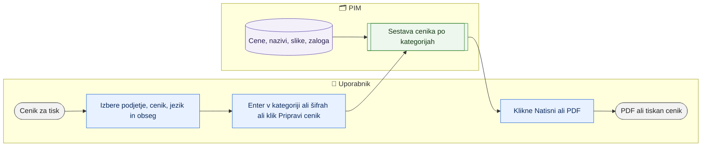

# Cenik za tisk (PDF iz kategorije ali izbranih artiklov)

> **Področje:** Poslovanje · **Lastnik:** komerciala · **Stanje:** ✅ deluje · **Preverjeno:** 2026-09-30, iz kode (#113, #107)

## 1. Namen

Komerciala pripravi digitalni cenik za kupca (kategorija ali seznam šifer, B2C ali B2B, v izbranem jeziku) in ga natisne ali shrani kot PDF z ukazom brskalnika.

## 2. Kdo sodeluje

| Vloga | Kaj naredi v procesu |
|---|---|
| Komerciala | Izbere podjetje, cenik, jezik, kategorijo ali šifre in natisne. |
| Urednik kataloga | Enako. |
| Skrbnik | Ni vloge. |
| Avtomatika (PIM) | Sestavi cenik iz trenutnih cen, nazivov, slik in zaloge. |

## 3. Kdaj se sproži

- **Ročno:** na `/cene/tisk` (gumb **Cenik za tisk** na `/cene`), ko komerciala potrebuje cenik za kupca.
- **Po urniku:** ni.
- **Ob dogodku:** ni.

## 4. Vhod in izhod

| | Kaj | Od kod / kam |
|---|---|---|
| **Vhod** | Podjetje, cenik B2C/B2B, jezik (sl, en, de, hr, it), spletno mesto, kategorija ali šifre, »samo objavljeni«, »s slikami« | Uporabnik |
| **Vhod** | Cene, nazivi, proizvajalec, slike, zaloga | PIM |
| **Izhod** | Tiskan cenik ali PDF, razvrščen po kategorijah | Tiskalnik / datoteka |

## 5. Diagram

## 6. Koraki

| # | Kdo | Kje (stran) | Kaj narediš | Kaj se zgodi v sistemu | Kako preveriš, da je uspelo |
|---|---|---|---|---|---|
| 1 | Komerciala | `/cene/tisk` | Izbereš podjetje, cenik (B2C maloprodaja / B2B veleprodaja), jezik in spletno mesto. | — | — |
| 2 | Komerciala | `/cene/tisk` | Vpišeš pot kategorije (npr. »Notranja svetila > Viseča svetila«) **ali** šifre, ločene z vejico ali novo vrstico; po želji »samo objavljeni« in »s slikami«. | — | — |
| 3 | Komerciala | `/cene/tisk` | Pritisneš Enter v polju kategorije ali šifer (ali klikneš **Pripravi cenik** za cel cenik podjetja). Vsaka nadaljnja sprememba (podjetje, cenik, jezik, spletno mesto, obseg, »samo objavljeni«) cenik osveži sama. | Cenik se sestavi po kategorijah: šifra, EAN, naziv, proizvajalec, cena brez DDV, DDV %, cena z DDV, zaloga; največ 2000 artiklov (nad tem stran opozori, naj zožiš izbiro). Izbira se zapiše v naslov strani. | Glava »… — cenik B2C/B2B«, datum in število artiklov. |
| 4 | Komerciala | `/cene/tisk` | Klikneš **Natisni / PDF** (ali Ctrl+P → Shrani kot PDF). | Brskalnik natisne samo cenik (orodna vrstica je skrita). | PDF v mapi Prenosi. |

## 7. Pravila in varovalke

- Cenik samo bere; nič ne zapiše.
- Glava pravi »z DDV« za B2C in »brez DDV« za B2B.
- Artikli brez cene v izbranem ceniku se ne pokažejo.
- Vsa izbira je v naslovu strani (`podjetje`, `cenik`, `jezik`, `mesto`, `kategorija`, `sifre`, `vsi`, `slike`, `pripravi`):
  povezavo lahko pošlješ sodelavcu in odpre isti cenik istega podjetja; »Nazaj« v brskalniku vrne prejšnjo izbiro.
- Besedilni polji (kategorija, šifre) bereta bazo šele ob Enter ali izhodu iz polja, ne na vsak pritisk tipke.
- Brez kategorije in šifer (cel cenik podjetja) se cenik pripravi samo na gumb.
- Prazen cenik pove, zakaj je prazen (kategorija s poljem poti, šifre, podjetje, cenik, »samo objavljeni«) in kaj poskusiti (#107).
- Če del vpisanih šifer ni v ceniku, stran našteje, katerih ni (ne obstajajo v podjetju, nimajo cene v ceniku ali niso objavljene).
- Jezik vpliva samo na naziv: artikli brez prevoda v izbrani jezik ostanejo s slovenskim nazivom (stran to napiše).
- Spletno mesto izbere pot kategorije na tem mestu; brez mesta velja prva kategorija artikla.

## 8. Ko gre kaj narobe

| Znak (kaj vidiš) | Verjeten vzrok | Kaj narediš |
|---|---|---|
| »Za to izbiro ni artiklov s ceno.« | Napačna pot kategorije, cenik ali »samo objavljeni« | Preveri pot (natančno kot v drevesu) ali odkljukaj »samo objavljeni«. |
| Manjkajo slike | Artikel nima slike ali povezava ne deluje | `/izdelki` → Mediji. |
| Naziv ni v izbranem jeziku | Prevod manjka | [Prevodi](../04-kakovost/prevodi.md). |

## 9. Tehnično ozadje

Za skrbnika in razvoj

- **Strani:** `PIM.Intranet/Components/Pages/PriceSheet.razor`
- **Storitve / delavci:** `PriceSheetService`, `CatalogReadService.GetWebSitesAsync`.
- **Tabele in pogledi:** `intranet.GetPriceListSheet`.
- **Migracije:** 150.
- **Urniki:** ni.

## 10. Odprta vprašanja in razlike

- ⚠️ Izbira cenika je omejena na B2C in B2B; drugih cenikov SAOP (npr. akcijskih) ni mogoče natisniti.
- ⚠️ Cenik za tisk bere cenik **izbranega** podjetja. IQLighting v SAOP nima cenika B2B (migracija 208), na spletu pa se B2B cena IQ artiklov bere iz cenika Vidadrie (213). Cenik za tisk »IQLighting — B2B« je zato verjetno prazen ali drugačen od spletnega.

## Povezani procesi

- [Cene in ceniki](cene-in-ceniki.md): vir cen.
- [Kategorije izdelka](../03-izdelki/kategorije-izdelka.md): pot kategorije.
- [Mediji](../03-izdelki/mediji.md): slike v ceniku.
