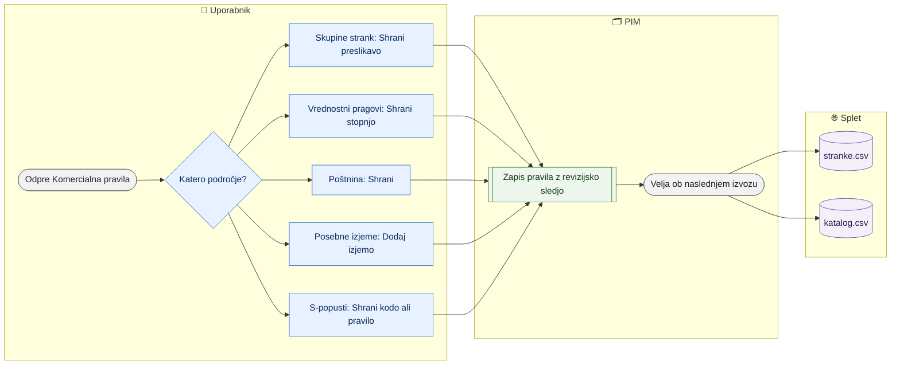

# Komercialna pravila — Magento skupine, vrednostni pragovi, poštnina, izjeme in S-popusti

> **Področje:** Poslovanje · **Lastnik:** komerciala · **Stanje:** ⚠️ delno · **Preverjeno:** 2026-09-24, iz kode

## 1. Namen

Komerciala na enem mestu nastavi pravila, ki določajo ceno in popust kupca na spletu: katera Magento skupina pripada tipu stranke, splošno lestvico vrednostnega rabata, poštnino, izjeme skupinskih popustov in posebne S-popuste na polno pakiranje. Rezultat so pravila v PIM, ki jih berejo `stranke.csv`, `katalog.csv` in kartice strank.

## 2. Kdo sodeluje

| Vloga | Kaj naredi v procesu |
|---|---|
| Komerciala | Ureja vse razdelke strani. |
| Urednik kataloga | Enako kot komerciala. |
| Skrbnik | Enako. |
| Avtomatika (PIM) | Pravila zapiše z revizijsko sledjo; ob izvozu izračuna skupine popustov in posebne S po strankah in tipih. |

## 3. Kdaj se sproži

- **Ročno:** komerciala na `/pravila-popustov` (Pravila → zavihek »Komercialna pravila«), ob spremembi prodajne politike.
- **Po urniku:** ni; pravila se upoštevajo ob naslednjem `WEB_CATALOG_EXPORT`.
- **Ob dogodku:** ni.

## 4. Vhod in izhod

| | Kaj | Od kod / kam |
|---|---|---|
| **Vhod** | Tipi strank, stranke, rabatne skupine artiklov, S kode izdelkov | PIM |
| **Vhod** | SAOP rabatni ceniki (osnova, ki jo izjeme preglasijo) | SAOP (nočni zajem) |
| **Izhod** | Magento skupina tipa, vrednostni pragovi | `stranke.csv` (»Skupina (Magento)«, »Rabat prag/% 1–3«) |
| **Izhod** | Izjeme skupinskih popustov | `stranke.csv` (»Skupine popustov«, »Popust NW«) |
| **Izhod** | Šifrant S kod, posebni S po tipu in stranki | `katalog.csv` (»S popust %«, »Posebni S za skupino strank«, »Posebni popust za stranko«) |
| **Izhod** | Pravila poštnine | samo PIM (⚠️ v nobeni datoteki) |

## 5. Diagram

## 6. Koraki

| # | Kdo | Kje (stran) | Kaj narediš | Kaj se zgodi v sistemu | Kako preveriš, da je uspelo |
|---|---|---|---|---|---|
| 1 | Komerciala | `/pravila-popustov` | Klikneš **Skupine strank**, izbereš »Tip stranke«, vpišeš »Ključ skupine Magento« (prazno = odstrani) in **Shrani preslikavo**. | Vse stranke tega tipa dobijo to Magento skupino v `stranke.csv`. | Tabela tipov: »Preslikano«; povzetek »Preslikane skupine strank N / M«. |
| 2 | Komerciala | `/pravila-popustov` | **Vrednostni pragovi** → **Uredi** pri stopnji, vpišeš »Prag bruto brez DDV« in »Popust %«, **Shrani stopnjo**. | Splošna lestvica velja za stranke brez lastnih pragov (lastne urejaš na kartici stranke). | Nova vrednost v tabeli pragov. |
| 3 | Komerciala | `/pravila-popustov` | **Poštnina** → spremeniš prag naročila, dolžino paketa, neto poštnino, »Brezplačno«, prednost in pri vrstici **Shrani**. | Pravilo se zapiše v PIM. | Sporočilo o uspehu. |
| 4 | Komerciala | `/pravila-popustov` | **Posebne izjeme** → »Izjema velja za« (tip ali posamezna stranka — vpišeš **interni ID** stranke), »Skupina artiklov«, »Popust %«, »Velja od/do« in **Dodaj izjemo**. | Izjema ima prednost pred SAOP popustom (stranka > tip > SAOP). | Vrstica v tabeli izjem s stanjem veljavnosti. |
| 5 | Komerciala | `/pravila-popustov` | **S-popusti** → v šifrantu S kod **Uredi** ali vpišeš novo kodo in »Popust %« ter **Shrani kodo**. | Odstotek velja za vse izdelke s to kodo. | Tabela »Šifrant S kod«. |
| 6 | Komerciala | `/pravila-popustov` | **S-popusti** → »Dodaj pravilo posebnega S«: »Komu« (tip ali stranka), »Za artikle« (rabatna skupina, vsi z S kodo, vsi, en artikel), »Nova S koda«, datumi, **Shrani pravilo**. | Obstoječe pravilo za isti cilj in obseg se posodobi. Zmaga najbolj specifično (artikel > S koda > skupina > vsi), stranka pred tipom. | V tabeli pravil štetje »izdelkov« in »strank«; v `katalog.csv` stolpca »Posebni S …«. |
| 7 | Komerciala | `/pravila-popustov` | Pri pravilu S klikneš **Umakni**. | Pravilo preneha veljati. | Vrstica izgine. |
| 8 | Avtomatika | — | — | Naslednji `WEB_CATALOG_EXPORT` zapiše nova pravila v `stranke.csv` in `katalog.csv`. | `/splet` → Preglej vsebino. |

## 7. Pravila in varovalke

- Skupina Magento je nosilna vez: nanjo so vezane cene in popusti, ne na posamezno stranko.
- Skupinski popust: ročni popust stranke → ročni popust tipa → SAOP rabatni cenik; poslovna enota deduje od plačnika, tranzit nima; ročni 0 % zavestno preglasi SAOP.
- Dodatni popust P2 (samo prek delovnega lista strank) se obračuna za osnovnim.
- S-popust velja pri količini ≥ PAK2 in samo za stranke s kljukico »Popust polno pakiranje«.
- Datum »velja do« ne sme biti pred »velja od«.
- Vse spremembe gredo v revizijsko sled (`b2b.AuditLog`); v SAOP se nič ne pošlje.
- Dostop: ADMIN, CATALOG_EDITOR, COMMERCIAL.

## 8. Ko gre kaj narobe

| Znak (kaj vidiš) | Verjeten vzrok | Kaj narediš |
|---|---|---|
| Gumb **Dodaj izjemo** je siv | Manjka skupina, odstotek ali cilj; datumi obrnjeni | Izpolni vsa polja. |
| Stranka po izjemi nima popusta v `stranke.csv` | Izjema še ne velja (datum), stranka ni iz podjetja 2, izvoz še ni tekel | Preveri veljavnost in `/splet`. |
| »Aktivna organizacija ni na voljo.« | Ni izbrane organizacije | Izberi podjetje v zgornji vrstici. |
| Pravilo S ne vpliva na izdelke (0 izdelkov) | Rabatna skupina ali S koda ne obstaja pri izdelkih | Preveri šifro skupine na seznamu izdelkov (filter Rabatna skupina). |

## 9. Tehnično ozadje

Za skrbnika in razvoj

- **Strani:** `PIM.Intranet/Components/Pages/DiscountRules.razor` (razdelki `types`, `tiers`, `shipping`, `overrides`, `spopusti`).
- **Storitve / delavci:** `IntranetDataService` (`SaveCustomerTypeMappingAsync`, `SaveValueTierAsync`, `SaveShippingRuleAsync`, `SaveGroupOverrideAsync`), `PackagingDiscountService`; `PIM.B2b.DiscountCalculator`.
- **Tabele in pogledi:** `pim.CustomerTypeMagentoGroup`, `pim.ValueDiscountTier`, `pim.ShippingRuleCatalog`, `b2b.GroupDiscountOverride`, `pim.PackagingDiscountCatalog`, `b2b.PackagingDiscountRule`, `b2b.PackagingDiscountSpecials`, `b2b.CustomerGroupDiscounts`, `b2b.AuditLog`; `intranet.GetDiscountRules`, `intranet.GetPackagingDiscountRules`.
- **Migracije:** 020, 098, 205, 214, 216, 252, 253, 274, 279.
- **Urniki:** ni lastnega; bere `WEB_CATALOG_EXPORT`.

## 10. Odprta vprašanja in razlike

- ⚠️ Pravila poštnine se shranijo, a jih ne bere noben izvoz (`katalog.csv`, `stranke.csv`); Magento jih iz PIM ne dobi. Ali jih Magento vodi sam, ni razvidno.
- ⚠️ Izjeme skupinskega popusta ni mogoče izbrisati ali urediti (ni gumba); ustaviš jo lahko samo z novo izjemo za isto skupino.
- ⚠️ Izjema za posamezno stranko zahteva **interni ID** stranke (ne šifre), ki ga uporabnik ne vidi; pravilo S pa zahteva šifro stranke.
- ⚠️ Stran dela v izbrani organizaciji; izjeme in pravila S za Vidadrio se v `stranke.csv` ne pokažejo (datoteka je samo za podjetje 2).
- ⚠️ Privzeti popusti po tipu iz baze kupcev ViD (TRGOVINE, INŠTALATERJI) in list »Dodatna pravila za artikle« niso preneseni (279, namenoma).

## Povezani procesi

- [Stranke](stranke.md): tip, lastni pragovi, posebni S in P2 po stranki.
- [Cene in ceniki](cene-in-ceniki.md): osnovne cene, na katere se popusti obračunajo.
- [Katalog in stranke za splet](../06-izhod-splet/katalog-in-stranke-csv.md): stolpci popustov v datotekah.
- [Iskanje in kartica izdelka](../03-izdelki/iskanje-in-kartica-izdelka.md): privzeti S izdelka in S-popust na seznamu izdelkov.
