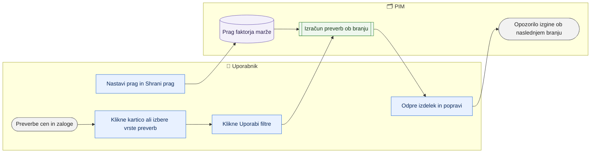

# Preverbe cen in zaloge (opozorila, prag faktorja marže)

> **Področje:** Poslovanje · **Lastnik:** komerciala · **Stanje:** ⚠️ delno · **Preverjeno:** 2026-09-24, iz kode

## 1. Namen

Seznam opozoril o cenah in zalogi (manjka cena, nizek faktor marže, podvojena cena, brez zaloge in prihoda, pod minimumom, zastarel posnetek). Opozorila **ne ustavijo** izvoza — povedo, kje je vredno pogledati. Komerciala nastavi prag faktorja marže.

## 2. Kdo sodeluje

| Vloga | Kaj naredi v procesu |
|---|---|
| Komerciala | Pregleda preverbe, nastavi prag faktorja marže, potrdi ali reši alarme. |
| Urednik kataloga | Pregleda preverbe in popravi ceno ali podatek na kartici (praga ne more urejati). |
| Skrbnik | Enako kot komerciala. |
| Avtomatika (PIM) | Preverbe izračuna ob branju strani iz trenutnih cen in zalog. |

## 3. Kdaj se sproži

- **Ročno:** komerciala na `/preverbe` (tudi s kartic številk; filtri so v naslovu strani).
- **Po urniku:** ni — preverbe se izračunajo ob odprtju strani.
- **Ob dogodku:** ni.

## 4. Vhod in izhod

| | Kaj | Od kod / kam |
|---|---|---|
| **Vhod** | Cene po cenikih (tudi nabavni cenik NAB), zaloge, min/max, posnetki | PIM |
| **Vhod** | Prag faktorja marže (privzeti in po podjetju) | Uporabnik |
| **Izhod** | Seznam opozoril z vzrokom, prodajno in prevzemno ceno, faktorjem | Zaslon |
| **Izhod** | Shranjen prag; potrjeni/rešeni alarmi | PIM |

## 5. Diagram

## 6. Koraki

| # | Kdo | Kje (stran) | Kaj narediš | Kaj se zgodi v sistemu | Kako preveriš, da je uspelo |
|---|---|---|---|---|---|
| 1 | Komerciala | `/preverbe` | Pogledaš kartice: Brez B2C cene, Brez B2B cene, Faktor marže pod pragom, Brez zaloge in brez prihoda, Podvojen zapis cene, Zaloga pod minimumom, Zastarel posnetek. Klik odpre filtriran seznam. | Števila za trenutno izbrano organizacijo. | Seznam pod karticami. |
| 2 | Komerciala | `/preverbe` | Vpišeš šifro/EAN/naziv, »Cenik ali skladišče«, obkljukaš vrste preverb in klikneš **Uporabi filtre**. | Seznam z vzrokom, prodajno, prevzemno ceno, faktorjem, osnovo in svežino. | »N preverb«. |
| 3 | Komerciala / urednik | Kartica izdelka | Klikneš šifro (odpre razdelek cen ali zaloge na kartici) in popraviš vzrok (cena gre v SAOP po odobritvi). | — | Ob naslednjem nalaganju preverba izgine. |
| 4 | Komerciala | `/preverbe` → »Faktor marže — prag« | Vpišeš prag (npr. 2,00) za privzeto ali svoje podjetje in klikneš **Shrani prag**. | Izdelek, katerega prodajna cena / nabavna cena je pod pragom, pride v preverbo FAKTOR_MARZE; predlagana cena = nabavna × prag. | Sporočilo »Prag je shranjen (N) …«. |
| 5 | Komerciala | `/preverbe` → »Obvestila« | Pri alarmu klikneš **Potrdi** ali **Reši**. | Alarm je potrjen/rešen. | Sporočilo; alarm izgine. |

## 7. Pravila in varovalke

- Preverbe so opozorila; nobena ne blokira izvoza v SAOP ali na splet.
- Prag faktorja marže in alarme ureja samo ADMIN ali COMMERCIAL.
- Faktor marže = prodajna cena / nabavna cena (cenik NAB).
- Prag po podjetju prevlada nad privzetim.

## 8. Ko gre kaj narobe

| Znak (kaj vidiš) | Verjeten vzrok | Kaj narediš |
|---|---|---|
| Okvir »manjka …« namesto seznama | Bralni model preverb v bazi manjka | Skrbnik: migracije 131/132/150. |
| Kartice kažejo »—« | Preverba ni na voljo | Kot zgoraj. |
| »Vpiši številko, npr. 2,00.« | Prag ni številka | Popravi vnos. |
| Gumbi alarmov manjkajo (»samo za ADMIN in COMMERCIAL«) | Vloga urednika | Prosi komercialo. |

## 9. Tehnično ozadje

Za skrbnika in razvoj

- **Strani:** `PIM.Intranet/Components/Pages/Checks.razor`
- **Storitve / delavci:** `IntranetFeatureReadService` (`intranet.GetPriceChecks`, `intranet.GetStockChecks`), `RulesWriteService` (`GetCheckThresholdsAsync`, `SaveCheckThresholdAsync`), `GovernanceReadService.GetAlertsAsync`, `PimCheckCode`.
- **Tabele in pogledi:** `pim.CheckThreshold`, `canon.ProductPrice`, `stock.Snapshot`, `ops.Alert` (vrste `PRICE_CHECK`, `STOCK_CHECK`).
- **Migracije:** 131, 132, 150, 191, 218.
- **Urniki:** ni.

## 10. Odprta vprašanja in razlike

- ⚠️ Razdelek »Obvestila« pričakuje alarme `PRICE_CHECK`/`STOCK_CHECK`, ki jih po besedilu strani **nihče ne ustvarja** (ni workerja). Razdelek je zato vedno prazen z opombo »manjka«.
- ⚠️ Preverbe veljajo za trenutno izbrano organizacijo; pregleda čez vsa podjetja ni.
- ⚠️ Filter vrst preverb kaže tehnične kode (npr. `CENA_MANJKA_B2B`), ne slovenskih imen.
- ⚠️ »Brez B2B cene« za IQLighting: na spletu se B2B cena bere iz cenika Vidadrie, preverba pa (verjetno) iz cenika istega podjetja — iz kode strani ni razvidno.

## Povezani procesi

- [Cene in ceniki](cene-in-ceniki.md): popravek cene.
- [Zaloge in rezervacija](zaloge-in-rezervacija.md): vir zaloge in min/max.
- [Kakovost in validacija](../04-kakovost/kakovost-in-validacija.md): blokirajoče napake (za razliko od teh opozoril).
