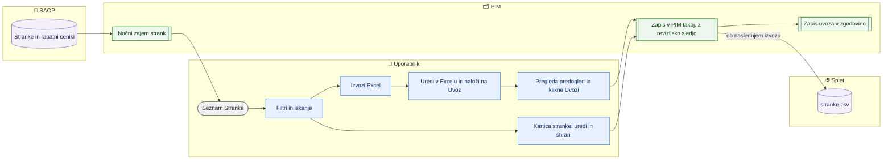

# Stranke — seznam, kartica in delovni list strank

> **Področje:** Poslovanje · **Lastnik:** komerciala · **Stanje:** ✅ deluje · **Preverjeno:** 2026-09-24, iz kode

## 1. Namen

Komerciala najde stranko (kupca, dobavitelja, proizvajalca) katerega koli podjetja, ji na kartici nastavi tip, B2B nastavitve, pragove, popuste, kontakte in zaznamke, ali pa vse to naenkrat uredi v Excelu in uvozi nazaj. Rezultat so podatki strank v PIM, ki za podjetje 2 gredo v `stranke.csv` (in posebni S v `katalog.csv`).

## 2. Kdo sodeluje

| Vloga | Kaj naredi v procesu |
|---|---|
| Komerciala | Išče stranke, ureja kartico, izvozi in uvozi delovni list strank, piše zaznamke. |
| Urednik kataloga | Enako kot komerciala. |
| Skrbnik | Enako; poleg tega povratek uvoza na `/uvozi`. |
| Avtomatika (PIM) | Ponoči zajame stranke in rabatne cenike iz SAOP, izračuna vlogo stranke, skupine popustov in stanje »v stranke.csv«; urni izvoz zapiše `stranke.csv`. |

## 3. Kdaj se sproži

- **Ročno:** komerciala na `/stranke`, kartici `/stranke/{Id}` ali z uvozom na `/stranke/uvoz`.
- **Po urniku:** zajem strank (`GetCustomers`) in rabatov (`ComercialTerms`) iz SAOP v nočni uskladitvi `NIGHTLY_RECONCILIATION` (00:30); izvoz `stranke.csv` v poslu `WEB_CATALOG_EXPORT`.
- **Ob dogodku:** ni.

## 4. Vhod in izhod

| | Kaj | Od kod / kam |
|---|---|---|
| **Vhod** | Stranke, plačnik, cenik, rabatni cenik, aktivnost, referent, rabati po skupinah artiklov | SAOP (nočni zajem) |
| **Vhod** | Delovni list strank (`.xlsx`, isti kot izvoz) | Excel |
| **Izhod** | Ročni prepis splošnih podatkov, kontakti, tip, vrsta, B2B nastavitve, pragovi, skupinski popusti, posebni S, P2, skrbnik, e-pošte, zaznamki, enote | PIM (takoj) |
| **Izhod** | Vrstica v `stranke.csv` (samo aktivne stranke podjetja 2 z B2B profilom) | Splet, ob naslednjem izvozu |
| **Izhod** | Zapis uvoza s prejšnjimi vrednostmi | Zgodovina uvozov (`/uvozi`) |

## 5. Diagram

## 6. Koraki

| # | Kdo | Kje (stran) | Kaj narediš | Kaj se zgodi v sistemu | Kako preveriš, da je uspelo |
|---|---|---|---|---|---|
| 1 | Komerciala | `/stranke` | Izbereš zavihek vloge (kupci, dobavitelji, proizvajalci), vpišeš iskanje (šifra, naziv, davčna, kraj), odpreš **Filtri** (podjetje, tip, aktivnost, vir vloge, popusti, »V stranke.csv«, Magento skupina). | Privzeto so vsa podjetja; filtri veljajo takoj. | Število rezultatov ob iskanju; čipi aktivnih filtrov. |
| 2 | Komerciala | `/stranke` | Klikneš vrstico stranke. | Odpre se kartica `/stranke/{Id}`. | Naslov je naziv, podnaslov podjetje, šifra in vloga; čipi Aktivna, stranke.csv, Magento skupina. |
| 3 | Komerciala | Kartica → **Splošni podatki** | Popraviš polje (naslov, davčna, plačnik, cenik, rabat, aktivnost …) in klikneš **Shrani splošne podatke**; **Počisti ročne prilagoditve** vrne vrednosti iz SAOP. | Ročna vrednost prevlada nad SAOP; v SAOP se nič ne pošlje. | Opomba »Ročno prilagojeno: ime, čas«. |
| 4 | Komerciala | Kartica → **Kontakti** | Vpišeš e-pošto, telefon, mobitel, osebe (ločene z navpičnico) in **Shrani kontakte**. | Kontakti gredo v `stranke.csv`. | Pod poljem piše vir vrednosti. |
| 5 | Komerciala | Kartica → **Komercialni podatki** | Nastaviš »Tip stranke«, »Vrsta stranke«, kljukice »Popust na polno pakiranje«, »Vrednostni rabat«, »B2B+ (brezplačna poštnina)« z datumi in klikneš **Shrani nastavitve**. Pragove vpišeš in **Shrani prag**. Posebni S: **Dodaj pravilo** / **Umakni**. | Tip določi Magento skupino; pragovi in kljukice gredo v `stranke.csv`, posebni S v `katalog.csv`. | Opomba »Gre v stranke.csv (aktivna, z B2B profilom)«; tabela »Skupine popustov« pokaže, kar gre v datoteko. |
| 6 | Komerciala | Kartica → **Poslovne enote in tranziti** | Izbereš vrsto (PE / Tranzit), stranko iz šifranta ali vpišeš ročno in klikneš **Dodaj**. | PE podeduje skupinske popuste od plačnika, tranzit jih nima. | Nova vrstica v tabeli. |
| 7 | Komerciala | Kartica → **Zaznamki** | Napišeš zaznamek in **Zapiši zaznamek**. | Zaznamek je viden vsem, ni ga mogoče spremeniti. | Zaznamek z imenom avtorja. |
| 8 | Komerciala | `/stranke` | Klikneš **Izvozi Excel (N)**. | Prenese se delovni list z natanko vrsticami pogleda in drugim listom »S po tipih strank«. | Datoteka `.xlsx`. |
| 9 | Komerciala | Excel | Urediš stolpce (vrsta, tip, B2B, pragovi, »Skupinski popusti stranke«, »Posebni S po izdelku«, »Dodatni popust po skupinah (P2)«, kontakti, skrbnik, e-pošte, »Dodaj opombo«). Prazna celica = ne spreminjaj, `-` = izprazni. | — | — |
| 10 | Komerciala | `/stranke/uvoz` | Po potrebi izbereš podjetje za vrstice brez stolpca »Podjetje« in naložiš datoteko. | Predogled: prebrane stranke, spremembe prej → potem, napake, stolpci samo za branje, pravila S po tipih. | Razdelek »2. Kaj bo uvoz naredil«. |
| 11 | Komerciala | `/stranke/uvoz` | Klikneš **Uvozi N sprememb pri M strankah …**. | Vse se zapiše takoj po istih poteh kot na kartici; uvoz se zapiše v zgodovino. | »3. Izid«: spremenjenih strank, število v `stranke.csv` in izdelkov s spremenjenim »Posebni popust za stranko«; povezava »uvoz #N«. |
| 12 | Avtomatika | — | — | Ob naslednjem `WEB_CATALOG_EXPORT` gredo spremembe v `stranke.csv` (in `katalog.csv`). | `/splet` → Preglej vsebino → `stranke.csv`. |

## 7. Pravila in varovalke

- PIM strank **ne pošilja** v SAOP; ročni prepis velja samo v PIM in prevlada nad SAOP, dokler ga ne počistiš.
- Vloga se izračuna znotraj podjetja stranke (dobavitelj izdelkov / SAOP vrsta D, proizvajalec izdelkov, kupec); ročna vrsta jo prepiše.
- V `stranke.csv` gre vsaka aktivna stranka podjetja 2 z B2B profilom; tip ni pogoj (brez tipa prazna Magento skupina).
- Skupine popustov v `stranke.csv`: ročni popust stranke → ročni popust tipa → SAOP rabatni cenik; PE deduje od plačnika, tranzit nima; samo danes veljavni in nad 0 %. P2 se obračuna za osnovnim: `100 − (100 − osnovni) × (100 − dodatni) / 100`.
- V uvozu je celica s seznamom (ločilo navpičnica) cel seznam: kar manjka, se umakne.
- Referent (SAOP) in opombe sta v delovnem listu samo za branje; skrbnik in e-pošte za dobavnice/obveščanje ne gredo v `stranke.csv`.
- Dostop: ADMIN, CATALOG_EDITOR, COMMERCIAL.

## 8. Ko gre kaj narobe

| Znak (kaj vidiš) | Verjeten vzrok | Kaj narediš |
|---|---|---|
| »Stolpci brez ustreznega polja (ne bodo uvoženi)« | Spremenjen naslov stolpca | Ne spreminjaj naslovov; izvozi znova. |
| Vrstica v »napakah« uvoza | Neznan tip, neveljavna številka ali datum | Popravi celico; ostale vrstice se uvozijo. |
| Stranka nima Magento skupine | Tip ni preslikan | `/pravila-popustov` → Skupine strank. |
| Kontakti »iz ERP« so prazni | Zajem kontaktov iz SAOP ne obstaja | Vpiši ročno (kartica pove, kaj manjka). |
| Uvoz pravi »v stranke.csv gre N«, datoteka se ne spremeni | Izvoz še ni tekel ali stranka ni iz podjetja 2 | Počakaj na `WEB_CATALOG_EXPORT` ali ga skrbnik zažene. |
| Napačen uvoz | — | `/uvozi/{id}` → **Pripravi povratek**. |

## 9. Tehnično ozadje

Za skrbnika in razvoj

- **Strani:** `Customers.razor`, `CustomerDetail.razor`, `CustomerPackagingPanel.razor`, `CustomerImport.razor`; izvoz `/izvoz/stranke.xlsx`.
- **Storitve / delavci:** `CustomerListService`, `CustomerCardService`, `CustomerWorkbookService`, `PackagingDiscountService`, `ImportHistoryService`; zajem `PIM.KatalogWorker` (`Customers`, `CustomerItemGroupDiscounts`).
- **Tabele in pogledi:** `b2b.Customer`, `pim.CustomerWebProfile`, `pim.CustomerContact`, `pim.CustomerExtra`, `pim.SalesClerk`, `b2b.CustomerValueDiscountTier`, `b2b.GroupDiscountOverride`, `b2b.CustomerExtraGroupDiscount`, `b2b.PackagingDiscountRule`, `b2b.CustomerGroupDiscounts`, `b2b.AuditLog`, `intranet.GetCustomerCard`, `intranet.GetCustomerList`, `intranet.GetCustomerListExtra`, `ops.ImportRun`.
- **Migracije:** 129, 140, 200, 202, 212, 250, 252, 253, 274, 279, 280.
- **Urniki:** `NIGHTLY_RECONCILIATION` (00:30), `WEB_CATALOG_EXPORT`.

## 10. Odprta vprašanja in razlike

- ⚠️ Oznaka »v stranke.csv« na seznamu in kartici ter filter »Gre v stranke.csv« upoštevata samo aktivnost in B2B profil, **ne podjetja**. Stranka Vidadrie je označena, kot da gre v `stranke.csv`, datoteka pa vsebuje samo stranke podjetja 2.
- ⚠️ Dodatni popust P2, referent in e-pošte (279) so bili uvedeni za bazo kupcev ViD (podjetje 3); v `stranke.csv` pridejo samo za stranke podjetja 2. Predlog združitve IQ + VID je odprt.
- ⚠️ Po uvozu stran napoti na »Pripravi izvoz« za ročno izdelavo; ta stran datoteke za Magento ne osveži (samo prenos).
- ⚠️ Kartica nima polj P2, skrbnika in e-pošt za dobavnice/obveščanje (279) — urejajo se samo prek delovnega lista.
- ⚠️ Zavihek »Dokumenti in finance« je prazen (vir ni odločen).
- ⚠️ Zajem kontaktov iz SAOP ne obstaja; vsi kontakti v `stranke.csv` so ročni.

## Povezani procesi

- [Popusti](popusti.md): Magento skupina po tipu, pragovi, izjeme, S-popusti.
- [Katalog in stranke za splet](../06-izhod-splet/katalog-in-stranke-csv.md): izvoz `stranke.csv`.
- [Zgodovina uvozov in povratek](../01-nadzor/zgodovina-uvozov-in-povratek.md): povratek uvoza strank.
- [Zajem iz SAOP](../02-vhodi/zajem-iz-saop.md): nočni zajem strank in rabatov.
