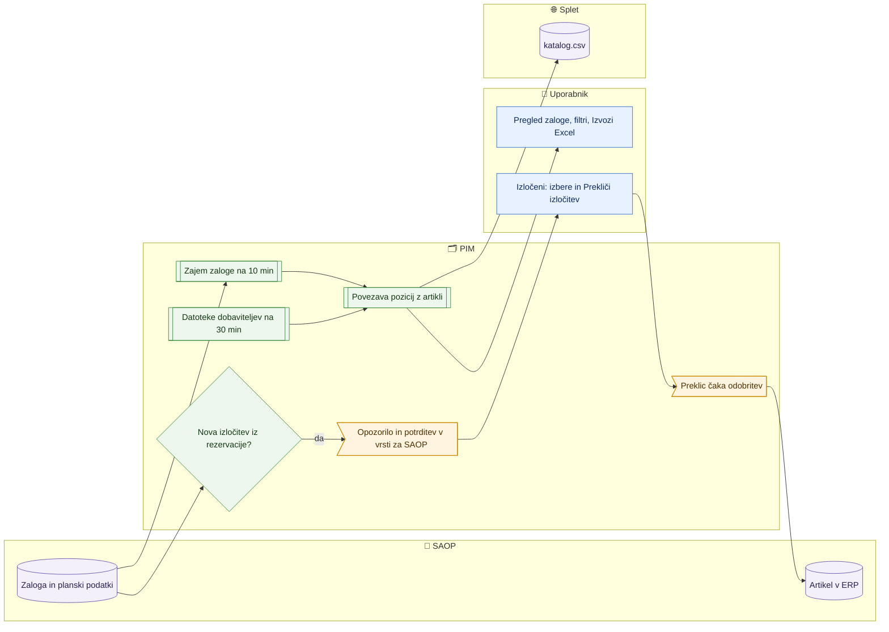

# Zaloge in izločitev iz rezervacije zaloge

> **Področje:** Poslovanje · **Lastnik:** komerciala · **Stanje:** ✅ deluje · **Preverjeno:** 2026-09-24, iz kode

## 1. Namen

Komerciala vidi, kaj je na zalogi pri nas (SAOP, vsa podjetja) in pri dobaviteljih (Nowodvorski, Braytron), kaj prihaja in kje so posebnosti, ter izvozi pogled v Excel. Na posebni strani pregleda artikle, ki jih je SAOP izločil iz rezervacije zaloge, in izločitev po potrebi prekliče (po odobritvi v SAOP). Zaloga v `katalog.csv` pride iz istih posnetkov.

## 2. Kdo sodeluje

| Vloga | Kaj naredi v procesu |
|---|---|
| Komerciala | Pregleda zalogo, filtrira, izvozi Excel; pregleda izločene iz rezervacije in predlaga preklic. |
| Urednik kataloga | Enako; odobri preklic izločitve na Izhod v SAOP. |
| Skrbnik | Nastavi, katera skladišča SAOP se berejo (`/nastavitve/skladisca`), in urnike zajema. |
| Avtomatika (PIM) | Bere zalogo iz SAOP in datotek dobaviteljev, poveže pozicije z artikli, ob novi izločitvi prižge opozorilo in uvrsti potrditev v vrsto za SAOP. |

## 3. Kdaj se sproži

- **Ročno:** komerciala na `/zaloge` ali `/nastavitve/rezervacija-zaloge`.
- **Po urniku:** `STOCK_IMPORT` (zaloga iz SAOP, vsakih 600 s), `SUPPLIER_STOCK_IMPORT` (Nowodvorski FTP, Braytron HTTPS, vsakih 1800 s, s spoštovanjem omejitev dobavitelja), datumi dobave v `NIGHTLY_RECONCILIATION` (`SAOP_DELIVERY_IMPORT` je za ročni zagon), dnevni mail »Zaloga pod MID« `STOCK_REPLENISHMENT_DIGEST` ob 5:30.
- **Ob dogodku:** SAOP na novo izloči aktiven artikel iz rezervacije (prehod ne → da) ob zajemu planskih podatkov.

## 4. Vhod in izhod

| | Kaj | Od kod / kam |
|---|---|---|
| **Vhod** | Količine, razpoložljivo, prihodi in datumi dobave po skladiščih | SAOP |
| **Vhod** | Zaloga in prihodi dobavitelja | Datoteke dobaviteljev (NW, BT) |
| **Vhod** | Zastavica »izloči iz rezervacije zaloge« (planski podatki) | SAOP |
| **Izhod** | Posnetki zaloge po viru, povezani z artikli; izpeljane težave | PIM |
| **Izhod** | Excel pogleda zaloge | Uporabnik |
| **Izhod** | Preklic izločitve kot sprememba v vrsti (`UpdateItemsPlanningData`) | SAOP, po odobritvi |
| **Izhod** | Lastna in dobaviteljeva zaloga, prihodi | `katalog.csv` |

## 5. Diagram

## 6. Koraki

| # | Kdo | Kje (stran) | Kaj narediš | Kaj se zgodi v sistemu | Kako preveriš, da je uspelo |
|---|---|---|---|---|---|
| 1 | Komerciala | `/zaloge` | Izbereš zavihek (Vsa zaloga, Na zalogi, Brez zaloge, Prihaja zaloga, Samo pri dobavitelju), vpišeš šifro ali EAN in pritisneš Enter. | Ena vrstica na artikel: naša zaloga (skladišče, količina, razpoložljivo, prihod), min/max, dobaviteljeva zaloga in prihod, podjetje, čas posnetkov. | Število zadetkov; stran po 50. |
| 2 | Komerciala | `/zaloge` | **Filtri**: podjetje, skladišče (SAOP), dobavitelj, posebnosti (pod min, nad max, prihod zamuja, negativna zaloga, samo pri dobavitelju, brez artikla v PIM), svežina posnetka; razvrstitev. | Filtri veljajo takoj in so v naslovu strani. | Čipi aktivnih filtrov. |
| 3 | Komerciala | `/zaloge` | Klikneš **Izvozi Excel (N)**. | Prenese se natanko ta pogled (brez uvoza — zaloga je samo za branje). | Datoteka `.xlsx`. |
| 4 | Komerciala | `/zaloge` → »Svežina po viru« | Pogledaš starost posnetka vsakega vira in »brez artikla«. | Vir, starejši od 24 ur, je označen z opozorilom. | Čip »Svežina«. |
| 5 | Komerciala | `/zaloge` → »Izpeljane težave« | Pogledaš zavrnjene pozicije po razlogu. | Težave nimajo gumba »reši« — izginejo, ko izgine vzrok. | — |
| 6 | Avtomatika | — | — | Ko SAOP na novo izloči aktiven artikel iz rezervacije, PIM posodobi eno kritično opozorilo na podjetje (zvonec, rdeči pas na `/sistem`) in v vrsto za SAOP uvrsti potrditev za ta artikel. Arhiviran (neaktiven) artikel zastavico izgubi in ne sproži opozorila. | Zvonec; `/outbound`. |
| 7 | Komerciala | `/nastavitve/rezervacija-zaloge` | Izbereš podjetje (privzeto vsa), obkljukaš artikle in klikneš **Prekliči izločitev** → **Da, prekliči izločitev**. | Za vsak artikel nastane sprememba »izloči iz rezervacije = ne« v vrsti za SAOP; artikli z že čakajočo spremembo nimajo kljukice (»Čaka na odobritev«). | Sporočilo o uvrščenih; vrstica kaže »Čaka na odobritev«. |
| 8 | Urednik | `/outbound` (Izhod v SAOP) | Odobriš spremembo. | Kljukica gre v SAOP po `UpdateItemsPlanningData`. | Po naslednjem zajemu artikla ni več na seznamu. |

## 7. Pravila in varovalke

- Zaloga je samo za branje: PIM je nikoli ne piše v SAOP.
- »Naša zaloga« je vsota čez skladišča, ki jih PIM bere iz SAOP (nastavitev na `/nastavitve/skladisca`).
- Zaloga dobavitelja se zapiše samo za obstoječe artikle (262); nespremenjena datoteka dobavitelja se ne zapiše znova.
- V `katalog.csv` je lastna zaloga IQ + VID skupaj, dobaviteljeva ločeno; stara ali manjkajoča zaloga ni dokaz, da je zaloga pošla.
- Preklic izločitve nikoli ne gre naravnost v SAOP — vedno čaka odobritev.
- Dostop do rezervacije: ADMIN, CATALOG_EDITOR, COMMERCIAL; `/zaloge` z dovoljenjem `page.stocks`.

## 8. Ko gre kaj narobe

| Znak (kaj vidiš) | Verjeten vzrok | Kaj narediš |
|---|---|---|
| Vir ima opozorilo svežine | Zajem ne teče ali dobavitelj vrača isto datoteko | `/sistem/posel/STOCK_IMPORT` oz. `SUPPLIER_STOCK_IMPORT`. |
| Vrstica »brez artikla« | Šifra ali EAN iz vira ni v PIM | Preveri šifro/EAN artikla; neujemanja v [Težave in neujemanja zajema](../02-vhodi/tezave-in-neujemanja-zajema.md). |
| Prihod »datuma ni« | Vir je javil količino brez datuma | Datumi pridejo ponoči iz SAOP. |
| Artikel ostaja na seznamu izločenih po odobritvi | Zajem še ni prebral planskih podatkov ali SAOP je zavrnil | `/izvozi/obvestila`, `/outbound`. |
| »Izločenih izdelkov trenutno ni mogoče naložiti.« | Povezava z bazo | Osveži stran. |

## 9. Tehnično ozadje

Za skrbnika in razvoj

- **Strani:** `Stocks.razor`, `CatalogReservationExclusions.razor`; izvoz Excel zaloge (migracija 190/191).
- **Storitve / delavci:** `StockReadService`, `CatalogReadService.GetReservationExclusionsAsync`, `SaopWriteService.EnqueueAsync` (polje `Planning.ExcludeQtyReservation`); `PIM.SaopStockWorker`, `PIM.SourceFetchWorker`, `PIM.StockFileWorker`; knjižnica `PIM.StockMapping` (`StockLandingWriter`, `StockMatchCounts`).
- **Tabele in pogledi:** `stock.Snapshot`, `stock.Position`, `stock.LandingRecord`, `stock.UnmatchedPosition`, `stock.ItemDeliveryDate`, `canon.ProductPlanning`, `out.ExportStockSource`, `out.CatalogStock`, `intranet.GetStockByItem`, `intranet.GetStockOverview`, `map.ProcessPlanningInbox`, sprožilec `canon.TR_Product_ClearReservationFlagOnArchive`, opozorilo `ReservationExcluded` v `ops.Alert`.
- **Migracije:** 103, 146, 187, 188, 189, 190, 191, 198, 204, 262, 263, 267.
- **Urniki:** `STOCK_IMPORT` (600 s), `SUPPLIER_STOCK_IMPORT` (1800 s), `NIGHTLY_RECONCILIATION` (00:30), `STOCK_REPLENISHMENT_DIGEST` (5:30).

## 10. Odprta vprašanja in razlike

- ⚠️ Ob novi izločitvi PIM uvrsti v vrsto »potrditev« za SAOP — to je pošiljanje iste vrednosti, ki jo je SAOP že nastavil. Namen (zapis, da je PIM izločitev videl?) iz kode ni jasen; odobritev po nepotrebnem obremeni vrsto.
- ⚠️ Za 616 izločitev pred migracijo 187 potrditve niso nastale (namenoma); stanje teh artiklov ni potrjeno.
- ⚠️ Dnevni mail »Zaloga pod MID« in predlogi MIN/MID/MAX (198, 200) so v tem dokumentu samo omenjeni; nimajo lastne strani v tem področju.

## Povezani procesi

- [Zajem iz SAOP](../02-vhodi/zajem-iz-saop.md) in [Dobaviteljski katalogi](../02-vhodi/dobaviteljski-katalogi-xml.md): viri zaloge.
- [Izhod v SAOP](../05-izhod-saop/izhod-v-saop.md): odobritev preklica izločitve.
- [Jeziki, kanali, skladišča, povezave](../08-upravljanje/jeziki-kanali-skladisca-povezave.md): skladišča po podjetjih.
- [Nadzor kataloga](../06-izhod-splet/nadzor-kataloga.md): lastna zaloga in pregled oznake O.
- [Preverbe cen in zaloge](preverbe-cen-in-zaloge.md): opozorila o zalogi.
