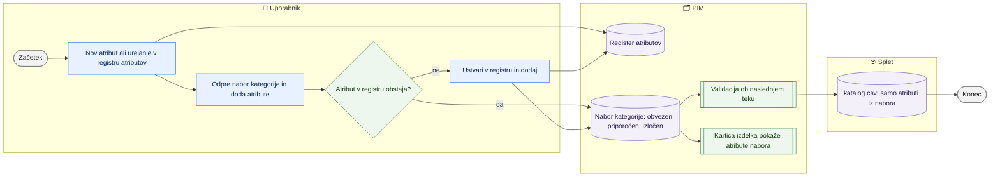

# Atributi in nabori atributov po kategorijah

> **Področje:** Upravljanje · **Lastnik:** urednik kataloga · **Stanje:** ✅ deluje · **Preverjeno:** 2026-09-24, iz kode

## 1. Namen

Urednik vodi register atributov (stalna koda, slovensko ime, prevodi imena, tip, enota) in za vsako kategorijo določi nabor: kateri atributi so obvezni, priporočeni ali izločeni. Nabor odloča, kaj je na kartici izdelka, kaj zahteva spletna validacija in kateri atributi gredo v spletni izvoz.

## 2. Kdo sodeluje

| Vloga | Kaj naredi v procesu |
|---|---|
| Komerciala | Stran vidi (bralni dostop); gumbi za shranjevanje ji vrnejo napako »Dejanje zahteva eno od vlog: ADMIN, CATALOG_EDITOR«. |
| Urednik kataloga | Ustvari, uredi, deaktivira ali izbriše atribut, vpiše prevode imen, sestavi nabore kategorij. |
| Skrbnik | Enako kot urednik; odloča o trajnem brisanju atributa z vrednostmi. |
| Avtomatika (PIM) | Ob naslednjem teku validacije upošteva nabore (obvezen = napaka za splet, priporočen = opozorilo); spletni izvoz vzame samo atribute iz nabora. |

## 3. Kdaj se sproži

- **Ročno:** urednik ob novem atributu dobavitelja, novi kategoriji, pritožbi »na kartici manjka polje« ali »v izvozu je preveč stolpcev«.
- **Po urniku:** sprememba se uporabi ob naslednjem `PRODUCT_VALIDATION` (vsako uro ali po zajemu iz SAOP) in `WEB_CATALOG_EXPORT` (po uspešni objavi).
- **Ob dogodku:** atribut lahko nastane tudi ob uvozu delovnega lista ali iz okna vrzeli pri uvozu novih artiklov (glej povezane procese).

## 4. Vhod in izhod

| | Kaj | Od kod / kam |
|---|---|---|
| **Vhod** | Ime atributa, koda, skupina, tip, enota, prevodi; seznam atributov za kategorijo (tudi prilepljen iz mastrov) | uporabnik |
| **Izhod** | Register atributov in nabori po kategorijah | PIM (`canon.AttributeDefinition`, nabori kategorij) |
| **Izhod** | Kategorijske zahteve validacije (obvezen/priporočen) | PIM, validacijski profil spleta |
| **Izhod** | Izbor stolpcev atributov v katalog.csv | splet (prek izvoza) |

## 5. Diagram

## 6. Koraki

| # | Kdo | Kje (stran) | Kaj narediš | Kaj se zgodi v sistemu | Kako preveriš, da je uspelo |
|---|---|---|---|---|---|
| 1 | Urednik | `/nastavitve/atributi` | Odpreš »+ Nov atribut«, vpišeš **Slovensko ime** (obvezno), po želji kodo, skupino, tip (TEXT, NUMBER, BOOL, ENUM), enoto, prevode imena; klikneš **Ustvari atribut**. | Če kode ne vpišeš, nastane iz imena. Če atribut z enakim slovenskim imenom že obstaja, gumb ostane onemogočen in stran pove kodo obstoječega. | Sporočilo »Atribut … je ustvarjen s kodo …«; atribut se odpre v desnem panelu. |
| 2 | Urednik | `/nastavitve/atributi` | Izbereš atribut v seznamu, zavihek **Osnovno**: skupina, tip, enota, »Vrednost se prevaja po jezikih«, »Je enota drugega atributa« (+ izbira para), »Aktiven«, opomba → **Shrani lastnosti**. | Koda se nikoli ne spremeni. Neaktiven atribut izgine iz izbirnikov in ne gre v izvoz. | Sporočilo »Lastnosti atributa … so shranjene.« |
| 3 | Urednik | `/nastavitve/atributi` | Zavihek **Prevodi**: vpišeš ime v vsakem jeziku → **Shrani prevode**. | Prazna polja se ne pošljejo (obstoječi prevod ostane). | Sporočilo »Shranjenih prevodov: N«; v seznamu jezikovna oznaka ni več rdeča. Hitri filter »Manjka EN/DE …« pokaže, kaj še manjka. |
| 4 | Urednik | `/nastavitve/atributi/{Code}` | Iz zavihka **Vrednosti** klikneš »Odpri vrednosti in pogostost«. | Samo bralna stran: različne vrednosti, število izdelkov, prevod, vir, ali gre na splet. | — |
| 5 | Urednik | `/nastavitve/nabori-atributov` | Izbereš drevo (svetila, videlektro), poiščeš kategorijo, klikneš **Uredi**. | Odpre se urejevalnik z nabori; podedovane vrstice so označene »podedovan: …«. | Stolpci Obvezni / Priporočeni / Izločeni se po shranjevanju osvežijo. |
| 6 | Urednik | isto | Dodaš atribute: izbereš jih v seznamu, **Raven** in **Dodaj izbrane (N)**; ali **Prilepi seznam** (vrstica »ime;obvezen«) → **Uvozi seznam**; ali **Kopiraj nabor** iz druge kategorije. | Neznana imena ponudi: **Ustvari v registru in dodaj vse** ali **Dodaj samo znane**. Predlogi »Atributi, ki jih izdelki te kategorije že nosijo …« imajo gumbe *priporočen* / *obvezen* / *ustvari v registru in dodaj*. | Sporočilo »V nabor kategorije … je zapisanih N atributov. Validacija jih upošteva ob naslednjem teku.« |
| 7 | Urednik | isto ali `/nastavitve/kategorije` (zavihek Atributi) | Spremeniš raven v izbirniku (obvezen/priporočen/izločen) ali klikneš **Odstrani** / **Izloči tu**. Na `/nastavitve/nabori-atributov` (2026-09-29) tudi več naenkrat: kljukice, »Označi vse«, »Označi brez vrednosti«, nato **Nastavi raven**, **Odstrani iz te kategorije** (lastno izbriše, podedovano ali tudi zgoraj določeno tu izloči) ali **Odstrani pri izvoru …** (izbriše vrstico v kategoriji, kjer je določena, torej za vse njene podkategorije; potrditev pove, koliko izdelkov pod izvorom ima vrednost, in ponudi »samo prazne«). | Podedovanega atributa ni mogoče izbrisati tu, samo izločiti ali odstraniti pri izvoru. | Sporočilo in gumb **Razveljavi** (vrne prejšnje ravni); vsaka vrstica gre v `b2b.AuditLog`. |
| 8 | Avtomatika | — | — | `PRODUCT_VALIDATION` ustvari ali zapre napake: obvezen atribut = napaka v spletnem profilu drevesa, priporočen = opozorilo. | `/kakovost/napake`, `/pravila/validacija` (vrstice »iz nabora atributov«). |
| 9 | Urednik ali skrbnik | `/nastavitve/atributi` | Brisanje: »Izbriši atribut …« → **Preveri uporabo** → po potrebi kljukica »Izbriši tudi vrednosti pri N izdelkih« → vpišeš `IZBRIŠI` → **Trajno izbriši atribut**. | Odstranijo se vrstice naborov, preslikave virov se deaktivirajo, pari enot razvežejo, zahteve validacije deaktivirajo, prevodi izbrišejo. | Sporočilo »Atribut … je trajno izbrisan …«. |

## 7. Pravila in varovalke

- Prevedljiva lastnost je v PIM **en** atribut z jezikom sl/en (npr. »Prevladujoča barva«); »… SLO« in »… ANG« sta samo stolpca v katalog.csv. Zajem od 294 cilj preslikave »<ime> SLO/ANG« zapiše kot jezik; neprevedena slovenska vrednost iz uvoza ne povozi obstoječega prevoda (295).
- **Enota atributa (301):** atribut ima svojo enoto (polje »Enota«, npr. Dolžina = mm) — to je enota vrednosti v PIM in v glavi katalog.csv (»Dolžina [mm]«). Atribut enote (»Enota dolžine«) ostane samo za lažje preslikave XML: prenos v PIM (val.Promote) vrednost iz vira pretvori v enoto atributa (»5 m« ali 5 + atribut enote »m« -> 5000; mm/cm/m, g/kg, cm3/dm3/l/m3; ista enota -> samo število), vrednost, ki ni število (»do 30m«, »~220-230«), pusti, kot je. Kartica in uvoz pišeta v enoti atributa, atribut enote izdelka se sam poravna. Zapis s piko pred tremi števkami (»1.500 m«) se ne pretvori, ker je dvoumen.
- Koda atributa je po ustvarjanju nespremenljiva — po njej se atribut veže na vire, nabore in izvoz.
- Dvojnik po slovenskem imenu ni dovoljen (isto pravilo kot v bazi, `canon.ResolveAttributeNames`).
- Trajni izbris zahteva vpis `IZBRIŠI`; atributa z vrednostmi ne izbrišeš brez dodatne kljukice. Priporočeno je deaktiviranje namesto brisanja.
- Nabor se deduje na podkategorije; najbližja vrstica zmaga. Kategorija brez nabora: na kartici in v izvozu gredo **vsi** atributi izdelka. Od 291 v katalog.csv gredo vsi atributi tudi pri kategoriji z naborom — nabor izloči samo atribut z ravnijo EXCLUDED (prej je izpadlo vse, kar ni bilo v naboru).
- Pisanje: samo ADMIN in CATALOG_EDITOR (politika `CatalogWrite`, preverjena v storitvi). COMMERCIAL stran vidi.

## 8. Ko gre kaj narobe

| Znak (kaj vidiš) | Verjeten vzrok | Kaj narediš |
|---|---|---|
| »Ustvari atribut« je siv | Prazno slovensko ime ali ime že obstaja | Uporabi obstoječi atribut (koda je v opozorilu). |
| »Dejanje zahteva eno od vlog …« | Prijavljen kot COMMERCIAL ali VIEWER | Prosi urednika ali skrbnika. |
| Nov obvezen atribut ne ustvari napak | Validacija še ni tekla | Počakaj na `PRODUCT_VALIDATION` ali ga poženi na `/sistem/posel/PRODUCT_VALIDATION`. |
| V katalog.csv manjka atribut | Kategorija ima nabor in atributa ni v njem, ali je atribut izločen/neaktiven | Dodaj ga v nabor kot priporočen. |
| Atribut nima vrednosti pri izdelkih | Ni preslikave vira | Zavihek **Viri** → »Odpri preslikave virov« (`/zajem/atributi`). |

## 9. Tehnično ozadje

Za skrbnika in razvoj

- **Strani:** `CatalogAttributes.razor`, `CatalogAttributeDetail.razor`, `CategoryAttributeSets.razor`, `CatalogCategories.razor` (zavihek Atributi), razdelilna `CatalogSettings.razor`.
- **Storitve:** `AttributeMappingService` (`canon.CreateAttributeDefinition`, `canon.UpdateAttributeDefinition`, `canon.DeleteAttributeDefinition`, `canon.SaveAttributeTranslations`, `intranet.GetAttributeDefinitions`, `intranet.GetAttributeUsage`), `CategoryTreeService` (`canon.SaveCategoryAttributeSet`, `SaveAttributeSetBulkAsync`, `CopyAttributeSetAsync`, `EnsureAttributeDefinitionAsync`, `intranet.GetCategoryAttributeSetTrees`), `IntranetFeatureReadService.GetAttributeValuesAsync`.
- **Tabele in pogledi:** `canon.AttributeDefinition`, `canon.ProductAttribute` (vrednosti po slovenskem imenu), `canon.CategoryAttributeEffective(...)`, `map.SourceAttribute`, `map.ValueLookup`, `map.MissingTranslation`, `out.ExportColumn`.
- **Migracije:** 147 (nabori), 177 (ustvarjanje iz nabora), 184/185 (bralni model vrednosti), 238 (dodaj/uredi/izbriši), 266/268 (zahteve validacije po vrstici in naboru).
- **Urniki:** `PRODUCT_VALIDATION` (3600 s, sproži ga zajem artiklov), `WEB_CATALOG_EXPORT`.
- **Pravice:** `view.catalog.attributes`, `view.catalog.attribute-sets`; pisanje `PimPolicies.CatalogWrite`.

## 10. Odprta vprašanja in razlike

- ⚠️ Na `/nastavitve/atributi` je vrstica »Paketne akcije« (izbor več atributov), vendar za izbrane atribute ni nobenega dejanja — samo izbor in »Počisti izbor«. Napis obljublja »Paketni zapis zahteva predogled vpliva«, česar ni.
- ⚠️ Stran za COMMERCIAL prikaže vse gumbe za urejanje in brisanje; zavrnitev pride šele ob kliku (napaka iz storitve).
- ⚠️ Opomba atributa se prebere šele iz pregleda uporabe (`GetUsageAsync`); če ta pade, se polje Opomba prikaže prazno in shranjevanje lahko opombo izbriše (prazno polje pomeni »pobriši«).
- ⚠️ Učinek nabora na validacijo ni takojšen — sporočilo to pove, a urednik mora sam sprožiti validacijo, če želi takoj videti rezultat.

## Povezani procesi

- [Drevo kategorij](drevo-kategorij.md): nabor je vezan na vozlišče drevesa; isti nabor ureja zavihek Atributi pri kategoriji.
- [Pravila validacije, slovar in preslikave](pravila-validacije-slovar-preslikave.md): kategorijske zahteve validacije nastanejo iz nabora.
- [Kakovost in validacija](../04-kakovost/kakovost-in-validacija.md): kje vidiš napake zaradi obveznih atributov.
- [Prevodi](../04-kakovost/prevodi.md): manjkajoči prevodi vrednosti atributov.
- [Iskanje in kartica izdelka](../03-izdelki/iskanje-in-kartica-izdelka.md): kartica prikaže atribute nabora.
- [Uvoz delovnega lista](../03-izdelki/uvoz-delovnega-lista.md): uvoz lahko ustvari nove atribute.
- [Težave in neujemanja zajema](../02-vhodi/tezave-in-neujemanja-zajema.md): preslikava atributov vira (`/zajem/atributi`).
- [Katalog in stranke CSV](../06-izhod-splet/katalog-in-stranke-csv.md): izvoz vzame samo atribute iz nabora.
