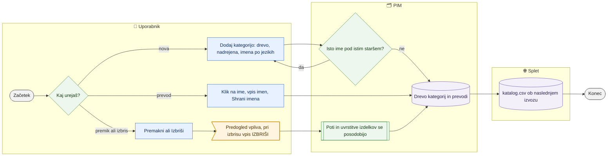

# Drevo kategorij in prevodi kategorij

> **Področje:** Upravljanje · **Lastnik:** urednik kataloga · **Stanje:** ✅ deluje · **Preverjeno:** 2026-09-24, iz kode

## 1. Namen

Urednik vzdržuje drevesa kategorij, kakor jih vidi spletna trgovina (svetila, videlektro): doda korensko ali podkategorijo z imeni v vseh jezikih, prevede obstoječe, premakne ali izbriše veje. Rezultat je drevo, po katerem se izdelki uvrščajo in ki gre v spletni izvoz.

## 2. Kdo sodeluje

| Vloga | Kaj naredi v procesu |
|---|---|
| Komerciala | Drevo pregleduje (bralni dostop); shranjevanje ji storitev zavrne. |
| Urednik kataloga | Dodaja, prevaja, premika in briše kategorije; ureja nabor atributov kategorije. |
| Skrbnik | Enako kot urednik. |
| Avtomatika (PIM) | Pri premiku posodobi poti in uvrstitve izdelkov; spremembe gredo v izvoz ob naslednjem `WEB_CATALOG_EXPORT`. |

## 3. Kdaj se sproži

- **Ročno:** nova skupina izdelkov, manjkajoč prevod kategorije (vrstica »Imena kategorij po jezikih«), preureditev trgovine.
- **Po urniku:** ni lastnega posla; sprememba gre na splet ob naslednjem `WEB_CATALOG_EXPORT` (po uspešni objavi).
- **Ob dogodku:** nepreslikana dobaviteljeva pot kategorije (`/kakovost/kategorije`) pogosto zahteva novo kategorijo tukaj.

## 4. Vhod in izhod

| | Kaj | Od kod / kam |
|---|---|---|
| **Vhod** | Drevo, nadrejena kategorija, imena po jezikih (slovensko obvezno) | uporabnik |
| **Izhod** | Vozlišča drevesa, prevodi imen, poti | PIM (`canon.Category`, prevodi) |
| **Izhod** | Posodobljene uvrstitve izdelkov ob premiku; odstranjene uvrstitve ob brisanju | PIM |
| **Izhod** | Kategorije v katalog.csv | splet (prek izvoza) |

## 5. Diagram

## 6. Koraki

| # | Kdo | Kje (stran) | Kaj narediš | Kaj se zgodi v sistemu | Kako preveriš, da je uspelo |
|---|---|---|---|---|---|
| 1 | Urednik | `/nastavitve/kategorije` | V filtrih izbereš **Drevo**, **Jezik v ospredju**, po želji podjetje, vejo, nivo; kljukica »Brez imena v …« ali klik na jezik v vrstici pokritosti. | Drevo se prebere v izbranem jeziku; števca pri vozlišču kažeta izdelke v kategoriji in v celi veji. | Vrstica »N od M zapisanih« pri pokritosti prevodov. |
| 2 | Urednik | isto | Odpreš »+ Dodaj kategorijo (korensko ali podkategorijo)«: drevo, **Nadrejena kategorija** (prazno = koren), imena po jezikih (slovensko obvezno) → **Ustvari kategorijo**. Ali v desnem panelu **+ Dodaj podkategorijo**. | Iz slovenskega imena nastaneta koda in pot. Isto ime pod istim staršem ustavi (gumb onemogočen), podobno ime samo opozori. | Nova kategorija je v drevesu; sporočilo o uspehu. |
| 3 | Urednik | isto | Klik na ime vozlišča → vpišeš imena v vseh jezikih → **Shrani imena** (ali v panelu zavihek **Prevodi** → **Shrani prevode**). | Shranijo se prevodi; slovensko ime lahko spremeni prikazano pot. | Števec pokritosti se zmanjša. |
| 4 | Urednik | isto | Premik: v panelu **Premakni** (ali izbereš več vozlišč in **Premakni izbrane**) → izbereš novo nadrejeno ali **Postavi na koren drevesa** → **Potrdi premik**. | Predogled pokaže število vej, kategorij in uvrstitev. Premakne se celo poddrevo; kode, prevodi, nabori in preslikave ostanejo pripeti, poti in uvrstitve izdelkov se posodobijo. | Veja je na novem mestu; pot v panelu je nova. |
| 5 | Urednik | isto | Izbris: **Izbriši** ali **Izbriši izbrane** → pregledaš vpliv → vpišeš `IZBRIŠI` → **Trajno izbriši N**. | Izbrišejo se kategorije s podkategorijami, uvrstitve izdelkov (izdelki ostanejo), preslikave, atributne nastavitve, validacijska in naslovna pravila teh kategorij. | Kategorije ni več; dejanje je v revizijski zgodovini. |
| 6 | Urednik | isto, zavihek **Atributi** / **Uporaba** | Nabor atributov kategorije (glej Atributi in nabori); v zavihku Uporaba povezavi na uvrstitve izdelkov in preslikave kategorij. | — | — |
| 7 | Avtomatika | — | — | Naslednji `WEB_CATALOG_EXPORT` zapiše nove poti in imena v katalog.csv. | Datoteka na `/splet`. |

## 7. Pravila in varovalke

- Drevo je eno, imena so po jezikih; slovensko ime je obvezno, ker iz njega nastaneta koda in kanonična pot.
- Isto ime pod istim staršem ni dovoljeno.
- Premik in izbris vedno najprej pokažeta predogled vpliva; izbris zahteva vpis `IZBRIŠI` in ga ni mogoče razveljaviti s tega zaslona.
- Skupni premik je dovoljen samo za kategorije istega drevesa.
- Pisanje: ADMIN in CATALOG_EDITOR (politika `CatalogWrite`).

## 8. Ko gre kaj narobe

| Znak (kaj vidiš) | Verjeten vzrok | Kaj narediš |
|---|---|---|
| »Ustvari kategorijo« je siv | Manjka slovensko ime ali dvojnik pod istim staršem | Vpiši slovensko ime ali uporabi obstoječo kategorijo. |
| »Za skupni premik izberi kategorije istega drevesa« | Izbor iz več dreves | Premikaj po drevesih ločeno. |
| Angleško ime je pristalo kot slovensko | Stara različica obrazca (pred 237) | Popravi imena v zavihku Prevodi. |
| Na spletu je kategorija še stara | Izvoz še ni tekel ali objava je blokirana | `/sistem` → posel »Katalog in stranke za splet«. |

## 9. Tehnično ozadje

Za skrbnika in razvoj

- **Strani:** `CatalogCategories.razor`; drevesa in kanonično polje po kanalu: `CatalogChannels.razor`.
- **Storitve:** `CategoryTreeService` — `intranet.GetCategoryTree`, `intranet.GetCategoryTranslationCoverage`, `canon.SaveCategory`, `canon.SaveCategoryTranslations`, `canon.GetCategoryChangeImpact`, `canon.MoveCategories`, `canon.DeleteCategories`; izbirnik kategorij je predpomnjen in se po spremembi izprazni.
- **Tabele:** `canon.Category` (+ prevodi po jeziku), uvrstitve izdelkov, `map.CategoryPathMap` (preslikave dobaviteljevih poti, po viru).
- **Migracije:** 178 (dodajanje v intranetu), 223, 230/231 (premik), 235 (prevedena pot), 237 (imena v vseh jezikih ob ustvarjanju).
- **Pravica:** `view.catalog.categories`.

## 10. Odprta vprašanja in razlike

- ⚠️ Kategorije VID (videlektro) po dogovoru zrcalijo svetila; stran tega ne vsiljuje — urednik mora sam paziti, da sta drevesi usklajeni.
- ⚠️ Brisanje odstrani tudi validacijska in naslovna pravila kategorije brez možnosti povratka; revizija se piše, obnove pa ni.
- ⚠️ Stran se ne osveži sama, ko nekdo drug spremeni drevo (npr. uvoz delovnega lista z novimi kategorijami).

## Povezani procesi

- [Atributi in nabori](atributi-in-nabori.md): nabor atributov je vezan na kategorijo.
- [Jeziki, kanali, skladišča, povezave](jeziki-kanali-skladisca-povezave.md): kateri kanal uporablja katero drevo.
- [Spletni nazivi](spletni-nazivi.md): pravila nazivov po kategorijah.
- [Kategorije izdelka](../03-izdelki/kategorije-izdelka.md): uvrščanje izdelkov v drevo.
- [Manjkajoče kategorije](../04-kakovost/manjkajoce-kategorije.md): dobaviteljeve poti brez naše kategorije.
- [Katalog in stranke CSV](../06-izhod-splet/katalog-in-stranke-csv.md): kategorije v izvozu.
