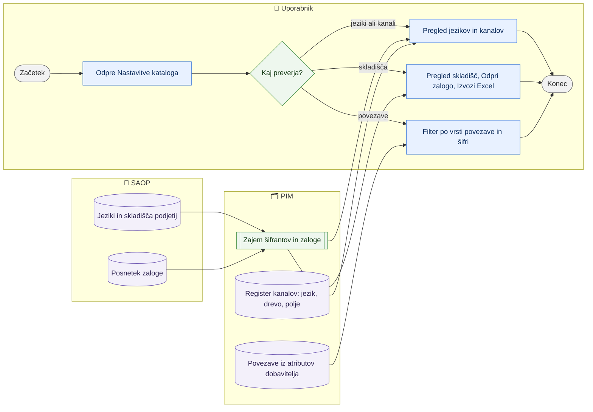

# Šifranti kataloga — jeziki, spletni kanali, skladišča in povezave izdelkov

> **Področje:** Upravljanje · **Lastnik:** skrbnik (šifranti), urednik kataloga (pregled) · **Stanje:** ⚠️ delno · **Preverjeno:** 2026-09-24, iz kode

## 1. Namen

Štiri **samo bralne** strani pod `/nastavitve`, na katerih uporabnik preveri, s čim katalog dela: kateri jeziki obstajajo (iz SAOP), kateri spletni kanal uporablja kateri jezik in drevo, katera skladišča ima podjetje in katera PIM bere v zalogo, ter katere povezave med izdelki (nadomestni, pribor …) je poslal dobavitelj.

## 2. Kdo sodeluje

| Vloga | Kaj naredi v procesu |
|---|---|
| Komerciala | Pregleda skladišča in zalogo po podjetju, izvozi zalogo skladišča v Excel. |
| Urednik kataloga | Preveri jezike in kanale, preden prevaja ali ureja drevo; pregleda povezave izdelkov. |
| Skrbnik | Ob neujemanju (manjka jezik, skladišče se ne bere) popravi vir: SAOP, profil vira zaloge ali migracijo. |
| Avtomatika (PIM) | Šifranta jezikov in skladišč osvežuje zajem iz SAOP; posnetek zaloge `STOCK_IMPORT`. |

## 3. Kdaj se sproži

- **Ročno:** pregled pred prevajanjem, ob vprašanju »zakaj zaloga skladišča X ni v PIM«, ob iskanju pribora ali nadomestnega izdelka.
- **Po urniku:** jeziki in skladišča pridejo iz SAOP ob zajemu (`SAOP_PRODUCT_IMPORT`, šifranti v `NIGHTLY_RECONCILIATION`); zaloga iz `STOCK_IMPORT` (vsakih 10 min).
- **Ob dogodku:** ni.

## 4. Vhod in izhod

| | Kaj | Od kod / kam |
|---|---|---|
| **Vhod** | Jeziki po podjetju, šifrant skladišč | SAOP (prek zajema) |
| **Vhod** | Register spletnih kanalov (jezik, drevo, kanonično polje) | PIM (`canon.WebSite`, vnese migracija) |
| **Vhod** | Povezave izdelkov iz atributov dobavitelja | dobavitelj (prek zajema) |
| **Izhod** | Pregled na zaslonu; Excel zaloge skladišča (`/izvoz/zaloge.xlsx`) | uporabnik |

## 5. Diagram

## 6. Koraki

| # | Kdo | Kje (stran) | Kaj narediš | Kaj se zgodi v sistemu | Kako preveriš, da je uspelo |
|---|---|---|---|---|---|
| 1 | Kdorkoli | `/nastavitve` | Izbereš kartico: Jeziki, Spletni kanali, Skladišča, Povezave izdelkov (ostale kartice: Atributi, Kategorije, Nabori, Rezervacija zaloge). | Kartice brez dovoljenja vloge so skrite ali zaprte. | — |
| 2 | Urednik | `/nastavitve/jeziki` | Pregledaš jezike **izbranega podjetja**: ime, šifra SAOP, koda kataloga, stanje, posodobljeno. | Samo branje iz `canon.Language`. | Jezik, ki ga rabiš za prevod, je »Aktiven«. |
| 3 | Urednik | `/nastavitve/kanali` | Pregledaš kanale: ime, jezik, drevo, kanonično polje, število kategorij, stanje. | Samo branje iz `canon.WebSite`. | Kanal kaže pravo drevo (svetila / videlektro). |
| 4 | Komerciala | `/nastavitve/skladisca` | Iščeš po šifri ali imenu, filtriraš podjetje in prikaz (»Samo z zalogo v PIM«, aktivna, neaktivna). Pri podjetju **Odpri zalogo** ali **Izvozi Excel**. | Za vsako podjetje: katera skladišča PIM bere, povzetek zaloge (artiklov, na zalogi, skupna količina, razpoložljivo, prihaja, negativna, čas posnetka). | Oznaka »Bere se« pri skladišču; čas posnetka je svež. |
| 5 | Urednik | `/nastavitve/povezave-izdelkov` | Izbereš podjetje, vrsto povezave (RELATED, SUBSTITUTE, ACCESSORY, SPARE, NADOMESTNI, SORODNI, DODATEK), vpišeš šifro → **Uporabi filtre**. | Vrstica pokaže izvorni izdelek, vrsto, cilj in ali je šifra cilja v katalogu (»ujeto z izdelkom« / »šifre ni v katalogu«). | Klik na šifro odpre kartico izdelka. |

## 7. Pravila in varovalke

- Vse štiri strani so samo bralne; ničesar ne zapišejo. Sprememba jezika ali skladišča gre v SAOP, sprememba kanala v migracijo.
- Kadar podjetje bere več skladišč, SAOP vrne eno vsoto; stran količine **ne** razdeli po skladiščih, ampak napiše »v vsoti N skladišč«.
- Dostop: ADMIN, CATALOG_EDITOR, COMMERCIAL (pravice `view.catalog.languages`, `view.catalog.channels`, `view.catalog.warehouses`, `view.catalog.product-links`).

## 8. Ko gre kaj narobe

| Znak (kaj vidiš) | Verjeten vzrok | Kaj narediš |
|---|---|---|
| »Za organizacijo ni jezikov« | Izbrano podjetje nima šifranta jezikov ali zajem šifrantov še ni tekel | Preveri nočno uskladitev na `/sistem`. |
| »PIM za to podjetje nima SAOP posnetka zaloge« | `STOCK_IMPORT` za podjetje ne teče ali je podjetje izključeno iz avtomatike | `/sistem` → »Zaloga iz SAOP«, »Podjetja v avtomatiki«. |
| Skladišče »Ne bere se«, čeprav bi moralo | Skladišče ni v profilu vira zaloge (`warehouseIdList`) | Skrbnik popravi profil vira zaloge. |
| Povezave izdelkov so prazne | Dobavitelj ne pošilja atributa vrste povezave | Pričakovano stanje (glej 10). |

## 9. Tehnično ozadje

Za skrbnika in razvoj

- **Strani:** `CatalogSettings.razor`, `CatalogLanguages.razor`, `CatalogChannels.razor`, `CatalogWarehouses.razor`, `ProductLinks.razor`.
- **Storitve:** `CatalogReadService.GetLanguagesAsync` (`canon.Language`), `GetWebSitesAsync` (`canon.WebSite`), `StockReadService.GetWarehouseStockAsync` (`intranet.GetWarehouseStock`, migracija 267), `ProductLinkReadService` (`intranet.GetProductLinks`, migracija 131).
- **Tabele:** `canon.Language`, `canon.WebSite`, `canon.Warehouse`, zadnji aktivni SAOP posnetek zaloge.
- **Izvoz:** `/izvoz/zaloge.xlsx?podjetje=…&skladisce=…`.

## 10. Odprta vprašanja in razlike

- ⚠️ Povezave izdelkov: po meritvi 2026-08-28 v katalogu ni nobenega atributa vrste povezave, zato je stran praktično prazna. Variantne skupine, vodilni izdelek in smernost niso narejeni — potrebna je odločitev, ali povezave nastajajo iz dobavitelja, SAOP ali ročno v PIM.
- ⚠️ Kanali in jeziki se ne urejajo v intranetu; nov kanal ali drevo zahteva migracijo (skrbnik/razvoj).
- ⚠️ Zaloga po posameznem skladišču ni na voljo, kadar podjetje bere več skladišč (SAOP vrne vsoto).
- ⚠️ Stran povezav privzeto izbere prvo aktivno podjetje, ne podjetja iz glave aplikacije.

## Povezani procesi

- [Drevo kategorij](drevo-kategorij.md): drevo, ki ga uporablja kanal.
- [Zaloge in rezervacija](../07-poslovanje/zaloge-in-rezervacija.md): količine po artiklih in stran `/nastavitve/rezervacija-zaloge`.
- [Zajem iz SAOP](../02-vhodi/zajem-iz-saop.md): od tam pridejo jeziki, skladišča in zaloga.
- [Prevodi](../04-kakovost/prevodi.md): jeziki, v katere se prevaja.
- [Avtomatika in urniki](../09-administracija/avtomatika-in-urniki.md): posli, ki osvežujejo šifrante in zalogo.
