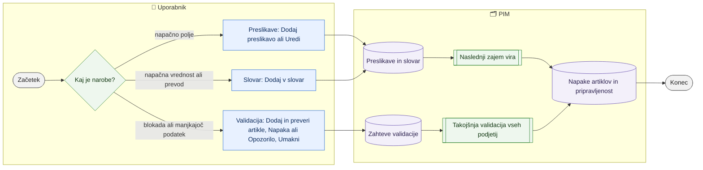

# Pravila validacije, slovar vrednosti in preslikave polj

> **Področje:** Upravljanje · **Lastnik:** urednik kataloga (validacija, slovar), skrbnik (preslikave) · **Stanje:** ⚠️ delno · **Preverjeno:** 2026-09-24, iz kode

## 1. Namen

Na `/pravila` uporabnik določi, kako podatek pride v PIM (preslikava elementa vira v polje), kako se poenoti (slovar vrednosti in prevodov) in kaj mora artikel imeti, da gre naprej (validacijski profili: napaka ustavi, opozorilo ne). Rezultat so pravila, po katerih tečeta zajem in validacija.

## 2. Kdo sodeluje

| Vloga | Kaj naredi v procesu |
|---|---|
| Komerciala | Sme dodajati in spreminjati zahteve validacije, vrstice slovarja in preslikave (politika `BusinessWrite`). |
| Urednik kataloga | Glavni urednik zahtev validacije in slovarja. |
| Skrbnik | Preslikave polj vira (tehnično najbolj občutljivo), vklop umaknjenih zahtev. |
| Avtomatika (PIM) | Po shranjeni zahtevi takoj ponovno validira; slovar in preslikave uporabi ob naslednji obdelavi vira. |

## 3. Kdaj se sproži

- **Ročno:** artikel je neupravičeno blokiran ali gre skozi brez podatka; vrednost iz vira je napačna ali neprevedena; podatek pristane v napačnem polju.
- **Po urniku:** zahteve upošteva vsak `PRODUCT_VALIDATION`; slovar in preslikave vsak zajem (npr. `SUPPLIER_CATALOG_IMPORT`, nočna uskladitev).
- **Ob dogodku:** shranitev zahteve na `/pravila/validacija` sama sproži celotno validacijo.

## 4. Vhod in izhod

| | Kaj | Od kod / kam |
|---|---|---|
| **Vhod** | Profil, polje, resnost (Napaka/Opozorilo) | uporabnik |
| **Vhod** | Domena, izvorna vrednost, jezik, ciljna vrednost | uporabnik |
| **Vhod** | Vir, vrsta podatka, element v viru, ciljno polje, »obvezno pri zajemu« | uporabnik |
| **Izhod** | Zahteve validacije, odprte/zaprte napake artiklov | PIM (`val.*`) |
| **Izhod** | Vrstice slovarja, preslikave polj | PIM (`map.ValueLookup`, `map.FieldMapping`) |

## 5. Diagram

## 6. Koraki

| # | Kdo | Kje (stran) | Kaj narediš | Kaj se zgodi v sistemu | Kako preveriš, da je uspelo |
|---|---|---|---|---|---|
| 1 | Kdorkoli | `/pravila` | Izbereš težavo (1–5): napačno polje, vrednost/prevod, blokada, spletni naziv, popust. | Stran te odpre na pravem registru. Vrstni red preverjanja: izvor → preslikava → slovar → validacija → izhod. | — |
| 2 | Urednik | `/pravila/validacija` | V »Dodaj obvezno polje« izbereš **1. Profil**, **2. Polje** (neznano kodo sprejme z »Uporabi kodo«), **3. Ko polje manjka** (Napaka/Opozorilo) → **Dodaj in preveri artikle**. | Zahteva se shrani, nato teče celotna validacija (`val.RunValidation`). Neznano polje se shrani kot umaknjeno in ne ustavi ničesar. | Sporočilo »Dodano: … Artikli so ponovno preverjeni.«; števca veljavnih/neveljavnih pri profilu. |
| 3 | Urednik | isto | Pri vrstici preklopiš **Napaka** / **Opozorilo** ali klikneš **Umakni**; umaknjeno zahtevo spet vključiš z **Vklopi** v razdelku »Zahteve, ki čakajo na polje ali so umaknjene«. | Po vsaki spremembi spet teče celotna validacija; umik zapre odprte težave te zahteve. Zahteva se nikoli ne briše. | Sporočilo o spremembi; število »Odprtih težav« v vrstici (klik vodi na seznam napak). |
| 4 | Urednik | isto | Filtri po profilu, resnosti, obsegu (vsi artikli profila / po kategorijah) in iskanje; **Izvozi Excel** (list na nivo). | Kategorijske vrstice nastanejo iz nabora atributov; povezava »iz nabora atributov« vodi na nabor. | — |
| 5 | Urednik | `/pravila/slovar` | »Dodaj vrednost ali prevod«: **Domena** (`*` ali koda lastnosti), **Vrednost iz vira**, **Jezik**, **Ciljna vrednost**, opomba → **Dodaj v slovar**. Obstoječo vrstico **Uredi** → **Shrani** (lahko tudi deaktiviraš). | Vrstica velja za vsa podjetja; ožja domena ima prednost pred `*`. Uporabi se pri naslednjem zajemu XML vira in pri prevodih v izvozu. Gumb ni odvisen od odziva strežnika: klik vedno sproži preverjanje, manjkajoče polje javi sporočilo (en klik shrani). Sporočilo po urejanju vrstice se pokaže ob tabeli. Iskanje, domena, stanje in stran so v URL-ju (`isci`, `domena`, `stanje`, `od`); jezikovni filter na `/kakovost/prevodi` je v `jezik`. Sporočilo po shranjevanju pove, kdaj vrstica učinkuje: prevod ob naslednjem zajemu ali ponovni obdelavi vira, ENOTNO tudi ob naslednji izdelavi katalog.csv; vrednosti, ki so že v PIM, se ne prepišejo takoj. | Povzetek »Vseh vnosov / Aktivnih«; `/kakovost/prevodi` pokaže manj manjkajočih prevodov po naslednji obdelavi. |
| 6 | Skrbnik | `/pravila/preslikave` | »Dodaj novo preslikavo«: **Vir**, **Vrsta podatka**, **Element v viru**, **Ciljno polje v PIM**, kljukica »Brez elementa zavrni vhodni zapis« → **Dodaj preslikavo**. Obstoječo **Uredi** → **Shrani**. | Preslikava velja za izbrano podjetje in vir, pri naslednji obdelavi vira. Obvezna preslikava pošlje zapis brez elementa v karanteno. | Sporočilo »Preslikava … je dodana in velja pri naslednjem zajemu«; `/zajem/neujemanja`. |
| 7 | Avtomatika | — | — | `PRODUCT_VALIDATION` in `PRODUCT_PUBLICATION` uporabita nove zahteve; zajem uporabi preslikave in slovar. | `/kakovost/napake`, `/sistem`. |

## 7. Pravila in varovalke

- Napaka ustavi izhod samo, če profil ustavlja (ERP in/ali splet); opozorilo nikoli ne ustavi. Opis učinka je izpisan pri vsakem profilu.
- Zahteve se ne brišejo (odprte napake kažejo nanje), samo umaknejo.
- Kategorijske zahteve urejaš prek nabora atributov; sprememba resnosti tu popravi tudi nabor (266).
- Slovar je skupen za vsa podjetja; revizija z `OrganizationId` 0.
- Jezik **ENOTNO** (291) ni prevod, ampak poenotenje zapisa iste vrednosti (domena = slovensko ime lastnosti). Uporabi ga `pim.NormalizeAttributeValue` ob vsakem zajemu (`map.ApplyValueTransforms`) in v katalog.csv; napetost, frekvenca, presledki in decimalna vejica so poenoteni že v pravilu, v slovar gredo samo izjeme. Predlog lepšega zapisa (307, `pim.PolishAttributeValue`: enote, razpon, vejica, velika začetnica) uporablja isti slovar ENOTNO, a je zaenkrat samo predogled na `/nastavitve/atributi/ciscenje?pogled=zapis`.
- Vse tri strani pišejo revizijo v `b2b.AuditLog`. Pisanje: ADMIN, CATALOG_EDITOR, COMMERCIAL (`BusinessWrite`).

## 8. Ko gre kaj narobe

| Znak (kaj vidiš) | Verjeten vzrok | Kaj narediš |
|---|---|---|
| Po »Dodaj in preveri artikle« dolgo čakanje, nato napaka | Celotna validacija traja predolgo (časovna meja 10 min) | Zahteva je najverjetneje že shranjena — osveži stran in preveri; validacija bo tekla ob naslednjem `PRODUCT_VALIDATION`. |
| »Polje … PIM-u še ni znano« | Koda polja ne obstaja v `canon.FieldValue` | Preveri ime polja; zahteva ostane umaknjena, dokler podatki polja ne prinesejo. |
| Slovar ne učinkuje | Vir še ni bil ponovno obdelan | Počakaj na naslednji zajem ali »Ponovno preslikaj vir« pri uvozu novih artiklov. |
| Preslikava ne učinkuje | Napačno podjetje (stran je vezana na izbrano podjetje) ali vir še ni bil obdelan | Preveri izbiro podjetja v glavi; ponovno obdelaj vir. |

## 9. Tehnično ozadje

Za skrbnika in razvoj

- **Strani:** `Rules.razor` (razdelilna), `ValidationRules.razor`, `ValueDictionary.razor`, `FieldMappings.razor`; zavihki `RulesTabs` vključujejo še `/pravila/nazivi` in `/pravila-popustov`.
- **Storitve:** `RulesWriteService.SaveRequirementAsync` (`intranet.SaveFieldRequirement`, nato `val.RunValidation` brez podjetja, `CommandTimeout = 600`), `SaveMappingAsync` (`intranet.SaveFieldMapping`), `SaveValueLookupAsync` (neposreden SQL na `map.ValueLookup` + revizija); branje `GovernanceReadService`.
- **Kje se slovar uporabi:** `PIM.XmlMapping/SqlMappingPipeline.cs` (pretvorbe `map.FieldTransform` in `map.ValueLookup` med izluščanjem XML), izvoz prevodov (216).
- **Tabele:** `val.ValidationProfile`, `val.FieldRequirement`, `map.FieldMapping` (po `SourceConnectorId` = podjetje + vir), `map.ValueLookup`, `b2b.AuditLog`.
- **Izvoz:** `/izvoz/validacijski-profili.xlsx`.
- **Migracije:** 049 (slovar), 133 (urejanje pravil), 236 (pripravljenost zahteva svežo validacijo), 249 (pravila po Excelu, potrditev skrbnika), 266, 268.

## 10. Odprta vprašanja in razlike

- ⚠️ Vsaka sprememba zahteve požene **celotno** validacijo vseh podjetij na isti povezavi s časovno mejo 600 s. Izmerjeno (2026-09-22) samo podjetje 2 traja ~11 min, zato lahko klic pade s časovno napako, čeprav je zahteva že shranjena; stran takrat pokaže »Zahteve ni bilo mogoče shraniti« — zavajajoče.
- ⚠️ Komerciala sme spreminjati validacijske zahteve in preslikave polj (`BusinessWrite`), čeprav hub `/nastavitve` pravi, da ima komerciala bralni dostop. Preveriti, ali je to namen.
- ⚠️ Preslikave polj so na strani vezane na izbrano podjetje (vir + podjetje), preslikave kategorij in atributov pa so po viru (244). Uporabnik lahko pričakuje isto obnašanje.
- ⚠️ Stran preslikav pravi »Shrani in ponovno zajemi«, vendar na strani ni gumba za ponovno obdelavo vira.

## Povezani procesi

- [Atributi in nabori](atributi-in-nabori.md): kategorijske zahteve iz nabora.
- [Spletni nazivi](spletni-nazivi.md): četrti zavihek pravil.
- [Popusti](../07-poslovanje/popusti.md): peti zavihek (`/pravila-popustov`).
- [Kakovost in validacija](../04-kakovost/kakovost-in-validacija.md): kje se vidijo napake.
- [Karantena](../04-kakovost/karantena.md): zapisi, ki jih obvezna preslikava zavrne.
- [Prevodi](../04-kakovost/prevodi.md): manjkajoči prevodi po slovarju.
- [Težave in neujemanja zajema](../02-vhodi/tezave-in-neujemanja-zajema.md): neprepoznane vrednosti in elementi.
- [Novi artikli dobaviteljev](../02-vhodi/novi-artikli-dobaviteljev.md): »Ponovno preslikaj vir« po popravku preslikave.
