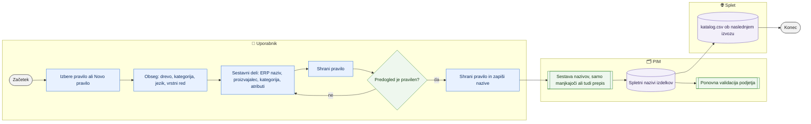

# Pravila za spletne nazive izdelkov

> **Področje:** Upravljanje · **Lastnik:** urednik kataloga · **Stanje:** ✅ deluje · **Preverjeno:** 2026-09-24, iz kode

## 1. Namen

Urednik sestavi pravilo, iz česa nastane spletni naziv izdelka (ERP naziv, proizvajalec, šifra, kategorija, atributi z enoto), ga preveri na predogledu pravih izdelkov in nato nazive zapiše — privzeto samo tam, kjer spletnega naziva še ni. Rezultat so enotni spletni nazivi v vseh jezikih.

## 2. Kdo sodeluje

| Vloga | Kaj naredi v procesu |
|---|---|
| Komerciala | Nima dostopa (stran je samo za ADMIN in CATALOG_EDITOR). |
| Urednik kataloga | Sestavi in shrani pravilo, pregleda predogled, zapiše nazive. |
| Skrbnik | Enako kot urednik. |
| Avtomatika (PIM) | Po zapisu ponovi validacijo podjetja; nazivi gredo v katalog.csv ob naslednjem izvozu. |

## 3. Kdaj se sproži

- **Ročno:** nova kategorija ali skupina izdelkov, novi izdelki brez spletnega naziva, sprememba sloga nazivov.
- **Po urniku:** ni; zapis je vedno ročen. Nazivi gredo na splet ob naslednjem `WEB_CATALOG_EXPORT`.
- **Ob dogodku:** ni.

## 4. Vhod in izhod

| | Kaj | Od kod / kam |
|---|---|---|
| **Vhod** | Koda in ime pravila, drevo in kategorija (obseg), vrstni red, jezik, sestavni deli | uporabnik |
| **Vhod** | ERP naziv, proizvajalec, šifra, kategorija, vrednosti atributov, slovar prevodov | PIM |
| **Izhod** | Pravila nazivov | PIM (pravila) |
| **Izhod** | Spletni nazivi izdelkov v izbranem jeziku (z zgodovino na kartici) | PIM → katalog.csv |

## 5. Diagram

## 6. Koraki

| # | Kdo | Kje (stran) | Kaj narediš | Kaj se zgodi v sistemu | Kako preveriš, da je uspelo |
|---|---|---|---|---|---|
| 1 | Urednik | `/pravila/nazivi` | V »Pravilo za urejanje« izbereš obstoječe pravilo ali **Novo pravilo**. | Aktivno pravilo z najvišjo prednostjo se odpre samodejno. | V naslovu urejevalnika piše »Pravilo KODA«. |
| 2 | Urednik | isto | Vpišeš **Kodo pravila** (po shranjevanju nespremenljiva), **Ime**, **Drevo**, **Kategorijo** (prazno = privzeto za drevo), **Vrstni red**; po potrebi v »Jezik …« omejiš jezik. | Brez omejitve jezika en izbor velja za vse jezike; vrednosti atributov in ime kategorije se prevedejo iz slovarja. | — |
| 3 | Urednik | isto | »+ Dodaj sestavni del«: **ERP naziv**, **Trenutni spletni naziv**, **Šifra artikla**, **Proizvajalec**, **Kategorija**, atribut; ali hitra predloga **ERP naziv + kategorija** / **ERP naziv + proizvajalec**. Vrstni red z ▲ ▼, odstrani z ×. | Stran sama sestavi predlogo; surova predloga je vidna le v »Napredno«. | Predogled se osveži ob vsaki spremembi. |
| 4 | Urednik | isto | **Shrani pravilo**. | Pravilo se shrani; nazivi se še ne spremenijo. | Sporočilo »Pravilo … je shranjeno. Nazivi se ne spremenijo, dokler jih ne zapišeš spodaj.« |
| 5 | Urednik | isto, razdelek Predogled | Izbereš podjetje in jezik, kljukica »Samo izdelki brez spletnega naziva v tem jeziku«; **Osveži predogled**. | Vzorec 25 izdelkov: šifra, ERP naziv, trenutni naziv, sestavljeni naziv. | Sestavljeni nazivi so pravilni. |
| 6 | Urednik | isto | **Shrani pravilo in zapiši nazive** (samo manjkajoče ali tudi prepis obstoječih). | Pravilo se najprej shrani (predogled in zapis sta enaka), nato se nazivi zapišejo v izbranem jeziku, sledi validacija podjetja. | Sporočilo »Zapisanih nazivov (jezik): N od M kandidatov …«; zgodovina na kartici izdelka. |

## 7. Pravila in varovalke

- Privzeto se dopolnijo samo manjkajoči nazivi; prepis obstoječih je izrecna izbira (odkljukaš kljukico).
- Zapis je mogoč samo za shranjeno in aktivno pravilo z vsebino.
- Zapis velja za en jezik naenkrat (jezik predogleda).
- Dostop: stran ima `[Authorize(Roles = "ADMIN,CATALOG_EDITOR")]`; pravica `view.rules.titles`.

## 8. Ko gre kaj narobe

| Znak (kaj vidiš) | Verjeten vzrok | Kaj narediš |
|---|---|---|
| »Predogled je prazen« | Pravilo ne doseže nobenega izdelka ali vsi že imajo naziv | Razširi obseg ali odkljukaj »Samo izdelki brez spletnega naziva«. |
| V nazivu je angleška vrednost | Ni prevoda v slovarju | Dodaj prevod na `/pravila/slovar`. |
| Zapis traja dolgo ali pade | Validacija celega podjetja po zapisu (meja 10 min) | Počakaj; preveri število zapisanih na kartici izdelka ali ponovno. |
| Gumb za zapis je siv | Pravilo ni shranjeno, ni aktivno ali je prazno | Shrani pravilo in preveri kljukico Aktivno. |

## 9. Tehnično ozadje

Za skrbnika in razvoj

- **Stran:** `TitleRules.razor`; sestava predloge `TitleTemplateBuilder.cs` (za `pim.ComposeTitle`).
- **Storitev:** `TitleRuleService` — `intranet.GetTitleRules`, `pim.SaveTitleRule`, `pim.PreviewTitleRules`, `pim.ApplyTitleRules` (`CommandTimeout = 600`, vrne Written/Candidates).
- **Migracije:** 072 (nazivi po jezikih), 149 (pravila nazivov).

## 10. Odprta vprašanja in razlike

- ⚠️ `TitleRuleService` ne preverja vloge na zapisovalni poti (ni `PimWriteGuard`); varuje samo `[Authorize]` na strani. Druge zapisovalne storitve vlogo preverjajo.
- ⚠️ Zapis v vse jezike zahteva ponovitev koraka 6 za vsak jezik posebej.

## Povezani procesi

- [Pravila validacije, slovar in preslikave](pravila-validacije-slovar-preslikave.md): prevodi vrednosti v nazivu prihajajo iz slovarja.
- [Atributi in nabori](atributi-in-nabori.md): atributi, ki jih lahko vstaviš v naziv.
- [Drevo kategorij](drevo-kategorij.md): obseg pravila po drevesu in kategoriji.
- [Iskanje in kartica izdelka](../03-izdelki/iskanje-in-kartica-izdelka.md): zgodovina naziva na kartici.
- [Katalog in stranke CSV](../06-izhod-splet/katalog-in-stranke-csv.md): nazivi v izvozu.
