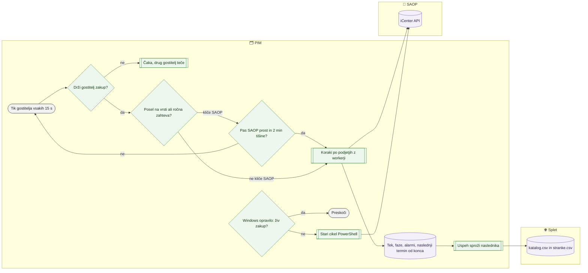

# Avtomatika in urniki poslov

> **Področje:** Administracija · **Lastnik:** skrbnik (ADMIN) · **Stanje:** ⚠️ delno · **Preverjeno:** 2026-09-29, iz kode

## 1. Namen

Avtomatika po urniku prinaša podatke v PIM (SAOP, dobavitelji), validira in objavlja katalog ter pripravi datoteke za splet in obvestila. V kodi je en sam motor — **gostitelj avtomatike** (`PIM.AutomationHost`); v praksi pa lahko na istih podatkih še vedno tečejo stara Windows opravila. Ta dokument opiše oba in kako ugotoviš, kateri dejansko teče.

## 2. Kdo sodeluje

| Vloga | Kaj naredi v procesu |
|---|---|
| Komerciala | Ni udeležena (vidi rezultat: sveže cene, zaloga, datoteke). |
| Urednik kataloga | Ni udeležen (vidi rezultat: validacija, objava, katalog.csv). |
| Skrbnik | Namesti in zažene gostitelja, spreminja urnike, vklaplja/izklaplja posle in podjetja, odstrani stara opravila. |
| Avtomatika (PIM) | Gostitelj drži zakup v bazi, vsakih 15 s preveri, kaj je na vrsti, požene korake z workerji, zapiše teke, faze in alarme. |

## 3. Kdaj se sproži

- **Po urniku (gostitelj, privzeto iz kode):**

| Posel | Kaj naredi | Ritem | Privzeto |
|---|---|---|---|
| `SAOP_PRODUCT_IMPORT` | Artikli iz SAOP (8 točk, podjetje po podjetje) | vsako uro | vklopljen |
| `SUPPLIER_CATALOG_IMPORT` | Katalog dobaviteljev NW/BT (XML); ne kliče SAOP, zato izven pasu SAOP | vsakih 6 h | vklopljen |
| `SAOP_ORDER_IMPORT` | Naročila kupcev in dobaviteljem | vsako uro | vklopljen |
| `STOCK_IMPORT` | Zaloga iz SAOP; uspeh sproži `WEB_STOCK_EXPORT` | vsakih 10 min | vklopljen |
| `PRICE_IMPORT` | Cene iz SAOP (GetPrices) | vsakih 10 min | vklopljen |
| `SAOP_DELIVERY_IMPORT` | Datumi dobave (en klic na artikel, ~50 min) | vsake 3 h | izklopljen (ročno) |
| `SUPPLIER_STOCK_IMPORT` | Zaloga NW (FTP) in BT (HTTPS) | vsakih 30 min | vklopljen |
| `PRODUCT_VALIDATION` | Validacija vseh podjetij + samodejni umik s spleta; sproži jo uspešen zajem artiklov | vsako uro | vklopljen |
| `PRODUCT_PUBLICATION` | Objava veljavnih artiklov; samo po uspešni validaciji, mlajši od 2 h | vsako uro | vklopljen |
| `WEB_CATALOG_EXPORT` | katalog.csv in stranke.csv (podjetje 2); samo po uspešni objavi, sproži ga objava | vsako uro | vklopljen |
| `WEB_STOCK_EXPORT` | magento-stock-prices.csv po podjetjih | vsakih 30 min | izklopljen (272) |
| `ALERT_EVALUATION` / `ALERT_DELIVERY` | Nadzornik zastalih obdelav / razpošiljanje alarmov | vsakih 5 min | vklopljen |
| `NIGHTLY_RECONCILIATION` | Poln kontrolni pregled vseh vhodov, nato validacija in objava | vsak dan ob 00:30 | vklopljen |
| `STOCK_REPLENISHMENT_DIGEST` | Dnevni mail »Zaloga pod MID« | vsak dan ob 05:30 | vklopljen |
| `SYSTEM_SELF_TEST` | Nočni samotest | vsak dan ob 04:30 | izklopljen |
| `SAOP_OUTBOUND_DISPATCH` | Pošiljanje odhodne vrste v SAOP | vsakih 5 min | izklopljen (ročna odločitev) |

- **Po urniku (stara Windows opravila, če so registrirana):** »PIM nocni tok« 02:30, »PIM zaloga« 5 min, »PIM katalog« 1 h, »PIM magento« 15 min, »PIM nadzor« 5 min (`scripts/Namesti-opravila.ps1`) ter `PIM-SaopKatalog`, `PIM-SaopStockWorker`, `PIM-MagentoProducts` … (`deploy/Configure-WorkerScheduledTasks.ps1`). ⚠️
- **Ročno:** skrbnik na `/sistem` ali `/sistem/posel/{JobKey}` klikne **Poženi zdaj**; ročna zahteva ima v pasu SAOP prednost pred rednimi posli.
- **Ob dogodku:** uspeh predhodnika sproži naslednika (zajem artiklov → validacija → objava → katalog za splet; zaloga → cene in zaloga za splet).

### Prednosti, teža poslov in ocena časa (naloga #12, 2026-09-29)

Ko je posel na vrsti (termin je minil ali je zahtevan), ga gostitelj ta tik začne samo, če ga ne zadrži nobeno od teh pravil (po vrsti; `JobQueue.Gate`):

1. **Predhodnik teče** — po celi verigi (validacija med objavo, objava med izvozom kataloga).
2. **Pas SAOP** — ročna zahteva ima prednost pred rednimi SAOP posli; posel, ki kliče SAOP, nikoli ne teče hkrati z drugim takim in začne šele po **2 min tišine** od konca zadnjega (ekipa SAOP 22. 9.).
3. **En težak posel naenkrat** — težki so validacija, objava, katalog za splet, cene in zaloga za splet, datumi dobave, analitika in nočna uskladitev. Drugi težak posel počaka, a **največ 15 min**, nato gre vseeno (da zadrževanje ne postane zamuda in alarm).
4. **Največ 3 posli hkrati** — nadzornik in razpošiljanje alarmov sta lahka in gresta mimo te meje, zato ju ročni zagon nikoli ne izrine.

Vrstni red pregleda v tiku: **ročne zahteve najprej**, nato redni posli po vrstnem redu kataloga.

**Ocena časa:** trajanje posla je povprečje uspešnih tekov zadnjih **14 dni** (`ops.JobRun`, ena poizvedba za vse posle; najmanj 3 teki, sicer stran napiše »ocene še ni«). Stran Nadzor ista pravila simulira naprej po tikih (`JobQueue.Forecast`) in pove: kdaj bo zagon (takoj / za poslom X, ki se konča čez ~N min / po tišini SAOP), koliko bo trajal in kdaj je naslednji redni zagon. Posel, ki ga razporejevalnik namenoma zadrži, je na Nadzoru siv (»Čaka v vrsti«, »V vrsti«), ne rdeč. Odločitve lastnika o prednostih so na nalogi #17 (do takrat velja zgornji privzeti predlog).

## 4. Vhod in izhod

| | Kaj | Od kod / kam |
|---|---|---|
| **Vhod** | Urniki, vklopi poslov in podjetij, zahteve za zagon | PIM (`ops.JobDefinition`, `ops.OrganizationAutomationPolicy`) |
| **Vhod** | Podatki SAOP in dobaviteljev | SAOP, dobavitelj |
| **Izhod** | Teki, koraki, faze, alarmi, zakup | PIM (`ops.JobRun`, `ops.JobStepRun`, `ops.JobPhaseRun`, `ops.Alert`, `ops.SchedulerLease`) |
| **Izhod** | Posodobljen katalog, cene, zaloge, validacija | PIM |
| **Izhod** | katalog.csv, stranke.csv, e-pošta | `EXPORT_ROOT`, prejemniki |

## 5. Diagram

## 6. Koraki

| # | Kdo | Kje (stran) | Kaj narediš | Kaj se zgodi v sistemu | Kako preveriš, da je uspelo |
|---|---|---|---|---|---|
| 1 | Skrbnik | strežnik | Namestiš gostitelja kot Windows storitev (`deploy/Install-AutomationHost.ps1 … -ZunanjiNadzor`, najprej `-DryRun`). | Storitev `PIM.AutomationHost` (zagon Automatic, ponovni zagon ob padcu 5/10/30 s) in naloga »PIM nadzor avtomatike« (`--preveri` vsakih 5 min). | `Get-Service PIM.AutomationHost` = Running; na `/sistem` »Gostitelj avtomatike teče«. |
| 2 | Skrbnik | strežnik | Odstraniš stara opravila: `scripts\Namesti-opravila.ps1 -Odstrani`; preveriš `Get-ScheduledTask 'PIM *'`. | Ostane samo »PIM nadzor avtomatike«. | Seznam opravil. |
| 3 | Skrbnik | `/sistem` | Razdelek **Podjetja v avtomatiki**: **Izključi** → **Potrdi izključitev** ali **Vključi**. | Za izključeno podjetje posli ne tečejo in obvestila se ne ustvarjajo (podjetje DEMO je izključeno od 246). | Oznaka »Vključeno« / »Izključeno«. |
| 4 | Skrbnik | `/sistem/posel/{JobKey}` | Razdelek **5. Nastavitve** → **Urnik**: »na razmik« ali »enkrat na dan«, razmik ali ura, časovna meja → **Shrani**. **Izklopi** / **Vklopi** posel. | Velja od naslednjega tika gostitelja; gostitelj ob zagonu urnika ne povozi (posodobi samo imena in opise). Razmik 1 min – 1 dan. | »Zdaj: vsakih …« v razdelku Urnik. |
| 5 | Skrbnik | `/sistem` ali stran posla | **Poženi zdaj**; pri poslih, ki kličejo SAOP, dobavitelja ali pošiljajo e-pošto, še **Potrdi zagon**. Med tekom **Ustavi**. | Zahteva se zapiše v bazo; gostitelj jo prevzame v 15 s, če je ne zadrži vrsta (predhodnik, pas SAOP, težak posel, meja 3 poslov). Če gostitelj ne teče, zahteva čaka. Sporočilo po kliku pove oceno začetka, trajanje in naslednji redni zagon. | Posel je »V vrsti« z oceno začetka (razdelek **Vrsta poslov** na `/sistem`, vrstica **Kdaj** na strani posla), nato »teče: korak …«, nato zelena oznaka. |
| 6 | Avtomatika | — | — | Posli, ki kličejo SAOP, tečejo po eden, z 2 min tišine vmes; največ 3 posli hkrati, od tega en težak (čaka največ 15 min); ročne zahteve imajo prednost; naslednji termin se računa od konca teka; po zaporednih napakah se razmik podvaja do največ 4 h. Workerji tečejo v Windows Job Object (padec gostitelja jih ustavi). | Stran posla, razdelek »4. Zgodovina tekov«; na `/sistem` razdelek **Vrsta poslov**. |

## 7. Pravila in varovalke

- Na eni bazi sme teči **en** gostitelj: zakup `ops.SchedulerLease` (prednost gostitelja 10); drugi gostitelj samo čaka, isti posel nikoli ne teče dvakrat (`ops.ClaimJobRun`).
- Stari PowerShell cikli se sami umaknejo, kadar je v bazi **kateri koli** živ zakup (`scripts/Sql.ps1`), razen z `-Vseeno`.
- Odvisnosti: objava samo po uspešni in sveži validaciji (≤ 2 h), izvoz za splet samo po uspešni objavi; padec vhoda nočne uskladitve blokira njeno validacijo in objavo.
- V SAOP avtomatika sama ne piše: `SAOP_OUTBOUND_DISPATCH` je privzeto izklopljen.
- Zagon posla z zunanjim učinkom zahteva drugi klik (potrditev).
- Stran in dejanja: samo ADMIN.

## 8. Ko gre kaj narobe

| Znak (kaj vidiš) | Verjeten vzrok | Kaj narediš |
|---|---|---|
| »Gostitelj avtomatike ne teče — posli ne tečejo« | Storitev ustavljena ali padla | `Start-Service PIM.AutomationHost`; dnevnik `<LOG_ROOT>\gostitelj\`. |
| Na `/sistem` piše `console` namesto `service` | Na isto bazo je priklopljen gostitelj z razvojnega računalnika | Ugasni ga; na bazi naj teče en gostitelj. |
| Utrip živ, posel pa ne teče | Posel ali podjetje izklopljeno, čaka na pas SAOP, na težak posel, na mejo 3 poslov ali je blokiran zaradi predhodnika | Razlog in ocena začetka pišeta v razdelku **Vrsta poslov** in v vrstici posla; odpri predhodnika. |
| Ocena začetka se ne ujema z dejanskim | Gostitelj teče s starim binarjem (pred nalogo #12 ne pozna teže poslov) ali je malo tekov za oceno | Ponovno zaženi gostitelja; ocena se izboljša s teki. |
| Ekipa SAOP se pritožuje zaradi obremenitve | Poleg gostitelja tečejo še stara Windows opravila ali drug računalnik (DEV) kliče isti SAOP | Odstrani stara opravila; ugasni gostitelja na DEV. |
| Rdeče »prestari podatki«, čeprav posel uspe | Vir ne prinaša novih podatkov (npr. dobavitelj vrača isto datoteko) | Stran posla → »1. Viri podatkov«; po potrebi meja svežine. |
| Tek visi »brez utripa« | Worker zamrznil (npr. premalo pomnilnika na SQL) | **Ustavi**; gostitelj viseče teke po 10 min zapre kot opuščene. |

## 9. Tehnično ozadje

Za skrbnika in razvoj

- **Knjižnica:** `PIM_Solution/src/PIM.Automation` — `JobCatalog.cs` (seznam poslov, privzeti urniki, odvisnosti, načrt korakov, pas SAOP `UsesSaop`, `SaopQuietSeconds = 120`, `NextAfterEnd`, `MaxBackoffSeconds = 4 h`), `JobQueue.cs` (pravila čakanja `Gate`, napoved `Forecast`/`Explain`, meje `MaxConcurrentJobs = 3`, `HeavyMaxWaitSeconds = 900`, ocena iz 14 dni), `AutomationEngine.cs` (tik 15 s, zakup 90 s, vrata iz `JobQueue.Gate`), `AutomationStore.cs` (`ops.EnsureJobDefinition` ne prepiše urnika), `JobRunner.cs`, `ChildProcessJob.cs`, `MonitorPolicy.cs`.
- **Gostitelj:** `PIM_Solution/workers/PIM.AutomationHost` — stikala `--enkrat <POSEL>`, `--posli A,B`, `--samo-nadzor`, `--preveri`, `--pomoc`.
- **Namestitev:** `deploy/Install-AutomationHost.ps1` (storitev, ne LocalSystem), `scripts/Namesti-nadzor-avtomatike.ps1` (zunanji nadzor, alarm `AutomationHostDown` po 10 min molka).
- **Stara opravila:** `scripts/Namesti-opravila.ps1` (5 nalog prek `Tiho.vbs` → PowerShell cikli), `deploy/Configure-ScheduledTasks.ps1` (Watchdog, AlertDispatcher), `deploy/Configure-WorkerScheduledTasks.ps1` (SAOP katalog, zaloga, dobave, Magento).
- **Tabele:** `ops.JobDefinition`, `ops.JobDependency`, `ops.JobRun`, `ops.JobStepRun`, `ops.JobPhaseRun`, `ops.JobSource`, `ops.SchedulerLease`, `ops.OrganizationAutomationPolicy`, `ops.ScheduleProfile` (postopki, ki jih posel sme odpreti).
- **Migracije:** 237 (enotni model opravil), 246 (en motor, DEMO izključen), 247 (alarmi po novem ritmu), 254 (odstranjeni stari cikli in razporejevalnik v IIS), 255 (faze korakov), 256 (viri in svežina), 259 (nadzor poslov), 260/261 (zamuda in premor SAOP), 276 (meja svežine na strani).
- **Dokumentacija:** `Navodila/05_AutomationHost.md`, `docs/AVTOMATIZACIJA.md`, `docs/NACRT_RAZPOREJEVALNIK.md`.

## 10. Odprta vprašanja in razlike

- ⚠️ **Trije razporejevalniki.** Po kodi je od migracije 254 edini motor `PIM.AutomationHost`; razporejevalnik v IIS intranetu je iz kode odstranjen. V praksi pa obstajajo trije načini zagona:
  1. **Windows opravila** (Task Scheduler) s PowerShell cikli — skripte so še v `scripts/` in `deploy/`; po stanju 2026-09-22 je PRD (`PIM_test_app`, baza `PIM_prd`) poganjal **samo** njih, storitev gostitelja tam ni bila nameščena.
  2. **Razporejevalnik v IIS intranetu** — v kodi ga ni več, a vsak intranet, objavljen pred 254, ga še vsebuje (privzeto vklopljen do 2026-09-22) in lahko zgrabi zakup; katera različica je na PRD, iz kode ni razvidno.
  3. **PIM.AutomationHost** — na DEV nameščen v `C:\Users\David\PIM-avtomatika` kot konzola z opravilom ob prijavi (»PIM avtomatika«), ne kot storitev; pas SAOP, naslednji zagon od konca, Job Object.
  Uporabnik želi **en preprost pogon**: na PRD namestiti storitev, odstraniti stara opravila (ostane le »PIM nadzor avtomatike«) in izbrisati skripte starih ciklov iz repozitorija.
- ⚠️ Stara opravila se umaknejo ob **katerem koli** živem zakupu — tudi zakupu gostitelja z razvojnega računalnika, priklopljenega na produkcijsko bazo. Obratno: ko gostitelj pade, stara opravila spet začnejo klicati SAOP.
- ⚠️ DEV in PRD kličeta **isti živi SAOP** (`iCenterAPI`); gostitelj na DEV podvaja obremenitev SAOP.
- ⚠️ Znano dejstvo »magento-csv vsakih 15 min« velja za staro opravilo »PIM magento«; v gostitelju `WEB_CATALOG_EXPORT` teče po uspešni objavi, sicer vsako uro.
- ⚠️ `Navodila/05_AutomationHost.md` navaja ključe poslov (`SAOP_STOCK`, `NW_STOCK`, `BT_XML` …), ki niso ključi v `JobCatalog` (npr. `STOCK_IMPORT`, `SUPPLIER_STOCK_IMPORT`, `SUPPLIER_CATALOG_IMPORT`); `--enkrat SAOP_STOCK` zato ne bo deloval.
- ⚠️ `SUPPLIER_CATALOG_IMPORT` na PRD potrebuje nastavitev `Fetch:NW_XML` (in verjetno `Fetch:BT_XML`) v `appsettings.Local.json`; brez nje prevzem pade in branje se preskoči.
- ⚠️ Dnevniki gostitelja: čiščenje (`PruneLogs`) obstaja, obseg hrambe ni viden na strani.

## Povezani procesi

- [Nadzor sistema](nadzor-sistema.md): kje vidiš stanje poslov, teke in sled.
- [Namestitev in migracije](namestitev-in-migracije.md): ustavitev in zagon gostitelja ob objavi.
- [Mesta shranjevanja](mesta-shranjevanja.md): mape, v katere pišejo posli.
- [Zajem iz SAOP](../02-vhodi/zajem-iz-saop.md): posli `SAOP_PRODUCT_IMPORT`, `PRICE_IMPORT`, `STOCK_IMPORT`.
- [Dobaviteljski katalogi XML](../02-vhodi/dobaviteljski-katalogi-xml.md): `SUPPLIER_CATALOG_IMPORT`.
- [Kakovost in validacija](../04-kakovost/kakovost-in-validacija.md): `PRODUCT_VALIDATION`.
- [Katalog in stranke CSV](../06-izhod-splet/katalog-in-stranke-csv.md): `WEB_CATALOG_EXPORT`.
- [Izhod v SAOP](../05-izhod-saop/izhod-v-saop.md): `SAOP_OUTBOUND_DISPATCH` (privzeto izklopljen).
- [Nadzorna plošča](../01-nadzor/nadzorna-plosca.md): povzetek stanja tokov.
