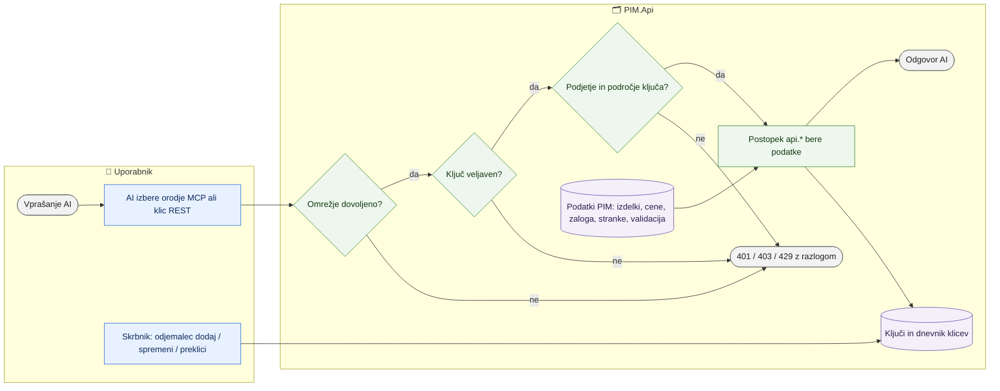

# Bralni API za AI in analize

> **Področje:** Administracija · **Lastnik:** skrbnik (ADMIN) · **Stanje:** ⚠️ delno · **Preverjeno:** 2026-09-29, iz kode in na razvojni bazi

## 1. Namen

AI orodja (Claude Code, Claude Desktop, ChatGPT z akcijami), Excel in skripte **berejo** podatke PIM: izdelke, cene, zalogo, stranke, naročila dobaviteljem, analitiko in stanje validacije. API je ločena spletna aplikacija ob intranetu (`PIM.Api`, IIS, vrata 5095). **Pisati ne more nič** — ne v katalog, ne v SAOP, ne v nastavitve. Rezultat: vodja ali komercialist vpraša AI po domače (»Koliko je vredna zaloga IQ Lightinga po dobaviteljih?«), AI pa odgovori s številkami iz PIM.

## 2. Kdo sodeluje

| Vloga | Kaj naredi v procesu |
|---|---|
| Komerciala | Uporablja AI s svojim ključem (vprašanja o cenah, zalogi, strankah — če ima ključ to področje). |
| Urednik kataloga | Uporablja AI za pregled izdelkov in kakovosti (kartica izdelka z naborom validacije). |
| Skrbnik | Namesti API, ustvari, spremeni in prekliče ključe (`PIM.Api.exe odjemalec ...`), pregleduje dnevnik klicev. |
| Avtomatika (PIM) | Ob vsakem klicu preveri ključ, omrežje, podjetje, področje in hitrost; zapiše klic v dnevnik; enkrat na dan pobriše dnevnik, starejši od 90 dni. |

## 3. Kdaj se sproži

- **Ročno:** vsakič, ko AI ali skripta pokliče API (REST `GET /api/v1/...` ali MCP `POST /mcp`).
- **Po urniku:** čiščenje dnevnika klicev enkrat na dan (znotraj `PIM.Api`, ne v gostitelju avtomatike).
- **Ob dogodku:** ni. API ne sproži nobenega posla; bere, kar so pripravili drugi procesi (zajem iz SAOP, validacija, cene, zaloga).

## 4. Vhod in izhod

| | Kaj | Od kod / kam |
|---|---|---|
| **Vhod** | Vprašanje AI (orodje MCP z argumenti) ali klic REST s ključem `X-Api-Key: pim_...` | AI, skripta, Excel |
| **Vhod** | Podatki PIM: izdelki, atributi, besedila, kategorije, slike, cene, zaloga, stranke, popusti, naročila, analitika, validacija, svežina | PIM (samo postopki sheme `api`) |
| **Izhod** | JSON (ali CSV za Excel) z odgovorom; pri MCP besedilo za AI | AI, skripta, Excel |
| **Izhod** | Dnevnik klicev (kdo, kdaj, kaj, koliko vrstic), čas zadnje uporabe ključa | PIM (`api.RequestLog`, `api.Client`) |

## 5. Diagram

## 6. Koraki

| # | Kdo | Kje | Kaj narediš | Kaj se zgodi v sistemu | Kako preveriš, da je uspelo |
|---|---|---|---|---|---|
| 1 | Skrbnik | strežnik | Objavi in namesti API (`deploy/Publish-Api.ps1`, `deploy/Install-PimApi.ps1`), vpiše povezavo do baze z uporabnikom v vlogi `pim_api_reader`. | Nastane IIS spletno mesto PIM-API na vratih 5095. | `http://STREZNIK:5095/health` vrne `"status":"ok"`. |
| 2 | Skrbnik | ukazna vrstica ob `PIM.Api.exe` | `odjemalec dodaj --ime "..." --podjetja 2,3 --podrocja izdelki,cene,zaloga --velja-do ...` | Nastane ključ `pim_...` (izpiše se enkrat; v bazi samo odtis SHA-256), zapis v `api.ClientHistory`. | `odjemalec seznam` pokaže ključ kot aktiven. |
| 3 | Uporabnik | Claude Code / Claude Desktop | Doda strežnik MCP z naslovom `.../mcp` in glavo `X-Api-Key` (Navodila/08). | AI ob zagonu pokliče `initialize` (dobi navodila za AI) in `tools/list` (vidi samo orodja področij ključa). | AI našteje orodja `pim-api`. |
| 4 | Uporabnik | AI | Vpraša po domače, npr. »Pokaži kartico izdelka X in povej, zakaj ni pripravljen za splet.« | AI pokliče orodja (`tools/call`), API izvede postopek `api.*` v izbranem podjetju, klic zapiše v dnevnik. | Odgovor s številkami iz PIM; v `api.RequestLog` je vrstica. |
| 5 | Skrbnik | ukazna vrstica | `odjemalec preklici --id N` ob odhodu sodelavca ali izgubi ključa. | Ključ ne velja najkasneje po 60 s; zapis v `api.ClientHistory`. | Klic s starim ključem vrne 401. |

## 7. Pravila in varovalke

- **Samo branje.** Uporabnik baze v vlogi `pim_api_reader` ima samo `EXECUTE` na shemi `api`; brez pravic na tabele, `api.Admin_*` je prepovedan. Vsa orodja MCP so označena `readOnlyHint`. API ne more ničesar poslati v SAOP ali v `katalog.csv`.
- **Podjetja ločena.** Vsak klic je v enem podjetju (`organizationId`); ključ vidi samo svoja podjetja.
- **Področja.** `stranke` so osebni podatki — to področje dodeli premišljeno. Kartica izdelka izpusti nabore področij, ki jih ključ nima.
- **Omrežje.** `Api:AllowedRemoteIps`; privzeto samo notranje omrežje. Objava na internet (HTTPS, OAuth) samo po odločitvi lastnika.
- **Sled.** Vsak klic v `api.RequestLog` (90 dni), vsaka sprememba ključa v `api.ClientHistory`.
- **Kakovost podatkov.** `validationStatus` v iskanju je shranjeno stanje zadnje validacije (lahko zastarelo, PENDING = še ni preverjeno); merodajen je nabor `validation` na kartici izdelka. To piše tudi v navodilih za AI.
- **Test F12** (`PIM.F12.ApiContractTests`) ob vsakih vratih preveri, da se katalog ujema s postopki v 287, da vloga ostane samo za branje in da MCP odgovarja po protokolu. `PIM.Api` je v `PIM.sln`, zato ga vrata vedno prevedejo.

## 8. Ko gre kaj narobe

| Znak (kaj vidiš) | Verjeten vzrok | Kaj narediš |
|---|---|---|
| `/health` vrne 503 | Napačna povezava do baze ali prijava IIS nima dostopa | Preveri `appsettings.Local.json` ob `PIM.Api.exe` (Navodila/08, 1.3). |
| 401 »Ključ ni veljaven« | Tipkarska napaka, preklican ali potekel ključ | `odjemalec seznam`, po potrebi nov ključ. |
| AI odgovori »Ključ nima področja …« | Ključ nima področja (npr. stranke) | `odjemalec spremeni --id N --podrocja ...` (premišljeno pri strankah). |
| AI trdi, da so podatki stari | Avtomatika ne teče ali je posel v napaki | `/api/v1/freshness`, nato `/sistem` v intranetu. |
| Claude.ai v brskalniku ali ChatGPT se ne poveže | Povezovalniki v oblaku zahtevajo javni HTTPS in pogosto OAuth, glave `X-Api-Key` ne podpirajo | Uporabi Claude Code ali Claude Desktop v notranjem omrežju. |

## 9. Tehnično ozadje

Za skrbnika in razvoj

- **Koda:** `Catalog.cs` (en vir za poti, parametre, OpenAPI, navodila in orodja MCP), `QueryRunner.cs` (preverjanje parametrov, izvedba postopkov), `ClientAccess.cs` (ključi, dnevnik), `McpProtocol.cs` (MCP brez baze), `ApiDocs.cs` (`/openapi.json`, `/api/v1/guide`), `ClientCli.cs` (`odjemalec ...`), `Program.cs` (varnost, poti).
- **Baza:** shema `api` (23 postopkov), tabele `api.Client`, `api.ClientHistory`, `api.RequestLog`, vloga `pim_api_reader` — migracija 287 (`287_BralniApiZaAnalizeInAi.sql`).
- **Tehnični opis:** `docs/API.md`; navodila za lastnika: `Navodila/08_API_za_AI.md`.

## 10. Odprta vprašanja in razlike

- ⚠️ Ni posebne točke ali filtra »izdelki z napakami / niso pripravljeni za splet« (AI mora kartico brati izdelek po izdelek). Potrebuje novo migracijo — ločena naloga.
- ⚠️ Na razvojni bazi ni veljavnega ključa (oba preklicana); ključ ustvari lastnik. Ali je API nameščen na produkciji, ni preverjeno.
- ⚠️ `READ_COMMITTED_SNAPSHOT` na bazi ni vklopljen: dolga bralna poizvedba med nočnim uvozom lahko čaka na zaklep.
- ⚠️ Ključi so zapisani pod oznako `pim.uporabniki` (dostop); lastne oznake za dnevnik klicev v slovarju podatkov ni.

## Povezani procesi

- [Uporabniki in vloge](uporabniki-in-vloge.md): dostop do intraneta (ključi API so ločeni od računov intraneta).
- [Namestitev in migracije](namestitev-in-migracije.md): migracija 287 in objava.
- [Avtomatika in urniki](avtomatika-in-urniki.md): svežina podatkov, ki jih API bere.
