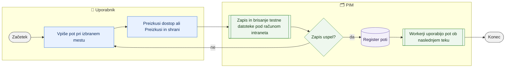

# Mesta shranjevanja datotek

> **Področje:** Administracija · **Lastnik:** skrbnik (ADMIN) · **Stanje:** ✅ deluje · **Preverjeno:** 2026-09-24, iz kode

## 1. Namen

Skrbnik nastavi, v katere mape PIM zapisuje datoteke: prevzete datoteke dobaviteljev (`LANDING_ROOT`), izvozne datoteke za splet — katalog.csv in stranke.csv (`EXPORT_ROOT`), dnevnike (`LOG_ROOT`) in delovne zvezke Excel (`WORKBOOK_ROOT`). Pot se shrani šele, ko PIM vanjo dejansko zapiše in pobriše testno datoteko.

## 2. Kdo sodeluje

| Vloga | Kaj naredi v procesu |
|---|---|
| Komerciala | Ni udeležena. |
| Urednik kataloga | Ni udeležen. |
| Skrbnik | Nastavi in preizkusi poti; na strežniku dodeli pravice mapam. |
| Avtomatika (PIM) | Workerji in gostitelj avtomatike berejo poti iz registra ob vsakem teku. |

## 3. Kdaj se sproži

- **Ročno:** prva namestitev na strežnik, selitev mape, napaka »mapa ni zapisljiva« v izpisu posla.
- **Po urniku:** ni; poti uporabljajo posli `WEB_CATALOG_EXPORT`, `SUPPLIER_CATALOG_IMPORT`, `SUPPLIER_STOCK_IMPORT` in drugi.
- **Ob dogodku:** ni.

## 4. Vhod in izhod

| | Kaj | Od kod / kam |
|---|---|---|
| **Vhod** | Absolutna pot ali omrežna lokacija | skrbnik |
| **Izhod** | Vrstica v registru poti z zadnjo preverbo | PIM (`ops.SystemPath`) |

## 5. Diagram

## 6. Koraki

| # | Kdo | Kje (stran) | Kaj narediš | Kaj se zgodi v sistemu | Kako preveriš, da je uspelo |
|---|---|---|---|---|---|
| 1 | Skrbnik | `/administracija/mape` | Pri mestu (Prevzete datoteke, Izvozne datoteke za splet, Dnevniki, Delovni zvezki) vpišeš pot. | — | — |
| 2 | Skrbnik | isto | **Preizkusi dostop** (samo preizkus) ali **Preizkusi in shrani**. | PIM pod računom intraneta (izpisan na vrhu strani) zapiše in pobriše testno datoteko; pot se shrani samo ob uspehu. Sprememba se zapiše v sled (`PATH_UPDATE`). | Zeleno sporočilo; oznaka »Nastavljeno«, kdo in kdaj. |
| 3 | Skrbnik | isto | **Vrni na privzeto**. | Vrstica se odstrani; velja vgrajeni privzetek (izpisan pod naslovom). Sled `PATH_CLEAR`. | Oznaka »Privzeta pot«. |
| 4 | Skrbnik | strežnik | Računu gostitelja avtomatike (in identiteti IIS bazena) dodeli pravico pisanja v iste mape (npr. `icacls`). | Workerji tečejo pod drugim računom kot intranet. | Naslednji tek posla na `/sistem` je zelen. |

## 7. Pravila in varovalke

- Pot se ne shrani, če preizkus zapisa ne uspe — obstoj mape ne pove ničesar o pravicah.
- Na strežniku pot ne sme biti v objavljeni mapi spletnega mesta (naslednja objava jo prepiše).
- Samo ADMIN.

## 8. Ko gre kaj narobe

| Znak (kaj vidiš) | Verjeten vzrok | Kaj narediš |
|---|---|---|
| Preizkus uspe, posel pa pade z »ni zapisljivo« | Worker teče pod drugim računom brez pravic | Dodeli pravice računu storitve `PIM.AutomationHost`. |
| katalog.csv ni na pričakovanem mestu | `EXPORT_ROOT` ni nastavljen ali kaže drugam | Preveri vrstico Izvozne datoteke; primer PRD: `C:\inetpub\wwwroot\PIM_exports_csv`. |
| Po objavi izginejo datoteke | Pot je bila v mapi spletnega mesta | Premakni na mapo zunaj objave. |

## 9. Tehnično ozadje

Za skrbnika in razvoj

- **Stran:** `AdminPaths.razor`; zavihki `SistemskeZadeveTabs`.
- **Storitve:** `AdminConsoleService.GetSystemPathsAsync`, `SaveSystemPathAsync`, `ClearSystemPathAsync`, `LogActivityAsync`; ključi in opisi v `PIM.Operations/SystemPaths.cs` (`LANDING_ROOT`, `EXPORT_ROOT`, `LOG_ROOT`, `WORKBOOK_ROOT`).
- **Tabela:** `ops.SystemPath` (vrstice po podjetju so možne; stran ureja samo splošne).
- **Skripte:** `scripts/Nastavi-izvozno-pot.ps1`, `scripts/Nastavi-pravice-izvozne-mape.ps1`.

## 10. Odprta vprašanja in razlike

- ⚠️ Preizkus velja samo za račun intraneta; za račun gostitelja avtomatike ga stran ne more narediti.
- ⚠️ Znano (2026-09-21/23): na DEV izvozna mapa pod `inetpub` ni zapisljiva, na PRD je bila pravica popravljena ročno z `icacls` za bazen `PIM_prd_pool`. Ob menjavi računa ali strežnika se napaka ponovi.

## Povezani procesi

- [Avtomatika in urniki](avtomatika-in-urniki.md): posli, ki pišejo v te mape.
- [Namestitev in migracije](namestitev-in-migracije.md): nastavitev poti ob prvi namestitvi.
- [Katalog in stranke CSV](../06-izhod-splet/katalog-in-stranke-csv.md): izvoz v `EXPORT_ROOT`.
- [Dobaviteljski katalogi XML](../02-vhodi/dobaviteljski-katalogi-xml.md): prevzem v `LANDING_ROOT`.
