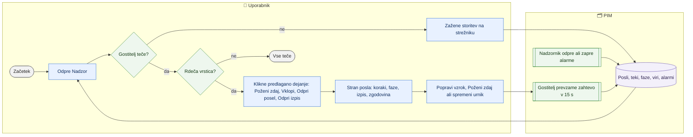

# Nadzor sistema — posli, teki, alarmi, sled sprememb in nočni samotest

> **Področje:** Administracija · **Lastnik:** skrbnik (ADMIN) · **Stanje:** ✅ deluje · **Preverjeno:** 2026-09-24, iz kode

## 1. Namen

Skrbnik na eni strani vidi, ali gostitelj avtomatike teče, ali so podatki vsakega posla sveži (zeleno/sivo/rdeče), zakaj je kaj rdeče in kateri en korak težavo reši; od tam gre v podrobnosti posla (koraki, faze, izpis, zgodovina, nastavitve), v teke vhodnih podatkov in v sled, kdo je kaj spremenil.

**Nočni samotest** (`SYSTEM_SELF_TEST`, ob 04:30, privzeto izklopljen) vsako noč prehodi celo verigo (baza, urniki, utripi, katalog, svežina zaloge po virih, karantena, kakovost, spletni CSV, odhodna vrsta, odmev iz ERP, svežina izvozov) in vsakemu koraku izmeri čas. Samo bere: ne kliče SAOP-a, ne pošilja ničesar in ne spreminja podatkov; edini zapis je njegov lastni rezultat (`ops.SelfTestRun`, `ops.SelfTestStep`). Ločene strani za zgodovino samotestov ni več (odstranjena 2026-09-29, odločitev lastnika): padel samotest se šteje v zvonec, zgodovina ostane v `ops.SelfTestRun` in dnevniku `samotest_*.log`. Podrobnosti: `docs/NADZOR_SKRBNIKA.md` §3.

## 2. Kdo sodeluje

| Vloga | Kaj naredi v procesu |
|---|---|
| Komerciala | Nima dostopa do `/sistem` (samo ADMIN); alarme lahko prejema po e-pošti, če je naročena. |
| Urednik kataloga | Nima dostopa; prejema alarme po e-pošti, če je naročen. |
| Skrbnik | Pregleda stanje, požene ali ustavi posel, vklopi postopek, potrdi ali razreši obvestilo, pregleda teke in sled. |
| Avtomatika (PIM) | Nadzornik (`ALERT_EVALUATION`) odpira alarme, razpošiljanje (`ALERT_DELIVERY`) jih pošlje; stran se sama osveži vsakih 15 s. Nočni samotest (`SYSTEM_SELF_TEST`) zapiše svoj rezultat; padel samotest se šteje v zvonec. |

## 3. Kdaj se sproži

- **Ročno:** dnevni pregled; ko nekdo javi, da cene, zaloga ali katalog niso sveži; po objavi nove različice.
- **Po urniku:** `ALERT_EVALUATION` in `ALERT_DELIVERY` vsakih 5 min; `SYSTEM_SELF_TEST` ob 04:30 (privzeto izklopljen, vklopi ga skrbnik); zunanja naloga »PIM nadzor avtomatike« vsakih 5 min preveri utrip gostitelja.
- **Ob dogodku:** e-poštni alarm (naročnine na `/administracija`) ali rdeč zvonec v glavi aplikacije.

## 4. Vhod in izhod

| | Kaj | Od kod / kam |
|---|---|---|
| **Vhod** | Zakup gostitelja, posli, teki, koraki, faze, viri s svežino, alarmi | PIM (`ops.*`) |
| **Vhod** | Teki vhodnih podatkov (strani, zavrnjeni zapisi) | PIM (`ops.PipelineRun`, `raw.Inbox`) |
| **Vhod** | Sledi sprememb iz več tabel | PIM (`intranet.GetUserActivityTrail`) |
| **Vhod** | Zadnji zagon nočnega samotesta (za zvonec) | PIM (`ops.SelfTestRun`, `ops.SelfTestStep` prek `intranet.GetAdminPulse`) |
| **Izhod** | Zahteve za zagon/ustavitev, vklopi poslov in postopkov, spremembe urnika in meje svežine, potrjeni/razrešeni alarmi | PIM (`ops.*`, sled `ops.LogUserActivity`) |

## 5. Diagram

## 6. Koraki

| # | Kdo | Kje (stran) | Kaj narediš | Kaj se zgodi v sistemu | Kako preveriš, da je uspelo |
|---|---|---|---|---|---|
| 1 | Skrbnik | `/sistem` (zavihek Nadzor) | Pogledaš prvi okvir: »Gostitelj avtomatike teče« (vrsta, računalnik, utrip) ali »… ne teče — posli ne tečejo«. | Odprtje strani označi obvestila kot videna (zvonec). | Utrip nekaj sekund star. |
| 2 | Skrbnik | isto | Preberi povzetek: »Vse teče« ali »N poslov potrebuje pozornost: …«. Posli so razvrščeni po tokovih: Spletni katalog, Cene in zaloga, Naročila, Vhodni viri, Sistem. | Barva pomeni svežino **podatkov**, ne izhodno kodo procesa: zelena = sveži, siva = izklopljeno ali brez dela, rdeča = napaka ali prestari podatki. | — |
| 3 | Skrbnik | isto | V rdeči vrstici klikneš ponujeno dejanje: **Poženi zdaj** (+ **Potrdi zagon** za zunanje klice), **Vklopi** (+ **Potrdi vklop**), **Vklopi postopek**, **Odpri posel**, **Odpri izpis**, **Kako zagnati gostitelja**. | Zahteva se zapiše; gostitelj jo prevzame ob naslednjem tiku. | »zahteva za zagon oddana«, nato »teče: …«. |
| 4 | Skrbnik | isto, »Druga obvestila« | **Potrdi** (videl sem) ali **Razreši** (rešeno). | Alarm se označi; razrešen izgine s seznama. | Vrstica izgine ali je potrjena. |
| 5 | Skrbnik | `/sistem/posel/{JobKey}` | Stran posla: **Stanje zdaj** (Kdaj teče, Zadnji rezultat, Kaj kliče), **1. Viri podatkov**, **2. Zadnji tek** (koraki in faze; `?tek=<id>` za starejši tek), **3. Izpis dnevnika** (**Pokaži cel izpis**), **4. Zgodovina tekov**, **5. Nastavitve** (Urnik, Meja svežine virov, Postopki, Odvisnosti, Datoteke). Krmila: **Poženi zdaj**, **Ustavi**, **Izklopi**, **Vklopi**. | Sprememba urnika ali meje svežine velja od naslednjega tika gostitelja; **Nazaj na kodo** vrne mejo svežine na privzeto. | Sporočilo o uspehu; vrednost v razdelku Nastavitve. |
| 6 | Skrbnik | `/sistem/teki` | Filtriraš podjetje, vir, postopek, status → **Uporabi filtre**; klik na čas odpre tek. | Seznam izvedb vhodov (katalog, XML, zaloga …) s prebranimi, uspešnimi in zavrnjenimi zapisi. | — |
| 7 | Skrbnik | `/sistem/teki/{RunId}` | Pregledaš identiteto teka, rezultat, korake in strani; klik na stran odpre težavo zajema. | Samo branje. | — |
| 8 | Skrbnik | `/sistem/sled` | Izbereš obdobje (dan … leto), iščeš po uporabniku, šifri ali opisu → **Poišči**. | Kronološka sled iz vseh tabel s stolpcem Vir (iz katere tabele). | Vrstica z dejanjem, ki ga iščeš. |

## 7. Pravila in varovalke

- Rumene barve ni: vsaka rdeča vrstica ima razlog in natanko en predlagan korak.
- Zagon ali vklop posla, ki kliče SAOP ali dobavitelja ali pošilja e-pošto, zahteva drugi klik.
- Dejanja se zapišejo v sled; če zapis sledi pade, stran pove, da je bilo dejanje izvedeno (da ga ne ponoviš).
- Vse strani `/sistem*` razen tekov so `[Authorize(Roles = "ADMIN")]`; pravice `tab.system.overview`, `tab.ingest.runs`, `view.system.activity`.

## 8. Ko gre kaj narobe

| Znak (kaj vidiš) | Verjeten vzrok | Kaj narediš |
|---|---|---|
| »Stanja poslov ni mogoče prebrati« | Baza nedosegljiva ali preobremenjena | Prikazano je zadnje prebrano stanje; poskusi **Osveži** čez minuto. |
| Posel rdeč »blokiran« | Predhodnik ni uspel ali je njegov uspeh prestar | **Odpri posel** predhodnika. |
| Postopek izklopljen (napaka 51100) | Postopek v `ops.ScheduleProfile` je izklopljen za podjetje | **Vklopi postopek**. |
| Tek visi brez utripa | Worker zamrznil | **Ustavi** na strani posla; izpis dnevnika. |
| Alarm se vedno znova odpira | Vzrok ni odpravljen (npr. mapa ni zapisljiva) | Preberi izpis, popravi vzrok (npr. `/administracija/mape`). |

## 9. Tehnično ozadje

Za skrbnika in razvoj

- **Strani:** `Monitor.razor` (`/sistem`), `MonitorJob.razor` (`/sistem/posel/{JobKey}`), `IngestRuns.razor` in `IngestRunDetail.razor` (`/sistem/teki`, tudi stari naslov `/zajem/teki`), `AdminActivity.razor` (`/sistem/sled`); zavihki `NadzorTabs` (Nadzor, Teki, Sled sprememb).
- **Storitve:** `MonitorService` (`RequestRunAsync`, `RequestCancelAsync`, `SetJobEnabledAsync`, `EnablePipelineAsync`, `SetOrganizationAutomationAsync`, `SaveJobScheduleAsync`, `SaveSourceMaxAgeAsync`, `AcknowledgeAlertAsync`, `ResolveAlertAsync`), `AdminConsoleService` (`MarkAlertsSeenAsync`, `intranet.GetUserActivityTrail`), `PipelineReadService`.
- **Presoja barve:** `PIM.Automation/MonitorPolicy.cs`, pregled `AutomationOverview.cs`.
- **Tabele:** `ops.SchedulerLease`, `ops.JobDefinition`, `ops.JobRun`, `ops.JobStepRun`, `ops.JobPhaseRun`, `ops.JobSource`, `ops.Alert`, `ops.PipelineRun`, `ops.ScheduleProfile`, `ops.SelfTestRun`, `ops.SelfTestStep`.
- **Samotest:** `PIM_Solution/tests/PIM.SelfTest.Nightly`, posel `SYSTEM_SELF_TEST` v `PIM.Automation/JobCatalog.cs` (opis poslov v [Avtomatika in urniki](avtomatika-in-urniki.md)).
- **Migracije:** 247, 254, 255 (faze), 256 (viri in svežina), 259 (nadzor poslov), 260/261, 276 (meja svežine na strani).

## 10. Odprta vprašanja in razlike

- ⚠️ `/sistem/teki` in `/sistem/teki/{RunId}` imata samo `[Authorize]` (vsak prijavljen), dostop pa zapira dovoljenje `tab.ingest.runs`; podrobnosti teka kažejo še stare zavihke zajema (`IngestTabs`: Vhodi, Teki, Težave), čeprav je meni »Zajem podatkov« odstranjen.
- ⚠️ Stran »Nadzor« prikazuje samo posle gostitelja; kar poženejo stara Windows opravila, se tu vidi le posredno (faze, teki), ne kot posel. Če na PRD še tečejo opravila, je slika na `/sistem` nepopolna.
- ⚠️ Stran posla se sklicuje na odstranjene strani (`/sistem/opravila` v besedilu alarmov iz 254); preveriti besedila alarmov.
- ⚠️ Stran v brskalniku ni bila preverjena s prijavljenim skrbnikom (znano iz sej 2026-09-21/22).

## Povezani procesi

- [Avtomatika in urniki](avtomatika-in-urniki.md): kaj posli počnejo in kdo jih poganja.
- [Uporabniki in vloge](uporabniki-in-vloge.md): naročnine na alarme po e-pošti.
- [Mesta shranjevanja](mesta-shranjevanja.md): pogost vzrok ponavljajočih alarmov.
- [Nadzorna plošča](../01-nadzor/nadzorna-plosca.md): poslovni povzetek za vse vloge.
- [Čakalna vrsta zajema](../02-vhodi/cakalna-vrsta-zajema.md) in [Težave in neujemanja zajema](../02-vhodi/tezave-in-neujemanja-zajema.md): nadaljevanje iz podrobnosti teka.
