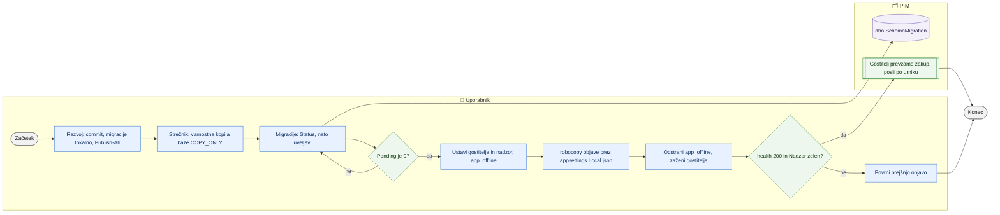

# Namestitev nove različice in migracij baze

> **Področje:** Administracija · **Lastnik:** skrbnik (ADMIN) · **Stanje:** ⚠️ delno · **Preverjeno:** 2026-09-24, iz kode

## 1. Namen

Nova različica PIM pride na strežnik v dveh delih: najprej **migracije baze** (oštevilčene `.sql` datoteke, ki jih uveljavi migrator ločeno od aplikacije), nato **objava aplikacije** (intranet + workerji + skripte v eni mapi, brez izvorne kode). Rezultat: baza in aplikacija na strežniku sta usklajeni, avtomatika spet teče.

## 2. Kdo sodeluje

| Vloga | Kaj naredi v procesu |
|---|---|
| Komerciala | Med vzdrževanjem ne dela v intranetu (stran kaže »Vzdrževanje PIM«). |
| Urednik kataloga | Enako; po objavi preveri svoje strani. |
| Skrbnik | Pripravi objavo, naredi varnostno kopijo, uveljavi migracije, prekopira objavo, preveri delovanje. |
| Avtomatika (PIM) | Gostitelj avtomatike mora biti med kopiranjem ustavljen; po zagonu nadaljuje po urniku. |

## 3. Kdaj se sproži

- **Ročno:** ko je na razvojnem računalniku nova, preizkušena različica (commit na GitHub).
- **Po urniku:** ni.
- **Ob dogodku:** nujni popravek; samo sprememba baze (nova migracija) se lahko namesti brez objave aplikacije.

## 4. Vhod in izhod

| | Kaj | Od kod / kam |
|---|---|---|
| **Vhod** | Mapa `PIM_Solution/sql/migrations` (NNN_Opis.sql) | razvojni računalnik / GitHub |
| **Vhod** | Objava (`PIM.Intranet.exe`, `Workerji\…`, `scripts\…`) | `Publish-All.ps1` na razvojnem računalniku |
| **Vhod** | `appsettings.Local.json` na strežniku (povezava, SAOP, `Fetch:*`) | ostane na strežniku, nikoli v objavi |
| **Izhod** | Posodobljena baza + vrstice v `dbo.SchemaMigration` | SQL strežnik |
| **Izhod** | Posodobljena mapa spletnega mesta IIS, zagnana storitev `PIM.AutomationHost` | strežnik |

## 5. Diagram

## 6. Koraki

| # | Kdo | Kje | Kaj narediš | Kaj se zgodi v sistemu | Kako preveriš, da je uspelo |
|---|---|---|---|---|---|
| 1 | Skrbnik | razvojni računalnik | Commit in push; nove migracije uveljaviš lokalno: `Invoke-PendingMigrations.ps1 -MigrationsPath <mapa> -ConnectionString <razvojna> -Status`, nato brez `-Status`. | Uveljavijo se samo datoteke, ki jih v `dbo.SchemaMigration` še ni (vsaka v svoji `sqlcmd -I` seji). | Drugi `-Status`: Pending = 0; aplikacija lokalno dela. |
| 2 | Skrbnik | razvojni računalnik | Zapreš Visual Studio, poženeš `deploy\Publish-All.ps1 -Destination C:\PIM_publish\PIM_app` (najprej `-DryRun`; `-BrezWorkerjev` za samo intranet). | Samostojna objava (self-contained) intraneta, vseh workerjev v `Workerji\` in skript v `scripts\`; `appsettings.Local.json` se izloči. | Obstaja `Workerji\PIM.AutomationHost\PIM.AutomationHost.exe`. |
| 3 | Skrbnik | strežnik, SSMS | Odpreš `deploy\Backup-PIM.sql`, popraviš `@BackupFile`, poženeš. | `COPY_ONLY` varnostna kopija + `RESTORE VERIFYONLY`. | Sporočilo o uspešni preverbi. |
| 4 | Skrbnik | strežnik | Migracije: `Invoke-PendingMigrations.ps1 … -Status`, nato brez `-Status` (potreben `sqlcmd`); brez `sqlcmd` prenosljiv paket (`New-PortableRelease.ps1`: `PIM.Migrator.exe` + `Apply-PimDatabase.ps1`). | Baza se posodobi **pred** aplikacijo (stara koda na novi bazi praviloma dela, obratno ne). | `-Status` še enkrat: Pending = 0; `CHANGED` pomeni spremenjeno že uveljavljeno datoteko. |
| 5 | Skrbnik | strežnik, PowerShell kot administrator | `Stop-Service PIM.AutomationHost`; `Disable-ScheduledTask 'PIM nadzor avtomatike'`; ustvariš `app_offline.htm` v mapi spletnega mesta. | Avtomatika in intranet se ustavita; uporabniki vidijo stran vzdrževanja. | `Get-Service` = Stopped. |
| 6 | Skrbnik | strežnik | `robocopy <objava> <mapa spletnega mesta> /MIR /XF appsettings.Local.json app_offline.htm /XD logs izvoz`. | Mapa spletnega mesta postane točna kopija objave; nastavitve, dnevniki in izvozi ostanejo. | Izhodna koda robocopy 0–7. |
| 7 | Skrbnik | strežnik | Odstraniš `app_offline.htm`; `Start-Service PIM.AutomationHost`; `Enable-ScheduledTask 'PIM nadzor avtomatike'`. | Intranet se zažene; gostitelj prevzame zakup. | `Invoke-WebRequest …/health` = 200; `/sistem` kaže `service · <strežnik>` in svež utrip. |
| 8 | Skrbnik | intranet | Prijava, `/sistem`: prvi posli po urniku se končajo zeleno. | — | Brez rdečih vrstic. |
| 9 | Skrbnik | strežnik | Če nova različica ne dela: ponovi koraka 6–7 s prejšnjo objavo (hrani npr. `C:\PIM_publish\PIM_app_prejsnja`). Bazo vračaš samo iz varnostne kopije. | — | `/health` in `/sistem`. |

**Prva namestitev** (enkrat): .NET 10 Hosting Bundle, IIS bazen (*No Managed Code*, `AlwaysRunning`, brez `idleTimeout`), `appsettings.Local.json` v mapi spletnega mesta, mape `EXPORT_ROOT`/`LANDING_ROOT` izven mape spletnega mesta (`/administracija/mape`), storitev gostitelja (`Install-AutomationHost.ps1 -ZunanjiNadzor`), odstranitev starih Windows opravil (`scripts\Namesti-opravila.ps1 -Odstrani`), prvi skrbnik (`PIM.Migrator --ustvari-admina <ime>`).

## 7. Pravila in varovalke

- Baza vedno **pred** aplikacijo; pred migracijami na strežniku vedno varnostna kopija.
- Že uveljavljene migracije se ne spreminja (hash v `dbo.SchemaMigration`) — popravek je nova datoteka z naslednjo številko.
- `appsettings.Local.json` nikoli ne gre na GitHub ali v objavo; na vsakem stroju ostane svoj. Pred migracijo preveri `Server=` in `Database=` v povezavi (PIM vs PIM_test).
- Na eni bazi sme teči en gostitelj avtomatike.
- Dolge migracije poganjaj izven delovnega časa in z ustavljenim gostiteljem.

## 8. Ko gre kaj narobe

| Znak (kaj vidiš) | Verjeten vzrok | Kaj narediš |
|---|---|---|
| Migracija pade z napako 1934 | Pognana brez `QUOTED_IDENTIFIER` (`sqlcmd -I`) | Uporabi `Invoke-PendingMigrations.ps1` (sam doda `-I`). |
| »empty string« ob zagonu skripte | Manjka `-MigrationsPath` pri `powershell -File` | Dodaj `-MigrationsPath $PWD`. |
| Stanje `CHANGED` | Uveljavljena datoteka je bila pozneje spremenjena | Ne poganjaj na silo; naredi novo migracijo (glej `Navodila/07_Tezave.md`). |
| Migracija pade na polovici | Napaka v eni datoteki | Prejšnje iz istega zagona ostanejo uveljavljene; popravi vzrok in poženi znova. |
| robocopy ne more prepisati `.exe` | Gostitelj ali worker še teče | `Stop-Service PIM.AutomationHost`, počakaj na konec workerjev. |
| Po objavi `/sistem` kaže `console` | Na bazo je priklopljen razvojni gostitelj | Ugasni ga. |

## 9. Tehnično ozadje

Za skrbnika in razvoj

- **Objava:** `deploy/Publish-All.ps1` (ovojnica okoli `dotnet publish … -c Release -r win-x64 --self-contained true`; cilj `PimPublishWorkersAndScripts` v `PIM.Intranet.csproj` doda `Workerji\` in `scripts\`), `deploy/Publish-Intranet.ps1` (z izvorno kodo na strežniku, z rollbackom), `deploy/New-PortableRelease.ps1` (+ `deploy/portable/*`).
- **Migracije:** `sql/migrations/Invoke-PendingMigrations.ps1` (vsaka datoteka v svoji seji, brez `--verify`), `src/PIM.Migrator` (vse čakajoče v eni transakciji z zaklepom, `--verify` F0–F10, `--show-migrations`, `--create-database`, `--ustvari-admina`), `deploy/Apply-Migrations.ps1` (`dotnet run` migratorja). Obe orodji pišeta v isto `dbo.SchemaMigration` z istim hashem.
- **Zdravje:** `/health` (anonimno, `{"stanje":"zdravo"}`).
- **Navodila:** `Navodila/README.md` (hitri vrstni red), `02_Migracije.md`, `03_Publish.md`, `04_Prenos_na_streznik.md`, `05_AutomationHost.md`, `07_Tezave.md`; `docs/PUBLISH.md`, `deploy/README-Windows.md`, `deploy/PORTABLE_RELEASE.md`.

## 10. Odprta vprašanja in razlike

- ⚠️ V mapi migracij so **podvojene številke** (npr. 230, 236, 237, 249, 256, 276 imajo po dve datoteki). Ledger jih loči po imenu, vrstni red med dvema z isto številko pa je abecedni — pri odvisnostih med njima lahko pride do napake.
- ⚠️ Po zapiskih iz sej na razvojni bazi nekatere migracije (npr. 246/247, 275, 279) niso bile uveljavljene po običajni poti ali niso v ledgerju; `-Status` na DEV zato ne odraža nujno stanja PRD.
- ⚠️ `Navodila/*.md` navajajo poti `C:\Users\david\Desktop\PIM\NoviPIM`, repozitorij pa je v `Documents\GitHub\PIM`; primeri ukazov se ne ujemajo z dejanskim računalnikom.
- ⚠️ Objava s seboj nese tudi skripte starih ciklov (`scripts\Namesti-opravila.ps1` …), ki lahko na strežniku znova registrirajo stara Windows opravila.
- ⚠️ V repozitoriju sta zabeleženi mapi objave `publish_2026-09-23` in `publish_2026-09-23_sc` (več tisoč datotek) — objava ne sodi v git.
- ⚠️ Navodila predpostavljajo, da je gostitelj na PRD nameščen kot storitev; po stanju 2026-09-22 ni bil (glej [Avtomatika in urniki](avtomatika-in-urniki.md)). Koraka 5 in 7 zato na PRD morda še ne veljata.
- ⚠️ Strežnik je publish-only (brez git in `PIM.sln`); `Publish-Intranet.ps1` z rollbackom predpostavlja izvorno kodo na strežniku in tam ni uporaben.

## Povezani procesi

- [Avtomatika in urniki](avtomatika-in-urniki.md): ustavitev in zagon gostitelja, stara opravila.
- [Nadzor sistema](nadzor-sistema.md): preverjanje po objavi.
- [Mesta shranjevanja](mesta-shranjevanja.md): nastavitev map ob prvi namestitvi.
- [Uporabniki in vloge](uporabniki-in-vloge.md): prvi skrbnik na novi bazi.
