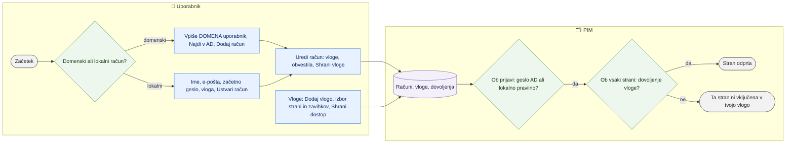

# Uporabniki, vloge in dostop do strani

> **Področje:** Administracija · **Lastnik:** skrbnik (ADMIN) · **Stanje:** ⚠️ delno · **Preverjeno:** 2026-09-24, iz kode

## 1. Namen

Skrbnik doda domenski (Active Directory) ali lokalni račun, mu dodeli vloge, po potrebi nastavi geslo lokalnemu računu, ga onemogoči ali prisilno odjavi, in določi, katere strani in zavihke vidi posamezna vloga. Rezultat: vsak sodelavec vidi in ureja samo tisto, kar mu vloga dovoli.

## 2. Kdo sodeluje

| Vloga | Kaj naredi v procesu |
|---|---|
| Komerciala | Se prijavi; nič ne ureja. |
| Urednik kataloga | Se prijavi; nič ne ureja. |
| Skrbnik | Edini upravlja račune, vloge, dovoljenja in naročnine na obvestila. |
| Avtomatika (PIM) | Ob vsaki zahtevi preveri dovoljenje poti; ob drugi prijavi istega računa ponudi prevzem seje. |

## 3. Kdaj se sproži

- **Ročno:** nov sodelavec, odhod sodelavca, sprememba dela, pozabljeno lokalno geslo, nova vloga.
- **Po urniku:** ni.
- **Ob dogodku:** prvi skrbnik na novi bazi se ustvari z orodjem (`PIM.Migrator --ustvari-admina <ime>` ali `tools/PIM.UserProvisioning`).

## 4. Vhod in izhod

| | Kaj | Od kod / kam |
|---|---|---|
| **Vhod** | Domenski uporabnik `DOMENA\uporabnik` ali lokalno ime, ime in priimek, e-pošta, začetno geslo, začetna vloga | skrbnik, Active Directory |
| **Vhod** | Izbor strani, zavihkov in podstrani za vlogo | skrbnik |
| **Izhod** | Računi, vloge, dovoljenja vlog, naročnine na alarme in dnevni mail »Zaloga pod MID« | PIM (`sec.*`, `intranet.UserAlertSubscription`) |

## 5. Diagram

## 6. Koraki

| # | Kdo | Kje (stran) | Kaj narediš | Kaj se zgodi v sistemu | Kako preveriš, da je uspelo |
|---|---|---|---|---|---|
| 1 | Skrbnik | `/administracija` | **Dodaj uporabnika** → **Domenski račun** → vpišeš `DOMENA\uporabnik`, izbereš začetno vlogo → **Najdi v AD** → **Dodaj račun**. | Račun se najprej preveri v AD; nastane vrstica z virom AD. Geslo ostane v AD. | Račun je v seznamu z oznako »Active Directory«, »Aktiven«. |
| 2 | Skrbnik | isto | **Lokalni račun** → uporabniško ime, ime in priimek, e-pošta, začetno geslo, vloga → **Ustvari račun**. | Geslo se shrani samo zgoščeno. Zavrne se le prazno geslo; krajše od 10 znakov samo opozori. | Sporočilo o uspehu (morebitno priporočilo za geslo). |
| 3 | Skrbnik | isto, »Uredi račun« | Ime, e-pošta → **Shrani profil**; lokalnemu računu novo geslo → **Nastavi geslo**; vloge (kljukice) → **Shrani vloge**; naročnine na vrste alarmov in »Zaloga pod MID«. | Spremembe so takoj v bazi; nova dovoljenja veljajo ob naslednji zahtevi uporabnika. | Oznake vlog v vrstici uporabnika. |
| 4 | Skrbnik | isto | **Onemogoči** / **Omogoči**; **Prisilno odjavi** (pri računu, ki je bil že viden). | Onemogočen račun se ne more prijaviti (»Ta račun je onemogočen«). Prisilna odjava razveljavi sejo. | Oznaka »Onemogočen«. |
| 5 | Skrbnik | `/administracija/vloge` | **Dodaj vlogo** → ime, koda (VELIKE_ČRKE), opis → **Ustvari in nastavi dostop**. | Nova lastna vloga brez dovoljenj. | Vloga je v seznamu levo. |
| 6 | Skrbnik | isto | Izbereš vlogo, označiš strani in njihove zavihke/podstrani (**Izberi vse**, **Počisti**) → **Shrani dostop**. Ime in opis → **Shrani podatke**. | Podstran brez glavne strani ni dovoljena; glavna stran z zavihki potrebuje vsaj enega. Vloge ADMIN ni mogoče omejiti (vedno vse). | »N sprememb« izgine; uporabnik z vlogo vidi nove postavke menija. |
| 7 | Skrbnik | isto | Lastno vlogo brez uporabnikov izbrišeš: **Izbriši vlogo** → **Da, izbriši**. | Sistemskih vlog in vlog z uporabniki ni mogoče izbrisati. | Vloge ni več. |
| 8 | Uporabnik | `/prijava` | Uporabniško ime in geslo → **Prijava** (po želji »Zapomni si me« do 14 dni). | Domenski račun se preveri v AD, lokalni z zgoščenim geslom. Če je račun prijavljen drugje, ponudi **Da, prevzemi sejo** (potrditev velja 2 min). | Odpre se nadzorna plošča; meni kaže samo dovoljene strani. |

## 7. Pravila in varovalke

- Strani `/administracija*` in `/sistem*` so samo za vlogo ADMIN (`[Authorize(Roles = "ADMIN")]`).
- Dostop do vsake strani preverja `PimAccessRouteView` po ključih iz `PimAccessCatalog` in `sec.RolePermission`; neznana nova stran je zaprta, dokler je ne dodamo v katalog. ADMIN ima vedno vse ključe.
- Neznan ali odstranjen naslov (npr. star zaznamek) prijavljen uporabnik vidi kot stran »Strani ni (več)« (`/ni-najdeno`, #65) v postavitvi intraneta s povezavama na nadzorno ploščo in iskanje izdelkov; strežnik vrne kodo 404, preusmeritev ni. Neprijavljen gre najprej na `/prijava`. Izvozi, prenosi (`/izvoz/...`), prijava in datoteke ohranijo kratek 404 brez strani (`PimNotFoundScope`).
- Zapisovalne pravice (urejanje kataloga, SAOP, komerciala, alarmi, varovalke) so vezane na **sistemske vloge** ADMIN, CATALOG_EDITOR, COMMERCIAL (politike v `PimAuthorization.cs`), ne na dovoljenja strani.
- En račun = ena aktivna seja (prevzem seje ob drugi prijavi).
- **Gesel obstoječih uporabnikov nikoli ne spreminjaj brez njihove zahteve** (tudi ne avtomatizirano ali z orodji za razvoj); za dodatnega skrbnika ustvari nov račun.

## 8. Ko gre kaj narobe

| Znak (kaj vidiš) | Verjeten vzrok | Kaj narediš |
|---|---|---|
| »Ta stran ni vključena v tvojo vlogo« | Vlogi manjka dovoljenje strani ali zavihka | `/administracija/vloge` → dodaj dovoljenje. |
| Lastna vloga ima dovoljenje, stran pa še vedno zavrne | Stran ima fiksno `[Authorize(Roles = …)]` s sistemskimi vlogami | Uporabniku dodaj še ustrezno sistemsko vlogo (glej 10). |
| Gumb shrani vrne »Dejanje zahteva eno od vlog …« | Zapisovalna politika zahteva sistemsko vlogo | Dodeli CATALOG_EDITOR ali COMMERCIAL. |
| »Najdi v AD« ne najde uporabnika | Napačen zapis ali intranet ne doseže domene | Preveri `DOMENA\uporabnik` in nastavitev `ActiveDirectory:Domain`. |
| Domenski uporabnik ne more spremeniti gesla v PIM | Domenskih gesel PIM ne hrani | Geslo spremeni v AD. |

## 9. Tehnično ozadje

Za skrbnika in razvoj

- **Strani:** `SystemUsers.razor` (`/administracija`), `SystemRoles.razor` (`/administracija/vloge`), `Login.razor`; zavihki `SistemskeZadeveTabs`.
- **Storitve:** `IntranetUserAdministrationService` (`sec.CreateDomainUser`, `CreateLocalUserAsync`, `ResetPasswordAsync`, `SetRolesAsync`, `SetEnabledAsync`, `ForceSignOutAsync`, naročnine `intranet.GetUserAlertSubscriptions`), `RoleAdministrationService` (`sec.Role`, `sec.RolePermission`), `RoleAccessService.CanAccessAsync`, `LocalUserAuthenticationService`, `ActiveDirectoryService`.
- **Tabele:** `sec.LocalUser` (tudi domenski računi z `AuthSource = DOMAIN`), `sec.LocalUserRole`, `sec.Role`, `sec.RolePermission`, `intranet.UserAlertSubscription`.
- **Prvi skrbnik:** `PIM.Migrator --ustvari-admina <ime>` ali `tools/PIM.UserProvisioning --user <ime>` (oba kličeta `sec.CreateLocalUser`, ne prepišeta obstoječega računa).
- **Migracije:** 224 (zadnjič viden), 225 (naročnine na alarme), 250 (vloge strank po podjetju), 259 (čiščenje dovoljenj nadzora).

## 10. Odprta vprašanja in razlike

- ⚠️ Lastne vloge (ustvarjene na `/administracija/vloge`) dobijo dovoljenja strani, vendar večina strani ima še fiksno `[Authorize(Roles = "ADMIN,CATALOG_EDITOR,COMMERCIAL")]` ali `ADMIN`, zapisovalne politike pa so vezane na sistemske vloge. Lastna vloga sama zato praktično ne odpre ničesar — potrebna je še sistemska vloga. Stran tega ne pove.
- ⚠️ `IntranetUserAdministrationService` in `RoleAdministrationService` na zapisovalni poti ne kličeta `PimWriteGuard`; varuje samo `[Authorize(Roles = "ADMIN")]` na strani.
- ⚠️ Ni varovala, ki bi preprečilo, da skrbnik onemogoči sam sebe ali odvzame vlogo ADMIN zadnjemu skrbniku.
- ⚠️ Menijska vidnost (`PimNavigation`) ima poleg dovoljenj še lastne sezname vlog pri nekaterih postavkah; oboje je treba vzdrževati usklajeno.
- ⚠️ V bazi ni revizije sprememb gesel (znano iz incidenta 2026-09-17); sled je samo v `/sistem/sled`, kolikor jo storitev zapiše.

## Povezani procesi

- [Nadzor sistema](nadzor-sistema.md): naročnine na alarme in sled sprememb.
- [Mesta shranjevanja](mesta-shranjevanja.md): tretji zavihek Sistemskih zadev.
- [Nadzorna plošča](../01-nadzor/nadzorna-plosca.md): prva stran po prijavi.
- [Varovalke](../01-nadzor/varovalke.md): kdo sme potrditi zadržano objavo.
- [Zaloge in rezervacija](../07-poslovanje/zaloge-in-rezervacija.md): dnevni mail »Zaloga pod MID« za naročene uporabnike.
