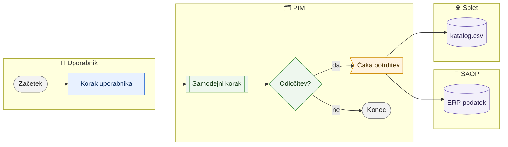

# [Ime procesa]

> **Področje:** [mapa, npr. Poslovanje] · **Lastnik:** [vloga ali oseba] · **Stanje:** ✅ deluje / ⚠️ delno / ❌ ne deluje · **Preverjeno:** [LLLL-MM-DD, iz kode / z uporabnikom]

<!--
KOPITO ZA VSE PROCESE PIM
- Vsak proces je ena datoteka v mapi svojega področja (docs/procesi/NN-podrocje/ime-procesa.md).
- Glava med --- je STROJNO BRANA: iz nje se sestavi glavni graf (00-GLAVNI-PROCES.md) in opozorila o vplivu sprememb.
  Vsak ključ v eni vrstici, seznami v [ ] ločeni z vejico. bere/pise samo z oznakami iz _PODATKI.md.
  koda: poti od korena repozitorija, dovoljen * ; to so datoteke, katerih sprememba pomeni spremembo tega procesa.
- Razdelkov ne izpuščaj in ne preimenuj. Če razdelek nima vsebine, napiši »Ni.«
- Piši za uporabnika (komerciala, urednik kataloga), ne za programerja. Tehnika gre samo v razdelek 9.
- Strani intraneta piši kot pot v poševnih narekovajih: `/izdelki/odprodaja`.
- Kar v kodi ni tako, kot bi uporabnik pričakoval, ali česar ni mogoče preveriti, označi z ⚠️ in zapiši v razdelek 10.
-->

## 1. Namen

En do dva stavka: čemu proces služi in kaj je rezultat.

## 2. Kdo sodeluje

| Vloga | Kaj naredi v procesu |
|---|---|
| Komerciala | … |
| Urednik kataloga | … |
| Skrbnik | … |
| Avtomatika (PIM) | … |

## 3. Kdaj se sproži

- **Ročno:** kdo in ob kakšni priložnosti.
- **Po urniku:** ime posla in pogostost (npr. `SUPPLIER_CATALOG_IMPORT`, vsakih 6 ur).
- **Ob dogodku:** kaj ga sproži.

## 4. Vhod in izhod

| | Kaj | Od kod / kam |
|---|---|---|
| **Vhod** | … | SAOP / dobavitelj / Excel / uporabnik |
| **Izhod** | … | PIM / SAOP / katalog.csv / Magento |

## 5. Diagram

Vedno pasovni diagram z istimi štirimi pasovi (pas, ki ga proces ne uporablja, izpusti).
Oblike: `([ ])` začetek/konec · `[ ]` korak uporabnika · `[[ ]]` samodejni korak · `{ }` odločitev · `[( )]` podatki · `>` čaka potrditev.
Barve so vedno enake (classDef spodaj kopiraj nespremenjene).

## 6. Koraki

| # | Kdo | Kje (stran) | Kaj narediš | Kaj se zgodi v sistemu | Kako preveriš, da je uspelo |
|---|---|---|---|---|---|
| 1 | Komerciala | `/…` | … | … | … |
| 2 | Avtomatika | — | — | … | … |

## 7. Pravila in varovalke

- Kaj sistem ne dovoli ali zadrži in zakaj (npr. »v SAOP nič samodejno — vedno po odobritvi«).
- Kdo lahko kaj (vloge in dovoljenja).

## 8. Ko gre kaj narobe

| Znak (kaj vidiš) | Verjeten vzrok | Kaj narediš |
|---|---|---|
| … | … | … |

## 9. Tehnično ozadje

Za skrbnika in razvoj

- **Strani:** `PIM.Intranet/Components/Pages/….razor`
- **Storitve / delavci:** …
- **Tabele in pogledi:** `schema.Tabela`
- **Migracije:** `NNN_Ime.sql`
- **Urniki:** ime posla, pogostost

## 10. Odprta vprašanja in razlike

- ⚠️ Kar v kodi ni jasno, ni dokončano ali se verjetno razlikuje od dejanskega dela.

## Povezani procesi

- [Ime](../NN-podrocje/proces.md): kako sta povezana.
